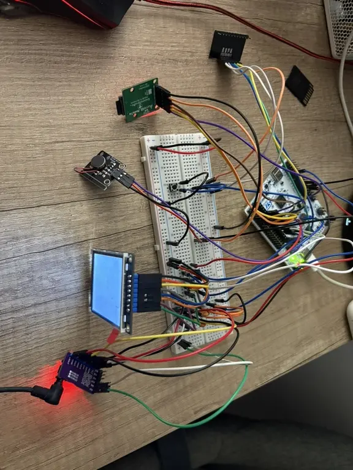
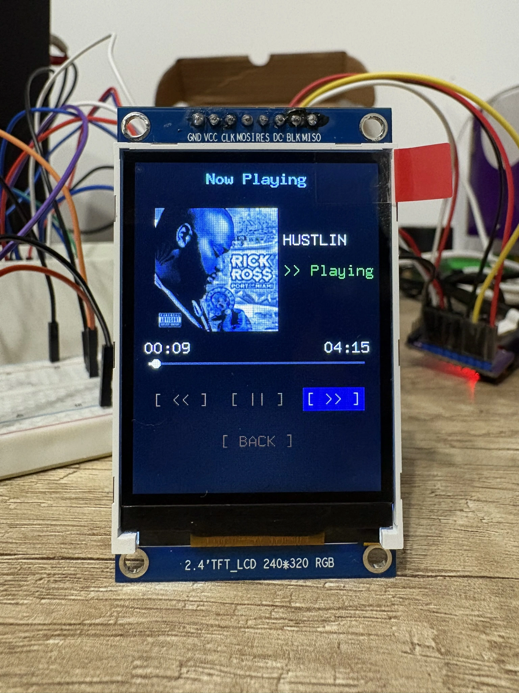

# NucleoPod: High-Fidelity Digital Audio Player

:::info

**Author:** Eduard-Ștefan Pană  \
**GitHub Project Link:** https://github.com/UPB-PMRust-Students/acs-project-2026-editheman

:::

---

## Description

NucleoPod is a standalone, portable digital audio player inspired by classic media players. Built around the STM32U545RE microcontroller and programmed entirely in Rust, the device reads audio files from an external MicroSD card, applies software-based Digital Signal Processing (DSP) for a 3-band equalizer, and outputs high-fidelity audio via an I2S DAC. It features a capacitive touch interface (click-wheel style) for navigation and a color TFT display for a hierarchical user interface (UI). The system is fully portable, powered by a rechargeable Li-Po battery circuit.

## Motivation

The motivation behind this project is rooted in a childhood dream. Growing up, I always wanted an original iPod, but I never had the opportunity to own one. Now that the iconic device has been officially discontinued, I decided to fulfill that wish by engineering my own functional tribute from scratch. Beyond this personal fulfillment, the project serves as a comprehensive technical challenge. Recreating the seamless experience of a classic media player allows me to dive deep into the embedded Rust ecosystem (specifically the Embassy async framework), master real-time Digital Signal Processing (DSP), and handle complex hardware synchronization (I2S, SPI, I2C) required for high-fidelity audio playback.

## Architecture

The software architecture is entirely asynchronous, built on the Embassy executor. It uses several concurrent tasks coordinated through async channels:

* **Audio Task:** Runs on TIM6 hardware interrupt at the WAV file's sample rate. The interrupt handler reads samples directly from a buffer and writes them to the internal DAC registers via PAC. This provides true hardware-driven audio output independent of CPU scheduling.
* **SD Reader Task:** Reads audio data from `.wav` files via SPI2 in 8KB chunks, using a double-buffering (ping-pong) technique to ensure continuous playback without underruns.
* **UI & Input Task:** Polls the MPR121 capacitive touch sensor via I2C1, detects click-wheel gestures (scroll up/down, select), and updates the menu state machine. Pushes UI updates to the TFT display over SPI1.
* **Haptic Task:** Triggers the vibration motor via GPIO on each scroll event to provide tactile feedback.

## Block Diagram

* **Power Subsystem:** External 5V Power Bank ➔ STM32 Nucleo USB-C port (`5V` rail).
* **Processing:** STM32U545RE (Nucleo-64), clocked at 160MHz via PLL.
* **Inputs:**
  * MicroSD Card Module ➔ connected via SPI2 (PB13/PB14/PB15, CS on PB5).
  * MPR121 Capacitive Touch Sensor ➔ connected via I2C1 (PB6/PB7).
  * Tactile push-button (center select) ➔ connected to GPIO PB4.
* **Outputs:**
  * Internal 12-bit DAC (DAC1_OUT1 on PA4) ➔ RC filter (100Ω + 100nF) ➔ 3.5mm Audio Jack.
  * TFT LCD Display (ILI9341, 320x240) ➔ connected via SPI1 (PA5/PA6/PA7, DC/RST/CS on PC6/PC7/PC9).
  * Vibration motor module (haptic feedback) ➔ connected to GPIO PB10.

## Log

* **Week Mar 30 - Apr 5:** * Project ideation and initial brainstorming. Evaluated multiple concepts (e.g., smart solar tracker, automated sorter) before settling on the digital audio player (NucleoPod) concept.
* Verified the core capabilities of the STM32U545RE microcontroller to ensure it has the necessary processing power (FPU) and peripherals for audio processing.
* **Week Apr 6 - Apr 12:** * Hardware research and compatibility checks. Investigated the necessary external modules for high-fidelity audio (I2S), storage (SPI), and user input (I2C).
* Made the architectural decision to exclusively use the STM32 Nucleo board, discarding the initially proposed Raspberry Pi Pico to streamline development and focus entirely on the STM32 ecosystem.
* **Week Apr 13 - Apr 19:** * Software architecture planning and scope management. Researched the Rust `embassy-stm32` framework for handling asynchronous tasks and DMA transfers.
* Consulted with the laboratory assistant to refine the project scope.
* **Week Apr 20 - Apr 26:** * Component selection and finalization of the Bill of Materials (BoM).
* Identified specific, compatible breakout boards (PCM5102A DAC, ST7789 TFT display, MPR121 Touch sensor) and designed the theoretical portable power subsystem (Li-Po battery, TP4056 charger, and 5V Boost converter).
* **Week Apr 27 - Present:** * Drafting the official project documentation and Moodle proposal.
* Initializing the GitHub repository and setting up the basic Rust toolchain for the target architecture (`thumbv8m.main-none-eabihf`). Currently preparing to order the hardware components to begin physical prototyping.
* **Week May 4 - May 10:**
  * Verified Nucleo board power rails and tested each component individually.
  * Successfully integrated and tested the ILI9341 display via SPI1 (with mirror correction via `flip_horizontal`).
  * Validated SD card communication on SPI2 and verified FAT32 file listing.
  * Tested MPR121 touch sensor on I2C1 — confirmed touch detection by reading raw electrode capacitance values.
  * Tested vibration motor on GPIO PB10 for haptic feedback.
  * Validated push-button input on PB4 with internal pull-up.
* **Week May 11 - Present:**
  * Discovered that SAI/I2S peripheral pins are not exposed on Nucleo-64, blocking the PCM5102A I2S path. Pivoted to using STM32's internal DAC on PA4.
  * Resolved DAC clock configuration by routing it through the LSE oscillator and increasing system clock to 160 MHz via PLL.
  * Built initial WAV playback prototype using a single-task busy-wait loop. Identified audio glitches caused by SD card read latency interleaved with sample output.
  * Implemented double-buffering (ping-pong) between two 8 KB / 16 KB / 32 KB buffers.
  * Tested an Embassy async task split (audio task + SD task) with a `Channel`, but confirmed that Embassy's cooperative scheduling on a single core could not eliminate the interruption while `embedded-sdmmc` performs blocking SPI transfers.
  * Currently implementing TIM6 hardware interrupt for audio output via PAC, decoupling sample timing from the async executor and allowing the main task to handle SD I/O without affecting audio continuity.

## Hardware Overview

The core of the system is the **STM32 Nucleo-64 (STM32U545RE)**, chosen for its ARM Cortex-M33 core with hardware FPU, built-in 12-bit DAC, and good Embassy support. The system clock is configured at 160 MHz using HSI + PLL to provide enough processing headroom for parallel SD reads and audio output. The hardware design is modular: each peripheral (display, SD, touch, motor) is on its own breakout board, connected via standard SPI/I2C/GPIO buses.

### Schematics

## Components

* **STM32U545RE Nucleo-64:** Main microcontroller and development board.
* **Internal 12-bit DAC (PA4):** Generates analog audio signal, AC-coupled via 100Ω + 100nF to the headphone jack.
* **PCM5102A Module (jack reuse only):** Provides the 3.5mm headphone jack and AGND reference; its I2S DAC chip is unused.
* **MicroSD SPI Module:** Mass storage for `.wav` audio files (FAT32 formatted, max 32 GB SDHC).
* **2.4" Color TFT LCD (ILI9341, 320x240):** Displays the menu UI, track list, and playback status.
* **MPR121 Touch Sensor:** Reads capacitive touch on copper-tape electrodes arranged in a circle, simulating a click-wheel.
* **Tactile Push-Button (6x6mm):** Center "Select / Play-Pause" button.
* **Vibration Motor Module:** Provides haptic feedback on scroll events.
* **5V USB Power Bank:** Portable power source.

## Bill of Materials (Hardware)

| Device | Usage | Price |
|--------|-------|-------|
| [STM32 Nucleo U545RE-Q](https://eu.mouser.com/ProductDetail/STMicroelectronics/NUCLEO-U545RE-Q?qs=mELouGlnn3cp3Tn45zRmFA%3D%3D) | The main microcontroller running the NucleoPod firmware | 110.00 RON |
| [PCM5102A DAC Module](https://www.emag.ro/modul-convertor-dac-pcm5102-2-1-vrms-tehnologie-directpathtm-dimensiuni-compacte-dh000056/pd/DM6QQL3BM/?ref=history-shopping_487416477_255937_1) | Used to decode the audio signal (I2S to Analog) and provide the high-quality 3.5mm jack | 42.00 RON |
| [MicroSD Card Reader Module](https://ardushop.ro/ro/module/1553-groundstudio-microsd-module-6427854023056.html) | SPI module used to read the `.WAV` audio files and `.BMP` album covers | 8.00 RON |
| [MicroSD Card](https://www.emag.ro/search/microsd+16gb) | Formatted to FAT32 to store the uncompressed music and images | 20.00 RON |
| [2.4" TFT LCD Display (ILI9341)](https://ardushop.ro/ro/electronica/1348-modul-lcd-24-cu-spi-controller-ili9341-6427854019523.html) | Used as the graphical user interface for the MP3 Player | 67.00 RON |
| [MPR121 Capacitive Touch Module](https://ardushop.ro/ro/senzori/984-modul-senzor-capacitiv-mpr121-6427854013279.html) | Used to read the 8 copper pads that make up the Haptic Touch Wheel | 10.00 RON |
| [Tactile push-button 6x6mm](https://ardushop.ro/ro/butoane--switch-uri/713-buton-mic-push-button-trough-hole-6427854009050.html) | Used as the physical center Select / Play / Pause button | 0.50 RON |
| [Vibration Motor Module](https://www.emag.ro/comutator-de-vibratii-pwm-pentru-motor-modul-senzor-motor-pentru-jucarii-motor-dc-vibrator-pentru-telefon-mobil-pentru-kitul-diy-arduino-uno-mega2560-r3-741050524275/pd/D69LHM2BM/?ref=history-shopping_487417681_245879_1) | Used to provide physical haptic feedback (clicks) when scrolling the touch wheel | 29.00 RON |
| [Resistors 100Ω](https://www.optimusdigital.ro/en/search?s=100+ohm+resistor) x2 | Used alongside the capacitors for the DAC output audio coupling | 0.10 RON |
| [Capacitors 10nF](https://www.optimusdigital.ro/en/search?s=100nf+capacitor) x2 | Used alongside the resistors for the DAC output audio coupling | 0.20 RON |
| [Breadboard 830 tie-points](https://sigmanortec.ro/Breadboard-830-puncte-p125425574) | Used as the base to safely prototype and wire all electronic components | 12.00 RON |
| [Dupont Jumper Wires](https://ardushop.ro/ro/fire-si-conectori/8-10-x-fire-dupont-mama-tata-20cm-6427854039200.html) | Assorted wires (M-M, M-F) used to connect the modules to the Nucleo board | 10.00 RON |

## Software

| Library | Description | Usage |
|---------|-------------|-------|
| [embassy-stm32](https://github.com/embassy-rs/embassy) | Async HAL for STM32 microcontrollers | Provides hardware abstraction for peripherals: DAC (audio playback), SPI (Display & SD card), I2C (Touch wheel), GPIO, and Timers. |
| [embassy-executor](https://github.com/embassy-rs/embassy) | Async executor for embedded | Manages and schedules concurrent asynchronous tasks (e.g., separating the haptic vibration motor task from the main audio playback loop). |
| [embassy-time](https://github.com/embassy-rs/embassy) | Time and delay primitives | Provides precise timing and delays required for display initialization, button debouncing, and haptic feedback duration. |
| [cortex-m](https://github.com/rust-embedded/cortex-m) | ARM Cortex-M core crates | Used for low-level core processor operations, such as unmasking the NVIC interrupts for the audio hardware timer. |
| [defmt-rtt](https://github.com/knurling-rs/defmt) / [panic-probe](https://github.com/knurling-rs/panic-probe) | Debugging & Panic handler | Catches fatal system errors (panics) and safely logs them to the host console via the RTT (Real-Time Transfer) debug interface. |
| [embedded-graphics](https://github.com/embedded-graphics/embedded-graphics) | 2D graphics library | Draws the entire graphical user interface: anti-flicker text rendering, control buttons (rectangles), and the progress bar (circles and lines). |
| [tinybmp](https://github.com/embedded-graphics/tinybmp) | BMP image parser | Performs bit-level decoding of uncompressed `bgr24` images (Album Covers) so they can be rendered on the display. |
| [mipidsi](https://github.com/almindor/mipidsi) | Display driver for MIPI DSI / SPI | Initializes and controls the ILI9341 TFT display, configuring screen orientation, pixel color formats, and SPI communication. |
| [embedded-hal-bus](https://github.com/rust-embedded/embedded-hal) | SPI Bus sharing | Creates an `ExclusiveDevice` for the display, ensuring proper management of the Chip Select (CS) pin on the shared SPI bus. |
| [embedded-sdmmc](https://github.com/rust-embedded-community/embedded-sdmmc) | SD/MMC file system | Enables navigation of the FAT32 file system on the SD card, directory iteration (handling 8.3 short names), and efficient byte-level reading for WAV and BMP files. |
| [heapless](https://github.com/japaric/heapless) | Data structures without dynamic allocation | Manages fixed-capacity vectors for the playlist and string formatting (such as playback time tracking) directly on the stack, safeguarding the limited RAM. |

## Links

1. [https://embedded-rust-101.wyliodrin.com/docs/acs_cc/category/lab](https://embedded-rust-101.wyliodrin.com/docs/acs_cc/category/lab)
2. [wav files downloader](https://www.cutyt.com/yt-wav)
3. [downloader for album cover](https://spotidownloader.com/en19)
4. [https://github.com/MYaqoobEmbedded/STM32-Tutorials/tree/master/Tutorial%2043%20-%20WAV%20Player](https://github.com/MYaqoobEmbedded/STM32-Tutorials/tree/master/Tutorial%2043%20-%20WAV%20Player)
5. [https://github.com/MabezDev/embedded-fatfs](https://github.com/MabezDev/embedded-fatfs)
6. [online wav conversion tool](https://g711.org/)
7. [ffmpeg - tool for transforming wav file from 16-bit to 8-bit](https://ffmpeg.org/ffmpeg.html)
8. [perfboard soldering](https://www.youtube.com/watch?v=5tydtZl95dE)
9. [DMA for SD with a 12-bit DAC logic](https://www.youtube.com/watch?v=fY4CHt99SuY)
10. [wav player exemple](https://www.youtube.com/watch?v=QPmFvSFyIbs&t=1301s)
11. [audio player exemple](https://www.youtube.com/watch?v=Eki52Y2Ou5s&t=931s)
