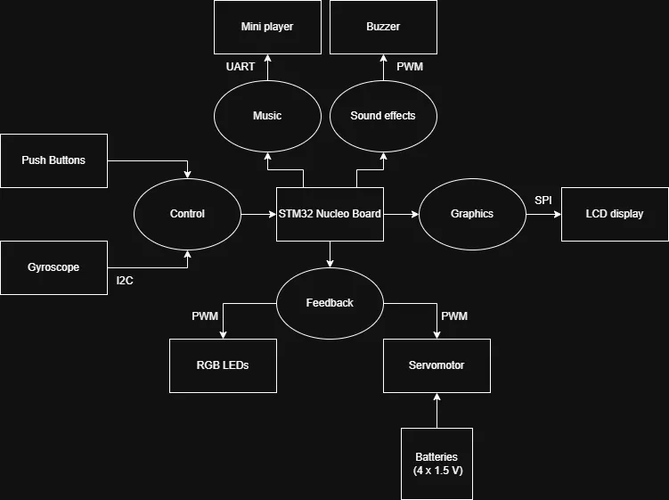
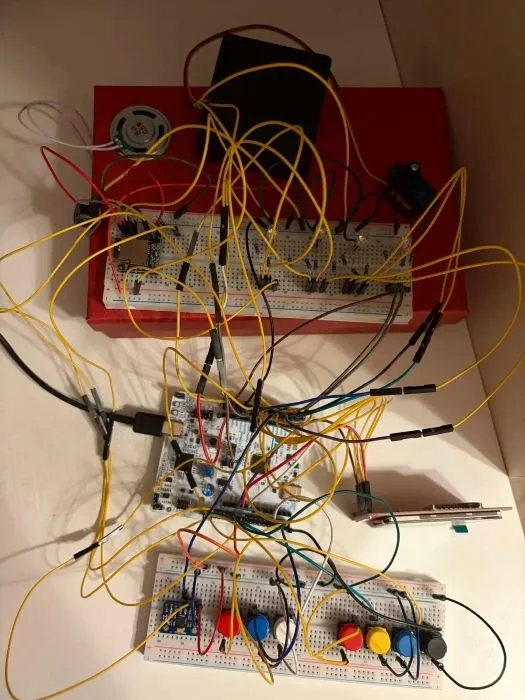
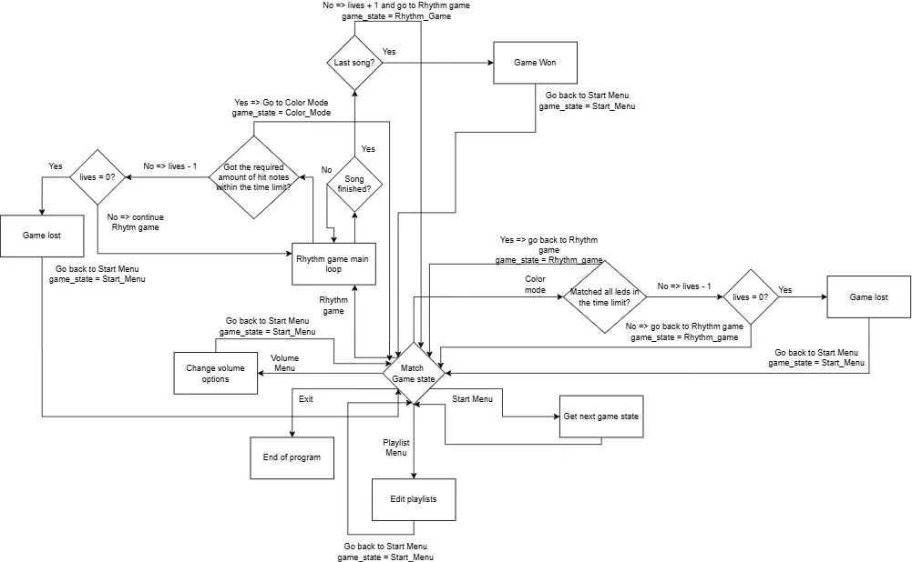

# Rhythm Game
Hardware Rhythm Game

:::info 

**Author**: Mocanu Elena Alexia \
**GitHub Project Link**: https://github.com/UPB-PMRust-Students/acs-project-2026-AlexiaElenaMocanu

:::

## Description

Rhythm game follows the standard mechanics of this genre: the player needs to hit the notes at the right time using the buttons on the breadboard. There are multiple types of notes: tap notes, hold notes, and motion notes triggered by moving the breadboard up/down on the table. Visual feedback is provided using RGB LEDs, where the color represents the accuracy. \
The player needs to accumulate a certain number of hit notes within the time limit to trigger the special game mode called "Color Match". Failing to trigger this game mode will make the player lose one life. In this mode, the user needs to match the color of the RGB LEDs with those shown on the screen using RGB channels. Failing to finish the game mode successfully will deduct one life. The player starts with three lives and can replenish one after completing a song. The player wins when all songs in the current playlist are completed successfully. \
The game is accompanied by music, and players can customize which set tracks are playing and in what order. 

## Motivation

I chose this project because I like rhythm games. Combining them with hardware will be a fun challenge for players.

## Architecture

Main components:

*Central control unit*: 
- **STM32 Nucleo Board**
  - handles the core game logic and synchronizes all peripherals

*Graphics*:
- **LCD display** 
  - displays the game interface 
  - communicates through SPI

*Control*:
- **Push buttons** 
  -  detect tap/hold notes
  -  connected via GPIO pins   
-  **Gyroscope** 
   -  detects the breadboard movement
   -  communicates through I2C

*Feedback*:
- **RGB LEDs** 
  - hit accuracy visual feedback
  - controlled via PWM pins
-  **Servomotor** 
   - color match progress visual feedback
     - when it reaches 180° it means the color match progress is 100%
   - controlled via PWM pins   

*Music*:
- **Mini player**
  - plays background tracks 
  - communicates through UART

*Sound effects*:
- **Buzzer**
  - game action sounds for audio feedback
  - controlled via PWM pins

## Log

### Week 13 - 19 April

I wrote the initial documentation.

### Week 20 - 26 April

I tested the functionality of the components.

### Week 27 April - 3 May

I implemented the UI interface and the button logic.

### Week 4 - 10 May

I wrote the logic for the rhythm game and color match.

### Week 11 - 17 May

I integrated the music and sounds effects into the game and wrote the logic for the volume and playlist menu.

## Week 18 - 24 May 

I made multiple tests to ensure the game is working properly and calibrated game parameters to ensure the gameplay experience is smooth.

## Hardware

The project uses the STM32 Nucleo Board as the main controller. An LCD Display is used for rendering the game graphics. User input is taken using push buttons. While in game, visual feedback is given using RGB LEDs for hit accuracy, and a servomotor for color match progress. The music is played using a DFPlayer Mini that has a microSD card and a speaker. A passive buzzer is used for sound effects. The motion notes are detected using a gyroscope.

### Schematics

### Bill of Materials

| Device                    | Usage                             | Price                                                                                                                                                                             |
| ------------------------- | --------------------------------- | --------------------------------------------------------------------------------------------------------------------------------------------------------------------------------- |
| STM32 Nucleo-U545RE-Q     | The microcontroller               | [Provided by faculty](https://www.st.com/en/evaluation-tools/nucleo-u545re-q.html)                                                                                                |
| TFT LCD Display           | Displaying the game graphics      | [21,60 RON](https://www.emag.ro/display-tactil-tft-lcd-240-x-320-px-cu-cititor-sd-spi-2-4-inch-gri-rosu-tft-24-ili9341-restouch-spi/pd/D49CJMYBM/)                                |
| Buttons                   | User input                        | [1,5 RON X 7](https://www.emag.ro/set-25-butoane-tactile-chucai-12x12x7-3mm-multicolor-a-md390/pd/DRPKD83BM/)                                                                     |
| Gyroscope MPU 6050 GY-521 | Detecting the breadboard movement | [31,99 RON](https://www.emag.ro/modul-giroscop-mpu-6050-gy-521-accelerometru-arduino-3-axe-2-1-cm-x-1-1-cm-x-0-3-cm-albastru-c7/pd/DL3G1QYBM/)                                    |
| RGB LEDs                  | Visual feedback                   | [1,33 RON X 4](https://www.emag.ro/set-10-x-led-rgb-5-mm-se2301081533/pd/D8VDVRMBM/)                                                                                              |
| Servomotor SG90 180°      | Visual feedback                   | [26,14 RON](https://www.emag.ro/servomotor-genelec-sg90-0-180-grade-22x11-5x22-5mm-gd-0228/pd/DGMQ44YBM/)                                                                         |
| DFPlayer Mini TF-16P      | Audio player for the music tracks | [18,03 RON](https://www.emag.ro/modul-tf-16p-dfplayer-mini-player-audio-24-biti-32-gb-negru-auriu-5904162801930/pd/D8B8KLMBM/)                                                    |
| Speaker                   | Audio output for the music tracks | [< 19,68 RON](https://www.emag.ro/modul-inregistrare-redare-audio-isd1820-cu-difuzor-3-5v-3-b-044/pd/DLXDNLMBM/)                                                                  |
| MicroSD Card              | Storing music files               | [29,98 RON](https://www.emag.ro/card-de-memorie-microsd-premium-32-gb-hc-i-class-10-qeno-100mb-s-pentru-camera-auto-telefon-aparat-foto-hub-console-negru-card32gb/pd/DBTYN2YBM/) |
| Pasive Buzzer             | Sound effects                     | [12,48 RON](https://www.emag.ro/buzzer-pasiv-pe-pcb-elektroweb-fara-generator-convertor-5-v-3-d-012/pd/DSLMTMYBM/)                                                                |

## Software

| Library                                                                              | Description                                                       | Usage                                                         |
| ------------------------------------------------------------------------------------ | ----------------------------------------------------------------- | ------------------------------------------------------------- |
| [embassy-stm32](https://github.com/embassy-rs/embassy/tree/main/embassy-stm32)       | Hardware Abstraction Layer for STM32                              | Used for control of GPIO, SPI, I2C, UART, and PWM peripherals |
| [embassy-executor](https://github.com/embassy-rs/embassy/tree/main/embassy-executor) | Async task executor                                               | Used to manage concurrent tasks                               |
| [embedded-hal](https://github.com/rust-embedded/embedded-hal)                        | Hardware abstraction traits                                       | Used for interacting with peripherals                         |
| [defmt](https://github.com/knurling-rs/defmt)                                        | Logging framework                                                 | Used for debugging                                            |
| [panic-probe](https://github.com/knurling-rs/probe-run/tree/main)                    | Panic handler                                                     | Used for monitoring fatal code errors                       |
| [embassy-time](https://github.com/embassy-rs/embassy/tree/main/embassy-time)         | Timekeeping, delays and timeouts                                  | Used for calculating game time                                |
| [embassy-sync](https://github.com/embassy-rs/embassy/tree/main/embassy-sync)         | Synchronization primitives and data structures with async support | Used for managing signals and channels                        |
| [heapless](https://github.com/rust-embedded/heapless)                                | Data structures that don't require dynamic memory allocation      | Used to store game data in vectors                            |
| [core](https://github.com/rust-lang/rust/tree/main/library/core)                     | Rust standard library                                             | Used for debug and write operations                           |
| [mipidsi](https://github.com/almindor/mipidsi)                                       | Display driver for ILI9341                                        | Used for connecting the screen via SPI                        |
| [embedded-graphics](https://github.com/embedded-graphics/embedded-graphics)          | 2D graphics library                                               | Used for drawing the game graphics                            |

The game runs in a continuous loop where it checks the current game state:
- *Start Menu*: the user chooses the next game state from the available options
- *Volume Menu*: the user can adjust the volume level of the music and turn on/off the sound effects
- *Playlist menu*: the user can edit the songs and their playback order during the game
- *Rhythm game*: the user is in a game; the game state switches to color mode when the color mode progress reaches 100%, to start menu when a game is won/lost and again to rhythm game when a song, excepting the last one, is completed
- *Color mode*: the user is in color mode; the game state switches to rhythm game after succesful completion or if the player is not out of lives after failing to complete the mode; if the player is out of lives, the game state switches to start menu
- *Exit*: the program stops after the user chooses this option

