# OxideVault
IoT-enabled smart vault with multi-factor authentication and tamper detection, powered by Rust.

:::info 

**Author**: Bolborea Gabriel-Viorel \
**GitHub Project Link**: https://github.com/UPB-PMRust-Students/acs-project-2026-Gabr1elBb

:::

## Description

A secure smart vault system that requires a two-step authentication process to unlock: scanning a valid NFC tag followed by entering a correct 4-digit PIN on a membrane keypad. To ensure physical security, the vault is equipped with an MPU6050 accelerometer and gyroscope that monitors for unauthorized movement or forceful impacts. 

If tampering is detected, or if the authentication fails multiple times, the system triggers a local buzzer alarm and locks down. An ESP8266 WiFi module is used to log access events and send alerts remotely, while an OLED display provides clear, real-time feedback to the user throughout the interaction.

## Motivation

Security systems are a critical application for embedded devices, where memory leaks or race conditions can lead to severe vulnerabilities. I chose this project to explore how Rust's memory safety and the RTIC (Real-Time Interrupt-driven Concurrency) framework can be leveraged to build a robust state machine. Handling multiple concurrent inputs (I2C sensors, GPIO interrupts for the keypad, and UART for WiFi) while maintaining deterministic real-time responses for the tamper alarm is a perfect challenge to understand the true power of Embedded Rust.

**OxideVault** ensures that race conditions are eliminated at compile time and that high-priority tasks (like the tamper alarm) are always handled with deterministic latency.

## Architecture  

## Log

### Week 27 April - 3 May
Finalized the hardware Bill of Materials (BOM), designed the system architecture block diagram, wrote the official documentation, and pushed the initial setup to the GitHub repository.

## Hardware

The hardware architecture of OxideVault is centered around the STM32 Nucleo-U545RE-Q. The system is designed to be powered via USB, utilizing the Nucleo's onboard 3.3V regulator for the logic-level sensors (OLED, MPU6050, NFC, WiFi) and the 5V rail for the SG90 Servo motor. 

Given the high-current draw of the servo motor during actuation and the transmission peaks of the ESP8266, power distribution is critical. To prevent voltage drops from resetting the microcontroller, the mechanical load (servo) is logically separated from the delicate I2C sensors. 

The peripherals are grouped into three distinct subsystems:
1. **Shared I2C Bus:** The OLED display, MPU6050, and PN532 module communicate over a single I2C interface, differentiated by their unique hardware addresses.
2. **Interrupt-Driven Inputs:** The membrane keypad and the IMU tamper alarm utilize hardware interrupts to ensure immediate CPU response without constant polling.
3. **Asynchronous IoT:** The ESP8266 operates on a dedicated UART channel, allowing the MCU to send logs without blocking the main security control loop.

### Schematics

TBD

### Bill of Materials

| Device | Usage | Price |
| :--- | :--- | :--- |
| [STM32 Nucleo-U545RE-Q](https://www.st.com/en/evaluation-tools/nucleo-u545re-q.html) | Main Microcontroller - System logic and task scheduling | [129 RON](https://ro.farnell.com/stmicroelectronics/nucleo-u545re-q/development-brd-32bit-arm-cortex/dp/4216396) |
| [PN532 NFC Module](https://www.nxp.com/docs/en/nxp/data-sheets/PN532_C1.pdf) | Primary Authentication - Reading RFID tags/cards | [55 RON](https://www.optimusdigital.ro/ro/wireless-nfc-rfid/101-modul-nfc-pn532.html) |
| [4x4 Membrane Keypad](https://www.parallax.com/package/4x4-matrix-membrane-keypad-datasheet/) | Secondary Authentication - 4-digit PIN entry | [12 RON](https://www.cleste.ro/tastatura-matriceala-tip-membrana-cu-4x4-taste.html) |
| [SSD1306 OLED (0.96")](https://cdn-shop.adafruit.com/datasheets/SSD1306.pdf) | User Interface - Displaying status and feedback messages | [25 RON](https://www.robofun.ro/display-oled-0-96-i2c-albastru-galben.html) |
| [MPU6050 IMU](https://invensense.tdk.com/wp-content/uploads/2015/02/MPU-6000-Datasheet1.pdf) | Tamper Detection - Accelerometer/Gyro for shock sensing | [16 RON](https://www.emag.ro/modul-accelerometru-si-giroscop-mpu6050-ai382-s321/pd/D0Z17DBBM/) |
| [ESP8266 (ESP-01)](https://www.espressif.com/sites/default/files/documentation/0a-esp8266ex_datasheet_en.pdf) | WiFi Connectivity - Remote logging and status reporting | [15 RON](https://www.optimusdigital.ro/ro/wireless-wi-fi/12-modul-wifi-esp8266-esp-01.html) |
| [SG90 Servo Motor](http://www.ee.ic.ac.uk/pjs102/projects/Control1/servo.pdf) | Locking Mechanism - Physical bolt actuation | [15 RON](https://www.cleste.ro/servomotor-sg90-9g.html) |
| [Active Buzzer](https://www.farnell.com/datasheets/2171110.pdf) | Audio Feedback - Siren for alarms and key press tones | [5 RON](https://www.optimusdigital.ro/ro/audio-buzzere/125-buzzer-activ-5v.html) |
| **Auxiliary Components** | **Breadboard, Dupont wires, and decoupling capacitors** | **~30 RON** |

## Software

| Library | Description | Usage |
|---------|-------------|-------|
| [rtic](https://rtic.rs/) | Concurrency Framework | Task scheduling, handling interrupts, and managing priorities (e.g., IMU alarm over display updates). |
| [stm32u5xx-hal](https://github.com/stm32-rs/stm32u5xx-hal) | Hardware Abstraction Layer | Low-level control for the Nucleo-U5 (configuring I2C, UART for WiFi, and PWM for the Servo). |
| [embedded-hal](https://crates.io/crates/embedded-hal) | Standard Traits | Standardized embedded interfaces allowing sensor drivers to communicate with the STM32. |
| [pn532](https://crates.io/crates/pn532) | NFC Interface | Sending commands and reading RFID tags/cards data via the I2C bus. |
| [ssd1306](https://crates.io/crates/ssd1306) | Display Driver | Hardware interface for sending pixels to the OLED screen. |
| [embedded-graphics](https://crates.io/crates/embedded-graphics) | 2D Graphics Library | Rendering fonts, text, and UI elements (like the "Access Granted" message) on the OLED. |
| [mpu6050](https://crates.io/crates/mpu6050) | IMU Driver | Reading accelerometer and gyroscope data to detect tampering and physical shocks. |

## Links

1. [The Rust Embedded Book](https://docs.rust-embedded.org/book/)
2. https://www.youtube.com/watch?v=kGyQS3B1IwU