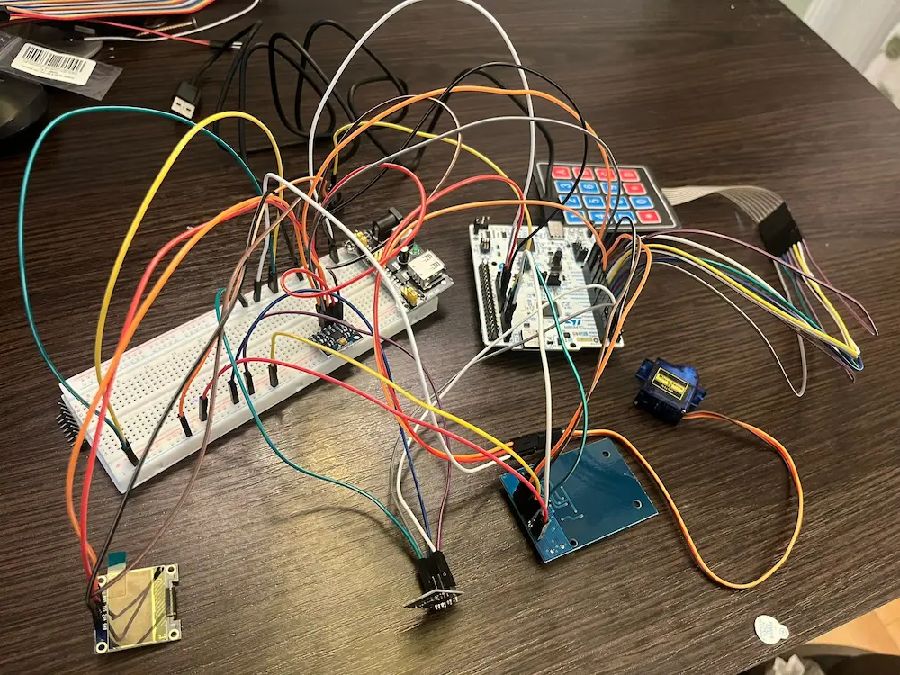
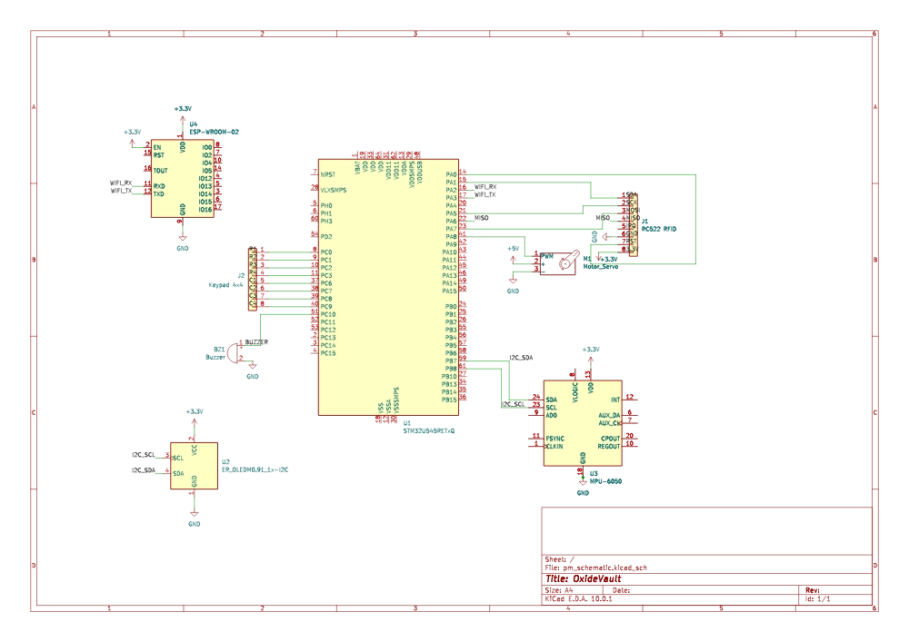

# OxideVault
IoT-enabled smart vault with multi-factor authentication and tamper detection, powered by Rust.

:::info 

**Author**: Bolborea Gabriel-Viorel \
**GitHub Project Link**: https://github.com/UPB-PMRust-Students/acs-project-2026-Gabr1elBb

:::

## Description

A secure smart vault system that requires a two-step authentication process to unlock: scanning a valid RFID tag followed by entering a correct 4-digit PIN on a membrane keypad. To ensure physical security, the vault is equipped with an MPU6050 accelerometer and gyroscope that monitors for unauthorized movement or forceful impacts. 

If tampering is detected, or if the authentication fails multiple times, the system triggers a local buzzer alarm and locks down. An ESP8266 WiFi module is used to log access events and send alerts remotely, while an OLED display provides clear, real-time feedback to the user throughout the interaction.

## Motivation

Security systems are a critical application for embedded devices, where memory leaks or race conditions can lead to severe vulnerabilities. I chose this project to explore how Rust's memory safety and the RTIC (Real-Time Interrupt-driven Concurrency) framework can be leveraged to build a robust state machine. Handling multiple concurrent inputs (I2C sensors, SPI for RFID, GPIO interrupts for the keypad, and UART for WiFi) while maintaining deterministic real-time responses for the tamper alarm is a perfect challenge to understand the true power of Embedded Rust.

**OxideVault** ensures that race conditions are eliminated at compile time and that high-priority tasks (like the tamper alarm) are always handled with deterministic latency.

## Architecture  

## Log

### Week 27 April - 3 May
Finalized the hardware Bill of Materials (BOM), designed the system architecture block diagram, wrote the official documentation, and pushed the initial setup to the GitHub repository.
### Week 5 May - 11 May
Finalized the physical breadboard prototyping and completed the detailed electrical schematics in KiCad. Updated the project documentation and synchronized all media assets for the repository.
### Week 12 May - 18 May
Configured the Embedded Rust environment using the `embassy-rs` framework. Implemented communication protocols for all peripherals, including SPI (RC522 RFID), GPIO (membrane keypad matrix), I2C (MPU6050, SSD1306 OLED), and async UART (ESP8266 HTTP server). All software subsystems were successfully unified under a safely shared `VaultState` Mutex.

### Week 19 May - 25 May
Performed the final physical assembly inside the vault enclosure. Conducted extensive hardware debugging to resolve I2C bus lockups and MCU resets during peak current draws. Resolved the issues by securing physical connections, minimizing wire crosstalk, and optimizing the servo PWM software logic to achieve a stable, continuous runtime.

## Hardware

The hardware architecture of OxideVault is centered around the STM32 Nucleo-U545RE-Q. The system is designed to be powered via USB, utilizing the Nucleo's onboard voltage regulators to provide 3.3V for logic-level sensors and 5V for the SG90 Servo motor.

Given the high-current draw of the servo motor during actuation and the transmission peaks of the ESP8266, power integrity is a priority. To prevent voltage drops that could trigger a system reset, the inductive load (servo) is decoupled from the sensitive digital circuitry.

The peripherals are organized into four functional subsystems:
1. **Shared I2C Bus:** The SSD1306 OLED display and the MPU6050 IMU share a single I2C interface, differentiated by their unique hardware addresses.
2. **High-Speed SPI Interface:** The MFRC522 RFID module operates on the SPI1 bus, ensuring fast authentication data exchange.
3. **Interrupt-Driven Inputs:** The membrane keypad and the IMU tamper alarm utilize hardware interrupts to ensure immediate CPU response without constant polling.
4. **Asynchronous IoT:** The ESP8266 operates on a dedicated UART channel, allowing the MCU to send logs without blocking the main security control loop.

### Schematics

### Bill of Materials

| Device | Usage | Price |
| :--- | :--- | :--- |
| [STM32 Nucleo-U545RE-Q](https://www.st.com/en/evaluation-tools/nucleo-u545re-q.html) | Main Microcontroller - System logic and task scheduling | [129 RON](https://ro.farnell.com/stmicroelectronics/nucleo-u545re-q/development-brd-32bit-arm-cortex/dp/4216396) |
| [RC522 RFID Module](https://www.nxp.com/docs/en/data-sheet/MFRC522.pdf) | Primary Authentication - Reading RFID tags/cards | [20 RON](https://www.optimusdigital.ro/ro/wireless-rfid/32-cititor-rfid-rc522.html)
| [4x4 Membrane Keypad](https://www.parallax.com/package/4x4-matrix-membrane-keypad-datasheet/) | Secondary Authentication - 4-digit PIN entry | [12 RON](https://www.cleste.ro/tastatura-matriceala-tip-membrana-cu-4x4-taste.html) |
| [SSD1306 OLED (0.96")](https://cdn-shop.adafruit.com/datasheets/SSD1306.pdf) | User Interface - Displaying status and feedback messages | [25 RON](https://www.robofun.ro/display-oled-0-96-i2c-albastru-galben.html) |
| [MPU6050 IMU](https://invensense.tdk.com/wp-content/uploads/2015/02/MPU-6000-Datasheet1.pdf) | Tamper Detection - Accelerometer/Gyro for shock sensing | [16 RON](https://www.emag.ro/modul-accelerometru-si-giroscop-mpu6050-ai382-s321/pd/D0Z17DBBM/) |
| [ESP8266 (ESP-01)](https://www.espressif.com/sites/default/files/documentation/0a-esp8266ex_datasheet_en.pdf) | WiFi Connectivity - Remote logging and status reporting | [15 RON](https://www.optimusdigital.ro/ro/wireless-wi-fi/12-modul-wifi-esp8266-esp-01.html) |
| [SG90 Servo Motor](http://www.ee.ic.ac.uk/pjs102/projects/Control1/servo.pdf) | Locking Mechanism - Physical bolt actuation | [15 RON](https://www.cleste.ro/servomotor-sg90-9g.html) |
| [Active Buzzer](https://www.farnell.com/datasheets/2171110.pdf) | Audio Feedback - Siren for alarms and key press tones | [5 RON](https://www.optimusdigital.ro/ro/audio-buzzere/125-buzzer-activ-5v.html) |
| [MB102 Breadboard Power Supply](https://www.optimusdigital.ro/en/linear-regulators/61-breadboard-source-power.html) | Dedicated Power - External 5V/3.3V power source for the SG90 servo and ESP8266 | 7 RON |
| **Auxiliary Components** | **Breadboard, Dupont wires, and decoupling capacitors** | **~30 RON** |

## Software

| Library | Description | Usage |
|---|---|---|
| [embassy-stm32](https://docs.embassy.dev/embassy-stm32/) | Asynchronous framework | Task scheduling, handling interrupts, and managing I2C, SPI, UART, PWM peripherals. |
| [mfrc522](https://docs.rs/mfrc522/) | RFID Driver | Interface for authenticating master RFID cards via SPI. |
| [ssd1306](https://docs.rs/ssd1306/) | OLED Display Driver | Hardware interface for sending pixel data to the system display. |
| [heapless](https://docs.rs/heapless/) | Static data structures | Manages PIN buffers and HTML packets without dynamic heap memory allocation. |
| [embedded-graphics](https://docs.rs/embedded-graphics/) | 2D Graphics Library | Renders text, fonts, and UI elements on the OLED interface. |
| [embedded-hal](https://docs.rs/embedded-hal/) | Hardware Abstraction | Standardized traits for abstracting GPIO, I2C, and SPI peripherals. |
| [defmt](https://docs.rs/defmt/) | Embedded Logger | Provides efficient debug logging over the RTT interface. |
| [embassy-sync](https://docs.embassy.dev/embassy-sync/) | Synchronization | Implements Mutexes to safely share the VaultState across asynchronous tasks. |

### Detailed Design

The software architecture is built upon the `embassy-rs` asynchronous framework, allowing multiple subsystems to run concurrently without blocking the main execution thread. The logic is divided into highly specific, independent tasks:
* **I2C Task:** Continuously polls the MPU6050 accelerometer for physical shocks and updates the SSD1306 OLED UI.
* **PWM Task:** Controls the SG90 servo motor state (locked/unlocked) with optimized actuation to prevent unnecessary current draw.
* **WiFi Task:** Manages the ESP8266 module via UART AT commands, hosting a local HTTP server for remote monitoring and override controls.
* **Main Loop:** Handles the physical authentication layer by scanning for the RFID Master Card via SPI and reading the matrix keypad via GPIO interrupts.

Inter-Process Communication (IPC) and synchronization between these concurrent tasks are achieved using a globally shared state (`VaultState` enum). This state is safely protected by a `Mutex` (`CriticalSectionRawMutex`), which eliminates data races at compile time and ensures that high-priority events, such as a tamper detection from the IMU, immediately force the entire system into an `Alarm` state.

## Links

1. [The Rust Embedded Book](https://docs.rust-embedded.org/book/)
2. https://www.youtube.com/watch?v=kGyQS3B1IwU
