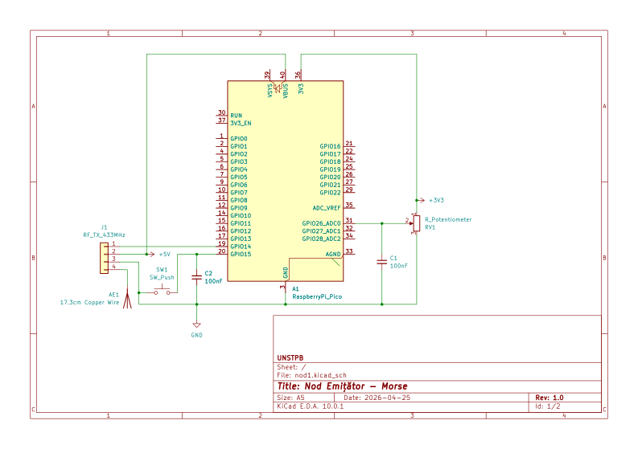
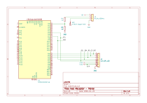

# Transmițător și traducător de cod Morse
Transmițător care emite un caracter în cod Morse și un receptor ce îl primește
și îl decodifică pentru a-l afișa pe un ecran.

:::info 

**Author**: Gabriel-Ioan PAVEL \
**GitHub Project Link**: https://github.com/UPB-PMRust-Students/acs-project-2026-gabrielioanpavel

:::

<!-- do not delete the \ after your name -->

## Description

Ideea proiectului este comunicarea unidirecțională prin cod Morse. Sunt prezente două noduri:

1. Nod emițător - Raspberry Pi Pico. Acesta citește valoarea dată de un potențiometru pentru
a selecta o literă din alfabetul englez, o traduce în cod Morse și o transmite la apăsarea unui
buton în eter prin intermediul unui modul RF 433MHz.
2. Nod receptor - STM32. Acesta captează semnalul, filtrează zgomotul, îl decodifică și
afișează caracterul pe un ecran LCD de 1.44\'\'.

Logica este realizată cu ajutorul frameworkul `embassy` pentru a facilita execuția de cod
asincron.

## Motivation

Am ales acest proiect din interesul pentru transmiterea semnalelor prin unde radio
folosind sisteme integrate.

## Architecture 

1. Nod emițător
- Input: Potențiometru conectat la un pin ADC. Se folosește de un filtru trece-jos
pentru a elimina zgomotul electric, facilitând maparea valorilor la cele 26 de litere
ale alfabetului englez. Un task asincron ascultă și actualizează constant caracterul într-o variabilă.
- Activare: Un task asincron așteaptă apăsarea unui buton pentru a transmite litera
selectată.
- Transmisie: Odată ce butonul este apăsat, microcontrollerul citește litera și generează
timingurile high/low pentru a transmite "punctele" și "liniile", pentru a fi transmise
de modulul RF, care are o antenă de cupru de 17.3cm legată.

2. Nod receptor
- Recepție: Modulul receptor RF cu o antenă de cupru de 17.3cm captează semnalul. Se folosește un
divizor de tensiune pentru a coborî tensiunea de 5V de la modul la 3.3V pentru ca semnalul
să fie primit de microcontroller printr-un pin GPIO.
- Decodificare: Un timer asincron pinul RX. Un algoritm de discriminare a duratei impulsurilor
clasifică perioadele de high/low în "puncte" (100ms), "linii" (300ms) sau zgomot/pauze, adăugând
secvențele valide într-un buffer de decodificare.
- Afișare: Odată ce un mesaj este decodificat, un task asincron trimite printr-un pin SPI caracterul
către ecranul de 1.44\'\'.

## Log

<!-- write your progress here every week -->

### Week 5 - 11 May

### Week 12 - 18 May

### Week 19 - 25 May

## Hardware

Proiectul folosește două microcontrollere, un ecran SPI, o pereche de module RF,
condensatori și rezostori.

### Schematics




### Bill of Materials

<!-- Fill out this table with all the hardware components that you might need.

The format is 
```
| [Device](link://to/device) | This is used ... | [price](link://to/store) |

```

-->

| Device | Usage | Price |
|--------|--------|-------|
| [Raspberry Pi Pico](https://www.raspberrypi.com/documentation/microcontrollers/raspberry-pi-pico.html) | Microcontroller pentru emitere | [32 RON](https://ardushop.ro/ro/raspberry-pi/513-raspberry-pi-pico-6427854006004.html) |
| [STM32 Nucleo-U545RE-Q](https://www.st.com/en/evaluation-tools/nucleo-u545re-q.html) | Microcontroller pentru recepție | împrumutat de la facultate |
| [Pereche emițător-receptor RF 433MHz](https://www.optimusdigital.ro/ro/ism-433-mhz/252-pereche-emitator-si-receptor-rf-433-mhz.html) | Pereche pentru transmisie prin radio | [9 RON](https://www.emag.ro/emitator-si-receptor-rf-433-mhz-radiofrecventa-ai196/pd/DXV1WGMBM/?ref=sponsored_products_search_f_b_1_1&recid=recads_1_5eeb774327d821d1507dab10e3a073b16b434e24323b157c1df591be8cee1ca6_1777052118&aid=624c1c25-3c92-11f1-801c-06eaf0d4245d&oid=58895050&scenario_ID=1) |
| [1.44'' SPI LCD](https://www.optimusdigital.ro/ro/optoelectronice-lcd-uri/2167-lcd-de-144-pentru-stc-stm32-i-arduino.html) | Ecran pentru output | 43 RON |
| Potențiometru rotativ | Selectare de litere | ~10 RON |
| [2x Placă de testare 70x90](https://www.optimusdigital.ro/ro/prototipare-cablaje-de-test/232-cablaj-de-test.html) | Plăci pentru cele două noduri | 2x 3 RON |
| Fire de cupru (? posibil altceva) | Antene | ? |
| Condensatoare 100nF | Filtre trece-jos | ? |
| Rezistențe 1k, 2k | Divizor de tensiune | ? |

## Software

| Library | Description | Usage |
|---------|-------------|-------|
| [embassy-rp](https://github.com/embassy-rs/embassy) | Framework pentru operații asincrone pentru Raspberry Pi Picro | Citire din potențiometru și transmisie |
| [embassy-stm32](https://github.com/embassy-rs/embassy) | Framework pentru operații asincrone pentru STM32 | Recepție și afișare pe ecran |
| [embassy-time](https://github.com/embassy-rs/embassy) | Ceas pentru operații asincrone | Operațiuni non-blocante |
| [embedded-graphics](https://github.com/embedded-graphics/embedded-graphics) | Bibliotecă de grafică 2D | Afișare pe ecran |
| [st7735-lcd](https://crates.io/crates/st7735-lcd) | Driver pentru LCD | Interfațare cu ecranul de 1.44\'\' |
