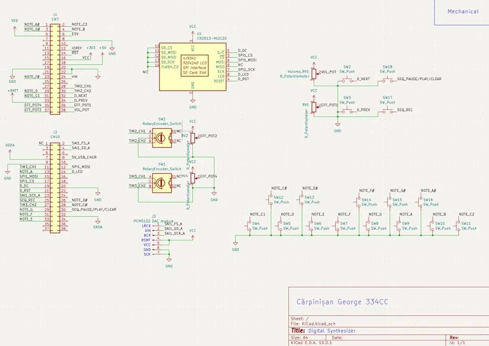

# Digital Synthesizer

Polyphonic synthesizer with DSP effects.

:::info

**Author**: Cărpinișan George \
**GitHub Project Link**: https://github.com/UPB-PMRust-Students/acs-project-2026-george17c

:::

## Description

A bare-metal polyphonic synth built with Rust. This project is a 48kHz multi-effect audio engine running on an STM32 NUCLEO-U545RE-Q. It features high-level DSP and a hardware interface for instant feedback. It uses a custom-designed top panel interface to hold the controls for a real-time I2S digital audio stream.

## Motivation

I like music and I'm fascinated by the hardware behind it. My goal is to recreate a studio-grade musical instrument, to the best of my ability.
My synth will have some iconic effects and functionalities from a modern synthesizer for a fraction of its price.

## Architecture

The system is designed around a non-blocking, async pipeline:

* **Clock Generation:** Used a hardware clock to guarantee a 48 kHz audio sample rate, alongside an 80 MHz CPU clock for DSP overhead.
* **User Interface (EXTI/GPIO/SPI):** Handles asynchronous hardware interrupts from physical components to trigger notes and modify effect parameters. Presets and effects are displayed on an LCD screen.
* **DSP Engine:** Computes multiple oscillators and applies effects in real-time.
* **DMA Controller:** Moves audio blocks from RAM to the audio peripheral without interrupting the CPU.
* **SAI/I2S Peripheral:** Formats the raw data stream into standard I2S frames and sends them to the external DAC.

## Log

### Week 13 - 19 April

* Wrote the initial DSP logic (oscillators, phase modulation, filtering) in a high-level environment ([rodio](https://crates.io/crates/rodio)).
* Started researching components and different top-panel layouts.
* Ordered the first batch of components.

### Week 20 - 26 April

* Started the mechanical assembly.
* Configured hardware clocks and initialized the I2S communication with the DAC. Tested its output (a C note from a pulse wave) on my headphones and speaker. Works!

### Week 27 April - 3 May

* Finished designing the top panel in AutoCAD.
* Started working on the screen interface for preset selection and effect visualization.

### Week 4 - 10 May

* Received the panel.
* Soldered jumper wires on the switches (GPIO pin) and daisy chained their GND pins.
* Soldered wires on the potentiometers.
* Fixed the DAC clock speed, the square wave sounded correctly by chance (it's more tolerant than a sine wave which needs to be sampled more accurately).

### Week 11 - 17 May

* Polished the preset logic, made the effect parameters more robust. Only changing their value when a corresponding potentiometer is close to the previous stored value.
* Resoldered some GND pins on the keyboard.

### Week 18 - 24 May

* Assembled all the components using a breadboard as a VCC and GND bus. Found out the potentiometers are not properly powered using the breadboard.
* Finished soldering on the proto board.

## Hardware

* STM32 NUCLEO-U545RE-Q: processing unit.
* Mechanical keyboard switches, 10k potentiometers, EC11 rotary encoder: to shape the sound.
* 2.8" LCD display: interface for visualizing effects.
* PCM5102 DAC module: for output.
* Power bank: main power supply.
* Wooden box + laser-cut panel.

### Schematics

### Bill of Materials

| Device | Usage | Price |
|--------|-------|-------|
|[STM32 NUCLEO-U545RE-Q](https://www.st.com/en/evaluation-tools/nucleo-u545re-q.html) | Microcontroller | [~115 RON](https://ro.farnell.com/stmicroelectronics/nucleo-u545re-q/development-brd-32bit-arm-cortex/dp/4216396?CMP=e-email-sys-orderack-GLB) |
|[Keyboard Switches](https://www.mouser.com/datasheet/2/71/EN_CHERRY_MX_RED-2322150.pdf)|For triggering notes, navigating the display and using the sequencer|[20 x 0.9 RON](https://qwertykey.ro/products/switchuri-outemu-red)|
|[10k potentiometers](https://www.futurlec.com/Potentiometers/POT10K.shtml)|For changing effect parameters|[8 x 1.31 RON](https://sigmanortec.ro/Potentiometru-1K-5K-10K-20K-50K-100K-p136286400)|
|[Rotary Encoder](https://www.farnell.com/datasheets/1837001.pdf)|For navigating the display|[2 x 4.39 RON](https://sigmanortec.ro/Encoder-rotativ-cu-click-20mm-EC11-p128736611)|
|[2.8" LCD display](https://www.lcdwiki.com/res/MSP2807/2.8inch_SPI_Module_MSP2807_User_Manual_EN.pdf)|For visualizing presets and effects|[55.08 RON](https://www.emag.ro/display-lcd-2-8-240x320-pixeli-slot-micro-sd-tactil-4-a-034/pd/DJCT01MBM/)|
|Electronics kit|For wires, breadboard|[39.21 RON](https://www.emag.ro/kit-start-componente-electronice-ai777/pd/DXRJ4TMBM/?ref=history-shopping_484876592_230588_1)|
|[PCM5102 DAC module](https://www.ti.com/lit/ds/symlink/pcm5102-q1.pdf)|For audio output|[37.50 RON](https://www.emag.ro/modul-convertor-audio-digital-analog-dac-pcm5102-calitate-audio-superioara-2-1-vrms-cu-tehnologia-directpathtm-dimensiuni-compacte-perfect-pentru-sisteme-audio-diy-si-placa-de-sunet-externa-7570977565/pd/D1D2W83BM/)|
|10 cm female-female wires|To solder on switches|[1 x 6.99 RON](https://www.optimusdigital.ro/en/wires-with-connectors/652-10-cm-40p-female-female-wire.html)|
|10 cm female-male wires|For the VCC and GND pins of the DAC and display|[2 x 3.99 RON](https://www.optimusdigital.ro/en/wires-with-connectors/650-fire-colorate-mama-tata-10p.html)
|Proto boards|To act as a VCC and GND bus|[2 x 1.28 RON](https://www.optimusdigital.ro/en/protoboards/722-20x80-mm-green-universal-prototyping-board.html)|
|Wooden box|Case for the whole circuitry| [34 RON](https://www.profiart.ro/catalog/q/cutie%20mdf)|
|Laser-cut top panel|For the user controlled knobs and switches| 0 RON |

## Software

| Library | Description | Usage |
|---------|-------------|-------|
| [embassy-stm32](https://github.com/embassy-rs/embassy) | Async HAL for STM32 | Main hardware abstraction for GPIO, SAI, DMA, SPI, and Clocks. |
| [mipidsi](https://github.com/almindor/mipidsi) | Multi-display driver | Modern driver for the ILI9341 display, compatible with `embedded-graphics`. |
| [display-interface-spi](https://github.com/almindor/display-interface) | Generic SPI display interface | Provides the communication layer between the SPI peripheral and the display driver. |
| [embedded-graphics](https://github.com/embedded-graphics/embedded-graphics) | 2D graphics library | Core library for drawing shapes, images, and basic text on the display. |
| [micromath](https://github.com/tarcieri/micromath) | Embedded math library | Provides optimized trigonometric and math functions (sin, cos, exp) for the DSP engine. |
| [static_cell](https://github.com/embassy-rs/static-cell) | Statically allocated memory | Allows safe runtime initialization of values with a `'static` lifetime, for sharing resources with async tasks without a heap memory manager. |
| [heapless](https://github.com/japaric/heapless) | Fixed-capacity data structures | Provides structures `String`, or `RingBuffer` with static capacities, preventing runtime allocation panics while handling UI state buffers. |
| [defmt](https://github.com/knurling-rs/defmt) | Efficient logging | Used for debugging |

## Links

1. [ How to create "On the Run" by Pink Floyd pattern on Behringer TD-3 (303) ](https://www.youtube.com/watch?v=mCpNF3-radE&list=PLlWYrAERc9u-2KVlG_TCtRS1XzZzfO4SF&index=7)
2. [ Synthesis Basics: How To Ring Mod, FM, and AM ](https://www.youtube.com/watch?v=p23e7xmL6I4&list=PLlWYrAERc9u-2KVlG_TCtRS1XzZzfO4SF&index=6)
3. [ The Math Behind Music and Sound Synthesis ](https://www.youtube.com/watch?v=Y7TesKMSE74&list=PLlWYrAERc9u-2KVlG_TCtRS1XzZzfO4SF&index=4)
