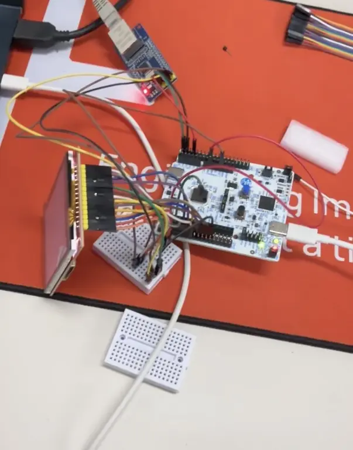
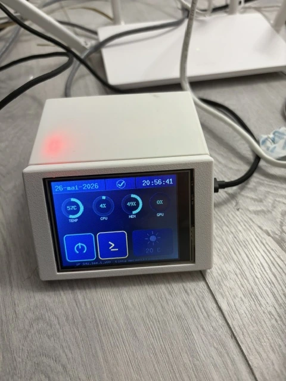
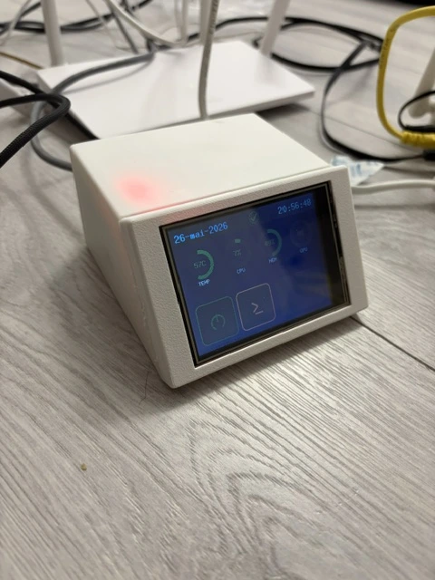
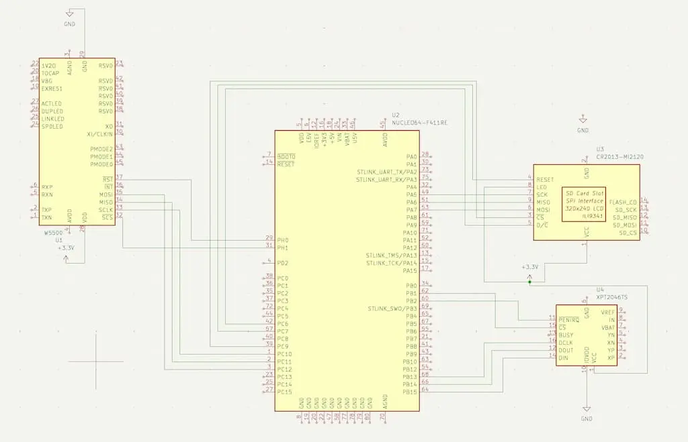

# BayPanel — PC Remote Management System

A 2.5" drive bay panel for monitoring and controlling a desktop PC over Ethernet, featuring a high-resolution display for animated system stats.

:::info

**Author**: Ioan Teodor Pop \
**GitHub Project Link**: [https://github.com/UPB-PMRust-Students/acs-project-2026-tedipop16](https://github.com/UPB-PMRust-Students/acs-project-2026-tedipop16)

:::

## Description

BayPanel is an embedded device that fits into a standard 2.5" HDD bay slot of a desktop PC. It uses an STM32 Nucleo-U545RE-Q connected to a W5500 Ethernet module to join the home network and expose an HTTP API. A companion lightweight agent running on the host PC communicates with the Nucleo over the local network, forwarding system metrics (CPU usage, RAM, temperatures, uptime) and accepting control commands (shutdown, reboot, execute shell commands). A 3.2" ILI9341 TFT display (320×240 px) mounted flush with the drive bay faceplate shows live system stats and animated temperature graphs. Power-on is handled via Wake-on-LAN magic packets sent directly from the Nucleo.

## Motivation

I wanted a permanent, always-on control panel for my desktop that doesn't depend on the PC being awake — something physical that sits in the case itself. Existing software solutions require the OS to be running. By putting the management logic on a microcontroller with its own Ethernet connection, the panel stays functional for Wake-on-LAN even when the PC is off, and the display shows status without needing the host to render anything. 
## Architecture

## Log

### Week 21 - 27 April

Finalized project idea, chose components, and had the theme approved. Ordered W5500 module and ILI9341 display. Drafted the architecture and started reading embassy-net documentation.

### Week 5 - 11 May
Connected the modules, and ran some tests on them. Also did schematics, cleared some issues with connections,
tested and moved every submodule into it's own spi channel( display - spi1, touch - spi2, w5500 - spi3).

### Week 12 - 18 May
Ran a full round of hardware bring-up tests on the board: ADC + PWM sanity check (joystick on PA0 driving a PWM channel on PB10), W5500 SPI diagnostics, NTP time sync over UDP, and touch/refresh-rate sweeps on the ILI9341. Once the I/O was stable, i started development on the OTP web server

### Week 19 - 25 May

Switched the display to a new layout that shows CPU temperature, CPU / RAM / GPU usage as live bars plus the host IP, instead of the previous text-only stats screen.

Wrote a small Rust agent that runs on the host PC (`telemetry-host`) and pushes telemetry to the Nucleo over UDP on port 9000. It reads CPU temp from `/sys/class/thermal`, CPU usage from `/proc/stat`, RAM from `/proc/meminfo`, and auto-detects the GPU usage source (NVIDIA via `nvidia-smi`, AMD via `gpu_busy_percent`, Intel via `gt_act_freq_mhz`). The same agent also listens on UDP 9001 for commands coming back from the board — it handles `SHUTDOWN` (tries `systemctl poweroff`, `loginctl poweroff`, `shutdown -h now`, `sudo shutdown` in order) and runs any other payload as a shell command via `sh -c`.

On the board, finished a web management server (`wol_web`) on port 80 with TOTP authentication.
After login you get a page where you set the target MAC address for Wake-on-LAN, fire the magic packet to the broadcast address on UDP/9, and send arbitrary shell commands to the host agent — the board forwards them over UDP/9001 to `telemetry-host`, which executes them with `sh -c`. The live telemetry coming from the host is also rendered on the page next to the WoL controls, with a small weather box.

[Demo: WOL working](https://drive.google.com/file/d/1UOepdDAg94WhN73oBUqqC3or3rJajF9G/view?usp=sharing)

## Hardware

ILI 9341 Display with touch - display info and buttons for controlling PC

W5500 - connecting to LAN for sendind WOL magic packets and also communicating with PC after turn-on

### Housing

I added a 3D-printed housing for the display. I started from the [Housing display 3.2 inch TFT LCD display module ILI9341](https://www.printables.com/model/1435870-housing-display-32-inch-tft-lcd-display-module-ili) model and modified it to fit the Nucleo board and to add a hole for the Ethernet connector.

### Schematics

### Bill of Materials

| Device | Usage | Price |
|--------|--------|-------|
| [STM32 Nucleo-U545RE-Q](https://www.st.com/en/evaluation-tools/nucleo-u545re-q.html) | Main microcontroller | Free (Faculty) |
| [W5500 Ethernet Module](https://www.emag.ro/modul-retea-ethernet-shield-w5500-cu-suport-tcp-ip-bn484/pd/D010W5YBM/) | Hardware TCP/IP stack, LAN connectivity | ~41 RON |
| [3.2" ILI9341 TFT SPI Display (320×240)](https://www.emag.ro/display-tft-lcd-3-2-inch-320x240-touchscreen-14pini-spi-ili9341-arduino-rx407/pd/D7Q411YBM/) | Live stats display mounted in bay faceplate | ~89 RON |
| [Breadboard 400 points](https://www.optimusdigital.ro/ro/prototipare-breadboard-uri/44-breadboard-400-puncte.html) | Prototyping connections | ~10 RON |
| [Jumper Wires M-F 40p 20cm](https://www.optimusdigital.ro/ro/fire-fire-mufate/92-fire-colorate-mama-tata-40p.html) | Component interconnections | ~8 RON |

**Total estimated cost: ~148 RON** (excluding Nucleo)

## Software

| Library | Description | Usage |
|---------|-------------|-------|
| [embassy-stm32](https://github.com/embassy-rs/embassy) | Async HAL for STM32 | SPI1 (display), SPI2 (W5500), GPIO, clocks |
| [embassy-net](https://github.com/embassy-rs/embassy/tree/main/embassy-net) | Async TCP/IP networking | HTTP server, DHCP client, UDP for WoL |
| [w5500-dhcp](https://github.com/newAM/w5500-rs) | W5500 driver + DHCP | Drives the Ethernet module over SPI |
| [mipidsi](https://github.com/almindor/mipidsi) | Display driver (ILI9341) | Initializes and writes to the TFT |
| [embedded-graphics](https://github.com/embedded-graphics/embedded-graphics) | 2D graphics library | Renders text and stats to the display |
| [embassy-executor](https://github.com/embassy-rs/embassy) | Async task executor | Runs network, display, and WoL tasks concurrently |
| [embassy-time](https://github.com/embassy-rs/embassy) | Async timers | Periodic display refresh and metric polling intervals |
| [defmt](https://github.com/knurling-rs/defmt) | Logging framework | Debug output over RTT |
| [serde-json-core](https://github.com/rust-embedded-community/serde-json-core) | no_std JSON parsing | Parses metric JSON POSTed by the host agent |

## Links

1. [Housing display 3.2 inch TFT LCD display module ILI9341](https://www.printables.com/model/1435870-housing-display-32-inch-tft-lcd-display-module-ili) — base model for the 3D-printed housing
2. [Demo: WOL working](https://drive.google.com/file/d/1UOepdDAg94WhN73oBUqqC3or3rJajF9G/view?usp=sharing) — test of Wake-on-LAN powering on the PC
