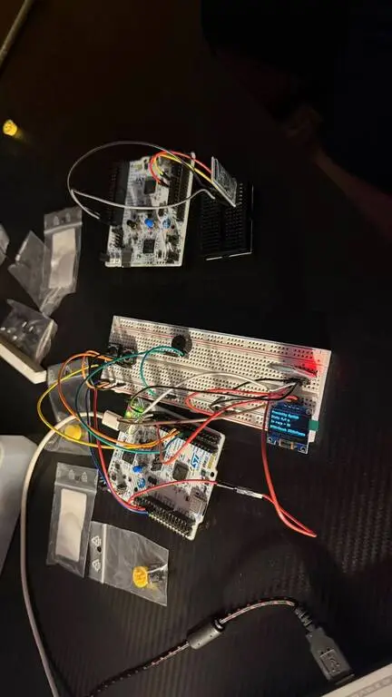
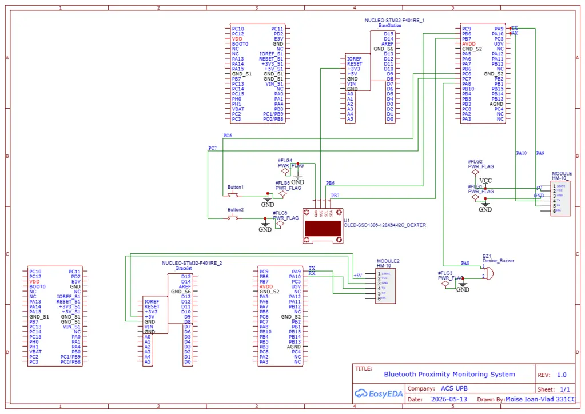

# Bluetooth Proximity Monitoring System
A two-device embedded system that uses Bluetooth to detect when a wearable bracelet moves too far from a base station and triggers alarms on base device.

:::info 

**Author**: Ioan-Vlad Moise \
**GitHub Project Link**: [link_to_github](https://github.com/UPB-PMRust-Students/proiect-ioan_vlad.moise)

:::

<!-- do not delete the \ after your name -->

## Description

The Bluetooth Proximity Monitoring System is a two-device embedded application built in Rust using the Embassy async framework on two STM32 Nucleo-U545RE-Q microcontrollers. One device acts as a fixed base station and the other as a wearable bracelet.

Each device is paired with an HM-10 BLE 4.0 module communicating over UART. The base station monitors the Bluetooth connection with the bracelet to detect when the bracelet moves out of range or when the connection is lost. The system provides two detection modes: sensitive mode and normal mode. In sensitive mode, the alarm is triggered if the bracelet is missing during a single scan. In normal mode, the bracelet must be missing for three consecutive scans before the alarm is triggered, reducing false alarms and improving reliability.

When this happens, the base station triggers its passive buzzer as an alarm. The base station displays the current connection status on an SSD1306 OLED display over I2C. A physical button on the base station allows the user to acknowledge and reset the alarm. The bracelet is powered by a portable USB powerbank or phone, making it wearable, while the base station is powered via USB.

## Motivation

I chose this project because it has a concrete real-world application: preventing loss of personal items, children, or pets in crowded environments. It covers multiple embedded communication protocols (UART, I2C, GPIO) and introduces challenges around wireless signal processing and async embedded Rust, making it both technically meaningful and practically useful.

## Architecture 

The system is divided into two independent embedded devices:

- **Base station**: scans for the bracelet using BLE through the HM-10 module over UART, drives the OLED display over I2C, triggers the buzzer, and handles button input via GPIO.
- **Bracelet**: advertises a BLE signal through the HM-10 module, allowing the base station to detect its presence.

Due to the hardware limitations of the BT-05 Bluetooth modules, the system works by detecting BLE availability/presence instead of using RSSI-based distance estimation.

## Log

<!-- write your progress here every week -->

### Week 16 - 26 April
Researched project requirements and finalized the hardware component list. Ordered all hardware components (HM-10 modules, buzzers, OLED display, buttons, breadboards, wires).

### Week 17 April - 4 May

### Week 18 - 11 May
I finished the hardware part of the project.

### Week 19 - 18 May
I continued working on the software implementation and tested the Bluetooth modules. Although I ordered HM-10 BLE modules, the modules I received turned out to be BT-05 clones, which did not fully support the expected HM-10 RSSI commands. Because of this hardware limitation, I decided to drop the RSSI-based distance estimation approach.

Instead, I adapted the project from an engineering perspective and redesigned the detection logic to rely on BLE presence scanning. The base station now checks whether the bracelet can still be detected during BLE scans. This allowed the system to remain functional even with the limitations of the Bluetooth modules.

### Week 20 - 25 May
I moved from the breadboard prototype to a more stable hardware setup by soldering the wires and components onto a PCB. This improved the reliability of the connections and made the system more robust for testing and demonstration.

## Hardware

The project uses two STM32 Nucleo-U545RE-Q boards as the main processing units: one for the base station and one for the bracelet. Each board is connected to one HM-10 BLE 4.0 module via UART for Bluetooth communication. One device includes one passive 3.3V buzzer for audio alerts and two physical button for alarm reset and stopping the alarm to get out of the zone, for a total of 1 buzzers and 2 buttons in the full system. The base station additionally drives one SSD1306 OLED display over I2C to show live distance estimates. The bracelet is powered by a USB powerbank/phone for portability.

### Schematics

### Bill of Materials

<!-- Fill out this table with all the hardware components that you might need.

The format is 

-->

| Device | Usage | Price |
|--------|--------|-------|
| [STM32 Nucleo-U545RE-Q](https://www.st.com/resource/en/user_manual/um3121-stm32-nucleo144-boards-mb1549-stmicroelectronics.pdf) | Main microcontroller (x2) | provided by lab |
| [HM-10 BLE 4.0 Module](https://people.ece.cornell.edu/land/courses/ece4760/PIC32/uart/HM10/DSD%20TECH%20HM-10%20datasheet.pdf) | Bluetooth communication via UART (x2) | [59.98 RON](https://www.optimusdigital.ro/en/wireless-bluetooth/862-modul-bluetooth-40-cu-adaptor-compatibil-33v-si-5v.html) |
| [OLED Display 0.96" SSD1306](https://cdn-shop.adafruit.com/datasheets/SSD1306.pdf) | Shows live distance on base station | [30.00 RON](https://www.emag.ro/display-oled-0-96-inch-128x64-lcd-arduino-ssd1306-cu-interfata-iic-i2c-albastru-bn621/pd/D436WM3BM/) |
| [Yellow Button with Round Cover](https://components101.com/switches/push-button) | Alarm reset input — 2 per device | [4 RON](https://www.optimusdigital.ro/en/buttons-and-switches/13604-yellow-button-with-round-cover.html) |
| [Passive Buzzer 3V/3.3V](https://components101.com/sites/default/files/component_datasheet/Buzzer%20Datasheet.pdf) | Audio alarm on device (x1) | [2 RON](https://www.optimusdigital.ro/ro/audio-buzzere/12247-buzzer-pasiv-de-33v-sau-3v.html) |
| [Female-Male Wires 20cm](https://media.digikey.com/pdf/Data%20Sheets/Digi-Key%20PDFs/Jumper_Wire_Kits.pdf) | Component wiring (x2) | [14.90 RON](https://www.optimusdigital.ro/ro/fire-fire-mufate/12466-fire-colorate-mama-tata-40p-40-cm.html) |
| [Breadboard](https://components101.com/sites/default/files/component_datasheet/Breadboard%20Datasheet.pdf) | Prototyping | [5.35 RON](https://www.optimusdigital.ro) |
| USB Powerbank | Portable power for bracelet | ~50.00 RON |
| **Total** | | **~150.15 RON** |

## Software

| Library | Description | Usage |
|---------|-------------|-------|
| [embassy-rs](https://github.com/embassy-rs/embassy) | Async embedded framework for STM32 | Task scheduling and async execution |
| [embassy-stm32](https://github.com/embassy-rs/embassy/tree/main/embassy-stm32) | STM32 HAL | UART, I2C, GPIO, and PWM peripheral access |
| [ssd1306](https://github.com/jamwaffles/ssd1306) | OLED display driver over I2C | Displaying the connection status and alarm state |
| [embedded-graphics](https://github.com/embedded-graphics/embedded-graphics) | Text and graphics rendering on OLED | Drawing text and UI elements on the display |
| [heapless](https://github.com/rust-embedded/heapless) | Fixed-size data structures for embedded systems | UART parsing buffers without dynamic allocation |
| [embassy-time](https://github.com/embassy-rs/embassy/tree/main/embassy-time) | Time utilities for Embassy applications | Delays, periodic checks, and task timing |
| [embassy-sync](https://github.com/embassy-rs/embassy/tree/main/embassy-sync) | Synchronization primitives for async embedded tasks | Signaling state between Bluetooth, display, and alarm tasks |
| [embedded-hal](https://github.com/rust-embedded/embedded-hal) | Common embedded hardware abstraction traits | PWM control for the passive buzzer |
| [embedded-io-async](https://github.com/rust-embedded/embedded-hal/tree/master/embedded-io-async) | Async embedded I/O traits | UART read and write operations |
| [defmt](https://github.com/knurling-rs/defmt) | Logging framework for embedded Rust | Debug and status messages during execution |

## Links

<!-- Add a few links that inspired you and that you think you will use for your project -->

1. [embassy-rs documentation](https://embassy.dev/)
2. [labs](https://embedded-rust-101.wyliodrin.com/docs/acs_cc/category/lab)
...