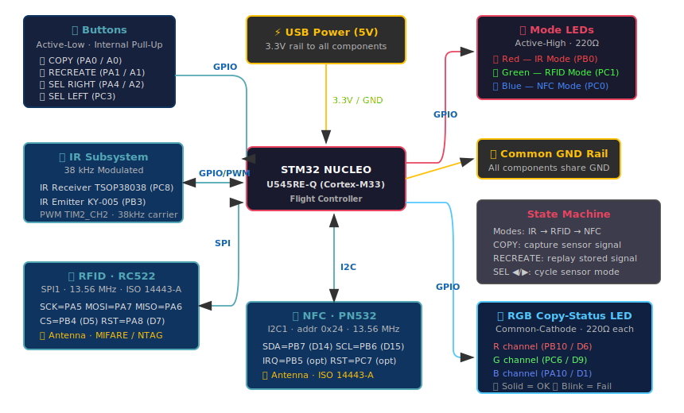

# Multi-Sensor Signal Copier
A handheld device that captures and replays IR, RFID, and NFC signals using a single STM32 board.

:::info 

**Author**: Paiusan Ionut \
**GitHub Project Link**: https://github.com/UPB-PMRust-Students/acs-project-2026-ionut-paiusan

:::

<!-- do not delete the \ after your name -->

## Description

A multi-sensor signal copier and replayer built around the STM32 NUCLEO-U545RE-Q board. The device can capture signals from three different wireless technologies — **Infrared (IR)**, **RFID (13.56 MHz)**, and **NFC (13.56 MHz)** — store them in memory, and replay them on demand. The user navigates between sensor modes using physical buttons, while LEDs provide visual feedback on the current mode and copy status.

The system uses an async state machine architecture powered by the Embassy framework, handling all sensor interactions, button debouncing, and LED animations concurrently.

## Motivation

I wanted to build a practical embedded device that combines multiple wireless communication protocols into a single tool. The idea of a "universal signal copier" — similar to a Flipper Zero — was both challenging and rewarding to implement from scratch. It gave me hands-on experience with SPI, I2C, PWM, and GPIO peripherals on a real microcontroller using Rust's Embassy async framework.

## Architecture 

The STM32 Nucleo board sits at the center of the system, acting as the main controller. It interfaces with three sensor subsystems via different communication protocols:

- **IR Subsystem** — An IR receiver (TSOP38038) captures modulated 38 kHz signals from remotes, and an IR emitter (KY-005) replays them using PWM on TIM2_CH2.
- **RFID Subsystem** — An MFRC522 (RC522) module communicates over SPI1 at 1 MHz, reading ISO 14443-A tags (MIFARE, NTAG) at 13.56 MHz.
- **NFC Subsystem** — A PN532 module communicates over I2C1 at address 0x24, also reading 13.56 MHz ISO 14443-A tags.

Four buttons (COPY, RECREATE, SELECT RIGHT, SELECT LEFT) control the device, while three individual mode LEDs indicate the active sensor and an RGB LED shows the copy status (working, success, or failure).



## Log

<!-- write your progress here every week -->
### Week 20 - 26 April
Got project approval. Researched components and communication protocols (IR modulation, SPI for RC522, I2C for PN532). Ordered all hardware components.

### Week 5 - 11 May
Assembled the breadboard prototype. Implemented the IR subsystem (capture and replay) and verified it with a TV remote. Created test binaries for each sensor. Set up the Embassy async project with all peripheral configurations.

### Week 12 - 18 May
Integrated the RC522 RFID module over SPI and the PN532 NFC module over I2C. Built the state machine with mode cycling and the full button/LED interface. Created the complete electrical and wiring schemas. Debugged I2C timeout issues with the PN532.

### Week 19 - 25 May
Finalized the main application firmware with all three sensors working. Added the RGB copy-status LED with animated feedback (yellow blink for working, green solid for success, red blink for failure). Wrote project documentation and prepared the final demonstration.

## Hardware

The project uses the STM32 NUCLEO-U545RE-Q as the main controller. It processes input from four physical buttons and drives three sensor-mode LEDs plus an RGB copy-status LED. Three sensor modules provide wireless signal capture capabilities:

- **IR Receiver (TSOP38038)** — demodulates 38 kHz IR signals and outputs a digital signal to GPIO PC8.
- **IR Emitter (KY-005)** — driven by a 38 kHz PWM carrier on PB3 (TIM2_CH2) to replay captured IR signals.
- **RC522 RFID Module** — reads 13.56 MHz ISO 14443-A tags via SPI1 (SCK=PA5, MOSI=PA7, MISO=PA6, CS=PB4, RST=PA8).
- **PN532 NFC Module** — reads 13.56 MHz NFC tags via I2C1 (SDA=PB7, SCL=PB6), with mode switches set to I2C (SEL0=1, SEL1=0).

All components run on the 3.3V rail provided by the Nucleo board via USB power. LEDs are connected through 220Ω current-limiting resistors.

### Schematics

<!-- Place your KiCAD or similar schematics here in SVG format. -->

### Bill of Materials

<!-- Fill out this table with all the hardware components that you might need.

The format is 
```
| [Device](link://to/device) | This is used ... | [price](link://to/store) |

```

-->

| Device | Usage | Price |
|--------|--------|-------|
| [STM32 Nucleo-U545RE-Q](https://www.st.com/en/evaluation-tools/nucleo-u545re-q.html) | Main Controller (Cortex-M33) | Lab Provided |
| [TSOP38038 IR Receiver](https://www.optimusdigital.ro/ro/senzori-senzori-optici/3710-modul-receptor-infrarosu-tsop38238.html) | Receives and demodulates 38 kHz IR signals | ~5 RON |
| [KY-005 IR Emitter](https://www.optimusdigital.ro/ro/senzori-senzori-optici/3700-modul-led-emitator-infrarosu.html) | Emits IR signals via 38 kHz PWM carrier | ~3 RON |
| [MFRC522 (RC522) RFID Module](https://www.optimusdigital.ro/ro/wireless-rfid/67-modul-rfid-mfrc522.html) | Reads 13.56 MHz RFID tags (MIFARE, NTAG) via SPI | ~12 RON |
| [PN532 NFC Module](https://www.optimusdigital.ro/ro/wireless-nfc/55-modul-nfc-pn532.html) | Reads 13.56 MHz NFC tags via I2C | ~45 RON |
| [RGB LED (Common-Cathode)](https://www.optimusdigital.ro/ro/optoelectronica-led-uri/484-led-rgb-de-5-mm-catod-comun.html) | Copy-status indicator (working / success / failure) | ~1 RON |
| [3× Red, Green, Blue LEDs](https://www.optimusdigital.ro/ro/optoelectronica-led-uri/68-led-verde-de-5-mm.html) | Sensor-mode indicator LEDs (IR / RFID / NFC) | ~2 RON |
| [6× 220Ω Resistors](https://www.optimusdigital.ro/ro/componente-electronice-rezistoare/848-rezistor-025w-220-ohmi.html) | Current-limiting for LEDs (3 mode + 3 RGB channels) | ~1 RON |
| [4× Push Buttons](https://www.optimusdigital.ro/ro/componente-electronice-butoane/1119-buton-tactil-6x6x6.html) | COPY, RECREATE, SELECT RIGHT, SELECT LEFT | ~3 RON |
| [Breadboard + Jumper Wires](https://www.optimusdigital.ro/ro/prototipare-breadboard-uri/44-breadboard-830-puncte.html) | Prototyping and connections | ~15 RON |

## Software

| Library | Description | Usage |
|---------|-------------|-------|
| [embassy-stm32](https://github.com/embassy-rs/embassy) | Hardware Abstraction Layer for STM32 | Handling GPIO, SPI, I2C, PWM, and timer peripherals |
| [embassy-executor](https://github.com/embassy-rs/embassy) | Async task executor for Cortex-M | Running the main async state machine |
| [embassy-time](https://github.com/embassy-rs/embassy) | Async timers and delays | Button debouncing, LED animations, sensor timeouts |
| [embassy-sync](https://github.com/embassy-rs/embassy) | Async synchronization primitives | Signal passing between tasks |
| [mfrc522](https://crates.io/crates/mfrc522) | MFRC522 (RC522) RFID driver | Reading RFID card UIDs via blocking SPI interface |
| [pn532](https://crates.io/crates/pn532) | PN532 NFC driver | Reading NFC tag UIDs via async I2C interface |
| [embedded-hal](https://crates.io/crates/embedded-hal) | Hardware Abstraction Traits 1.0 | Unified trait interface for SPI, I2C, GPIO |
| [embedded-hal-bus](https://crates.io/crates/embedded-hal-bus) | SPI bus sharing utilities | ExclusiveDevice wrapper for RC522 chip select |
| [defmt](https://crates.io/crates/defmt) | Efficient embedded logging | Debug output via RTT probe |

## Links

<!-- Add a few links that inspired you and that you think you will use for your project -->
[Flipper Zero — Inspiration for a multi-protocol signal tool](https://flipperzero.one/)
[Embassy — Async Rust framework for embedded](https://embassy.dev/)
[MFRC522 Datasheet — RC522 RFID reader IC](https://www.nxp.com/docs/en/data-sheet/MFRC522.pdf)
[PN532 User Manual — NFC controller](https://www.nxp.com/docs/en/user-guide/141520.pdf)
[IR Remote Control Protocol — NEC format explained](https://techdocs.altium.com/display/FPGA/NEC+Infrared+Transmission+Protocol)
