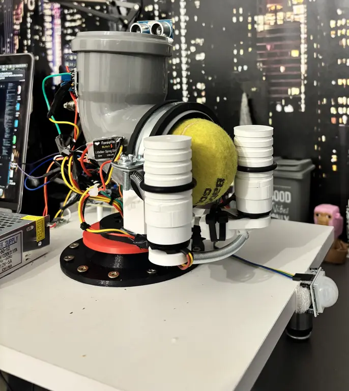
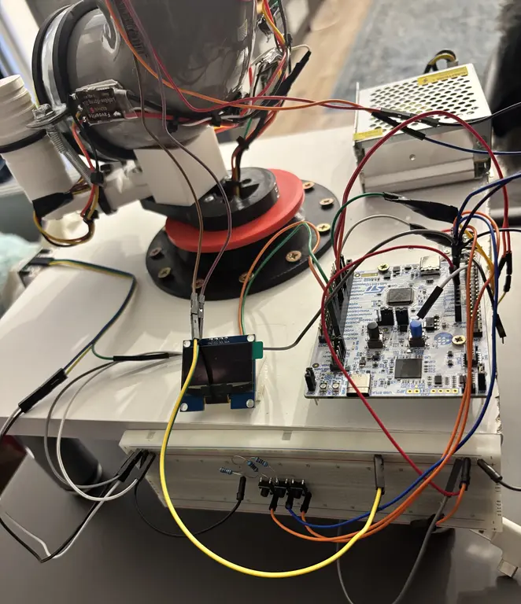
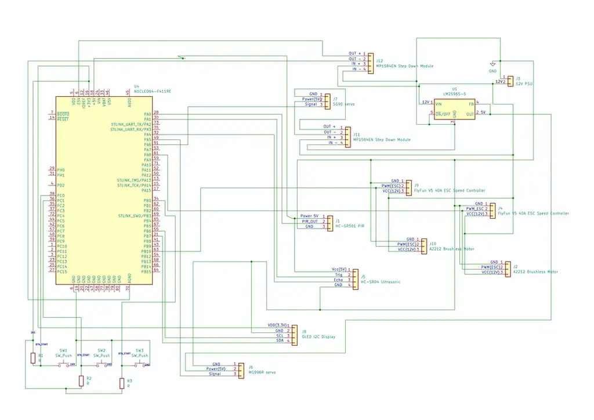

# Smart Pet Ball Launcher

An autonomous ball launcher for dogs that detects the pet's position using a PIR sensor, rotates a motorized turret toward it, and launches a tennis ball using a dual-flywheel mechanism.

:::info

**Author**: Irina Daniela Munteanu \
**GitHub Project Link**: [link_to_github](https://github.com/UPB-PMRust-Students/acs-project-2026-danielaim10)

:::

<!-- do not delete the \ after your name -->

## Description

The Smart Pet Ball Launcher is an embedded device designed to play fetch autonomously with a dog. The system waits in low-power sleep mode until a PIR motion sensor detects the pet. Once detected,
the turret (mounted on a 3D-printed rotating base with a bearing) sweeps to locate the animal.
When the dog returns the ball and places it in the loading tube, an HC-SR04 ultrasonic sensor confirms the ball is present at the launch gate. A dual MOSFET module then triggers an electromagnetic solenoid piston (JF-0530B) that releases a spring-loaded arm, allowing the ball to drop between two counter-rotating brushless motor flywheels which propel it toward the pet.
An OLED display shows the current system state and game mode. Three game modes are available: Random, Training, and a failure-detection sleep mode. Session statistics (number of throws, average return time) are logged via UART using defmt.

## Motivation

Pets need regular physical activity, but owners are not always available to play with them. Existing commercial ball launchers use fixed angles and have no awareness of where the animal
actually is. This project builds a device that actively tracks the pet using a PIR sensor, adapts its aim using a servo turret, and features intelligent game modes that grow with the animal's ability.

## Architecture

## Log

### Week 14 - 20 April
- Finalized project theme and received approval.
- Researched and ordered all hardware components from EMAG AliExpress and Optimus Digital.

### Week 4 - 8 May
- Set up the Embassy Rust development environment for STM32U545RE-Q.
- Implemented and tested PIR sensor detection via EXTI on PA0.
- Implemented HC-SR04 ultrasonic distance measurement.
- Tested SG90 servo gate control via PWM (TIM3_CH1).
- Integrated SH1106 OLED driver (custom, no external crate) with real-time state display

### Week 12 - 18 May
- 3D printed supports for both servo motors, one glued to the tube, the other to the project support, for better resistance.
- Changed the infrastructure of the wheels, placing them with a spring between them to adapt to the ball and for better ball-wheel adhesion.
- Implemented MG996R turret sweep logic and PIR-based angle locking.
- Integrated ESC arming sequence and brushless motor control (TIM1_CH1, TIM8_CH2).

### Week 19 - 25 May
- Encountered a problem with the servo motors: connecting them directly from the STM32 board caused them to burn out due to insufficient current. Solution: powered each servo separately
through a dedicated MP1584EN DC-DC step-down module from the 12V supply.
- Replaced the SG90 gate servo with a dual MOSFET module + electromagnetic solenoid piston (JF-0530B, 12V) for more reliable and faster ball release. The MOSFET gate is controlled via a GPIO output on PB4 — no PWM required.
- Implemented the complete state machine: Stopped, WarmUp, WaitBall, WaitDog, Launching ,Cooldown, Sleeping.
- Implemented all three game modes (Random, Training, Sleep) with session statistics logging.

## Hardware

The main controller is the **STM32 Nucleo-U545RE-Q**, chosen for its low-power STOP mode, and strong Embassy async support.

Two **A2212/13T 1000KV brushless motor** spin 3D-printed flywheel wheels in opposite directions to propel the tennis ball through the launch tube. They are powered by a 12V 5A switched-mode power supply and controlled via two FVT LittleBee 30A-S ESC speed controllers connected to PWM outputs of the STM32.

The turret assembly rotates on a **3D-printed base with a bearing**, driven by an MG996R servo via PWM (TIM2_CH3, PB10). The servo is powered through an **MP1584EN step-down module** (12V,6V) to avoid overloading the STM32 board.

Ball release is handled by a **dual MOSFET power module** (15A, 400W) driving an **electromagnetic solenoid piston JF-0530B**(12V, push-pull). A single GPIO HIGH signal on PB4 energizes the solenoid, retracting a spring-loaded arm and releasing the ball. The arm
returns automatically via the spring. The solenoid is powered from the 12V supply through the MOSFET, and the MOSFET signal pin is connected directly to the STM32 GPIO (3.3V logic compatible).

An **HC-SR501 PIR sensor** triggers MCU wake-up via external interrupt (EXTI0, PA0). An HC-SR04 ultrasonic sensor is placed at the tube entrance (TRIG=PA1, ECHO=PA4) to confirm ball presence. A **128x64 I2C OLED display** (SH1106, 1.3") shows system state and mode(SCL=PB6, SDA=PB7). **Three tactile buttons** allow mode selection and manual control.

### Schematics

### Bill of Materials

| Device | Usage | Price |
|--------|--------|-------|
| [STM32 Nucleo-U545RE-Q](https://www.st.com/en/evaluation-tools/nucleo-u545re-q.html) | Main microcontroller | 85 RON |
| [A2212/13T 1000KV Brushless Motor x2](https://hobbymarket.ro/motor-brushless-1000kv-a2212-13t-pentru-drone-si-aeromodele.html) | Dual flywheel ball propulsion | 120 RON |
| [FVT LittleBee 30A-S 30A ESC BLHeli_S Motor Speed Controller x2](https://de.aliexpress.com/item/32738195790.html?gatewayAdapt=glo2deu)| Brushless motor speed control | 45 RON |
| 3D Printed Flywheel Wheels x2 | Grip and propel the ball | 0 RON (printed) |
| 3D Printed Turret Base + Bearing | Rotating turret platform | 0 RON (printed) |
| [MP1584EN Mini DC-DC Step Down Module](https://www.optimusdigital.ro/en/adjustable-step-down-power-supplies/166-mp1584en-mini-dc-dc-step-down-module.html) | Tension regulatory | 6 RON |
| [MG996R Servo Motor](https://www.emag.ro/servomotor-towerpro-mg-996r-180-55g-cuplu-pana-la-10-kg-cablu-30-cm-3-pini-multicolor-2-c-038/pd/DTHLKLMBM/) | Turret horizontal rotation | 35 RON |
| [Dual MOSFET Power Module 15A, 400W](https://sigmanortec.ro/Modul-dual-MOSFET-de-putere-15A-400W-p187778881) | C Control ball release gate | 3 RON |
| [Electromagnetic Solenoid Piston JF-0530B 12V, push-pull](https://sigmanortec.ro/piston-electromagnetic-jf-0530b-cu-solenoid-12v-push-pull) | Ball release gate | 24 RON |
| [HC-SR501 PIR Sensor](https://www.emag.ro/senzor-de-miscare-detector-pir-hc-sr501-sensibilitate-reglabila-33-x-23-x-30-mm-multicolor-2-a-020/pd/DZLTKLMBM/) | Pet presence detection + MCU wake-up | 10 RON |
| [HC-SR04 Ultrasonic Sensor](https://www.emag.ro/modul-senzor-ultrasonic-detector-distanta-hc-sr04-xbaxah-ultrasonic/pd/D5HMPD2BM/) | Ball presence detection at tube | 7 RON |
| [LM2596 DC-DC Step-Down Module](https://www.bitmi.ro/electronica/modul-coborator-de-tensiune-lm2596-dc-3a-10017.html) | Voltage regulation for logic components | 12 RON |
| [12V 5A Switched-Mode Power Supply](https://www.optimusdigital.ro/en/12-v-ac-dc-power-supplies/5067-12v-5a-60-w-switched-mode-power-supply.html) | Main power source | 60 RON |
| [OLED Display 128x64 I2C 1.3"](https://www.emag.ro/display-oled-rezolutie-128-x-64-1-3-inchi-comunicare-i2c-27-x-27-mm-multicolor-5904162806386/pd/D7RP0LMBM/) | System state and mode display | 25 RON |
| [Buttons x3](https://www.emag.ro/set-5-bucati-buton-microintrerupator-smd-tactil-6x6x3-1mm-4-pini-cupru-rosu-setmswitch/pd/DT9XRK3BM/) | Mode selection and start/stop | 8 RON |
| Breadboard + Jumper Wires | Prototyping connections | 15 RON |
| **Total** | | **455 RON** |

## Software

| Library | Description | Usage |
|-------|-------------|-------|
|[embassy-stm32](https://github.com/embassy-rs/embassy)| Async HAL for STM32 | GPIO, PWM, I2C, UART, EXTI, timers |
| [embassy-executor](https://github.com/embassy-rs/embassy) | Async task executor | Main event loop and state machine |
| [embassy-time](https://github.com/embassy-rs/embassy) | Timekeeping and delays | HC-SR04 timing, servo sweep, ESC arming |
| [embassy-sync](https://github.com/embassy-rs/embassy) | Synchronization primitives | Shared state between modules |
| [embedded-hal](https://github.com/rust-embedded/embedded-hal) | Hardware abstraction traits | Unified interface for peripherals |
| [embedded-hal-async](https://github.com/rust-embedded/embedded-hal) | Async HAL traits | Async I2C for OLED Driver |
| [sh1106](https://github.com/rust-embedded-community/sh1106) | OLED display driver (I2C) | Rendering system state and mode on display |
| [embedded-graphics](https://github.com/embedded-graphics/embedded-graphics) | 2D graphics library | Drawing text and icons on OLED |
| [defmt](https://github.com/knurling-rs/defmt) | Lightweight logging framework | Structured debug output and statistics |
| [defmt-rtt](https://github.com/knurling-rs/defmt) | RTT logging transport | Streams defmt logs to PC over debug probe |

**Note on OLED driver**: The SH1106 controller used in the 1.3" display is not compatible with the ssd1306 crate. A minimal custom driver was implemented directly in src/sh1106.rs using raw I2C commands and an embedded 5×7 font, without any external display crate dependency.

## Links

1. [Embassy-rs documentation](https://embassy.dev)
2. [STM32U5 Low Power Modes — Reference Manual](https://www.st.com/resource/en/reference_manual/rm0456-stm32u5-series-advanced-armbased-32-bit-mcus-stmicroelectronics.pdf)
3. [A2212 Brushless Motor datasheet](https://hobbymarket.ro/motor-brushless-1000kv-a2212-13t-pentru-drone-si-aeromodele.html)
4. [HC-SR501 PIR Sensor datasheet](https://www.mpja.com/download/31227sc.pdf)
5. [SH1106 OLED Rust driver](https://github.com/rust-embedded-community/sh1106)
6. [defmt logging framework](https://defmt.ferrous-systems.com)
7. [Inspiration](https://www.youtube.com/shorts/AUyqmwbT5Vc)