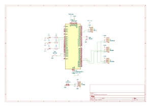

# BreatheCheck
A breath and environment monitoring device that estimates alcohol-related gas concentration, heart rate, SpO2, temperature, humidity, and pressure.

:::info

**Author:** Luciana-Ioana Toma \
**GitHub Project Link:** [https://github.com/UPB-PMRust-Students/acs-project-2026-lucianatoma8](https://github.com/UPB-PMRust-Students/acs-project-2026-lucianatoma8)

:::

## Description

BreatheCheck is an embedded monitoring device built on the STM32 Nucleo-U545RE-Q board. The project combines gas sensing, environmental sensing, and optical heart rate and SpO2 sensing in order to provide a broader view of the air being breathed and the user's basic physiological indicators.

For gas detection, the device uses an MQ-3 sensor. Its analog output is read through the STM32 ADC and compared to a baseline measured during startup calibration. The firmware estimates an alcohol-related gas concentration in mg/L based on how much the MQ-3 value rises above the clean-air baseline. A deadband is used so that normal breath humidity and temperature do not immediately trigger a false alcohol reading.

The BME280 sensor measures ambient temperature, humidity, and atmospheric pressure. These values are displayed together with the MQ-3 reading in order to provide environmental context, since gas sensor behavior can be influenced by surrounding air conditions.

For heart rate and SpO2 monitoring, the MAX30102 optical sensor measures reflected red and infrared light from a fingertip. The firmware processes the raw samples using a simple peak detection algorithm to estimate heart rate in BPM, and uses the red/infrared signal ratio to estimate SpO2.

All values are shown on a 0.96" SSD1306 OLED display. Three LEDs provide quick feedback for the MQ-3 alcohol-related level: green for normal, yellow for caution, and red for exceeded threshold. A passive buzzer is activated when the red threshold is reached.

The prototype is powered through the STM32 Nucleo USB connector. The firmware is written in Rust using embassy-rs.

:::danger
The alcohol, BPM, and SpO2 values are estimated for educational and demonstration purposes. The device is not intended for medical, legal, or safety-critical use.
:::

## Motivation

I chose this project because I wanted to work with multiple sensors at the same time and learn how to handle analog, digital, and I2C peripherals in Rust using embassy-rs.

Instead of building only a simple breath alcohol detector, I wanted the device to monitor several values related to breathing and air conditions: alcohol-related gas concentration, temperature, humidity, pressure, heart rate, and SpO2. This made the project more interesting because it combines environmental sensing with basic biometric sensing.

The project was also useful for learning how to combine several sensor readings into one embedded application, display live values on an OLED screen, and provide immediate visual and audio feedback through LEDs and a buzzer.

## Architecture

The project is divided into several sensing, processing, and feedback blocks that work together to monitor breath-related gas concentration, environmental conditions, and biometric values.

Main Components:
* **The Controller**: The STM32 Nucleo-U545RE-Q board — the brain of the device. It reads all sensors, processes the data, updates the display, and controls the LEDs and buzzer.
* **The Gas Sensing System**: The MQ-3 gas sensor is connected to the ADC and is used to detect alcohol-related volatile compounds in exhaled air. The firmware calibrates the sensor against the surrounding air at startup.
* **The Environmental Sensing System**: The BME280 sensor measures temperature, humidity, and pressure. These values describe the surrounding air conditions and provide context for the MQ-3 reading.
* **The Optical Sensing System**: The MAX30102 sensor is connected over I2C and estimates heart rate and SpO2 from a fingertip using red and infrared light.
* **The Display and Feedback System**: The SSD1306 OLED displays the live measurements. Three LEDs and a passive buzzer provide immediate feedback based on the MQ-3 alcohol-related threshold.
* **The Power System**: The prototype is powered through the STM32 Nucleo USB connector during operation and debugging.

## Log

### Week 5 - 11 May

- Defined the initial project idea and chose the main functionality of the device.
- Selected the main components: MQ-3, BME280, MAX30102, SSD1306 OLED, LEDs, and passive buzzer.
- Ordered the required hardware components.
- Started the first hardware tests by connecting and testing the OLED display and the status LEDs.

### Week 12 - 18 May

- Built the main hardware connections on the breadboard.
- Connected the remaining sensors and output components: MQ-3, BME280, MAX30102 and buzzer.
- Tested each component separately to make sure it worked correctly.
- Verified the I2C bus using an I2C scanner and confirmed that the OLED, BME280, and MAX30102 were detected.

### Week 19 - 25 May

- Implemented the full firmware in Rust using embassy-rs.
- Added MQ-3 startup calibration and alcohol-related gas estimation based on the clean-air baseline.
- Added BME280 temperature, humidity, and pressure readings.
- Added MAX30102 heart rate and SpO2 estimation.
- Integrated the OLED display, LED feedback, and passive buzzer alert into the final firmware.

## Hardware 

| Component | Role | Interface |
|---|---|---|
| STM32 Nucleo-U545RE-Q | Main microcontroller | — |
| MQ-3 alcohol gas sensor | Detects alcohol-related volatile compounds in exhaled air | ADC (PA4 / A2) |
| MAX30102 | Estimates heart rate (BPM) and SpO2 (%) | I2C1 (0x57) |
| BME280 | Measures temperature, humidity, and pressure | I2C1 (0x76) |
| SSD1306 OLED 0.96" | Displays live measurements | I2C1 (0x3C) |
| LED Green | Normal MQ-3 level | GPIO (PC0) |
| LED Yellow | Caution MQ-3 level | GPIO (PC1) |
| LED Red | Exceeded MQ-3 threshold | GPIO (PC2) |
| Passive buzzer | Beeps when the MQ-3 threshold is exceeded | GPIO (PA8) |
| Breadboard + jumper wires | Prototyping connections | — |

### Schematics

### Bill of Materials

| Device | Usage | Price |
|--------|--------|-------|
| STM32 Nucleo-U545RE-Q | Main microcontroller | — RON |
| MQ-3 Alcohol Sensor | Alcohol-related volatile gas detection | [13.00 RON](https://www.bitmi.ro/electronica/modul-senzor-de-gaze-mq3-10421.html) |
| MAX30102 | Heart rate and SpO2 | [11.98 RON](https://www.bitmi.ro/electronica/senzor-ritm-cardiac-si-spo2-max30102-12117.html) |
| BME280 | Temperature, humidity and pressure measurement | [32.67 RON](https://www.emag.ro/modul-senzor-temperatura-umiditate-presiune-bme280-ai0002-s34/pd/DR7HCZBBM/?ref=history-shopping_485342338_50435_1) |
| SSD1306 OLED 0.96" | Display | [16.96 RON](https://sigmanortec.ro/Display-OLED-0-96-I2C-IIC-Albastru-p135055705) |
| LEDs (x3) + Resistors | Visual feedback | 26.20 RON |
| Passive Buzzer | Audio feedback | [1.45 RON](https://sigmanortec.ro/Buzzer-pasiv-5v-p172425809) |
| Breadboard + Wires | Prototyping | [34.58 RON](https://www.emag.ro/kit-breadboard-830-gauri-65-fire-modul-tensiune-alimentare-mb102-jh027/pd/DY1YP6BBM/?ref=history-shopping_485342338_227191_1) |
| | **Total** | **136.84 RON** |

## Software

| Library | Description | Usage |
|---------|-------------|-------|
| [embassy-stm32](https://docs.embassy.dev/embassy-stm32) | STM32 HAL for embassy-rs | ADC, I2C1, GPIO, and peripheral access |
| [embassy-executor](https://docs.embassy.dev/embassy-executor) | Async executor for embedded Rust | Runs the main firmware loop |
| [embassy-time](https://docs.embassy.dev/embassy-time) | Timing utilities | MQ-3 calibration timing, display refresh, and sensor sampling |
| [embedded-graphics](https://docs.rs/embedded-graphics/latest/embedded_graphics/) | Graphics primitives for embedded displays | Draws text on the OLED screen |
| [ssd1306](https://github.com/jamwaffles/ssd1306) | OLED display driver | Controls the SSD1306 OLED over I2C |
| [embedded-hal-bus](https://docs.rs/embedded-hal-bus/latest/embedded_hal_bus/) | Shared bus utilities | Allows multiple I2C devices to share the same bus |
| [defmt](https://defmt.ferrous-systems.com/) and [defmt-rtt](https://docs.rs/defmt-rtt/latest/defmt_rtt/) | Embedded logging | Debug output through probe-rs |

## Links

1. [MQ-3 Datasheet](https://www.sparkfun.com/datasheets/Sensors/MQ-3.pdf)
2. [MAX30102 Datasheet](https://datasheets.maximintegrated.com/en/ds/MAX30102.pdf)
3. [BME280 Datasheet](https://www.bosch-sensortec.com/media/boschsensortec/downloads/datasheets/bst-bme280-ds002.pdf)
4. [SSD1306 Datasheet](https://cdn-shop.adafruit.com/datasheets/SSD1306.pdf)
5. [embassy-rs documentation](https://embassy.dev)
6. [embassy-rs STM32 HAL](https://docs.embassy.dev/embassy-stm32)
7. [STM32U545RE Reference Manual](https://www.st.com/en/microcontrollers-microprocessors/stm32u545re.html)