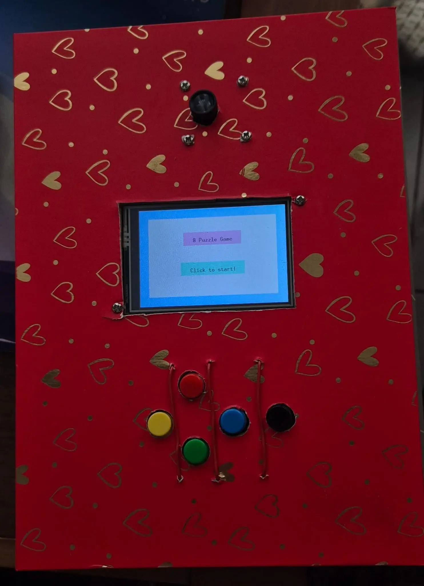
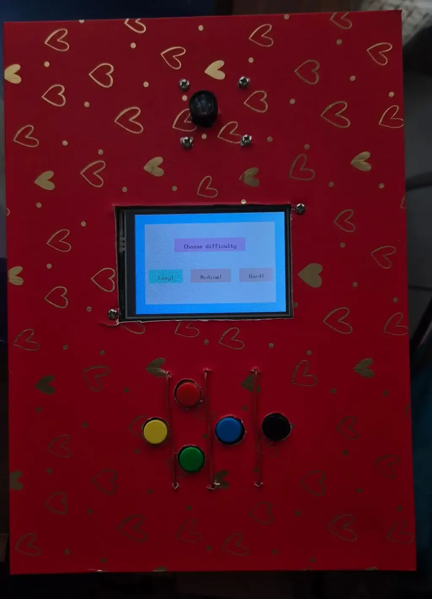
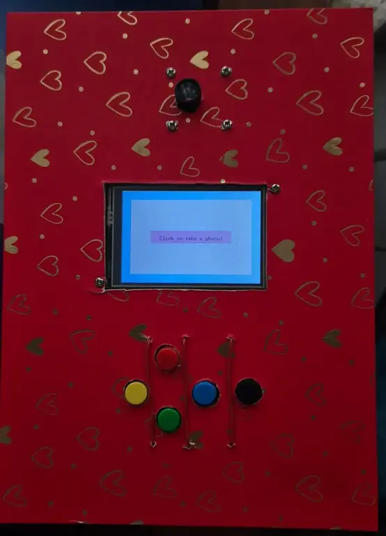
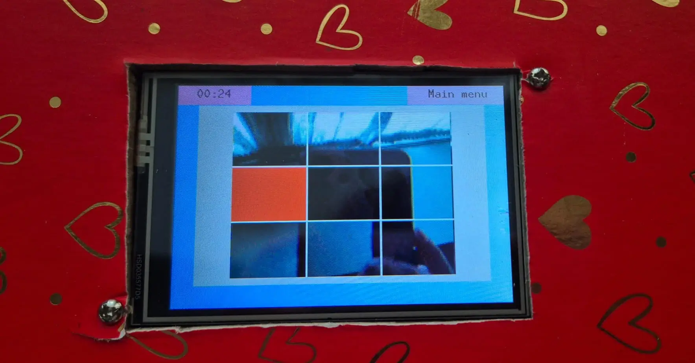
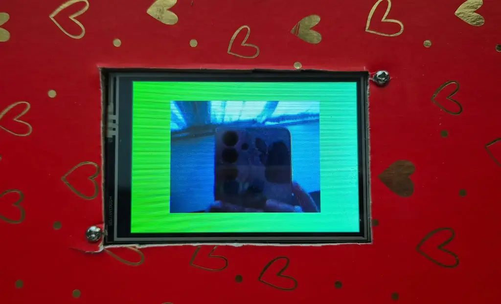
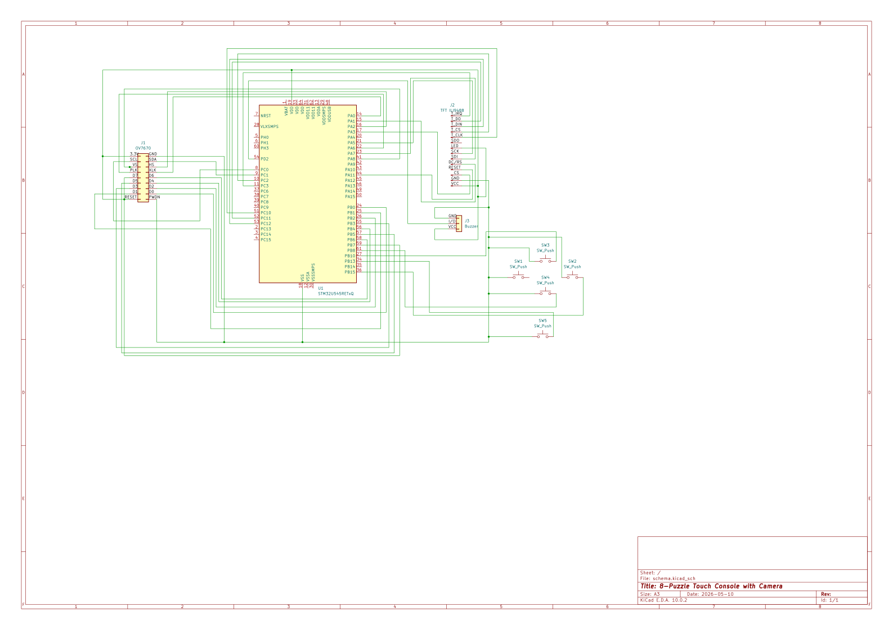

#  8-Puzzle Touch Console with Camera 
A mini-console that turns your photos into an 8-puzzle you can play using the touchscreen or buttons.

:::info 

**Author**: Alexandru Maria-Mihaela \
**GitHub Project Link**: https://github.com/UPB-PMRust-Students/acs-project-2026-maria-alexandru

:::

<!-- do not delete the \ after your name -->

## Description

This project is a laptop-like mini-console equipped with an attached camera. When a game begins, the camera takes a photo that is sliced into a 3x3 grid, shuffled and one tile is removed to create a classic sliding 8-puzzle. Players must reassemble their picture by sliding the tiles using either the touchscreen or physical buttons. The interface also features a built-in timer that tracks both the current elapsed time and the player's best score.

## Motivation

I chose this project because it is based on a console I had when I was little. I could take a picture and instantly play it as a sliding puzzle and I wanted to recreate that fun experience.

## Architecture 

The software architecture of the console is modular, divided into distinct layers that separate the core game logic from direct hardware interaction. The main components are:

- **Game Engine**: This is the software "brain" of the application. It manages the internal state of the 8-puzzle game (a 3x3 matrix), tracks the position of the empty space and validates allowed moves. It also evaluates the win condition (checking if the tiles are in the correct order) and keeps track of the move count or elapsed time.

- **Input Management Subsystem**: It is responsible for capturing and processing user input (buttons pressed, movements made on screen).

- **Graphics & Display Subsystem**: It is responsible for rendering the visual representation of the game state to the screen. This includes drawing the 3x3 grid, updating the positions of the numbered tiles and rendering user interface elements (such as the move counter or timer). 

- **Audio Subsystem**: It translates specific game events triggered by the Game Engine into corresponding sound effects, such as a mechanical click when a tile successfully slides, an error tone for invalid moves, or a victory jingle when the puzzle is solved.

### Architecture Diagram

## Log

<!-- write your progress here every week -->

### Week 13 - 19 April
Ordered the hardware components.

### Week 20 - 26 April
Initialized the ILI9488 display and verified the SPI interface communication. Performed screen tests by rendering examples from https://crates.io/crates/ili9488-rs.

### Week 27 - 03 May
Integrated the OV7670 camera module and established the video capture routine

### Week 04 - 10 May
Finalized peripheral integration: connected and configured the touch controller, buzzer and buttons. Implemented external interrupts (EXTI) for the hardware buttons to ensure responsive input handling.

### Week 11 - 17 May
Developed the game software, including the game logic, screen display and button controls.

### Week 18 - 24 May
- Video: https://youtube.com/shorts/Yu7dfRNBbo0

## Hardware

<!--  Detail in a few words the hardware used. -->

- **STM32U5 microcontroller (Nucleo-U545RE-Q)**
- **3.5" Touch Screen 480x320 SPI TFT ILI9488:** The display unit of the console
- **VGA Camera OV7670 640 x 480px**: Captures images input for the system
- **Microswitches TC-1212T (12x12x7.3mm):** Mechanical tactile switches used for the directional pad and user action buttons
- **Acoustic buzzer for microcontrollers:** Provides auditory feedback and sound effects for various game events

### Schematics

### Bill of Materials

| Device | Usage | Price |
|--------|-------|-------|
| [3.5" Touch Screen 480x320 SPI TFT ILI9488 (1x)](http://www.lcdwiki.com/3.5inch_SPI_Module_ILI9488_SKU:MSP3520) | Main display and visual output | [80.43 RON](https://www.drot.ro/platforma-arduino/149154-ecran-tactil-3-5-480x320-spi-tft-ili9488.html) |
| [VGA Camera OV7670 640 x 480px (1x)](https://web.mit.edu/6.111/www/f2016/tools/OV7670_2006.pdf) | Capturing images/video input | [11.55 RON](https://www.drot.ro/platforma-arduino/900-camera-vga-ov7670-640-x-480px.html) |
| [Acoustic buzzer for microcontrollers (1x)](https://components101.com/misc/buzzer-pinout-working-datasheet) | Audio feedback and sound effects | [4.21 RON](https://www.drot.ro/platforma-arduino/849-buzzer-acustic-pentru-microcontrolere.html) |
| [Microswitch TC-1212T - 12x12x7.3mm SMD PCB (5x)](https://docs.rs-online.com/1b59/0900766b81126ccb.pdf) | Mechanical switches for user input/controls | [10.44 RON](https://www.drot.ro/platforma-arduino/1180-mikroswitch-tc-1212t-12-x-12-x-7-3-mm-smd-pcb.html) |
| [Button cap for microswitch - Red (1x)](https://www.drot.ro/platforma-arduino/1181-buton-pentru-mikroswitch-ro-u-12-x-12-x-7-3-mm.html) | Plastic cap for microswitch (Red) | [1.30 RON](https://www.drot.ro/platforma-arduino/1181-buton-pentru-mikroswitch-ro-u-12-x-12-x-7-3-mm.html) |
| [Button cap for microswitch - Blue (1x)](https://www.drot.ro/platforma-arduino/1182-buton-pentru-mikroswitch-albastru-12-x-12-x-7-3-mm.html) | Plastic cap for microswitch (Blue) | [1.30 RON](https://www.drot.ro/platforma-arduino/1182-buton-pentru-mikroswitch-albastru-12-x-12-x-7-3-mm.html) |
| [Button cap for microswitch - Green (1x)](https://www.drot.ro/platforma-arduino/1183-buton-pentru-mikroswitch-verde-12-x-12-x-7-3-mm.html) | Plastic cap for microswitch (Green) | [1.30 RON](https://www.drot.ro/platforma-arduino/1183-buton-pentru-mikroswitch-verde-12-x-12-x-7-3-mm.html) |
| [Button cap for microswitch - Yellow (1x)](https://www.drot.ro/platforma-arduino/1184-buton-pentru-mikroswitch-galben-12-x-12-x-7-3-mm.html) | Plastic cap for microswitch (Yellow) | [1.30 RON](https://www.drot.ro/platforma-arduino/1184-buton-pentru-mikroswitch-galben-12-x-12-x-7-3-mm.html) |
| [Button cap for microswitch - White (1x)](https://www.drot.ro/platforma-arduino/1185-buton-pentru-mikroswitch-alb-12-x-12-x-7-3-mm.html) | Plastic cap for microswitch (White) | [1.30 RON](https://www.drot.ro/platforma-arduino/1185-buton-pentru-mikroswitch-alb-12-x-12-x-7-3-mm.html) |

## Software

| Library | Description | Usage |
|---------|-------------|-------|
| [ili9488](https://github.com/DashCampbell/ili9488-rs) | Display driver for ILI9488 | Used for initializing the display |
| [embedded-graphics](https://github.com/embedded-graphics/embedded-graphics) | 2D graphics library | Used for drawing to the display |
| [embassy-time](https://github.com/embassy-rs/embassy)| Time library | Used for measuring the game time and for adding small delays |
| [embassy_executor](https://github.com/embassy-rs/embassy) | Task manager | Used for reading user input and updating the screen at the same time |
| [embassy-sync](https://github.com/embassy-rs/embassy) | Async synchronization | Used for communicating between the display task and buttons/touch task |
| [embedded-hal](https://github.com/rust-embedded/embedded-hal) | Standard hardware rules | Defines standard interfaces |
| [panic-probe](https://github.com/knurling-rs/probe-run/tree/main) | Error handling | Stops the program if the code crashes |
| [defmt]() | Logging library | Used for printing debug messages to the computer |
| [rand]() | Random number generator | Used for shuffling the puzzle board pieces |

## Links

1. [ How To Make Mini Laptop at Home ](https://www.youtube.com/watch?v=pFho9bYt6Us)
