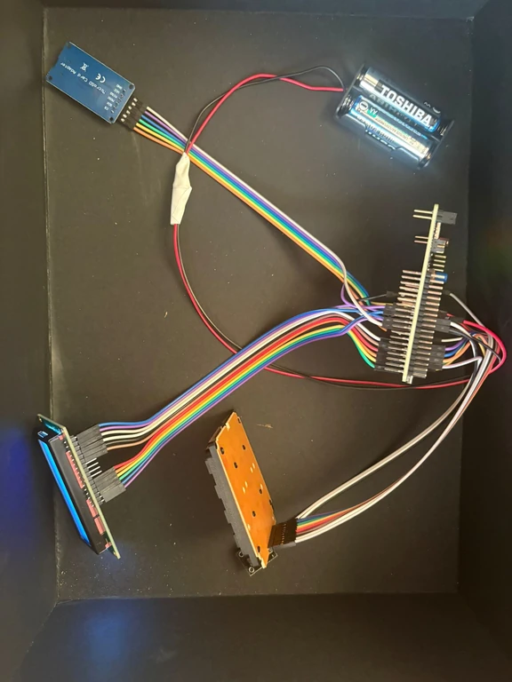
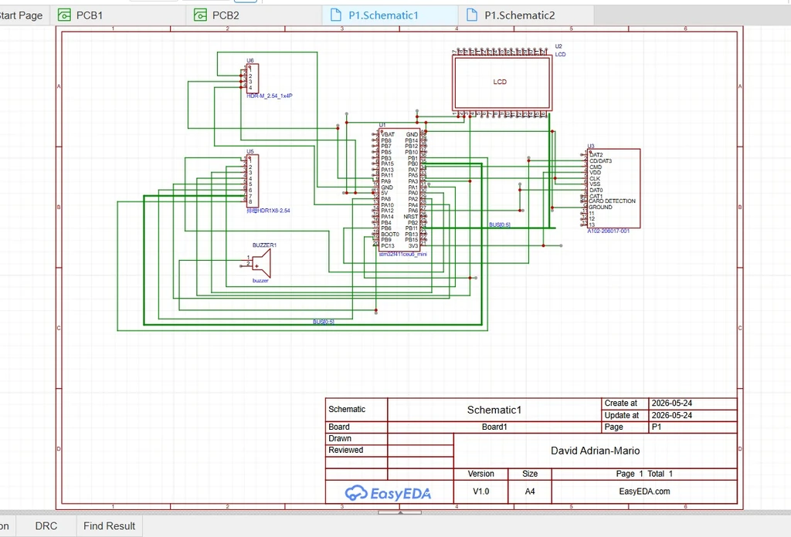

# SmartCash – Intelligent Cash Register System

A smart cash register with product scanning, real-time alerts, and business monitoring features.

---

## info

- **Author:** David Adrian-Mario  
- **Group:** 331 CC  
- **GitHub Project Link:** https://github.com/UPB-PMRust-Students/acs-project-2026-mariodavid3

---

## Description

SmartCash is an intelligent cash register system designed to modernize small retail operations by integrating product scanning, real-time alerts, and smart monitoring features.

The system runs on a microcontroller platform and connects to a barcode scanner, display interface, and alert modules. It allows fast product identification, automatic price calculation, and detection of unusual events such as suspicious transactions, missing products, or system errors.
The device features a display interface that provides clear and real-time information to the user, including product name, price, and total cost. Additionally, the system includes a buzzer and LED-based alert mechanism that notifies the operator in case of errors, invalid scans, or unusual activities.

To enhance functionality, SmartCash can optionally communicate with a computer, allowing storage of transaction logs and management of product databases. This makes the system scalable and adaptable for more advanced retail applications.

Overall, SmartCash improves efficiency, reduces human error, and provides a more reliable and user-friendly solution for handling transactions in small retail environments.

---

## Motivation

I chose this project because I am familiar with how markets and small shops operate, and I noticed that many systems are outdated and rely heavily on manual work. This leads to mistakes, slow service, and lack of control.

The goal is to build a smarter cash register that improves efficiency, reduces errors, and provides real-time alerts.
Additionally, this project allowed me to explore the practical side of embedded systems development by integrating both hardware and software components into a single functional system. Working with peripherals such as barcode scanners, displays, and communication interfaces helped me better understand how real-world devices operate.

Another important motivation was the possibility to design a system that can be extended in the future. SmartCash can evolve into a more complex solution by adding features such as inventory management, cloud connectivity, or mobile integration.

Overall, this project combines a real-world problem with a technical challenge, making it both useful and educational.

---

## Architecture

The system is composed of the following main components:

- **Main Controller** – handles product processing, scanning logic, and alerts  
- **Scanning Module** – reads barcode data and sends it to the controller  
- **Display Module** – shows product information and total price  
- **Alert Module** – buzzer and LEDs for notifications  

All components communicate through the microcontroller, which acts as the central processing unit.

---

## Log

### Week 5 – 11 May
Defined the project idea and overall architecture.

### Week 12 – 18 May
Started hardware setup and tested barcode scanner and display.

### Week 19 – 25 May
Implemented scanning logic and alert system.

---

## Hardware

The project uses:
- Microcontroller (STM32 / Arduino / Raspberry Pi Pico)  
- Barcode scanner  
- LCD / TFT display  
- Buzzer  
- LEDs  
- Buttons  
- Breadboard and wires  

---

## Schematics

---

## Bill of Materials

| Device | Usage | Price |
|------|------|------|
| Microcontroller (STM32 / Pico / Arduino) | Main processing unit | ~50 RON |
| Barcode Scanner | Product scanning | ~70 RON |
| LCD / TFT Display | User interface | ~80 RON |
| Passive Buzzer | Audio alerts | ~10 RON |
| LEDs | Visual alerts | ~10 RON |
| Buttons | User interaction | ~5 RON |
| Jumper Wires (M-F, F-F) | Connections between components | ~20 RON |
| Breadboard | Prototyping connections | ~10 RON |
| USB Cable | Power and communication with PC | ~15 RON |

---

## Software

| Library | Description | Usage |
|--------|------------|------|
| embedded-hal | Hardware abstraction layer | Communication with peripherals |
| display driver (ILI9341 / ST7789) | Display control | UI rendering |
| serial / UART library | Serial communication | Barcode scanner input |
| GPIO library | Digital input/output control | Buttons and LEDs |
| PWM library | Pulse-width modulation | Buzzer control |
| SPI library | Serial Peripheral Interface | Communication with display |
| I2C library | Sensor communication | Future extensions (sensors) |

---

## Links

