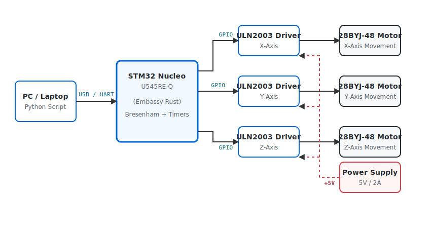
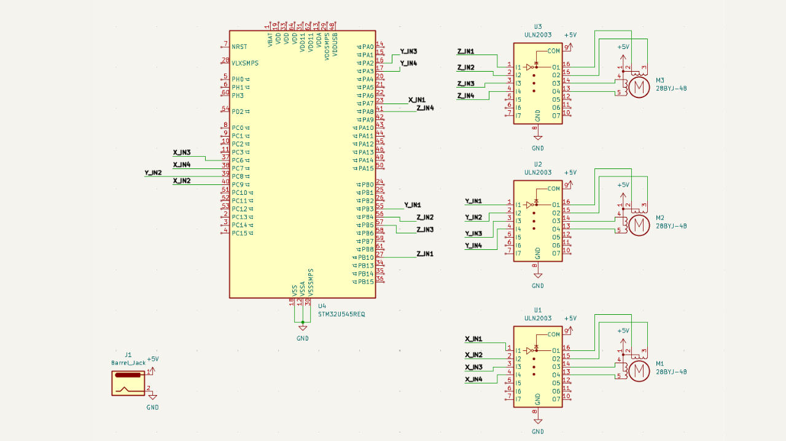
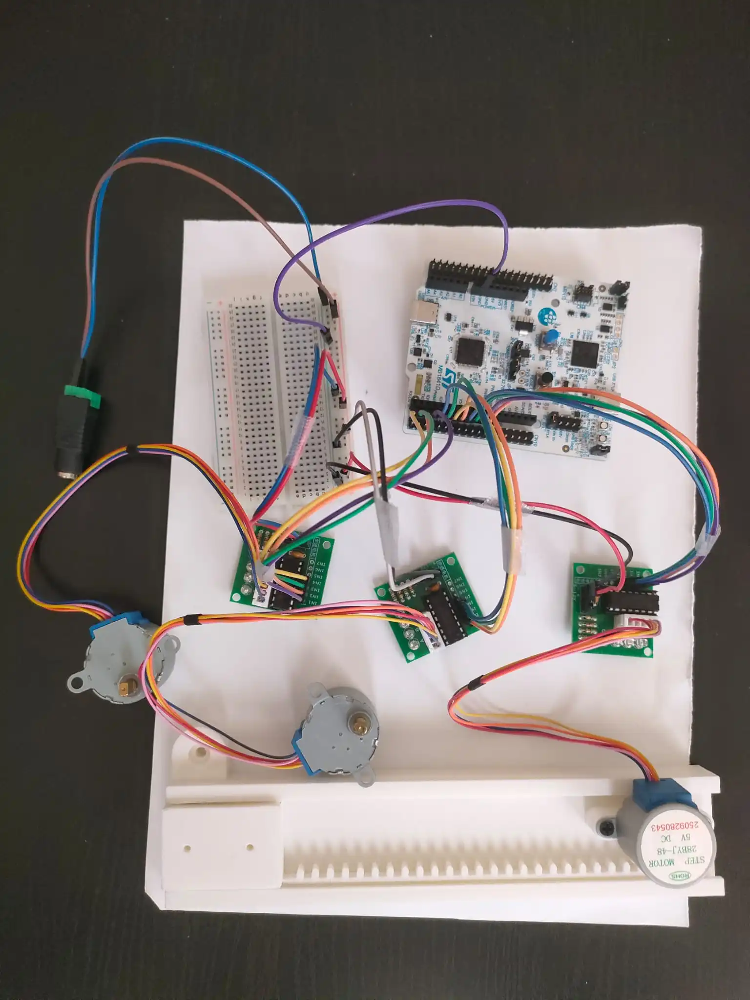

# CNC Pen Plotter

An autonomous 2D plotting machine that translates digital coordinates into physical drawings on paper using a synchronized triple-stepper Cartesian mechanism for all axes (X, Y, and Z).

:::info

**Author**: [Lazarescu Matei-Cristian] \
**GitHub Project Link**: [link_to_github](https://github.com/UPB-PMRust-Students/acs-project-2026-matei1608)

:::

## Description

The CNC Pen Plotter is an embedded real-time device designed to physically draw graphics onto a sheet of paper. The system acts as a precise executor for coordinate data sent from a PC via USB (UART). Instead of relying on a high-level operating system, the STM32 Nucleo-U545RE-Q microcontroller uses DMA to receive a continuous stream of coordinates without blocking the CPU. 

Once the data is parsed, the firmware utilizes Bresenham's line algorithm to calculate the exact interpolation needed to draw straight lines. All three axes (X, Y, and Z) are driven by **28BYJ-48 unipolar stepper motors**, controlled via **ULN2003 drivers**. The Z-axis motor rotates a mechanism to lower the pen when drawing or lift it when moving between shapes. The entire motion system is strictly synchronized using asynchronous Embassy tasks and hardware timers to generate specific step sequences, preventing step loss and maintaining smooth kinematics.

## Motivation

Translating digital graphics into physical reality requires a deep understanding of hardware-software synchronization. While commercial plotters or 3D printers handle this using advanced, pre-built frameworks, building one from scratch entirely in bare-metal Rust (`no_std`) represents a significant engineering challenge. This project was chosen to demonstrate the capability of handling asynchronous real-time communications, software-defined stepping sequences (Half-Step/Full-Step) for geared motors, and mathematical motion control (linear interpolation) on a highly resource-constrained embedded system.

## Architecture

- **Communication Module** — Handles the asynchronous serial communication (UART over USB) between the PC and the STM32 microcontroller. It uses DMA and ring buffers (via `heapless`) to safely store incoming coordinate commands without risking memory overflow or dynamic allocation crashes.
- **Motion Control Module** — The core logical component. It reads the target coordinates and applies Bresenham's line algorithm to determine the exact sequence of steps for the X and Y motors. Since 28BYJ-48 motors require sequential coil activation, this module cycles through a defined boolean matrix (step sequence) and sets the appropriate STM32 GPIO pins HIGH/LOW to drive the ULN2003 inputs.
- **Toolhead Module** — Controls the Z-axis actuation. It reuses the stepper motor task logic to drive a third 28BYJ-48 motor, effectively turning a mechanical gear to lift or drop the pen onto the paper at the start or end of a drawing path.
- **Power & Drive Module** — A 5V 2A power supply feeds the ULN2003 stepper drivers and motors directly, connected via a screw-terminal DC barrel jack adapter on a 400-point breadboard. The MCU logic runs safely isolated at 3.3V/5V via USB, sharing only the common ground (GND) with the power circuit.

## Log

### April 14 - 20
- Finalized project theme and received approval.
- Researched kinematics and ordered the stepper motors, drivers, and mechanical components.

### May 4 - 10
- All the hardware components finally arrived. 
- Started researching datasheets and figuring out how to correctly wire the STM32, the ULN2003 drivers, and the power supply on the breadboard.

### May 11 - 17
- Finished the physical hardware assembly and all the electronic wiring.
- Wrote the initial testing code and successfully got all three stepper motors spinning.

### May 18 - 24

## Hardware

The main controller is the **STM32 Nucleo-U545RE-Q**, chosen for its hardware FPU (useful for kinematic math), advanced hardware timers, and robust support within the Rust Embassy async ecosystem.

The physical movement is achieved using three **28BYJ-48 Stepper Motors**. These are 5V geared unipolar stepper motors known for their high precision (due to the internal 1:64 gear ratio). They are driven by three **ULN2003 Motor Drivers**, which act as high-current switches, translating the 3.3V logic signals from the STM32 into the 5V high-current pulses required by the motor coils.

Power is managed separately to protect the microcontroller: the motors are powered by a dedicated **5V 2A Power Supply**, connected to the circuit using a **screw-terminal DC barrel jack adapter**. The power distribution and driver logic connections are routed on a **400-point breadboard** using standard **jumper wires**. The STM32 shares a common GND with the motor circuit but draws its own logic power via USB.

### Bill of Materials

| Device | Usage | Price |
|--------|--------|-------|
| STM32 Nucleo-U545RE-Q | Main microcontroller | From Faculty |
| [3x 28BYJ-48 Stepper Motors + ULN2003 Drivers](https://www.emag.ro/search/motor+pas+cu+pas+28byj-48+uln2003) | X, Y, and Z axis movement & switching | ~60 RON |
| [5V 2A Power Supply](https://www.emag.ro/search/alimentator+5v+2a) | Powering the ULN2003 drivers & motors | ~25 RON |
| [DC Barrel Jack Adapter (Female)](https://www.emag.ro/search/mufa+alimentare+mama+surub) | Connecting the power supply to the breadboard | ~5 RON |
| [Breadboard 400 points](https://www.emag.ro/search/breadboard+400) | Prototyping electronic connections | ~10 RON |
| [Jumper Wires (M-M / M-F)](https://www.emag.ro/search/set+fire+jumper+arduino) | Routing signals between MCU, drivers, and power | ~15 RON |
| **Total** | | **~120 RON** |

## Software

| Library | Description | Usage |
|---------|-------------|-------|
| [embassy-stm32](https://github.com/embassy-rs/embassy) | Async HAL for STM32 | Managing UART (DMA), Timers, and Standard GPIO pins |
| [embassy-executor](https://github.com/embassy-rs/embassy) | Async task executor | Running concurrent tasks (e.g., listening to UART while stepping all 3 motors) |
| [embassy-time](https://github.com/embassy-rs/embassy) | Timekeeping | Managing microsecond delays between motor steps to control speed |
| [heapless](https://github.com/japaric/heapless) | `no_std` data structures | Creating ring buffers for storing incoming coordinates without dynamic allocation |
| [defmt](https://github.com/knurling-rs/defmt) | Lightweight logging framework | Structured debug output (e.g., coordinate parsing status) |
| [defmt-rtt](https://github.com/knurling-rs/defmt) | RTT logging transport | Streaming logs to the PC via the debug probe |
| [panic-probe](https://github.com/knurling-rs/probe-run) | Panic handler | Catching errors and safely halting the motors via probe |

## Links

1. [Embassy-rs documentation](https://embassy.dev)
2. [STM32U5 Reference Manual](https://www.st.com/resource/en/reference_manual/rm0456-stm32u5-series-advanced-armbased-32-bit-mcus-stmicroelectronics.pdf)
3. [Bresenham's Line Algorithm Explanation](https://en.wikipedia.org/wiki/Bresenham%27s_line_algorithm)
4. [28BYJ-48 Stepper Motor Datasheet](https://components101.com/motors/28byj-48-stepper-motor)
5. [ULN2003 Driver Datasheet](https://www.st.com/resource/en/datasheet/uln2001.pdf)
6. [defmt logging framework](https://defmt.ferrous-systems.com)