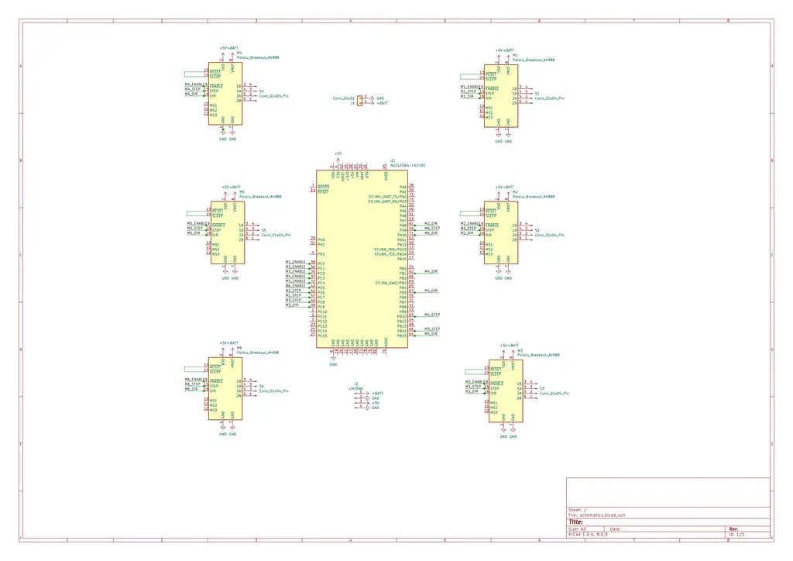
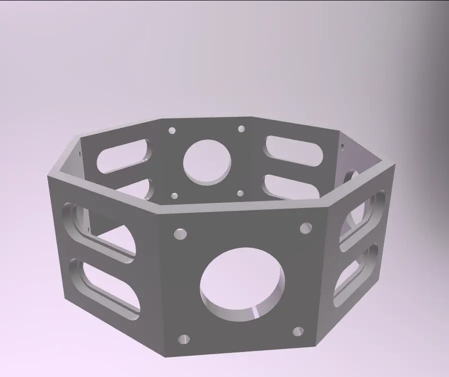
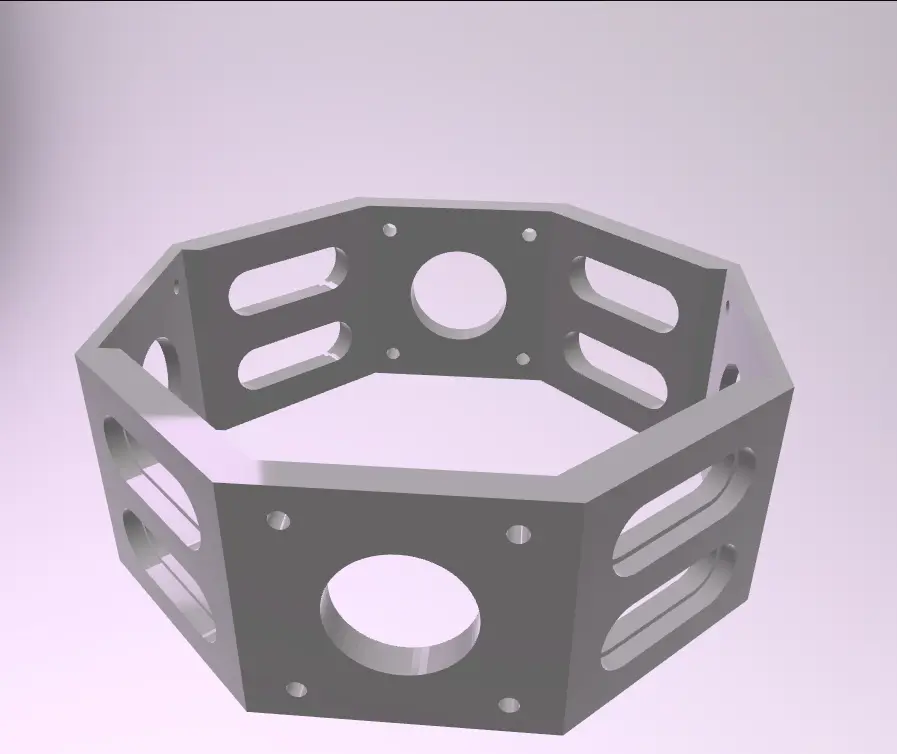
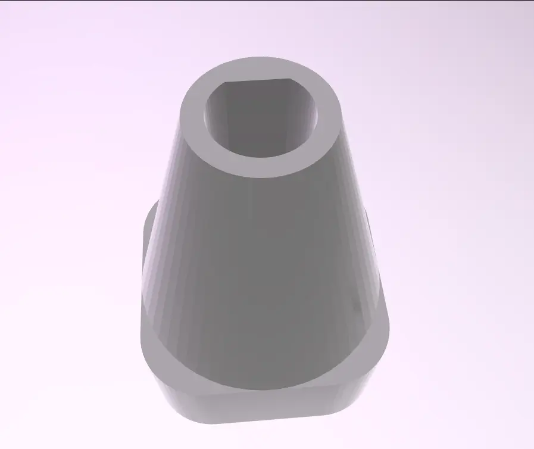

# Rubik's Cube Solver

A smart robotic system that uses mobile computer vision to analyze a Rubik's Cube and an STM32-controlled mechanical frame to solve it.

:::info

**Author:** Matei Stănuca \
**GitHub Project Link:** [Rubiks Cube Solver](https://github.com/UPB-PMRust-Students/acs-project-2026-mateistanuca1)

:::

## Description

This project is an end-to-end automated solver. It uses a smartphone camera to scan all six faces of the Rubik's Cube. The mobile application processes the images to identify the color configuration and calculates the optimal solution using the Kociemba algorithm. The resulting move sequence is transmitted to an STM32 microcontroller, which executes the physical rotations using six NEMA 17 stepper motors.

## Motivation

The goal is to integrate high-level software (Computer Vision and Pathfinding) with low-level hardware control. By using a smartphone as the sensor, I can leverage its high-resolution camera and processing power to simplify the hardware setup while creating a seamless user experience where a simple scan leads to a physical solution.

## Architecture

The system operates in three main stages:

1. Vision Layer: Smartphone app captures and parses the cube's state.

2. Communication Layer: Data is sent via UART (Serial) or Bluetooth/Wi-Fi to the STM32.

3. Execution Layer: STM32 coordinates six A4988 drivers to perform the moves.

## Log

### Week 21 - 27 April

Found components and refined strategy.

### Week 27 - 03 May

Started testing each stepper + driver.

### Week 03 - 10 May

First try with IDA* algorithm (unsuccessfully due to low RAM)

### Week 10 - 17 May

The steppers started rotating the cube.

### Week 17 - 24 May

Rubik Cube solved.

## Hardware

The system is powered by an STM32 Nucleo board. The mechanical assembly uses six NEMA 17 motors, each equipped with a 3D-printed adapter.

### Schematics

### 3D Printed Components

### Bill of Materials

| Component | Quantity | Cost/Piece |
| --------- | -------- | ---------- |
| Driver stepper A4988 + Radiator | 6 | 8,09 RON |
| Stepper motor, Nema17, 1.8 grade, 1.5A, 42x42x34mm | 6 | 67,06 RON |
| Module Wifi ESP8266 Transreceiver, ESP-01 | 1 | 21,05 RON |
| Suport 2 acumulatori 18650, SMD, SMT, pini bronz | 1 | 9,83 RON |
| Modul coborator tensiune adjustabil LM2596 DC-DC 4.5-40V 3A | 1 | 6,69 RON |
| Modul adaptor ESP-01, ESP8266 | 1 | 4,60 RON |
## Software

| Library | Description | Usage |
|---------|-------------|-------|
| [embassy-stm32](https://github.com/embassy-rs/embassy) | STM32 HAL for Embassy | Used for GPIO, ADC and timers/PWM |
| [embassy-executor](https://github.com/embassy-rs/embassy) | Async task executor | Runs the main application logic |
| [embassy-time](https://github.com/embassy-rs/embassy) | Timekeeping and delays | Used for timing and sensor polling |
| [embedded-hal](https://github.com/rust-embedded/embedded-hal) | Hardware abstraction layer | Standard interface for peripherals |
| [defmt](https://github.com/knurling-rs/defmt) | Lightweight logging framework | Used for debugging and logging |
| [defmt-rtt](https://github.com/knurling-rs/defmt) | RTT logging transport | Sends logs to the PC |
| [panic-probe](https://github.com/knurling-rs/probe-run) | Panic handler | Used for debugging crashes |
| [imageproc](https://crates.io/crates/imageproc) | Vision library | Parsing cube colors from camera |

## Links

<!-- Add a few links that inspired you and that you think you will use for your project -->

1. [Tesseract Rubiks Cuber Robot](https://www.instructables.com/Tesseract-Rubiks-Cube-Robot/)
