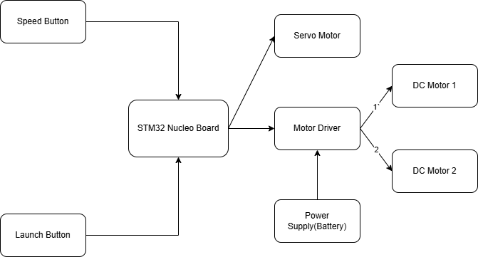

# Ping Pong Ball Launcher
Variable speed ping pong ball launcher

:::info

**Author**: Roescu Matei Florin \
**GitHub Project Link**: link_to_github

:::

<!-- do not delete the \ after your name -->

## Description
This project presents an automatic ping pong ball launcher designed for training purposes. The system is capable of launching balls at variable speeds, which can be adjusted through user input via a control button. A separate trigger button allows the user to launch a ball on demand, offering precise control over each shot. The launching mechanism is based on two continuously rotating wheels that grip and accelerate the ball upon contact, ensuring consistent speed and direction.

## Motivation

The main idea for this project was inspired by my passion for ping pong. Since I play this sport regularly, I have always been interested in finding ways to improve my skills. This led me to the concept of designing a training machine that could simulate real gameplay situations. Building a ping pong ball launcher felt like a natural and exciting challenge, as it combines my interest in the sport with practical engineering and problem-solving.
## Architecture


Main Components:
- **Microcontroller (STM32 Nucleo)**: It's the brain of the project
- **Buttons**: One is used to cycle through different predefined launching speeds and the other is used to launch the ball
- **DC Motors**: Used for spinning two wheels continuously
- **Motor Driver**: Controls the speed and direction of the two motors
- **Power Supply**: The board does not support enough power for high motor speeds, so a power supply is needed
- **Servo Motor**: Used for releasing the ball when launching button is pressed

## Log

<!-- write your progress here every week -->

### Week 5 - 11 May

### Week 12 - 18 May

### Week 19 - 25 May

## Hardware

Detail in a few words the hardware used.

### Schematics

Place your KiCAD or similar schematics here in SVG format.

### Bill of Materials

<!-- Fill out this table with all the hardware components that you might need.

The format is
```
| [Device](link://to/device) | This is used ... | [price](link://to/store) |

```

-->


## Software


## Links

<!-- Add a few links that inspired you and that you think you will use for your project -->

...
