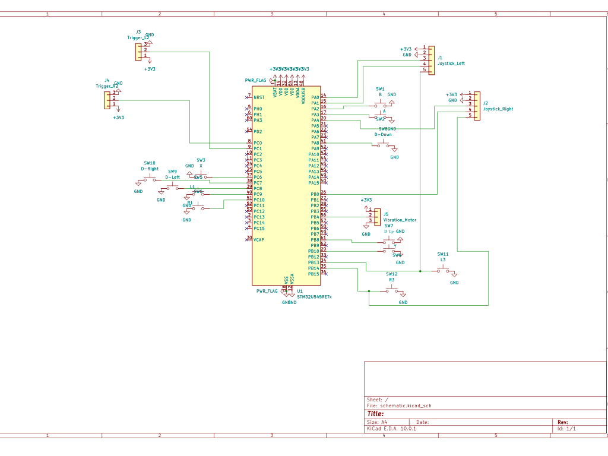

# Game Controller

A custom wired game controller inspired by Xbox/PlayStation designs, built on STM32 Nucleo-U545RE-Q, connected to the host via USB-C.

:::info

**Author**: Țopa Mihai-Sebastian \
**GitHub Project Link**: https://github.com/UPB-PMRust-Students/acs-project-2026-topa-mihai-sebastian

:::

---

## Description

This project is a **wired game controller** that connects to a computer via **USB-C**, presenting itself as a standard **HID (Human Interface Device)** — natively recognized by any modern operating system, no extra drivers needed.

The controller features:
- **2 analog joysticks** (left/right), each with a clickable button (L3/R3)
- **2 analog triggers** (L2/R2), each with its own linear potentiometer
- **4 face buttons** (A, B, X, Y)
- **D-Pad** (4 directions)
- **Shoulder buttons** (L1, R1)
- **Vibration motor** for haptic feedback, PWM-controlled
- USB-C powered — no batteries needed
- Fully recognized by **Steam** (Steam Input) — all axes, buttons, and triggers work correctly

I initially planned a two-microcontroller architecture (STM32 + ESP32-C3) communicating over Bluetooth LE, but decided against it — coordinating BLE HID between two microcontrollers turned out to be quite complex. The final design uses a **single STM32 Nucleo-U545RE-Q** that reads all inputs and connects directly to the host as a USB HID gamepad.

---

## Motivation

As an avid gamer, I wanted to understand how a controller works from the ground up — from analog signal acquisition to OS-level communication. This project lets me work with ADC, GPIO, PWM, and USB HID all in one practical device.

---

## Architecture

```
┌─────────────────────────────────────────────────────────────┐
│                        INPUT LAYER                          │
│  [Joystick L] [Joystick R] [Trigger L] [Trigger R]          │
│  [Buttons x12]             [Vibration Motor]                │
└───────────────────────┬─────────────────────────────────────┘
                        │ ADC / GPIO / PWM
                        ▼
┌─────────────────────────────────────────────────────────────┐
│               STM32 Nucleo-U545RE-Q                         │
│  - Reads ADC: 4 joystick axes + 2 triggers                  │
│  - Reads GPIO: 12 buttons                                   │
│  - Controls vibration motor via PWM                         │
│  - Acts as USB HID Gamepad                                  │
└───────────────────────┬─────────────────────────────────────┘
                        │ USB-C
                        ▼
                  [ PC / Laptop ]
```

---

## Log

### Week 1
- Defined the architecture and component list.
- Researched the USB HID protocol for gamepads.

### Week 2
- Wired the joysticks and verified ADC readings on all 4 axes.
- Wired all buttons and verified GPIO readings.

### Week 3
- Implemented USB HID on the STM32 using the Embassy USB stack.
- Tested controller recognition by the operating system.

### Week 4
- Wired the potentiometers for the analog triggers.
- Wired the vibration motor and tested PWM control.
- Full integration test.
- Added the controller to Steam and configured it using Steam Input. Steam correctly detects all axes, buttons, and triggers. The controller is fully functional in Steam.

---

## Hardware

### Main Components

#### 1. STM32 Nucleo-U545RE-Q
The only microcontroller in the project. Reads all inputs, controls the vibration motor, and communicates with the host via USB HID.

- 6 ADC channels: Joystick L (X, Y), Joystick R (X, Y), Trigger L, Trigger R
- 12 GPIO pins for buttons
- 1 PWM output for the vibration motor (TIM3 CH1)
- USB Full Speed via USB-C (PA11/PA12) to the host
- Powered via USB-C; provides 3.3V on Morpho pins (CN7) for peripherals

#### 2. Analog Joysticks PS2 Module (×2)
Standard XY joystick modules with integrated push-button (L3/R3). Each module: VCC, GND, VRx, VRy, SW.

- VRx/VRy → 2 ADC channels per joystick
- SW → GPIO with internal pull-up

#### 3. Tactile Buttons 12×12mm (×12)
A, B, X, Y, L1, R1, D-Pad ×4, L3, R3.

- Wired between GPIO and GND, internal pull-up enabled in firmware

#### 4. Analog Triggers — Linear Potentiometers 10K (×2)
One potentiometer per trigger (L2 and R2).

- Wiper → ADC channel on STM32
- 0–3.3V range mapped to the trigger axis value

#### 5. Vibration Motor (PWM, DC, 3–5V)
ERM coin-type motor, driven by an NPN transistor (S8050 or BC337) and a flyback diode (1N4148).

```
STM32 GPIO (PWM) → Transistor base → Motor → 3.3V
                                     1N4148 in parallel with motor
```

#### 6. Power Supply

The board is powered via USB-C (5V from the USB bus). The Nucleo's onboard regulator provides 3.3V on the Morpho pins (CN7) for all peripherals. No external regulator is needed.

---

### Schematics




The schematic covers the following connections:

**Joysticks (×2)**
| Signal | STM32 Pin |
|--------|-----------|
| Joystick L — VRx | PA0 (ADC1) |
| Joystick L — VRy | PA1 (ADC1) |
| Joystick L — SW (L3) | PB13 |
| Joystick R — VRx | PA4 (ADC1) |
| Joystick R — VRy | PB0 (ADC1) |
| Joystick R — SW (R3) | PB14 |

**Triggers (×2)**
| Signal | STM32 Pin |
|--------|-----------|
| Trigger L2 — wiper | PC1 (ADC1) |
| Trigger R2 — wiper | PC0 (ADC1) |

**Buttons (×12)**
| Button | STM32 Pin |
|--------|-----------|
| A | PA3 |
| B | PA2 |
| X | PC6 |
| Y | PB10 |
| L1 | PC9 |
| R1 | PC10 |
| D-Up | PB8 |
| D-Down | PA8 |
| D-Left | PC8 |
| D-Right | PC7 |
| L3 | PB13 |
| R3 | PB14 |

**Vibration Motor**
| Signal | STM32 Pin |
|--------|-----------|
| PWM control | PB4 (TIM3 CH1) |

**USB**
| Signal | STM32 Pin |
|--------|-----------|
| USB D- | PA11 |
| USB D+ | PA12 |

---

### Bill of Materials

| Device | Usage | Price |
|--------|-------|-------|
| STM32 Nucleo-U545RE-Q | Main microcontroller + USB HID | ~110 RON *(owned)* |
| Joystick Module 2-Axis XY ×2 | Left + right joystick with L3/R3 | 5.45 RON × 2 |
| Tactile Button PCB 12×12×7.3mm ×12 | A, B, X, Y, D-Pad ×4, L1, R1, L3, R3 | 1.33 RON × 12 |
| Linear Potentiometer Module 10K ×2 | Analog triggers L2 and R2 | 12.52 RON × 2 |
| Vibration Motor Module DC PWM 3–5V | Haptic feedback | 5.36 RON |
| Breadboard 800p ×1 | Prototyping base | ~14 RON |
| Dupont Wire 30cm M-M ×2 (40pcs/set) | Breadboard connections | 8.39 RON × 2 |
| Dupont Wire 30cm M-F ×1 (40pcs/set) | Module connections | 7.59 RON |
| Ceramic Capacitor Set 300pcs | VCC / ADC decoupling | 12.55 RON |
| Resistor Kit 30 values 600pcs | Pull-up / protection | 15.16 RON |
| | Subtotal (components) | 123.34 RON |
| | Delivery | 15.15 RON |
| | **Total (cart incl. VAT)** | **138.49 RON** |
| | **Grand Total (incl. Nucleo)** | **~248 RON** |

---

## Software

Firmware is written in **Rust** using the **Embassy** async framework for STM32.

### Key components

- **USB HID** — `embassy-usb` with a custom 8-byte gamepad report descriptor (12 buttons + 4 axes + 2 triggers). The device presents itself as a Game Pad (Usage Page 0x01, Usage 0x05) for maximum OS compatibility.
- **ADC** — `embassy-stm32` ADC1, blocking reads at ~19.5 cycles sample time. Raw 14-bit values mapped to signed 8-bit axis values via `adc_to_axis()`.
- **GPIO** — 12 buttons, active-low with internal pull-up. Press events detected on falling edge (bit was 0, now 1).
- **PWM** — TIM3 CH1 on PB4 drives the vibration motor. Duty cycle: 100% when R2 trigger is maxed out, 70% for 500 ms every 10 seconds otherwise.
- **Clocks** — HSI @ 16 MHz for the CPU; HSI48 (synced from USB SOF) for the USB peripheral; SYS clock routed to ADC.

### HID report layout (8 bytes)

| Byte | Content |
|------|---------|
| 0 | Buttons 0–7 (A, B, X, Y, L1, R1, D-Up, D-Down) |
| 1 | Buttons 8–11 (D-Left, D-Right, L3, R3) + 4-bit padding |
| 2 | LX axis (i8) |
| 3 | LY axis (i8) |
| 4 | RX axis (i8) |
| 5 | RY axis (i8) |
| 6 | L2 trigger (u8, 0–255) |
| 7 | R2 trigger (u8, 0–255) |

The main loop runs at ~200 Hz (5 ms `Timer::after`). USB HID and USB stack are joined as two concurrent async tasks via `embassy-futures::join`.

---

## Links

1. [Embassy Async Embedded Framework (Rust)](https://embassy.dev/)
2. [USB HID Usage Tables (Gamepad)](https://usb.org/sites/default/files/hut1_21.pdf)
3. [STM32 Nucleo-U545RE-Q User Manual (UM3062)](https://www.st.com/resource/en/user_manual/um3062-stm32u3u5-nucleo64-board-mb1841-stmicroelectronics.pdf)
