# AeroGuard

Solar-powered air quality monitor with GPS.

:::info

**Author**: Defta Ovidiu 344C2 \
**GitHub Project Link**: [UPB-PMRust-Students/acs-project-2026-odefta](https://github.com/UPB-PMRust-Students/acs-project-2026-odefta)

:::

## Description

Portable air quality station running off a solar panel and an 18650 cell. An STM32 reads particulate matter (PM2.5 / PM10), gases (CO, NO₂, NH₃, VOCs), temperature, humidity, and pressure, and tags every sample with GPS coordinates plus a timestamp. Readings are logged as JSON on a microSD card and served over Wi-Fi by a XIAO ESP32-C6 co-processor that runs a small REST server. A companion mobile app pulls the API and renders charts, the location on a map, and the battery state.

## Motivation

Professional air quality stations are lab-accurate but cost tens of thousands of euros each, so they end up sparse — only a handful per city — and the data they publish online is averaged over an entire district. AeroGuard takes the opposite trade-off: a solar-powered monitor built from off-the-shelf modules, for a small fraction of the price of a real station, that pulls in particulate matter (PM1.0 / PM2.5 / PM10), common pollutant gases (CO, NO₂, NH₃), a VOC index, temperature, humidity, atmospheric pressure, and GPS coordinates with an accurate UTC timestamp — and logs all of it every few seconds. The numbers are not lab-grade, but the device runs unattended for days on the balcony, can be moved wherever I want to measure, and gives me a far richer picture of what is actually in the air around it than any public source.

## Architecture

Battery monitoring uses a 2 × 100 kΩ divider into an STM32 ADC pin and is exposed through `/api/battery`. Reverse-polarity protection on the SOLAR+ and BATT+ rails is done with 1N5819 Schottky diodes. Overcurrent / overcharge / overdischarge protection is taken care of by the Seiko S-8261 PCB built into the protected NCR18650B cell — no external polyfuse needed (a 1 A polyfuse would have nuisance-tripped on the Wi-Fi TX bursts anyway). A 470 µF bulk cap sits on the MP1584 output to keep the buck converter stable under PMS5003 fan inrush.

## Log

### Week 14 — 20 April

Picked the MCU stack: STM32 Nucleo U545RE-Q + XIAO ESP32-C6 as a Wi-Fi co-processor, both in Rust with embassy, talking to each other over UART with JSON. Checked drivers on crates.io — most sensors are covered, the MiCS-4514 is not, so I'll port the DFRobot Arduino library by hand. Sketched the power chain (panel → buck → charger → 18650 → boost) and made a buy list.

### Week 21 — 27 April

Ordered everything on April 22 from eMag, Optimus Digital, depozitulcubaterii, sigmanortec, DigiKey and Robofun. All parts arrived by the end of the week. Wrote most of this documentation page and put together the architecture diagram.

## Hardware

The STM32 talks to all sensors over standard buses: **I2C** for BME280, SGP40 and MiCS-4514, **UART** for PMS5003 and NEO-6M GPS, **SPI** for the microSD card. The XIAO ESP32-C6 sits on another UART and handles Wi-Fi and the REST API.

Power flows like this: a 9V / 2W polycrystalline panel feeds an MP1584 buck converter trimmed to 5.5 V (the upper limit on the CN3065 input). The CN3065 is a solar-optimised single-cell Li-Ion charger — unlike a TP4056, it does not collapse the panel under low light, which matters when the sun is behind a cloud. It charges a Panasonic NCR18650B Protected cell (3.7 V, 3400 mAh, with the Seiko S-8261 PCB built into the cell). A MT3608 boost converter lifts the battery voltage to a clean 5 V rail that feeds three loads: the PMS5003 fan, the STM32 Nucleo via its E5V pin, and the XIAO ESP32-C6 via its 5V pin. The Nucleo's onboard LDO (U15, LD39050PU33R, max 500 mA) generates the 3.3 V rail that powers every I2C / UART sensor and the SD module — no external AMS1117 needed.

The two trimmer-based switching modules (MP1584 and MT3608) ship from the factory at unpredictable output voltages (the MT3608 in particular can be set to 28 V out of the box). Both get calibrated against a multimeter **before** anything else is connected to them.

### Schematics

<!-- TODO: KiCad schematics, exported as SVG. -->

### Bill of Materials

Unit prices in RON (VAT included), at the quantity actually needed for one AeroGuard. I bought a few extras (one or two spares on the modules that are most likely to fail at first power-up), but those are not counted here.

| Device | Usage | Price (RON) |
|--------|-------|-------------|
| [STM32 Nucleo U545RE-Q](https://www.st.com/en/evaluation-tools/nucleo-u545re-q.html) | Main MCU (Cortex-M33 @ 160 MHz, 512 KB flash, ultra-low-power U5) | lab provided |
| [Seeed XIAO ESP32-C6](https://wiki.seeedstudio.com/xiao_esp32c6_getting_started/) | Wi-Fi 6 / BLE 5.3 co-processor | 110 |
| [DFRobot SEN0377 (MiCS-4514)](https://www.dfrobot.com/product-2417.html) | CO / NO₂ / NH₃ via I2C | 175 |
| [Plantower PMS5003](https://github.com/m2mlorawan/datasheet/blob/master/plantower-pms5003-manual_v2-3.pdf) | PM1.0 / PM2.5 / PM10 via UART (5 V fan + laser) | 90 |
| [Sensirion SGP40](https://sensirion.com/products/catalog/SGP40/) (Gravity module) | VOC index via I2C | 50 |
| [Bosch BME280](https://www.bosch-sensortec.com/products/environmental-sensors/humidity-sensors-bme280/) breakout | Temperature / humidity / pressure via I2C | 15 |
| [u-blox NEO-6M GPS](https://www.u-blox.com/en/product/neo-6-series) module + antenna | GPS over UART (NMEA) | 20 |
| microSD module (SPI) + 16 GB card | JSON log storage (FAT32) | 40 |
| 9V / 2W polycrystalline solar panel (130 × 200 mm) | Energy harvesting | 25 |
| [MP1584](https://www.monolithicpower.com/en/mp1584.html) buck module | 9 V → 5.5 V (panel → CN3065 input) | 7 |
| [CN3065](https://content.instructables.com/FGJ/QXX8/MH9I7U1D/FGJQXX8MH9I7U1D.pdf) solar charger | Single-cell Li-Ion charging (4.2 V out, 4.4–6 V in) | 10 |
| [Panasonic NCR18650B Protected](https://depozitulcubaterii.ro/home/1767-acumulator-li-ion-panasonic-ncr18650b-3400mah-3-7v-made-in-japan-1767.html) | 3400 mAh Li-Ion with Seiko S-8261 PCB | 75 |
| 18650 holder with leads | Battery mount | 15 |
| [MT3608](https://www.olimex.com/Products/Breadboarding/BB-PWR-3608/resources/MT3608.pdf) boost module | 3.7 V → 5 V single rail | 25 |
| 1N5819 Schottky diodes ×2 | Reverse-polarity protection on SOLAR+ and BATT+ | 10 |
| 470 µF / 25 V electrolytic | Bulk cap on MP1584 output | 5 |
| JST-PH 2.0 mm 2-pin pigtails ×3 | CN3065 solar / battery / system connectors | 6 |
| Hookup wire (22 AWG, ~3 m) | Wiring | 5 |

## Software

| Library | Description | Usage |
|---------|-------------|-------|
| [embassy-executor](https://docs.embassy.dev/embassy-executor/) | Async task executor | Runs the main loop on both MCUs |
| [embassy-stm32](https://docs.embassy.dev/embassy-stm32/) | STM32 async HAL | Peripheral access on the Nucleo (feature `stm32u545re`) |
| [embassy-time](https://docs.embassy.dev/embassy-time/) | Async timers and delays | Sensor polling intervals, debouncing |
| [embassy-net](https://docs.embassy.dev/embassy-net/) | Async TCP/IP stack | Network layer on the ESP32-C6 side |
| [embassy-sync](https://docs.embassy.dev/embassy-sync/) | Async sync primitives | Channels and signals between tasks |
| [esp-hal](https://github.com/esp-rs/esp-hal) | ESP32-Cx HAL | XIAO ESP32-C6 peripherals, target `riscv32imac-unknown-none-elf` |
| [esp-hal-embassy](https://docs.rs/esp-hal-embassy) | Embassy time driver | Glues Embassy executor to esp-hal |
| [esp-wifi](https://github.com/esp-rs/esp-wifi) | Wi-Fi / BLE driver | Wi-Fi connection on the ESP32-C6 |
| [picoserve](https://docs.rs/picoserve) | Embassy-native HTTP server | Serves the REST API to the mobile app |
| [bme280-rs](https://docs.rs/bme280-rs) | BME280 async driver | Reading temperature / humidity / pressure |
| [sgp40](https://docs.rs/sgp40) | SGP40 VOC sensor driver | Reading the VOC index |
| [pmsx003](https://docs.rs/pmsx003) | PMS5003 frame parser | Decoding the 32-byte particulate matter packets |
| [nmea](https://docs.rs/nmea) | NMEA-0183 parser | Parsing GPS sentences from the NEO-6M |
| [embedded-sdmmc](https://docs.rs/embedded-sdmmc) | FAT32 over SPI | Writing JSON log lines to the microSD card |
| [serde](https://docs.rs/serde) + [serde-json-core](https://docs.rs/serde-json-core) | `no_std` JSON serializer | Encoding REST responses and SD log lines |
| [heapless](https://docs.rs/heapless) | `no_std` collections | Fixed-capacity buffers and string types |
| [defmt](https://docs.rs/defmt) | Embedded logger | Debug logs streamed via [probe-rs](https://probe.rs/) |

For the MiCS-4514 there is no Rust crate, so I'm porting [DFRobot's Arduino library](https://github.com/DFRobot/DFRobot_MICS). The chip exposes its readings over I2C through a simple register interface, so the port is mostly translating a handful of read/write helpers and the calibration math.

## Links

1. [Embassy book](https://embassy.dev/)
2. [esp-rs book](https://docs.esp-rs.org/book/)
3. [STM32U5 reference manual (RM0456)](https://www.st.com/resource/en/reference_manual/rm0456-stm32u575585-armbased-32bit-mcus-stmicroelectronics.pdf)
4. [Nucleo-64 user manual UM3062 (MB1841)](https://www.st.com/resource/en/user_manual/um3062-stm32u5-series-nucleo64-board-stmicroelectronics.pdf)
5. [XIAO ESP32-C6 wiki](https://wiki.seeedstudio.com/xiao_esp32c6_getting_started/)
6. [PMS5003 datasheet](https://github.com/m2mlorawan/datasheet/blob/master/plantower-pms5003-manual_v2-3.pdf)
7. [MiCS-4514 datasheet](https://www.sgxsensortech.com/content/uploads/2023/03/MiCS-4514-rev-16.pdf)
8. [SGP40 datasheet](https://sensirion.com/products/catalog/SGP40/)
9. [BME280 datasheet](https://www.bosch-sensortec.com/products/environmental-sensors/humidity-sensors-bme280/)
10. [DFRobot SEN0377 product page](https://www.dfrobot.com/product-2417.html)
11. [DFRobot_MICS Arduino driver (source for the Rust port)](https://github.com/DFRobot/DFRobot_MICS)
