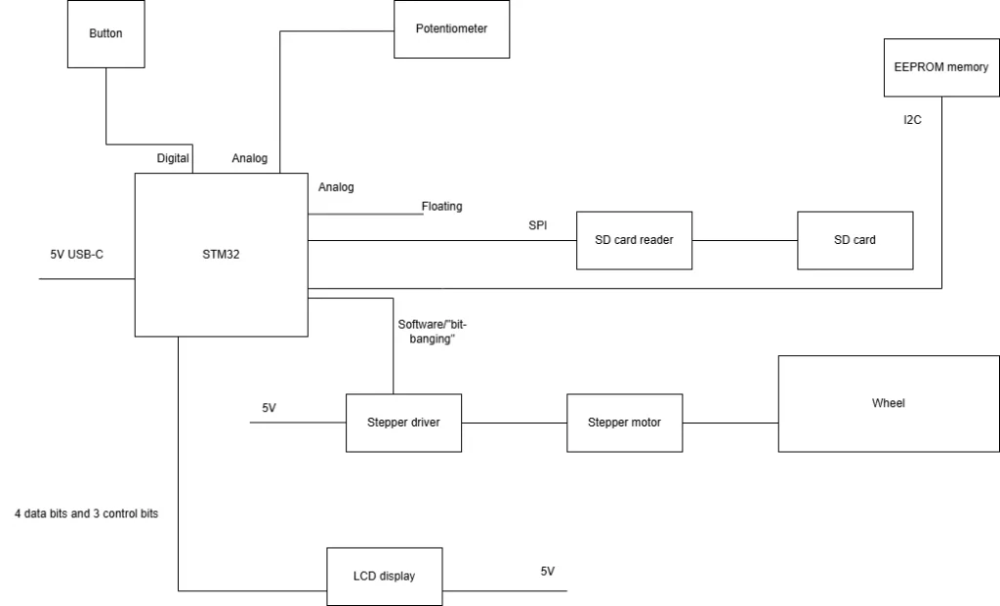
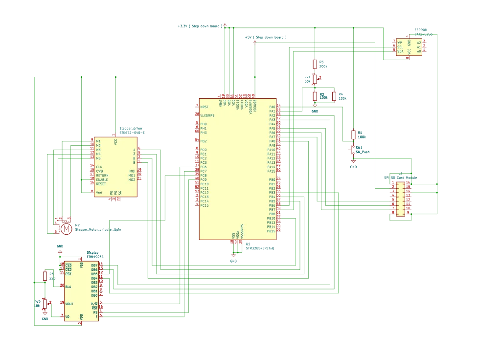

# Randomness-audited Wheel-of-Fortune
A motorized wheel that randomly chooses its output and also proves how fair it is.

:::info

**Author**: Radu-Alexandru Vasilescu \
**GitHub Project Link**: https://github.com/UPB-PMRust-Students/acs-project-2026-vasilescuradu

:::

## Description

The Randomness-audited Wheel-of-Fortune is an arcade-like
product, designed to be fun and interesting. The user chooses the number of full rotations,
presses the “start game” button and the wheel begins to rotate. When it stops, the result is displayed on the LCD screen,
along with fairness statistics. The project uses an entropy source - the jitter from an
unconnected analog pin – to create a carnival experience. At the same time,
fairness is guaranteed by the chi-square test and the distribution of the results is
logged on an SD card for external audit.

## Motivation

I am interested in how mathematics can be
used in practical contexts and the wheel-of-fortune shows exactly that.
Probabilities and statistics have applications in domains such as economics,
physics, gambling, etc. Therefore, they are one of the most straightforward
ways to show that mathematics is not only about theory, but also about
real-life situations.

## Architecture

## Log

### Week 27 April - 3 May

I created the documentation, containing a lot of details about the
project.
### Week 10 - 17 May

I created the motorized wheel and presented a spin demo
for the hardware milestone. Also, I wired the pot and the button.

### Week 18 - 24 May

I wired the SD card reader, the EEPROM and the LEDs.
I implemented most of the required software and presented a demo for the software milestone.

### Week 25 - 31 May

I replaced the DC gear motor and VNH2SP30 driver with a 28BYJ-48 stepper motor and ULN2003 driver, which lets the wheel land exactly on the target slot without speed/brake calibration. I added a 16x2 LCD (4-bit mode) that shows the result and the chi-square fairness verdict after each spin, moved the start button to an analog input, and repurposed the potentiometer to select the number of full rotations.

## Hardware

The hardware architecture revolves around the STM32 microcontroller. The physical rotation of the wheel is powered by a 28BYJ-48 stepper motor controlled via a ULN2003 driver, which gives exact, repeatable positioning on the target slot without any speed or brake calibration. The system is powered via a 5V USB connection. User inputs are handled by a 50k potentiometer to configure the number of full rotations and a physical push button (read as an analog voltage level) to start the game. A 16x2 LCD displays the resulting slot and the fairness verdict after each spin. The AT24C256 I2C EEPROM is used for stats logging. The MicroSDHC 8GB card and the SD card reader nano module are used for external audit. All components are prototyped and connected using a standard 830-point breadboard and a dedicated jumper wire set.

### Schematics

### Bill of Materials

| Device | Usage | Price |
|--------|--------|-------|
| [STM32 Nucleo Board](https://www.st.com/en/evaluation-tools/stm32-nucleo-boards.html) | The main microcontroller running the logic | ~ 100.00 RON |
| [28BYJ-48 5V Stepper Motor and Blue ULN2003 Driver Set](https://www.optimusdigital.ro/ro/motoare-motoare-pas-cu-pas/101-driver-uln2003-motor-pas-cu-pas-de-5-v-.html?srsltid=AfmBOoo7z2oDRYsy1MbzxaFBLjm9ummjQTLPcTV45-iWbfMgyH3tTVms) | Physically rotates the wheel | 16.97 RON | 
| [50k Mono Potentiometer](https://www.optimusdigital.ro/ro/componente-electronice-potentiometre/1885-potentiometru-mono-50k.html?srsltid=AfmBOopsy_OdVFuYxkBoo1D9JZx9zzn1B3piJ1i7kABN3P_O6AsyTs_w) | Analog input to select the number of rotations | 1.49 RON |
| [White Round Cap Push Button](https://www.optimusdigital.ro/ro/butoane-i-comutatoare/1115-buton-cu-capac-rotund-alb.html?srsltid=AfmBOorTSdiSNy5lCZLD_elUSRuKveDm7G4lwfxWsktSIJ8Z76j-wwe5) | Analog input to trigger the spin event | 1.99 RON |
| [830 Tie-Point Breadboard and Jumper Wire Kit](https://sogest.ro/accesorii-multimetre/set-placa-test-breadboard-830-165x55x085cm-set-cabluri-breadboard-si-alimentat) | Prototyping and interconnecting all electronic modules | 39.00 RON |
| [SD card reader nano module](https://sogest.ro/module-diverse/modul-nano-cititor-de-card-sd) | Interfaces with the SD card for data logging | 16.00 RON |
| [AT24C256 I2C EEPROM Module](https://www.optimusdigital.ro/en/memories/632-modul-eeprom-at24c256.html?search_query=EEPROM&results=64) | Persistent storage for statistics across reboots | 9 RON |
| [MicroSDHC 8GB card](https://sogest.ro/carduri-microsd/card-microsdhc-8gb-clasa10-maxell-cu-adaptor-sd-x-series-micro-sdhc-8gb-ad-class10) | Physical storage medium for the external audit logs | 38 RON |
| [Display LCD1602 HD44780](https://www.bitmi.ro/display-lcd1602-hd44780-albastru-iluminat-10486.html?gad_source=1&gad_campaignid=21312430054&gbraid=0AAAAADLag-l9Mrse7Pa8BnYa5ZS0HyDMY&gclid=CjwKCAjwrNrQBhBjEiwAoR4VO28wxRhXikjyxuW3njLUfpud9TIIGEJrlRJMqJKEM_28ANK_kKp9whoCWFsQAvD_BwE) | Used for displaying results and statistics | 14 RON |

## Software

The software architecture is written entirely in **Rust**, utilizing the **Embassy** asynchronous execution framework. This allows the microcontroller to handle multiple concurrent tasks—such as driving the stepper motor, managing user inputs, and logging data to the SD card—without blocking the CPU.

| Library | Description | Usage |
|---------|-------------|-------|
| [embassy-stm32](https://github.com/embassy-rs/embassy) | Async HAL | Hardware abstraction (GPIO, ADC, I2C, SPI). The EEPROM (raw I2C) and the 16x2 LCD (4-bit GPIO bit-banging) are driven directly through this HAL, without a dedicated driver crate. |
| [embassy-executor](https://github.com/embassy-rs/embassy) | Async task executor | Runs the main loop and the SD logger as concurrent async tasks. |
| [embassy-sync](https://github.com/embassy-rs/embassy) | Async synchronization primitives | Signal that passes the latest stats snapshot to the SD logger task. |
| [embassy-time](https://github.com/embassy-rs/embassy) | Timekeeping, delays and timeouts | Stepper step timing, button debounce, LCD timing. |
| [embedded-hal](https://github.com/rust-embedded/embedded-hal) | Standard hardware traits | SPI/GPIO traits for the SD card interface. |
| [embedded-hal-bus](https://github.com/rust-embedded/embedded-hal) | SPI/I2C bus-sharing helpers | ExclusiveDevice wrapper for the SD card on the SPI bus. |
| [embedded-sdmmc](https://github.com/rust-embedded-community/embedded-sdmmc-rs) | FAT filesystem & SD card driver | Writing CSV audit logs to the SD card. |
| [defmt](https://github.com/knurling-rs/defmt) | Efficient logging framework | Debug/info logging over RTT during development. |
| [cortex-m](https://github.com/rust-embedded/cortex-m) | Cortex-M core access | Cycle-accurate short delays (asm::delay) for the LCD enable pulse. |

## Links

1. [Embassy Book](https://embassy.dev/book/) - Official documentation for the Embassy async Rust framework.
2. [STM32 Rust Ecosystem](https://github.com/stm32-rs) - Repositories and Hardware Abstraction Layers for STM32 microcontrollers.