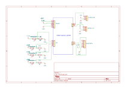
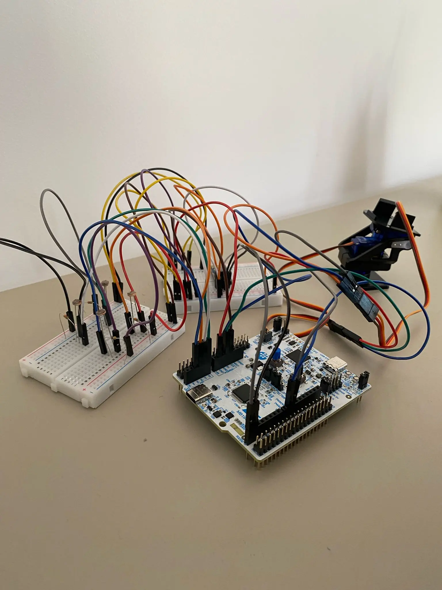

# Dual-Axis Solar Tracker
Active dual-axis light tracking system using STM32 and embedded Rust.

:::info 

**Author**: Marcea Radu Andrei \
**GitHub Project Link**: [Github](https://github.com/UPB-PMRust-students/acs-project-2026-MarceaRadu)

:::

<!-- do not delete the \ after your name -->

## Description

The Dual-Axis Solar Tracker is a hardware and software system that automatically orients a central platform towards the strongest light source in a given environment. It uses four light-dependent resistors (LDRs) to measure ambient light intensity across four quadrants. A microcontroller processes these inputs to calculate light differentials and drives two servo motors to adjust the platform's horizontal (pan) and vertical (tilt) alignment, ensuring it remains perpendicular to the light source. Telemetry data is transmitted via Bluetooth to a mobile application for real-time monitoring.

## Motivation

My main motivation was to build an autonomous system, and a dual-axis solar tracker felt like the perfect challenge. Since I've never built a hardware project from the ground up, I saw this as a great way to get hands-on experience with servo motors, LDRs, and microcontrollers. Blending physical hardware with asynchronous Rust code brings the project to life, creating something real that actively reacts to its surroundings.

## Architecture 

The project is divided into 4 main components: Input, Processing, Output, and Telemetry.

**Main Components:**

* **Input:** The four Light Dependent Resistors (LDRs) send analog voltage signals to the processing unit via the ADC (Analog-to-Digital Converter).
* **Processing:** The STM32 Nucleo board reads these signals asynchronously, calculates the horizontal and vertical light differentials, and determines the necessary angle adjustments. It then translates these actions into control signals (PWM) and sends them directly to the servo motors.
* **Output:** The Pan and Tilt servo motors receive the PWM commands and execute the mechanical motion to physically align the solar tracker. 
* **Telemetry & UI:** The microcontroller packages the calculated solar data and motor angles, transmitting them via a UART interface to a Bluetooth module. A paired mobile application receives this data stream, allowing the user to monitor the tracker's status wirelessly.

## Log

<!-- write your progress here every week -->

### Week 27 April - 4 May
I researched the hardware requirements and ordered the necessary electronic components for the project.

### Week 5 - 11 May
I started writing the initial draft of the documentation and structured the main sections. \
Afterwards, I created the system architecture diagram and updated the final bill of materials.

### Week 12 - 18 May
I assembled the mechanical pan-tilt bracket and wired the voltage dividers on the breadboard. \
I also connected the servo motors and the Bluetooth module to the STM32 board.

### Week 19 - 25 May
I configured the ADC and PWM pins using the embedded Rust framework for control. \
Finally, I implemented the UART data transmission.

## Hardware

The project relies on the STM32 Nucleo-U545RE-Q as the core controller. The mechanical movement is achieved using a prefabricated Pan-Tilt plastic bracket housing two SG90 micro servos. The sensing array consists of four standard photoresistors (LDRs) paired with 10kΩ resistors acting as pull-downs in a voltage divider setup, assembled on a mini breadboard.

### Schematics

### Photo

### Bill of Materials

| Device | Usage | Price |
|--------|--------|-------|
| [STM32 Nucleo-U545RE-Q](https://www.st.com/en/evaluation-tools/nucleo-u545re-q.html) | The main microcontroller unit | Provided by faculty |
| [Pan-Tilt Bracket with 2x SG90 Servos](https://sigmanortec.ro/montura-servomotor-suport-camera-2-axe-pt-antivibratii-ptz-pentru-sg90-mg90s) | Mechanical 2-axis movement | 8.46 RON |
| [4x Photoresistor (5537) 5mm](https://sigmanortec.ro/Fotorezistor-5537-5mm-p160378607) | Light intensity detection (LDRs) | 6.76 RON |
| [Resistor kit](https://sigmanortec.ro/kit-rezistori-30-valori-20-bucati) | Contains the 4x 10kΩ resistors needed for the voltage dividers | 15.16 RON |
| [Breadboard 400 points](https://sigmanortec.ro/Breadboard-400-puncte-p129872825#) | Prototyping electronic circuits | 6.62 RON |
| [Set of Jumper Wires](https://sigmanortec.ro/Set-Jumper-breadboard-140-p136286416) | Connecting components | 11.72 RON |

## Software

| Library | Description | Usage |
|---------|-------------|-------|
| [embassy-stm32](https://github.com/embassy-rs/embassy) | Basic hardware library | Used to set up the ADC input pins for the LDR sensors, the PWM output pins for the servo motors, and the UART serial port for the Bluetooth module. |
| [embassy-executor](https://github.com/embassy-rs/embassy) | Code runner | Used to run the main asynchronous loop of the program without freezing the board. |
| [defmt](https://github.com/knurling-rs/defmt) | Console printing tool | Used to print the motor angles and raw sensor light values to the laptop screen for debugging and calibration. |
| [cortex-m](https://github.com/rust-embedded/cortex-m) | CPU utilities and delays | Used to add hardware-level pauses in the code to give the physical servo motors enough time to reach their target angles. |
| [heapless](https://github.com/rust-embedded/heapless) | Data structures | Used to create fixed-capacity strings for packaging the angle and sensor telemetry data before transmitting it over Bluetooth. |

## Links

<!-- Add a few links that inspired you and that you think you will use for your project -->

1. [Lab](https://embedded-rust-101.wyliodrin.com/docs/fils_en/category/lab)
