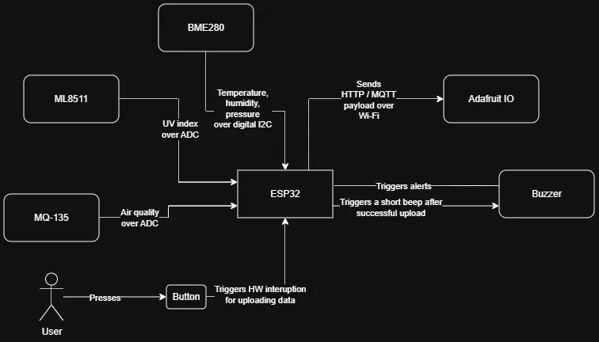

# IoT Weather-Station: Meteo and Air Quality Monitor
A smart IoT station for monitoring weather and air quality, featuring acoustic alerts and a live cloud dashboard.

**Author**: Mitran Ramona Luminița \
**GitHub Project Link**: [UPB-PMRust-Students/acs-project-2026-mnoramona](https://github.com/UPB-PMRust-Students/acs-project-2026-mnoramona)

## Description

This project consists of an IoT station capable of measuring environmental parameters and displaying them in real-time on an online dashboard (Adafruit IO). The system reads temperature and atmospheric pressure (via I2C), measures UV ray intensity (via ADC), and monitors air quality by detecting CO2, ammonia, benzene, and smoke using an MQ-135 sensor. When safety thresholds are exceeded, a buzzer triggers distinct acoustic alarms depending on the specific hazard. Additionally, a physical push-button is wired to a hardware interrupt, allowing the user to wake the system or force an immediate data upload to the cloud.

## Motivation

I chose this project because it offers a highly practical and relevant application (environmental health monitoring) while elegantly integrating multiple fundamental concepts of electronics and embedded programming. The project natively covers a wide range of hardware communication protocols - I2C for digital sensors, ADC for analog signals, and Hardware Interrupts for asynchronous events - and bridges the gap to the Internet of Things (IoT) by transmitting data over Wi-Fi via the MQTT protocol.

## Architecture 

The system is built around a central microcontroller that interfaces with various input and output modules:
* **Processing Unit (ESP32):** Reads sensor data, applies digital filters and business logic (mapping ADC voltages for the UV and MQ-135 sensors), and manages the Wi-Fi connection.
* **Digital Input Module (I2C):** The BME280 sensor communicates bidirectionally over the I2C bus (SDA/SCL) to provide precise temperature, humidity, and pressure data.
* **Analog Input Module (ADC):** The ML8511 (UV) and MQ-135 (Air Quality) sensors output a variable voltage that is read by the ESP32's ADC pins.
* **Hardware Interrupt Module:** A push-button is connected to a digital pin with an internal pull-up resistor. Pressing it triggers an interrupt Service Routine (ISR) that halts the normal code flow to force a "Data Upload" event.
* **Local Output Module:** A buzzer is used to provide immediate acoustic feedback, generating specific alarms via PWM:
    * *Fast Alarm:* Dangerous gas detected (MQ-135 > critical threshold).
    * *Slow Alarm:* UV Index is dangerously high for sun exposure.
    * *Short Confirmation Beep:* Triggered when data is successfully uploaded to the cloud via the push-button.
* **Cloud Module:** Adafruit IO receives JSON/MQTT payloads and visualizes the data on live charts and gauges.

## Log

### Week 27 April - 3 May 

Created documentation and bill of materials

### Week 4 - 10 May

### Week 11 - 17 May

### Week 18 - 24 May

## Hardware
The project utilizes an ESP32 microcontroller due to its native Wi-Fi capabilities and generous pinout. The selected sensors cover both digital communication (BME280) and analog voltage reading (ML8511 and MQ-135). A simple push-button serves as an asynchronous trigger, and a buzzer adds a layer of local user interaction.

### Schematics

### Bill of Materials

| Device | Usage | Price |
|--------|--------|-------|
| ESP32 DevKit V1 | Main microcontroller for processing and Wi-Fi connectivity. | [30 RON](https://www.optimusdigital.ro/ro/placi-cu-esp32/12933-placa-de-dezvoltare-plusivo-wireless-compatibila-cu-esp32-si-ble.html?search_query=esp32+si+ble&results=11) |
| BME280 Sensor Module | Measures temperature, humidity, and atmospheric pressure (I2C). | [34 RON](https://www.emag.ro/modul-senzor-temperatura-umiditate-presiune-bme280-ai0002-s34/pd/DR7HCZBBM/?cmpid=148774&utm_source=google&utm_medium=cpc&utm_campaign=(RO:eMAG!)_3P_NO_SALES_>_Jucarii_hobby&utm_content=111476631565&gad_source=1&gad_campaignid=11606684347&gclid=Cj0KCQjw2MbPBhCSARIsAP3jP9yjHltoyqtVCIfcGIuRuK0H9Ia6tYC9mUdQIgVO9Fbke33v-HH3gbEaAkwjEALw_wcB) |
| ML8511 UV Sensor | Detects ultraviolet light intensity (ADC). | [33 RON](https://www.optimusdigital.ro/ro/senzori-senzori-optici/2944-senzor-de-lumina-uv-ml8511.html?search_query=ML8511&results=1) |
| MQ-135 Air Quality Sensor | Detects gas levels (CO2, ammonia, benzene, smoke) (ADC/Digital). | [22 RON](https://www.emag.ro/mq-135-modul-senzor-calitate-aer-haxmya-mq-135/pd/D7HMPD2BM/)
| 5V Passive/Active Buzzer | Acoustic warning module for exceeded safety thresholds. | [2 RON](https://www.optimusdigital.ro/ro/audio-buzzere/634-buzzer-pasiv-de-5-v.html?search_query=buzzer&results=44) |
| Button | Trigger for the hardware interrupt (Force Data Upload). | 2 RON |
| Breadboard & Jumper Wires | For rapid prototyping and circuit connections. | 20 RON |

## Software

| Library | Description | Usage |
|---------|-------------|-------|
| [WiFi.h]| Standard ESP32 library for wireless networking. | Used to connect the microcontroller to the local internet router. |
| [Adafruit MQTT Library] | Robust MQTT client for Arduino/ESP. | Used to package and transmit data to the Adafruit IO dashboard. |
| [Wire.h] | I2C communication library. | Used to initiate and read data from the I2C bus (SDA/SCL pins). |
| [Adafruit_BME280]| Software driver for the BME280 sensor. | Used to extract temperature, humidity, and pressure data. |

## Links

1. [ESP32 Pinout Reference](https://randomnerdtutorials.com/esp32-pinout-reference-gpios/)
2. [Adafruit IO Example](https://learn.adafruit.com/esp8266-temperature-slash-humidity-webserver)
3. [MQ-135 Gas Sensor Calibration with Arduino](https://components101.com/sensors/mq135-gas-sensor-for-air-quality)
4. [Using Hardware Interrupts on ESP32](https://lastminuteengineers.com/handling-esp32-gpio-interrupts-tutorial/)
