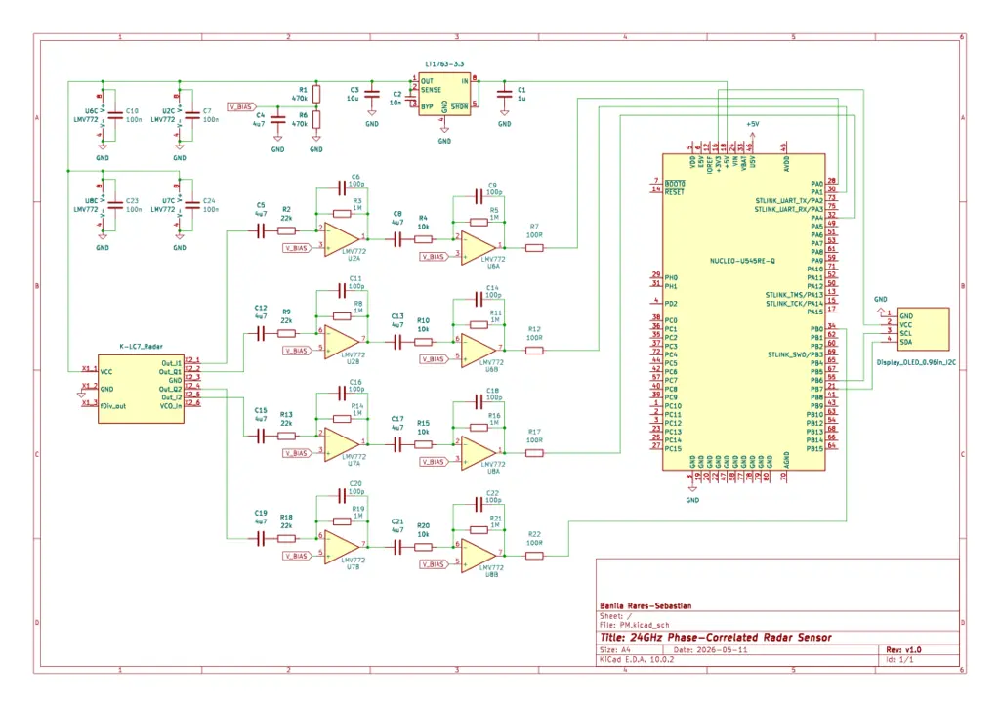

# Phase-Correlated Doppler Velocity Sensor
A custom 24GHz continuous-wave radar system for velocity tracking (speed and orientation) using STM32, Embassy Rust, and Digital Signal Processing.

:::info 

**Author**: Banila Rares-Sebastian \
**GitHub Project Link**: https://github.com/UPB-PMRust-Students/acs-project-2026-rares567

:::

<!-- do not delete the \ after your name -->

## Description

The system detects and tracks the movement of walking targets (humans) in its field of view, determining both their speed and their spatial orientation (Angle of Arrival). It achieves this by emitting a 24GHz microwave signal and capturing the reflections using a dual-antenna receiver. The microvolt-level phase-shifted signals are filtered and amplified by a custom 4-channel analog front-end (~1000x gain) built to strict low-noise tolerances. An STM32 microcontroller samples these 4 channels simultaneously via a hardware-triggered ADC and DMA to preserve phase correlation. Finally, the MCU runs a Fast Fourier Transform (FFT) algorithm to calculate the velocity vectors and displays the target's speed and angle on a digital screen.

## Motivation

I chose this project as it provides a challenging combination of analog electronics (through working on a protoboard and soldering components manually) and embedded programming (through working on a STM32 MCU for digital signal processing). This makes it a great learning experience and a wonderful and precise sensor with utility in any human-related tracking or statistics.

## Architecture 


## Log

<!-- write your progress here every week -->

### Week 7 - 13 April

Ordered components for the hardware from Sigmanortec and DigiKey.

### Week 14 - 20 April

Started work on soldering components on the protoboard (op-amps, voltage regulator and adjacent passive components).

### Week 21 - 27 April

Completed work on the first stage signal amplifier and successfully tested one channel.

### Week 5 - 11 May

Successfully completed and tested the entire front-end circuit and finished building the hardware. Designed the schematic of the entire circuit.

### Week 12 - 18 May

Created the software for reading the amplified signals using the ADC, processing the signal and displaying the relevant values on the I2C display.

### Week 19 - 25 May

## Hardware

The hardware features a custom Analog Front-End (AFE) bridging the 24GHz K-LC7 sensor and the STM32. Because the raw radar signals are in the microvolt range, the AFE utilizes LMV772 low-noise op-amps in a two-stage active amplifier configuration.
By placing precision passives (1% resistors and C0G capacitors) in the negative feedback loops, the circuit forms an active low-pass filter. This actively suppresses high-frequency environmental noise while applying a massive 73 dB (~4,467x) voltage gain, boosting microscopic reflections to a readable 0–3.3V range. To guarantee signal integrity, an LT1763 ultra-low-noise LDO provides clean 3.3V power, driving a voltage divider that establishes a 1.65V virtual ground. This biases the op-amps so the AC radar waves can swing symmetrically without clipping above 3.3V and below GND.

### Schematics



### Bill of Materials

<!-- Fill out this table with all the hardware components that you might need.

The format is 
```
| [Device](link://to/device) | This is used ... | [price](link://to/store) |

```

-->

| Device | Usage | Price |
|--------|--------|-------|
| [Nucleo-U545-RE-Q](https://www.st.com/en/evaluation-tools/nucleo-u545re-q.html) | Microcontroller | Lab provided|
| [RFbeam-K-LC7](https://rfbeam.ch/product/k-lc7-radar-transceiver/) | 24GHz dual-receiver radar sensor | [233.6 RON](https://www.digikey.ro/en/products/detail/rfbeam-microwave-gmbh/K-LC7-RFB-00H/10638901)|
| [4x LMV772MA/NOPB](https://www.ti.com/product/LMV772/part-details/LMV772MA/NOPB) | Low-noise operational amplifiers | [40.76 RON](https://www.digikey.ro/en/products/detail/texas-instruments/LMV772MA-NOPB/665715)|
| [LT1763CS8-3.3](https://www.analog.com/media/en/technical-documentation/data-sheets/1763fh.pdf) | Low-noise LDO linear voltage regulator | [33.08 RON](https://www.digikey.ro/en/products/detail/analog-devices-inc/LT1763CS8-3-3-TRPBF/958589)
| [Display OLED 0.96" I2C](https://sigmanortec.ro/Display-OLED-0-96-I2C-IIC-Albastru-p135055705) | I2C OLED screen for displaying output | 16.96 RON|
| [Protoboard 7x9cm FR4](https://sigmanortec.ro/Placa-PCB-prototipare-fata-dubla-7x9cm-p125747328) | Protoboard for creating the custom amplifier | 5.76 RON|
| [5x SOIC-8 to DIP-8 adapter](https://sigmanortec.ro/adaptor-smd-la-dip-8-pini-sop8) | Adapter for converting SOIC-8 to protoboard-compatible DIP-8 | 4.95 RON|
| [8x MFR-25FTE52-1M](https://www.digikey.ro/en/products/detail/yageo/MFR-25FTE52-1M/9139874) | 1M OHM 1% resistors | 1.32 RON|
| [4x MFR-25FTF52-100R](https://www.digikey.ro/en/products/detail/yageo/MFR-25FTF52-100R/9140477) | 100 OHM 1% resistors | 0.66 RON|
| [4x MFR-25FRF52-10K](https://www.digikey.ro/en/products/detail/yageo/MFR-25FRF52-10K/14626) | 10K OHM 1% resistors | 0.69 RON|
| [2x MFR-25FTE52-470K](https://www.digikey.ro/en/products/detail/yageo/MFR-25FTE52-470K/9140222) | 470K OHM 1% resistors | 0.33 RON|
| [5x C320C104J5R5TA7301](https://www.digikey.ro/en/products/detail/kemet/C320C104J5R5TA7301/3726081) | 100nF X7R capacitors | 6.04 RON|
| [9x ECE-A1EN4R7U](https://www.digikey.ro/en/products/detail/panasonic-industry/ECE-A1EN4R7U/227616) | 4.7uF 20% capacitors | 10.18 RON|
| [8x C317C101J1G5TA7301](https://www.digikey.ro/en/products/detail/kemet/C317C101J1G5TA7301/6562461) | 100pF C0G capacitors | 8.84 RON|
| [4x MFR-25FRF52-22K](https://www.digikey.ro/en/products/detail/yageo/MFR-25FRF52-22K/9138943) | 22K OHM 1% resistors | 0.69 RON|
| [105BPS100M](https://www.digikey.ro/en/products/detail/cornell-dubilier-knowles/105BPS100M/5410521) | 1uF 20% capacitor | 0.99 RON|
| [C322C103J1R5TA7301](https://www.digikey.ro/en/products/detail/kemet/C322C103J1R5TA7301/12700464) | 10nF X7R capacitor | 1.86 RON|
| [ECE-A1VN100UB](https://www.digikey.ro/en/products/detail/panasonic-industry/ECE-A1VN100UB/2689190) | 10uF 20% capacitor | 1.86 RON|


## Software

The software is written in Rust using the embassy bare-metal asynchronous framework. It handles strict real-time data acquisition from the ADC, heavy Digital Signal Processing (DSP) for radar signals, and driving the graphical UI.

| Library | Description | Usage |
|---------|-------------|-------|
| [embassy-stm32](https://github.com/embassy-rs/embassy) | Hardware Abstraction Layer (HAL) | Used to initialize and control the STM32 MCU peripherals, specifically the hardware ADC for reading radar pins and the I2C bus. |
| [embassy-executor](https://github.com/embassy-rs/embassy) | Async RTOS Executor | Used to run the main execution loop for the embedded application. |
| [embassy-time](https://github.com/embassy-rs/embassy) | Timekeeping library | Used to create the 300µs Ticker for timing gaps between ADC radar samples. |
| [microfft](https://crates.io/crates/microfft) | Fast Fourier Transform library | Executes the complex 256-bin FFT to transform the time signal into discrete Doppler speed bins. |
| [micromath](https://crates.io/crates/micromath) | Fast embedded math library | Provides fast f32 approximations for trigonometry (cos, atan2, asin, sqrt) required for the cross-spectrum phase analysis and diagonal speed compensation. |
| [num-complex](https://crates.io/crates/num-complex) | Complex number data structures | Required to store the real and imaginary voltage components used during the FFT and Blackman windowing prep. |
| [ssd1306](https://crates.io/crates/ssd1306) | OLED display driver | Used to interface with and flush pixel data to the 0.96" OLED screen over I2C. |
| [embedded-graphics](https://github.com/embedded-graphics/embedded-graphics) | 2D graphics library | Used for drawing the geometric lines for the UI trajectory arrow and rendering the text fonts. |
| [heapless](https://crates.io/crates/heapless) | Memory-safe data structures | Used for fixed-capacity, stack-allocated String buffers to format the speed and angle text without requiring a dynamic memory allocator. |
| [defmt](https://github.com/knurling-rs/defmt) & [panic-probe](https://crates.io/crates/panic-probe) | Debugging and logging | Standard tooling used to handle panics and print highly efficient debug logs directly to the probe over RTT. |

## Links

<!-- Add a few links that inspired you and that you think you will use for your project -->

1. [RFbeam K-LC7 datasheet](https://rfbeam.ch/wp-content/uploads/dlm_uploads/2022/11/K-LC7_Datasheet.pdf)
2. [RFbeam K-LC7 typical signal amplifier](https://rfbeam.ch/wp-content/uploads/dlm_uploads/2022/10/AN-04-TypicalSignalAmp.pdf)
3. [RFbeam K-LC7 radome design](https://rfbeam.ch/wp-content/uploads/dlm_uploads/2023/05/AN-03-Radome.pdf)
4. [Embassy Framework Documentation](https://embassy.dev/)
