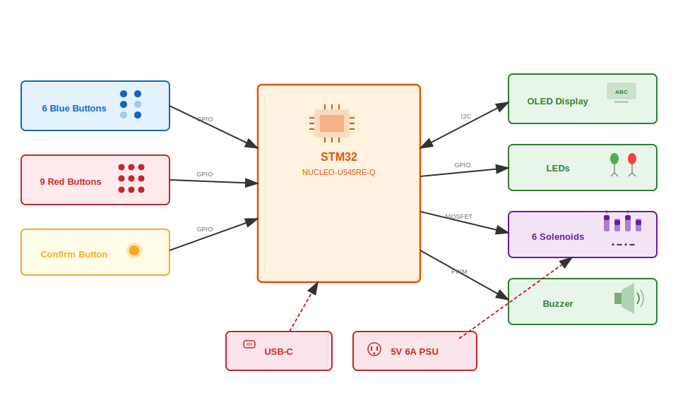

# Braille Bidirectional Trainer
An interactive system for learning Braille through visual, tactile and auditory feedback.

:::info 

**Author**: Ciuperca Robert-Mihai \
**GitHub Project Link**: https://github.com/robert1724/website

:::

<!-- do not delete the \ after your name -->

## Description

The Braille Bidirectional Trainer is a dual-mode educational device. Mode 1 teaches sighted users to write Braille using a 3x2 button matrix based on screen prompts. Mode 2 helps visually impaired users practice reading via a 6-solenoid tactile display, with answers entered through a T9-style keypad and validated by audio feedback.

## Motivation

I chose this project after meeting a visually impaired person and realizing how much a basic knowledge of Braille would have helped our communication. This experience inspired me to create a tool that assists parents and teachers in supporting blind children, while providing young learners with an interactive, fun way to practice their tactile skills.

## Architecture 



The system operates in two modes, selected at startup by pressing a blue (Mode 1) or red button (Mode 2). Each mode has 3 levels of increasing difficulty, and the user must achieve at least 80% accuracy to advance.
### Mode 1 — Learn to Write Braille (Sighted Users)
The OLED display shows a random letter or word. The user encodes it in Braille using 6 blue buttons arranged in a 3×2 cell, then presses the yellow button to confirm. A green LED lights up for correct answers, red for incorrect ones.
### Mode 2 — Learn to Read Braille (Blind Users)
The STM32 activates solenoids through MOSFETs to physically raise Braille dots on a tactile plate. The user feels the pattern and types the corresponding letter on 9 red buttons arranged as a phone keypad (multi-press input, like old Nokia phones). Feedback is given via buzzer: one beep for correct, two beeps for incorrect.
The STM32 NUCLEO-U545RE-Q acts as the central controller, managing all input/output:
- **Input**: 6 blue buttons + 9 red buttons (GPIO) + 1 yellow confirm button
- **Display**: 0.91" OLED 128×32 via I2C — shows letters, words and game status
- **Tactile output**: 6 push-pull solenoids (5V 0.7A) driven by IRLZ44N MOSFETs with flyback diodes
- **Feedback**: Green/red LEDs (Mode 1) and passive buzzer via PWM (Mode 2)
- **Power**: USB-C for STM32, separate 5V 6A PSU for solenoids, with bulk and decoupling capacitors

## Log

<!-- write your progress here every week -->

### Week 5 - 11 May

### Week 12 - 18 May

### Week 19 - 25 May

## Hardware

Detail in a few words the hardware used.

### Schematics

Place your KiCAD or similar schematics here in SVG format.

### Bill of Materials

<!-- Fill out this table with all the hardware components that you might need.

The format is 
```
| [Device](link://to/device) | This is used ... | [price](link://to/store) |

```

-->

| Device | Usage | Price |
|--------|--------|-------|
| [Raspberry Pi Pico W](https://www.raspberrypi.com/documentation/microcontrollers/raspberry-pi-pico.html) | The microcontroller | [35 RON](https://www.optimusdigital.ro/en/raspberry-pi-boards/12394-raspberry-pi-pico-w.html) |


## Software

| Library | Description | Usage |
|---------|-------------|-------|
| [st7789](https://github.com/almindor/st7789) | Display driver for ST7789 | Used for the display for the Pico Explorer Base |
| [embedded-graphics](https://github.com/embedded-graphics/embedded-graphics) | 2D graphics library | Used for drawing to the display |

## Links

<!-- Add a few links that inspired you and that you think you will use for your project -->

1. [link](https://example.com)
2. [link](https://example3.com)
...
