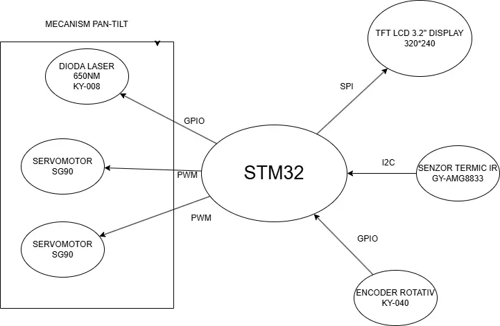
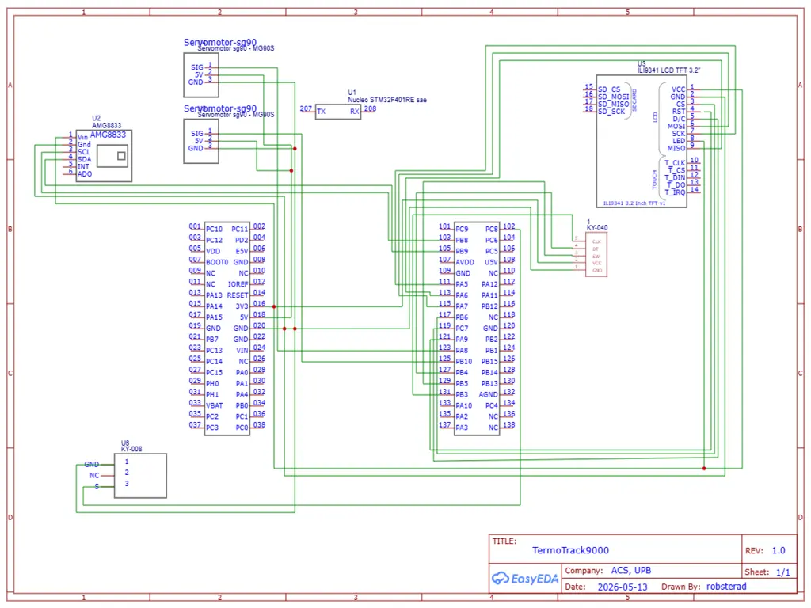

# TermoTrack 9000
Sistem de monitorizare termica cu interpolare si urmarire automata prin laser

**Author**: Radulescu Robert-Stefan 331CC \
**GitHub Project Link**: [UPB-PMRust-Students/acs-project-2026-robsterad](https://github.com/UPB-PMRust-Students/acs-project-2026-robsterad)

## Description

TermoTrack 9000 este un sistem avansat de imagistica termica bazat pe microcontrolerul STM32. Dispozitivul captureaza date de temperatura in infrarosu folosind un senzor matriceal AMG8833 (8*8 pixeli) si le proceseaza in timp real pentru a genera o imagine fluida pe un ecran TFT color.

Sistemul implementeaza un algoritm de **interpolare biliniara** pentru a transforma matricea bruta de 64 de puncte intr-o harta termica de inalta rezolutie (320x240). Utilizatorul poate interactiona cu sistemul prin intermediul unui **encoder rotativ** pentru a ajusta dinamic plaja de temperaturi monitorizata (scaling), permitand optimizarea imaginii atat pentru circuite electronice (diferente mici de temperatura), cat si pentru detectia prezentei umane.

O caracteristica distinctiva a proiectului este **subsistemul de urmarire automata (tracking)**. Microcontrolerul identifica in timp real punctul cu temperatura maxima si actioneaza un mecanism pan-tilt cu **doua servomotoare** pentru a indrepta un **indicator laser** exact catre sursa de caldura detectata. Suplimentar, un buton dedicat permite realizarea unui "screenshot" prin trimiterea matricei de date catre un PC via **UART**.

## Motivation

Am ales acest proiect deoarece combina procesarea complexa de semnal (DSP) cu controlul actuatorilor mecanici. Termoviziunea are aplicatii practice vaste, de la diagnoza circuitelor electronice pana la sisteme de securitate, iar implementarea pe o arhitectura ARM Cortex-M ofera oportunitatea de a utiliza periferice avansate precum DMA, Timere hardware si FPU.

## Architecture

Sistemul este organizat in jurul unitatii centrale de procesare (STM32) care coordoneaza urmatoarele blocuri:
- **Unitatea de achizitie**: Senzorul AMG8833 conectat prin I2C Fast Mode.
- **Unitatea de procesare**: Algoritmi de interpolare si cautare a extremelor locale (Max Tracking).
- **Unitatea de afisare**: Display TFT ILI9341 controlat prin SPI cu suport DMA.
- **Unitatea de actionare**: Doua servomotoare controlate prin PWM pentru orientarea laserului.
- **Interfata utilizator**: Encoder rotativ (Timer Hardware) si buton de captura (EXTI).

## Log

### Week 20 - 26 April

Am redactat documentatia initiala a proiectului si am definit structura arhitecturala.

## Hardware

Sistemul utilizeaza microcontrolerul **STM32** pentru a gestiona protocoalele de comunicatie si calculul matematic. Senzorul termic comunica prin **I2C**, in timp ce ecranul utilizeaza **SPI** de mare viteza. Servomotoarele sunt controlate prin semnale **PWM**, iar laserul este actionat digital prin **GPIO**.

### Bill of Materials

| Device | Usage | Price (Est. RON) |
|--------|-------|------------------|
| Placa de dezvoltare STM32 Nucleo-64 | Microcontrolerul principal, procesare date si rulare task-uri asincrone. | FREE |
| Modul AMG8833 (8x8 pixeli) | Senzor termic IR (matrice 64 puncte). Comunica prin I2C. Baza pentru interpolarea la 320x240. | 205 RON |
| Display TFT LCD 3.2" ILI9341 | Afisarea interfetei grafice si a hartii termice. Controlat rapid prin magistrala SPI. | 88 RON |
| Modul Encoder Rotativ KY-040 | Interactiunea utilizatorului pentru ajustarea pragurilor de temperatura (zoom/scaling termic). | 5 RON |
| 2x Micro Servomotoare SG90 | Actionarea mecanismului Pan-Tilt (axa X si axa Y) pentru urmarirea fizica a sursei de caldura. | 30 RON |
| Modul Dioda Laser 650nm KY-008 | Indicator vizual montat pe mecanismul Pan-Tilt; indica cel mai cald punct detectat. | 3 RON |
| Breadboard 830 puncte MB-102 | Platforma principala pentru realizarea conexiunilor electrice rapide (fara lipire). | 14 RON |
| Set Fire DuPont (Tata-Tata, Tata-Mama) | Realizarea legaturilor electrice intre pinii STM32 si periferice. | 15 RON |

## Software

Sistemul este dezvoltat in ecosistemul **Rust Embedded (`no_std`)**. Proiectul se bazeaza puternic pe framework-ul `embassy` pentru multitasking cooperativ bazat pe `async/await`, permitand senzorului, ecranului si encoderului sa ruleze simultan fara sa se blocheze reciproc.

| Library (Crate) | Description | Usage in Project |
|---------|-------------|-------|
| `embassy-rs` | Framework asincron pentru microcontrolere | Baza de executie (Runtime). Gestioneaza task-urile concurente (citire I2C, afisare ecran, monitorizare EXTI encoder). |
| `embassy-stm32` | Hardware Abstraction Layer (HAL) | Configurarea la nivel de registri a pinilor GPIO, SPI, I2C, PWM si a intreruperilor externe (EXTI) pentru STM32. |
| `embassy-time` | Gestionarea timpului hardware | Functii non-blocante de `Delay` si `Timer` necesare pentru debounce-ul encoderului si initializarea ecranului. |
| `mipidsi` | Driver modern pentru ecrane TFT | Comunicarea cu controller-ul ILI9341 al display-ului, configurarea orientarii (Landscape) si trimiterea pixelilor. |
| `embedded-graphics` | Biblioteca grafica 2D `no_std` | Randarea formelor, a textului si afisarea dreptunghiurilor/gradientilor ce formeaza imaginea termica pe ecran. |
| `amg88xx` | Driver pentru senzorul termic | Preluarea matricelor de temperatura (8x8) via I2C direct de la senzorul termic AMG8833. |
| `defmt` / `probe-rs` | Sistem de logging si debugging | Flash-uirea rapida a codului pe placa si transmiterea log-urilor structurate via RTT (fara a folosi un port serial clasic). |

### Schematics

## Links

1. [Embassy-rs Documentation](https://embassy.dev/)
2. [MLX90640 Datasheet](https://www.melexis.com/-/media/files/documents/datasheets/mlx90640-datasheet-melexis.pdf)
3. [Embedded Graphics Documentation](https://docs.rs/embedded-graphics/latest/embedded_graphics/)
4. [Rust Embedded Book](https://docs.rust-embedded.org/book/)