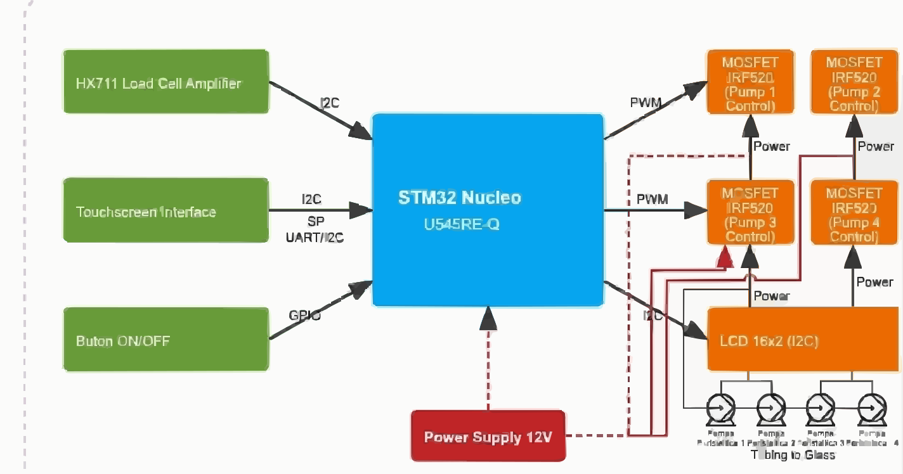

# Shot Maker
A smart system that automatically prepares drink shots based on user selection.

:::info

**Author**: Lotan Roberto-Gabriel  \

**GitHub Project Link**: https://github.com/UPB-PMRust-Students/acs-project-2026-Adamura1

:::

## Description

Shot Maker is an automated system that prepares drink shots based on user input. The user selects a drink type from a display interface. Based on this selection, the system calculates the required quantity for each ingredient.

Liquids are dispensed into a glass using pumps or valves. A weight sensor continuously measures the amount poured, and the system stops dispensing when the target weight is reached. For multi-ingredient drinks, each component is added proportionally.

## Motivation

The project aims to automate drink preparation while ensuring precision and repeatability. It explores embedded control systems applied to real-world tasks.

## Architecture

- **Input Layer**: touchscreen interface for selecting drink type  
- **Processing Layer**: computes target weight and ingredient ratios  
- **Actuation Layer**: controls pumps or valves  
- **Measurement Layer**: load cell monitors real-time weight  
- **Output Layer**: final drink in the glass  

### Flow Summary:
- User selects drink  
- System computes ingredient weights  
- Pumps dispense liquids  
- Load cell measures continuously  
- System stops at target weight  

## Log

### Week 20-26 Apr
- Defined functionality  
- Identified main components  

### Week 27-3 Apr
- Wired the STM32 Nucleo board
- Flashed the first Rust firmware via probe-rs
  
### Week 4-10 Apr
- Implemented HX711 driver and pump PWM
- Calibrated tare and pouring tolerance
  
## Hardware

- STM32 Nucleo-U545RE-Q microcontroller
- SSD1306 OLED 128x64 (I2C)
- Load cell 1 kg + HX711 amplifier
- 3x 12V peristaltic pumps
- 3x N-channel logic-level MOSFETs + 1N4007 flyback diodes
- 2x momentary push buttons
- 12V / 5A power supply for the pumps
- 5V step-down regulator for logic

### Schematics

### Photos

### Bill of Materials

| Device | Usage | Price |
|--------|-------|-------|
| STM32 NUCLEO-U545RE-Q | Microcontroller (main control unit) | ~120 RON |
| HX711 Load Cell Amplifier | Converts load cell signal to digital | ~10 RON |
| Load Cell 1kg | Measures weight of the liquid | ~35 RON |
| Peristaltic Pump 12V x3 | Dispenses liquids | ~50 RON x 3 |
| MOSFET IRLZ44N x3 | Controls pumps from microcontroller | ~5 RON x 3 |
| SSD1306 OLED 128x64 (I2C) | User interface display | ~25 RON |
| Power Supply 12V 5A | Powers pumps | ~50 RON |
| Breadboard | Prototyping | ~15 RON |
| Jumper Wires | Connections | ~10 RON |
| Silicone Tubing | Liquid transport | ~15 RON |

TOTAL: ~450 RON

## Links

* [About Rust](https://docs.rust-embedded.org/book/)
* [Youtube](https://youtu.be/Z7GkGeZrb2Y)
* [Youtube2](https://youtu.be/2DopvpNF7J4)
