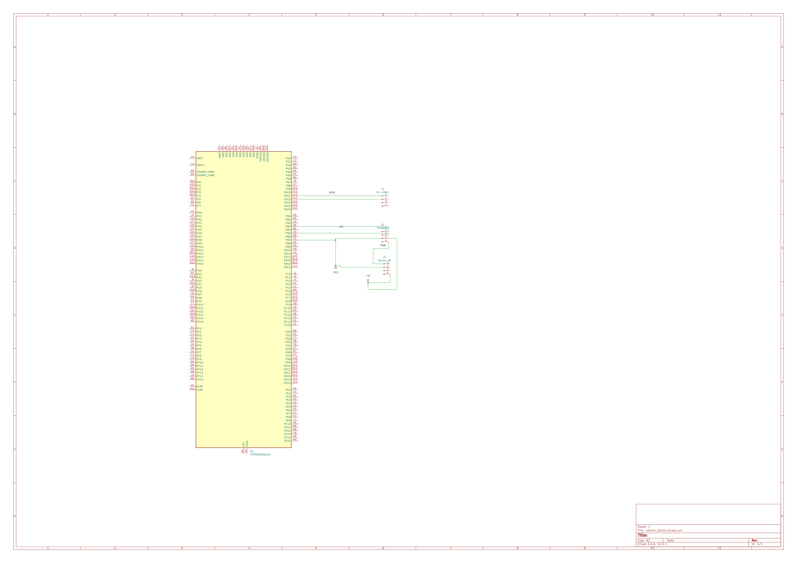

# Robotic Bloom – Interactive Flower

An artificial flower that opens when a person approaches and rotates towards the strongest light source.

:::info 

**Author**: Sara-Cristiana Capp \
**GitHub Project Link**: https://github.com/SaraCapp/acs-project-2026-SaraCapp

:::

## Description

This project consists of an artificial flower that opens when a person approaches it. The system uses an ultrasonic sensor (HC-SR04) to measure the distance and multiple servomotors to control the movement of the petals.

The entire system is controlled by an STM32 microcontroller, which reads data from the sensor and sends commands to the servos using a PCA9685 PWM driver.

Another feature of the project is that the flower can rotate towards the strongest light source. This is done using multiple photodiodes placed around the flower. The STM32 compares the light values and controls a servo motor to rotate the flower in the direction where the light is stronger.

## Motivation

I chose this project because I wanted to build something interactive, not just theoretical. It combines several concepts learned during the course, such as working with sensors, controlling motors and using communication protocols like I2C.

Also, I liked the idea of creating something visual that reacts to people.

## Architecture 

The system is composed of the following main components:

- sensing module (HC-SR04 and photodiodes)
- control module (STM32 microcontroller)
- actuator control module (PCA9685 PWM driver)
- movement module (servomotors)
- power module (external power supply)

The STM32 reads the distance using GPIO pins and reads the light values from photodiodes using ADC inputs. It communicates with the PCA9685 module via I2C. The PCA9685 generates PWM signals used to control the servomotors.

## Log

### Week 5 - 11 May
Project idea and components selection.

### Week 12 - 18 May
System architecture design and addition of light tracking feature.

### Week 19 - 25 May
Created diagrams, schematic and documentation.

## Hardware

The project uses an STM32 board as the main controller. The HC-SR04 sensor is used for distance measurement, while six photodiodes are used to detect the direction of the strongest light source.

The PCA9685 module is used to control multiple servomotors using PWM signals. Servomotors are powered using an external 5V power supply because they require high current.

All components share a common ground to ensure proper operation.

### Schematics

### Bill of Materials

| Device | Usage | Price |
|--------|--------|-------|
| STM32 board | Main microcontroller | TBD |
| HC-SR04 | Distance measurement | TBD |
| PCA9685 | PWM control for servos | TBD |
| MG996R servomotors x9 | 8 for petals + 1 for rotation | TBD |
| Photodiodes x6 | Light detection | TBD |
| Resistors x6 | Used with photodiodes (voltage divider) | TBD |
| Level shifter | Voltage compatibility | TBD |
| External power supply | Power for servos | TBD |
| Capacitors | Power stabilization | TBD |
| Wires | Connections | TBD |

## Software

| Library | Description | Usage |
|---------|-------------|-------|

| embedded-hal | Hardware abstraction | Interface control |
| pca9685 driver | PWM driver | Control servomotors |

## Links

1. https://cdn.sparkfun.com/datasheets/Sensors/Proximity/HCSR04.pdf  
2. https://cdn-shop.adafruit.com/datasheets/PCA9685.pdf  
3. https://github.com/embassy-rs/embassy  
