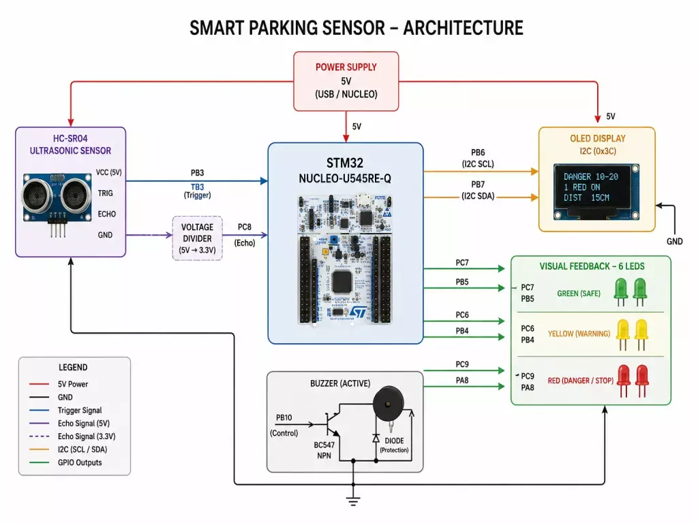
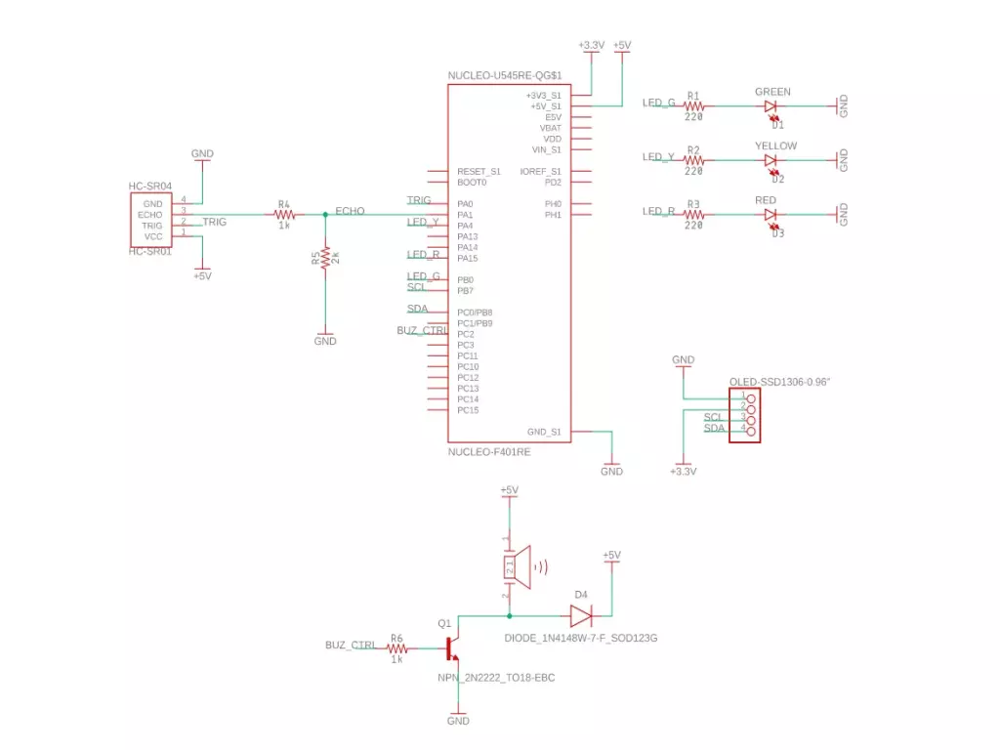

# Smart Parking Sensor

An embedded parking assistance system that measures the distance to nearby obstacles and provides real-time visual and audio feedback.

:::info

**Author:** Sebastian Marcu  \
**GitHub Project Link:** https://github.com/UPB-PMRust-Students/acs-project-2026-SebastianMarcu27

:::

---

## Description

This project implements a smart parking assistance system using an STM32 Nucleo-U545RE-Q board and an HC-SR04 ultrasonic distance sensor. The system measures the distance between the sensor and an obstacle placed in front of it and provides real-time feedback through six LEDs, an active buzzer, and an OLED I2C display.

The warning level changes progressively as the obstacle gets closer. The LEDs indicate the current distance range using green, yellow, and red stages, while the buzzer increases its alert frequency and becomes continuous when the obstacle is very close. The OLED display shows the current warning state and the measured distance in centimeters.

---

## Motivation

Parking sensors are commonly used in modern vehicles to help drivers estimate the distance to nearby obstacles and avoid collisions. This project recreates a simplified but functional version of such a system using embedded hardware.

The main purpose of the project is to combine sensor acquisition, GPIO control, I2C communication, real-time timing, and user feedback into a complete embedded application. Compared to the initial version, the final implementation provides more detailed feedback by using six LEDs, a buzzer driver circuit, and an OLED display.

---

## Architecture



The system is built around the STM32 Nucleo-U545RE-Q microcontroller board. The HC-SR04 ultrasonic sensor is used as the input module. The STM32 sends a trigger pulse to the sensor and measures the echo pulse duration in order to compute the distance.

The measured distance is then classified into one of several warning states. Based on the selected state, the STM32 controls six LEDs, the buzzer output, and the OLED text display.

The system uses:
- **GPIO output** for the trigger pin, LEDs, and buzzer control
- **GPIO input** for the echo signal
- **I2C communication** for the OLED display
- **software timing** for ultrasonic measurement, LED blinking, and buzzer patterns

The HC-SR04 echo signal is connected through a voltage divider before reaching the STM32 input pin, because the sensor may output 5V while the STM32 uses 3.3V logic. The buzzer is controlled using a BC547 transistor, so the microcontroller pin does not drive it directly.

---

## Hardware



The hardware implementation uses an STM32 Nucleo-U545RE-Q board as the main controller. The HC-SR04 ultrasonic sensor is connected using one trigger pin and one echo pin. Since the echo signal can reach 5V, a voltage divider is used to adapt the signal to the 3.3V logic level accepted by the STM32.

The visual feedback system consists of six LEDs:
- two green LEDs for safe distances
- two yellow LEDs for warning distances
- two red LEDs for danger and stop states

Each LED is connected through a current-limiting resistor. The buzzer is driven through a BC547 transistor, with a diode used for protection in the driver circuit. The OLED display is connected through the I2C interface and is used to display both the current state and the measured distance.

Main pin usage:
- **PB3**: HC-SR04 trigger
- **PC8**: HC-SR04 echo
- **PC7, PB5**: green LEDs
- **PC6, PB4**: yellow LEDs
- **PC9, PA8**: red LEDs
- **PB10**: buzzer driver
- **PB6 / PB7**: I2C SCL / SDA for OLED

---

## Bill of Materials

| Device | Usage | Estimated Price |
|---|---|---|
| STM32 Nucleo-U545RE-Q | Main microcontroller board | Provided |
| HC-SR04 ultrasonic sensor | Distance measurement | ~10 RON |
| OLED I2C display | Displays state and measured distance | ~30 RON |
| Green LEDs (x2) | Safe distance visual feedback | ~2 RON |
| Yellow LEDs (x2) | Warning distance visual feedback | ~2 RON |
| Red LEDs (x2) | Danger / stop visual feedback | ~2 RON |
| Active buzzer | Audio warning signal | ~5 RON |
| BC547 transistor | Buzzer driver | ~2 RON |
| Diode | Driver circuit protection | ~5 RON |
| Resistors | LED current limiting and voltage divider | ~15 RON |
| Breadboard | Circuit prototyping | ~15 RON |
| Male-male jumper wires | Breadboard connections | ~30 RON |
| Male-female jumper wires | Sensor/display/module connections | ~10 RON |
| USB cable | Programming and powering the board | Already available |

---

## Software

The project is written in Rust and uses the Embassy framework. The application runs without a standard library and uses the STM32 hardware abstraction provided by `embassy-stm32`.

The software periodically triggers the HC-SR04 sensor and measures the echo pulse duration. The distance is computed using the standard ultrasonic approximation:

```text
distance_cm = echo_time_us / 58
```

The measured value is then mapped to one of the following states:

| Distance range | State | LED behavior | Buzzer behavior |
|---|---|---|---|
| > 150 cm | Safe | Two green LEDs on | Rare beep |
| 150 - 120 cm | Safe | One green LED on | Slow beep |
| 120 - 90 cm | Caution | One green LED blinking | Medium beep |
| 90 - 70 cm | Warning | One yellow LED on | Alert beep |
| 70 - 50 cm | Close | Two yellow LEDs on | Fast beep |
| 50 - 30 cm | Close | Two yellow LEDs blinking | Fast beep |
| 30 - 20 cm | Danger | One red LED blinking | Very fast beep |
| 20 - 10 cm | Danger | One red LED on | Very fast beep |
| < 10 cm | Stop | Two red LEDs on | Continuous alarm |

If no valid echo signal is received, the system enters a `NoSignal` state and blinks the yellow and red LEDs to indicate a sensor problem.

The OLED display is controlled through I2C at address `0x3C`. It shows the current warning state, LED behavior, and measured distance. To reduce flicker, the display is not fully refreshed every cycle; the distance value is updated separately from the state header.

The main software modules are:
- sensor triggering and echo measurement
- distance-to-state classification
- LED and buzzer output control
- OLED initialization and text rendering
- simple state-based UI updates

---

## Links

- Project repository: https://github.com/UPB-PMRust-Students/acs-project-2026-SebastianMarcu27

