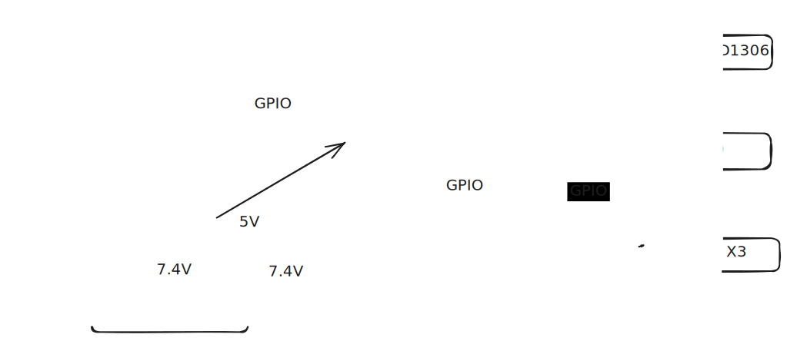
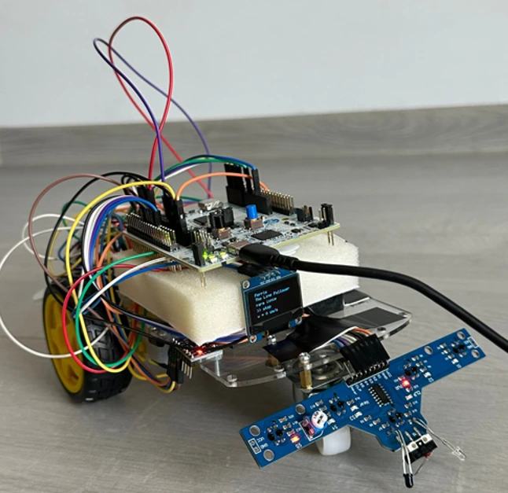
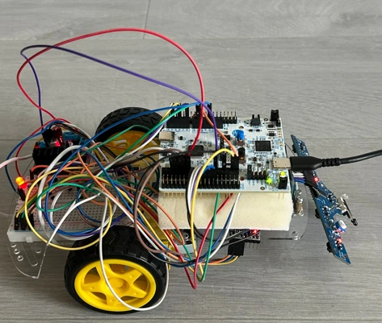
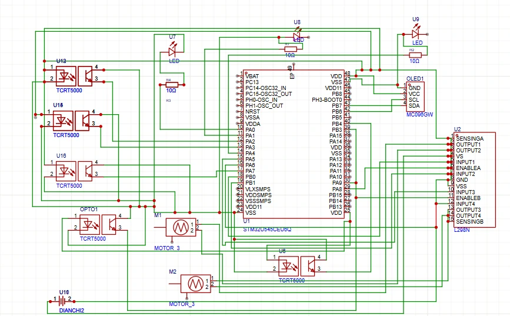

# Ferris Goes Vroom

A fast autonomous line-following car

:::info

**Author:** Sorana-Ioana Ulmeanu \

**GitHub Project Link:** https://github.com/UPB-PMRust-Students/acs-project-2026-soranaulm

:::

## Description

Ferris Goes Vroom is an autonomous line-following car that tracks a black line on a white surface. The car uses a 5-channel IR sensor module mounted under the chassis to detect the line position, and adjusts the two DC motors to stay on track. A small OLED display shows real-time information such as line detection state and speed. An MPU6050 accelerometer estimates the current speed by integrating acceleration over time.
What sets this project apart is the use of **Rust** with the **Embassy** async framework on an STM32 microcontroller — an uncommon choice in the embedded world, but one that brings memory safety and high performance. A set of colored LEDs provides real-time visual feedback about the system state: line detected, line lost, or maximum speed reached.

## Motivation

Growing up, I always wanted a remote control car. I loved watching them speed around and dreamed of having one
of my own. So when this project came along, I saw the perfect opportunity to finally get my car, just built by my own hands this time.

What makes this project special to me is how interactive and alive it feels. Watching a small car zoom along
a track on its own, reacting to the world around it in real time, feels almost like it has a personality.
There is something deeply satisfying about building something that moves, that responds, that feels human in
its own little way.

## Architecture

The system is organized into four main modules that run concurrently as Embassy async tasks:

**Sensor Subsystem:** A TCRT5000 5-channel IR sensor module is put in front of the chassis. Each channel reads surface reflectivity — black surfaces absorb IR (digital LOW) and white surfaces reflect it (digital HIGH). The combined pattern of S1–S5 readings determines the line position relative to the car center.

**PID Control Engine:** The control engine receives the error value from the sensor subsystem every few milliseconds and computes a correction using proportional, integral, and derivative terms. This correction is applied differentially to the two motors: if the car drifts right, the left motor speeds up and the right motor slows down, and vice versa. The three PID constants (Kp, Ki, Kd) are tuned experimentally on the real track.

**Motor Drive Subsystem:** An L298N dual H-bridge driver receives PWM signals from two STM32 timer channels (TIM2_CH3 and TIM3_CH1) and independently drives the two DC motors. Speed is controlled differentially — when turning, the outer motor runs at 100% duty cycle while the inner motor runs at 50%, allowing smooth cornering. For sharp corrections, one motor stops completely.

**LED Feedback Module:** Three 5mm LEDs indicate the current system state: red lights when no line is detected and the car is stopped, blue lights when the line is detected and tracking is active, and green lights when the car is moving forward on the line.

**Display & Speed Module:** A 0.96 SSD1306 OLED display connected via I2C shows real-time line detection state. An MPU6050 accelerometer, also connected via I2C, estimates speed by integrating the X-axis acceleration (ax) over time with dt = 50ms.

#### Block Diagram

### Communication Protocols

| Protocol | Usage |
|----------|-------|
| **GPIO Input** | Reading IR sensors, computing line position |
| **GPIO Output** | Controlling LEDs |
| **PWM (TIM)** | Controlling motor speed via L298N ENA/ENB |
| **ADC** | Reading analog IR sensor values for precise line position |
| **PWM (TIM)** | Controlling motor speed via L298N |

## Log

### Week 1
Defined the project concept and architecture. Researched and selected the hardware components needed for the build. Started working on the project documentation.

### Week 2
Verified each component one by one. Assembled the hardware — mounted the chassis, connected the TCRT5000 sensor module, L298N motor driver, OLED display, MPU6050, LEDs, and LiPo battery.

### Week 3
Wrote test code to verify all components working together — sensor readings, motor control, LED feedback, OLED display, and MPU6050 speed estimation.	

### Week 4
Finalized the project software with complete line-following logic. Finalized documentation and assembled all components in their final positions on the car.

## Hardware

The project is built around the **STM32 Nucleo-U545RE-Q**, featuring an ARM Cortex-M33 core running at 160MHz with 256KB of SRAM and 2MB of Flash, and an integrated ST-LINK/V3E debugger for easy flashing and RTT logging from Rust.

**A TCRT5000 5-channel IR sensor module** is mounted under the front of the chassis is mounted in a row under the front of the chassis. Each sensor emits infrared light and reads back the reflection — black surfaces absorb IR (digital LOW) and white surfaces reflect it (digital HIGH). The combined pattern of readings is used to compute the signed error of the line position relative to the car center.

A **L298N dual H-bridge motor driver** receives PWM signals from two STM32 timer channels and independently drives the two **DC motors with gearboxes**. The speed difference between the motors is the steering mechanism — no servo is needed.

Three 5mm LEDs (green, red, blue) with 220Ω current-limiting resistors are connected to GPIO output pins: red lights when no line is detected and the car stops, blue lights when the center sensors are aligned on the line, and green lights when the motors are running.

A **0.96" SSD1306 OLED display** is connected via I2C and shows real-time data: current speed, system state, and lap time.

A LiPo 7.4V battery powers the system autonomously. A HW-286 step-down regulator converts the 7.4V battery voltage to 5V to power the STM32 Nucleo, while the motors are driven directly from the battery voltage through the L298N.

The car chassis is either a commercial kit that holds all components in a compact and balanced layout. All components are connected on a breadboard with jumper wires.

[Demo](https://drive.google.com/file/d/15pEPNW_HupW3DtSfVHj9SexEdzAc97Xa/view?usp=sharing)

## Schematics

## Bill of Materials

| Device | Usage | Price |
|--------|-------|-------|
| [STM32 Nucleo-U545RE-Q](https://www.st.com/en/evaluation-tools/nucleo-u545re-q.html) | Main microcontroller | Provided by university |
| [TCRT5000 5-channel IR module](https://www.bitmi.ro/senzori-electronici/senzor-tcrt5000-cu-5-canale-pentru-urmarirea-liniei-10796.html) | Line detection | 16.99 RON |
| [L298N Motor Driver](https://www.bitmi.ro/module-electronice/modul-driver-l298n-cu-punte-h-dubla-pentru-motoare-dc-stepper-10400.html) | Dual DC motor control | 11.99 RON |
| [OLED Display SSD1306 0.96](https://www.bitmi.ro/electronica/ecran-oled-0-96-cu-interfata-iic-i2c-10488.html) | Real-time info display | 18.98 RON |
| [LED 5mm x3 (green, red, blue)](https://sigmanortec.ro/led-5mm-galben?SubmitCurrency=1&id_currency=2&gad_source=1&gad_campaignid=23069763085&gbraid=0AAAAAC3W72MHJfsM4OIBiavb31HceLdF0&gclid=Cj0KCQjww8rQBhDjARIsAE43KPPO91ZgWIrvTmxOFl-4Ef-DNobrKq3cDYaIEEjsULWql3iUzyc6cKkaAs_6EALw_wcB) | Visual feedback | 0.9 RON |
| [Resistors 220Ω x3 (kit)](https://sigmanortec.ro/kit-rezistori-30-valori-20-bucati?SubmitCurrency=1&id_currency=2&gad_source=1&gad_campaignid=23069763085&gbraid=0AAAAAC3W72MHJfsM4OIBiavb31HceLdF0&gclid=Cj0KCQjww8rQBhDjARIsAE43KPOJp4UTmhwNo1vMdQtHna5V_TJA_fCljqShhdf_jti3jHOmUQJVbQcaAoqzEALw_wcB) | LED current limiting | 15.16 RON |
| [LiPo Battery 7.4V](https://www.emag.ro/baterie-gens-ace-g-tech-soaring-1000mah-7-4v-30c-2s1p-xt60-kxg0060208/pd/D5RNQWMBM/?utm_medium=ios&utm_campaign=share%20product&utm_source=mobile%20app) | Autonomous power supply | 61.35 RON |
| [2WD Car chassis kit](https://sigmanortec.ro/Kit-sasiu-masina-2WD-urmaritor-linie-p172447939?SubmitCurrency=1&id_currency=2&gad_source=1&gad_campaignid=23069763085&gbraid=0AAAAAC3W72MHJfsM4OIBiavb31HceLdF0&gclid=Cj0KCQjww8rQBhDjARIsAE43KPOyOr5N7Gfx9LmCz1uGRrUwDUqEOnw8INjrzhQ2fKjxNQONSaTV7eAaAsCHEALw_wcB) | Mechanical strcuture |  41.21 RON |
| [Breadboard 400](https://www.bitmi.ro/componente-electronice/breadboard-400-puncte-pentru-montaje-electronice-rapide-10633.html) | Prototyping connections | 6.99 RON |
| [Jumper wires](https://www.bitmi.ro/electronica/40-fire-dupont-mama-mama-30cm-10503.html) | Prototyping connections(M-M, T-T, M-T) | 22.97 RON |
| [XT60 pigtail cable, male-female, 20cm](https://www.emag.ro/set-2-bucati-mufa-xt60-tata-mama-cablu-siliconic-lungime-20-cm-36073-36173/pd/D6J19QMBM/?utm_source=mobile%20app&utm_medium=ios&utm_campaign=share%20product) | Battery connector | 27.39 RON |
| [Black electrical tape](https://www.leroymerlin.ro/produse/banda-izolatoare-emos-19-mm-x-20-m-neagra-12085101.html?gclsrc=aw.ds&gad_source=1&gad_campaignid=22336169660&gbraid=0AAAAADwsS17jrlpcrXuL23b_yI2DmuFCj&gclid=Cj0KCQjww8rQBhDjARIsAE43KPO4Wb-Vk0dmpN3WlYYbxvbQjEA4Wd0Gpz1hDJzQXPEn98giooNR63UaAraTEALw_wcB) | Track line for car | 6.49 RON |
| [M3 screws + nuts set](https://www.leroymerlin.ro/produse/suruburi-metrice-cu-cap-inecat-otel-m3-x-16-mm-10721620.html) | Chassis assembly | ~2 RON |
| [Double-sided adhesive tape](https://www.leroymerlin.ro/produse/banda-dublu-adeziva-moment-power-fix-rezistenta-pana-120-kg-19-mm-x-1-5-m-alb-10575495.html?utm_source=google&utm_medium=cpc&utm_campaign=pmax&utm_content=materiale-constructii-vopsea&gad_source=1&gad_campaignid=22294857356&gbraid=0AAAAADwsS15SufdSsaTf_GoXFaVDVDdK6&gclid=Cj0KCQjww8rQBhDjARIsAE43KPM1ds0XzksdQLlTxEfcRNbOyKP_eLKT_-IymxFJXnC3-K9lwMZFNCYaAoT_EALw_wcB) | Component mounting | 19.98 RON |
| [HW-286 Step-down regulator](https://www.emag.ro/modul-convertor-coborator-dc-4v-38v-5a-reglabil-1-25v-36v-eficienta-96-putere-75w-protectie-scurtcircuit-pentru-sisteme-diy-si-alimentare-electronica-an7/pd/D19FC1YBM/?cmpid=145971&utm_source=google&utm_medium=cpc&utm_campaign=(RO:Whoop!)_3P-Y_%3e_Jucarii_hobby&utm_content=79559831474&gad_source=1&gad_campaignid=2078923891&gbraid=0AAAAACvmxQihs2WnLDXuriZW-vXAynmTp&gclid=Cj0KCQjww8rQBhDjARIsAE43KPP-zRUIV2l8rovl47pTQG0Q9itRJF-HGXpiUrw259kevNvRdie3-iwaAtLBEALw_wcB) | Voltage regulation 7.4V to 5V | 28.29 RON |

## Software

| Library | Description | Usage |
|---------|-------------|-------|
| `embassy` | Async runtime for embedded Rust | Task management and async executor |
| `embassy-stm32` | Embassy HAL for STM32 | GPIO, PWM (TIM), I2C control |
| `embassy-time` | Timer abstractions | Delays and PID loop timing |
| `embassy-sync` | Async synchronization primitives | Coordinating sensor, PID, display and LED tasks |
| `embedded-hal` | Hardware Abstraction Layer | Generic hardware interfaces |
| `ssd1306` | OLED display driver | Drawing text and graphics on the SSD1306 via I2C |
| `embedded-graphics` | 2D graphics library | Rendering text and shapes on the OLED display |
| `defmt` | Efficient embedded logging | Debugging via RTT |
| `cortex-m` | Low-level ARM Cortex-M utilities | Low-level control |
| `cortex-m-rt` | Runtime for ARM Cortex-M | Entry point and interrupt setup |

## Links

- [STM32 Nucleo-U545RE-Q Documentation](https://www.st.com/en/evaluation-tools/nucleo-u545re-q.html)
- [Nucleo-U545RE-Q User Manual](https://www.st.com/resource/en/user_manual/um3062-stm32u3u5-nucleo64-boards-mb1841-stmicroelectronics.pdf)
- [SSD1306 Driver Documentation](https://docs.arduino.cc/libraries/ssd1306/)
- [TCRT5000 Datasheet](https://www.vishay.com/docs/83760/tcrt5000.pdf)
- [L298N Datasheet](https://www.st.com/resource/en/datasheet/l298.pdf)
- [HW-286 Datasheet](https://www.mantech.co.za/ProductInfo.aspx?Item=15M7625&srsltid=AfmBOopv679_kLveY5yQmN0XXcmfyDvMhncTeTYx8qqII-04p-BZZxNV)
