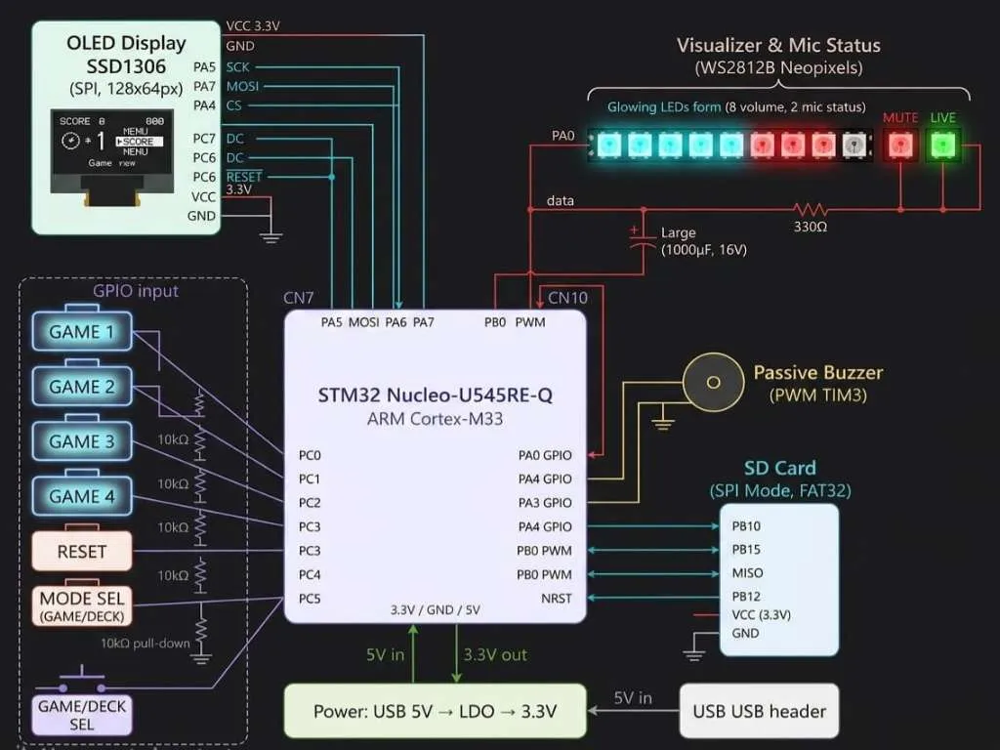

# Stream Deck and Fun
A hybrid USB HID controller and standalone reflex game for streamers and gamers.

:::info 

**Author**: Anghelina Stefan-Emilian \
**GitHub Project Link**: [https://github.com/UPB-PMRust-Students/acs-project-2026-Atackator](https://github.com/UPB-PMRust-Students/acs-project-2026-Atackator)

:::

## Description

**Stream Deck and Fun** is a dual-mode hardware peripheral designed to enhance the streaming and gaming experience. The device operates in two distinct modes, toggleable via a physical switch:
1. **Stream Deck Mode (Control):** Acts as a customizable HID interface that sends macro commands to the PC. It features a bi-directional data flow, receiving real-time system feedback such as audio levels, microphone mute status, or live stream alerts.
2. **"Loading Screen" Mode (Physical Game):** A standalone reflex-based game ("Whack-a-Button") that runs 100% on the local hardware. It is designed to keep the user engaged during long matchmaking queues or lobby wait times without needing to alt-tab from the game.

## Motivation

I chose this project to explore the integration of high-performance embedded systems with desktop environments:
* **Complex Interfacing:** Implementing bidirectional communication using USB HID (Keyboard/Media keys) and Serial protocols.
* **High-Speed Peripherals:** Utilizing DMA (Direct Memory Access) to drive WS2812B addressable LEDs and I2C for fluid OLED UI rendering.
* **Asynchronous Logic:** Building a robust system in **Rust** to handle concurrent tasks like debouncing, display updates, and USB communication without blocking the CPU.

## Architecture 

The project architecture consists of three main logical blocks:

1.  **PC Host Layer:** A background application (written in Python or Rust) that monitors OS metrics (Volume, OBS Studio status) and pushes updates to the STM32 while listening for HID shortcuts.
2.  **Firmware Layer (STM32):**
    * **USB Stack:** Manages the enumeration of the device as a standard Human Interface Device.
    * **Mode Controller:** A central State Machine that switches the board's resources between the "Deck" logic and the "Game" logic.
    * **Peripheral Drivers:** Specialized modules for the SSD1306 OLED display and the timing-critical Neopixel protocol.
3.  **Hardware Layer:** The physical interface including mechanical buttons, RGB feedback, and an OLED dashboard.

## Log

### Week 5 - 11 May

### Week 12 - 18 May

### Week 19 - 25 May

## Hardware

The project utilizes the **STM32 Nucleo-U545RE-Q**, a powerful ARM Cortex-M33 microcontroller. This board was chosen for its native USB support and advanced hardware timers, which are essential for driving addressable LEDs and handling HID reports efficiently.

### Schematics

### Bill of Materials

| Device | Usage | Price |
|--------|--------|-------|
| [STM32 Nucleo-U545RE-Q](https://www.optimusdigital.ro/ro/placi-stm/12693-nucleo-u545re-q.html) | Main Microcontroller (Cortex-M33) | [~165 RON](https://www.optimusdigital.ro/) |
| [OLED Display 0.96" I2C](https://www.optimusdigital.ro/ro/display-uri-oled/230-display-oled-096-cu-interfaa-i2c-albastru-galben.html) | Dashboard and Score Display | [25 RON](https://www.optimusdigital.ro/) |
| [WS2812B RGB LED Strip](https://www.optimusdigital.ro/ro/led-uri-rgb-adreabile/1932-bareta-cu-8-led-uri-rgb-ws2812-5050.html) | Volume Visualizer and Status LED | [18 RON](https://www.optimusdigital.ro/) |
| [Tactile Buttons 12x12mm](https://www.optimusdigital.ro/ro/butoane-i-comutatoare/683-buton-tactiv-12x12x73mm.html) | Inputs for Deck and Game (6-8 pcs) | [10 RON](https://www.optimusdigital.ro/) |
| [Passive Buzzer](https://www.optimusdigital.ro/ro/buzzere/154-buzzer-pasiv.html) | Audio feedback for game events | [5 RON](https://www.optimusdigital.ro/) |
| [Passive Components Set](https://www.optimusdigital.ro/) | Resistors (10k, 330) and Capacitors (100nF) | [10 RON](https://www.optimusdigital.ro/) |

## Software

The firmware is developed in **Rust** using the Embassy framework for modern, asynchronous embedded development.

| Library | Description | Usage |
|---------|-------------|-------|
| [embassy-stm32](https://github.com/embassy-rs/embassy) | Async HAL for STM32 | Low-level peripheral control and task scheduling |
| [usbd-hid](https://crates.io/crates/usbd-hid) | USB HID class device | Emulating keyboard/media keys for PC control |
| [embedded-graphics](https://github.com/embedded-graphics/embedded-graphics) | 2D graphics library | Drawing the UI, icons, and text for the OLED |
| [ssd1306](https://crates.io/crates/ssd1306) | I2C display driver | Interfacing with the OLED panel |
| [smart-leds](https://crates.io/crates/smart-leds) | WS2812B driver | Managing RGB animations and visualizer colors |

## Links

1. [STM32U5 Reference Manual](https://www.st.com/resource/en/reference_manual/rm0456-stm32u5-series-32bit-arm-cortexm33-mcus-stmicroelectronics.pdf)
2. [The Rust Embedded Book](https://docs.rust-embedded.org/book/)
3. [Embassy Project Documentation](https://embassy.dev/)
4. [WS2812B Timing and DMA Implementation](https://controllerstech.com/ws2812-led-with-stm32/)