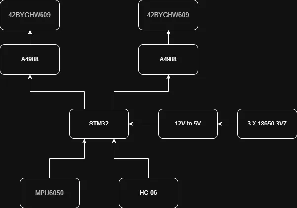
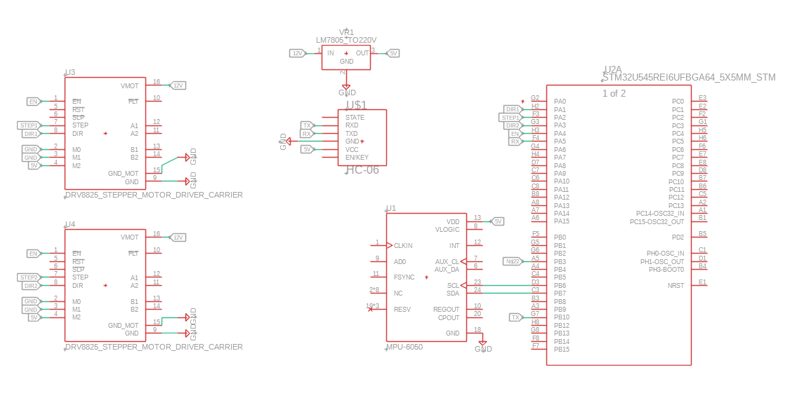

# Two-Wheeled Self-Balancing Robot

:::info 

**Author**: Calmac Stefan \
**GitHub Project Link**: [link_to_project](https://github.com/UPB-PMRust-Students/acs-project-2026-Stefan1627)

:::

## Description

The system maintains an upright position on two wheels by continuously adjusting the speed of the motor. It receives data on the angle of inclination and angular velocity from an inertial measurement unit as inputs. A microcontroller processes this data using a PID control algorithm to calculate the necessary corrective forces. The output consists of PWM signals sent to the motor drivers, which actuate the wheels to move forward or backward, counteracting the inclination and keeping the system balanced in real time. The robot will also be controllable from a phone.

## Motivation

I’ve been itching to bridge the gap between my software-heavy coursework and hands-on hardware, and a self-balancing robot is the perfect "final boss" to start with. It’s a great way to finally dive into **Control Systems** and PID algorithms, moving beyond theory to see my code actually fight gravity in real time. Plus, adding smartphone control gives it that extra bit of polish and functionality that makes the whole engineering challenge even more rewarding.

## Architecture 

## Log

### Week 20 - 24 April
Made initial documentation and ordered hardware parts.

### Week 27 - 30 April
Tested all components

### Week 4 - 8 April
Assembled first prototype 

## Hardware

- Microcontroller: The central logic unit (likely an Arduino, ESP32, or similar) that processes sensor data and controls the motor drivers.

- MPU6050 IMU: A 6-axis motion tracking device combining a 3-axis gyroscope and a 3-axis accelerometer to measure orientation and acceleration.

- 42BYGHW609 Stepper Motors (x2): High-torque NEMA 17 stepper motors used for precise positioning or movement.

- Motor Drivers: (Inferred) Interfaces like the A4988 or DRV8825 used to translate logic signals from the microcontroller into high-current power for the stepper motors.

  - Power Supply: A dedicated DC source (such as a LiPo battery or 12V adapter) to provide sufficient current for the motors and logic circuits.

### Schematics

### Bill of Materials

| Device | Usage | Price |
|--------|--------|-------|
| [STM32](https://www.st.com/en/evaluation-tools/nucleo-u545re-q.html) | Microcontroller | [129 RON](https://ro.farnell.com/stmicroelectronics/nucleo-u545re-q/development-brd-32bit-arm-cortex/dp/4216396?CMP=e-email-sys-orderack-GLB) |
| [MPU6050](https://cdn.sparkfun.com/datasheets/Sensors/Accelerometers/RM-MPU-6000A.pdf) | IMU (Gyroscope + Accelerometer) | [14.68 RON](https://www.optimusdigital.ro/en/inertial-sensors/13611-mpu6050-accelerometer-and-gyroscope-module-soldered-pins.html)
| [HC-06](https://www.rajguruelectronics.com/Product/707/HC-06%20core%20bluetooth%20module.pdf) | Bluetooth Module | [30.40 RON](https://www.optimusdigital.ro/en/wireless-bluetooth/9629-hc-06-slave-module-with-adapter-33v-and-5v-compatible.html?search_query=0104110000063557&results=1) |
| [LM2596](https://www.ti.com/lit/ds/symlink/lm2596.pdf) | Buck Converter 12V - 5V | [10 RON](https://www.emag.ro/modul-dc-dc-step-down-lm2596-765464701237/pd/DWHHRGBBM/) |
| [2 X A4988](https://www.pololu.com/file/0j450/a4988_dmos_microstepping_driver_with_translator.pdf) | Stepper Motor Driver | [14.80 RON](https://www.optimusdigital.ro/en/stepper-motor-drivers/866-driver-pentru-motoare-pas-cu-pas-a4988-rosu.html?search_query=a4988&results=8) |
| [2 X 42BYGHW609](https://www.openimpulse.com/blog/wp-content/uploads/wpsc/downloadables/42BYGHW609-Stepper-Motor-Datasheet1.pdf) | Stepper Motor | [2 x 55 RON](https://www.optimusdigital.ro/en/stepper-motors/1968-motor-pas-cu-pas-42byghw609.html) | 
| Hubs | Coupling Hubs | [12 RON](https://www.optimusdigital.ro/en/coupling-hubs/227-hexagonal-motor-coupling-hub-5-mm.html) |
| [3 X 18650](https://www.tme.eu/Document/d2b1b92043fdc4f07bc5beebafb429d9/NCR18650GA.pdf) | Battery | [63 RON](https://www.tme.eu/ro/details/accu-ncr18650ga/acumulatori/panasonic/ncr18650ga/) |
| Wheels | Moving | [34 RON](https://sigmanortec.ro/roata-65mm-cu-cauciuc) |

## Software

| Library | Description | Usage |
|---------|-------------|-------|
| [embassy-stm32](https://github.com/embassy-rs/embassy/tree/main/embassy-stm32) | Hardware Interface | Base library for project. |

## Links

1. https://www.youtube.com/watch?v=I6z26LVu5y0

