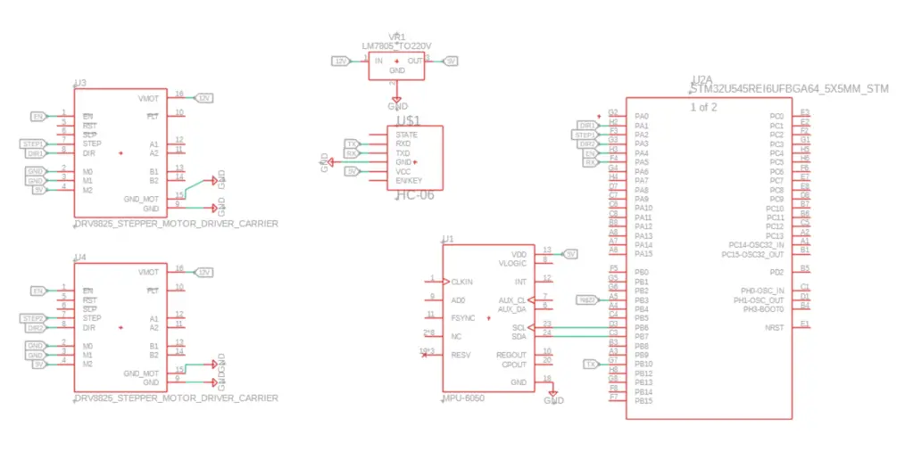

# Two-Wheeled Self-Balancing Robot

:::info 

**Author**: Calmac Stefan \
**GitHub Project Link**: [link_to_project](https://github.com/UPB-PMRust-Students/acs-project-2026-Stefan1627)

:::

## Description

The system maintains an upright position on two wheels by continuously adjusting the speed of the motor. It receives data on the angle of inclination and angular velocity from an inertial measurement unit as inputs. A microcontroller processes this data using a PID control algorithm to calculate the necessary corrective forces. The output consists of PWM signals sent to the motor drivers, which actuate the wheels to move forward or backward, counteracting the inclination and keeping the system balanced in real time. The robot will also be controllable from a phone.

## Motivation

I’ve been itching to bridge the gap between my software-heavy coursework and hands-on hardware, and a self-balancing robot is the perfect "final boss" to start with. It’s a great way to finally dive into **Control Systems** and PID algorithms, moving beyond theory to see my code actually fight gravity in real time. Plus, adding smartphone control gives it that extra bit of polish and functionality that makes the whole engineering challenge even more rewarding.

## Architecture 

## Log

### Week 20 - 24 April
Made initial documentation and ordered hardware parts.

### Week 27 - 30 April
Tested all components

### Week 4 - 8 April
Assembled first prototype

### Week 11 - 15 April
Implemented basic control loop and tested balancing.

### Week 18 - 22 April
Added smartphone control and refined LQR parameters.

## Hardware

- Microcontroller: The central logic unit (likely an Arduino, ESP32, or similar) that processes sensor data and controls the motor drivers.

- MPU6050 IMU: A 6-axis motion tracking device combining a 3-axis gyroscope and a 3-axis accelerometer to measure orientation and acceleration.

- 42BYGHW609 Stepper Motors (x2): High-torque NEMA 17 stepper motors used for precise positioning or movement.

- Motor Drivers: (Inferred) Interfaces like the A4988 or DRV8825 used to translate logic signals from the microcontroller into high-current power for the stepper motors.

- Power Supply: A dedicated DC source (such as a LiPo battery or 12V adapter) to provide sufficient current for the motors and logic circuits.

### Schematics

### Bill of Materials

| Device | Usage | Price |
|--------|--------|-------|
| [STM32](https://www.st.com/en/evaluation-tools/nucleo-u545re-q.html) | Microcontroller | [129 RON](https://ro.farnell.com/stmicroelectronics/nucleo-u545re-q/development-brd-32bit-arm-cortex/dp/4216396?CMP=e-email-sys-orderack-GLB) |
| [MPU6050](https://cdn.sparkfun.com/datasheets/Sensors/Accelerometers/RM-MPU-6000A.pdf) | IMU (Gyroscope + Accelerometer) | [14.68 RON](https://www.optimusdigital.ro/en/inertial-sensors/13611-mpu6050-accelerometer-and-gyroscope-module-soldered-pins.html)
| [HC-06](https://www.rajguruelectronics.com/Product/707/HC-06%20core%20bluetooth%20module.pdf) | Bluetooth Module | [30.40 RON](https://www.optimusdigital.ro/en/wireless-bluetooth/9629-hc-06-slave-module-with-adapter-33v-and-5v-compatible.html?search_query=0104110000063557&results=1) |
| [7805CV](https://www.alldatasheet.com/datasheet-pdf/view/22634/STMICROELECTRONICS/L7805CV.html) | Voltage Regulator | [2.29 RON](https://www.tme.eu/ro/details/l7805cv/regulatoare-de-tensiune-neregulata/stmicroelectronics/?brutto=1&currency=RON&utm_source=google&utm_medium=cpc&utm_campaign=RUMUNIA%20%5BPLA%5D%20CSS&utm_content=&campaign_id=10591401989&gad_source=1&gad_campaignid=10591401989&gclid=Cj0KCQjww8rQBhDjARIsAE43KPNMQx9BcwCRkYgH--lNO9846eYcD11bwCDiKmXQAqxLTKGlnEeu9BgaAp3-EALw_wcB) |
| [2 X DRV8825](https://www.tme.eu/Document/1dd18faf1196df48619105e397146fdf/POLOLU-2133.pdf) | Stepper Motor Driver | [14.49 RON](https://www.optimusdigital.ro/ro/drivere-de-motoare-pas-cu-pas/154-driver-pentru-motoare-pas-cu-pas-drv8825.html) |
| [2 X 42BYGHW609](https://www.openimpulse.com/blog/wp-content/uploads/wpsc/downloadables/42BYGHW609-Stepper-Motor-Datasheet1.pdf) | Stepper Motor | [2 x 55 RON](https://www.optimusdigital.ro/en/stepper-motors/1968-motor-pas-cu-pas-42byghw609.html) | 
| Hubs | Coupling Hubs | [12 RON](https://www.optimusdigital.ro/en/coupling-hubs/227-hexagonal-motor-coupling-hub-5-mm.html) |
| [3 X 18650](https://www.tme.eu/Document/b0696c4f778ad42c714b01b76e452497/XTAR+18650+3500.pdf) | Battery | [44 RON](https://www.tme.eu/ro/details/xtar-18650-3.5ah10/acumulatori/xtar/18650-350pcm/?brutto=1&currency=RON) |
| Wheels | Moving | [34 RON](https://sigmanortec.ro/roata-65mm-cu-cauciuc) |
| [2sc3399](https://www.alldatasheet.com/datasheet-pdf/view/108623/SANYO/2SC3399.html) | Transistor | [2.50 RON](https://www.digikey.lt/en/products/detail/rochester-electronics-llc/2SC3399-AC/12098102) |
|Capacitor 1000uF/16V | Filtering | [0.59 RON](https://www.optimusdigital.ro/ro/componente-electronice-condensatoare/7822-condensator-electrolitic-1000-uf-16-v.html) |
|Capacitor 1000uF/25V | Filtering | [0.59 RON](https://www.optimusdigital.ro/ro/componente-electronice-condensatoare/3005-condensator-electrolitic-de-1000-uf-la-25-v.html) |
|Capacitor 470uF/25V | Filtering | [0.49 RON](https://www.optimusdigital.ro/ro/componente-electronice-condensatoare/3007-condensator-electrolitic-de-470-uf-la-25-v.html) |

## Software

| Library | Description | Usage |
|---------|-------------|-------|
| [embassy-stm32](https://github.com/embassy-rs/embassy/tree/main/embassy-stm32) | Hardware Interface | Base library for project. |
| [defmt](https://crates.io/crates/defmt) | Compact logging framework | Debug and runtime status messages. |
| [defmt-rtt](https://crates.io/crates/defmt-rtt) | Real-Time Transfer | Logging backend. |
| [panic-probe](https://crates.io/crates/panic-probe) | Panic handler for embedded Rust | Reports useful diagnostic information |
| [embassy-executor](https://crates.io/crates/embassy-executor) | Async task executor used by the Embassy embedded framework. | Structure async tasks. |
| [embassy-futures](https://crates.io/crates/embassy-futures) | Provides async utilities for embedded systems| join4 runs four async operations concurrently and waits for all of them. |
| [embassy-time](https://crates.io/crates/embassy-time) | Provides timing primitives for Embassy-based embedded firmware. | Used where a blocking-style delay object is required by a driver, especially sensor initialization. |
| [embedded-hal](https://crates.io/crates/embedded-hal) | Defines generic traits for embedded hardware interfaces. | Used the PWM trait abstraction for controlling PWM behavior generically. |
| [mpu6050-dmp](https://crates.io/crates/mpu6050-dmp) | Rust driver crate for the MPU6050 IMU. | Used to: initialize the MPU6050,configure accelerometer range, configure gyroscope range, read motion data. |

## Links

1. https://www.youtube.com/watch?v=I6z26LVu5y0
2. https://zenn.dev/tana_ash
3. https://github.com/tana/balance-robot2

