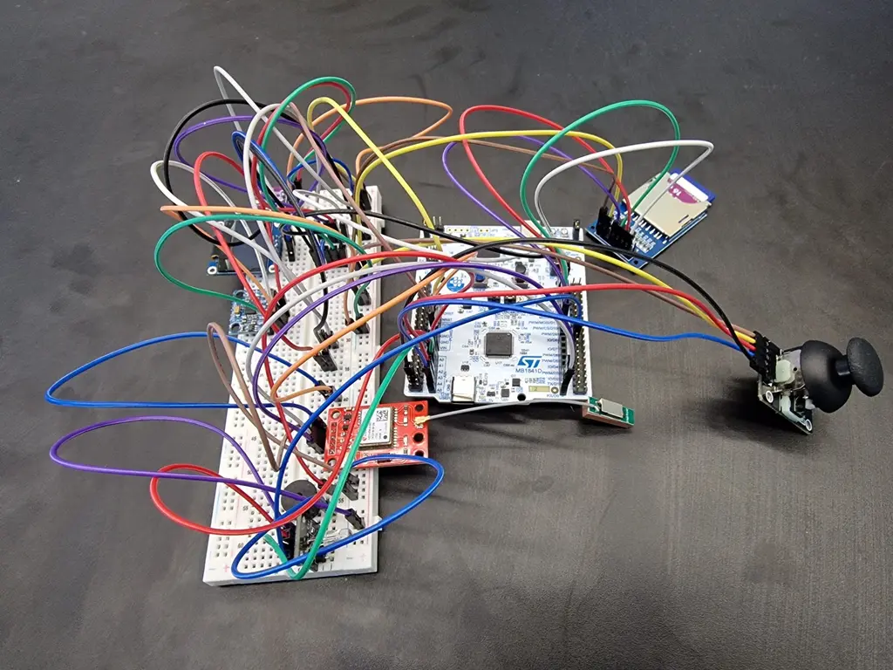
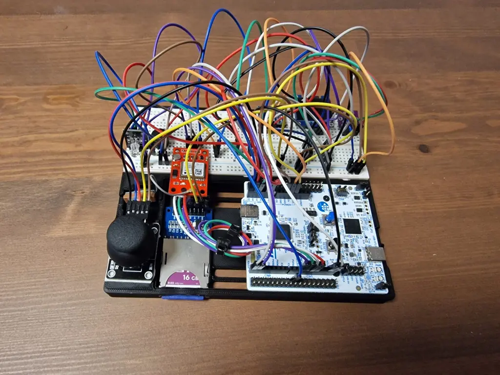
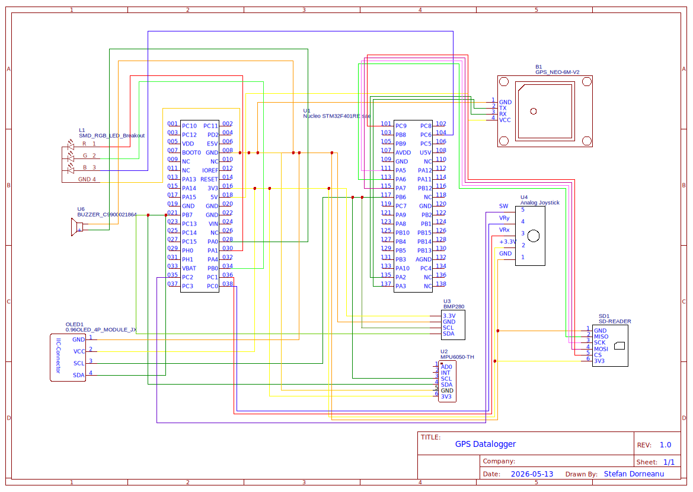

# GPS Datalogger for Bicycle

A embedded system for recording and monitoring bicycle ride data, with real-time display and event detection.

:::info

**Author**: Dorneanu Stefan Cristian \
**GitHub Project Link**: [Project Link](https://github.com/UPB-PMRust-Students/acs-project-2026-stefandorneanu)

:::

<!-- do not delete the \ after your name -->

## Description

The system acquires data from a GPS module (position, speed, altitude), an accelerometer and gyroscope (sudden braking and cornering detection) and a barometric sensor (precise altitude). Data is displayed in real time on a display and saved persistently on an SD card in CSV format. The software runs multiple parallel async tasks: GPS acquisition with data decoding, event detection from the accelerometer and gyroscope with filtering on the magnitude of the acceleration vector, live display and SD card writing. Sensor fusion combines GPS altitude with barometric altitude for improved accuracy.

## Motivation

I have been cycling regularly for the past few years and always wanted a deeper understanding of my rides beyond what a simple phone app can offer. Most commercial solutions are either too expensive or too closed to customize. Building this system from scratch on a microcontroller gives me full control over what data is collected and how it is processed. I also wanted to explore how sudden braking and cornering events can be detected in real time using an IMU, which has practical applications in cyclist safety. The project strikes a good balance between hardware integration and software complexity, making it an ideal fit for this project.

## Architecture

The system is structured around 6 main async tasks running in parallel:

- **GPS Task** — reads NMEA sentences from the NEO-6M module via UART, parses $GPRMC and $GPGGA sentences to extract position, speed, altitude and time
- **IMU Task** — reads the MPU-6050 accelerometer via I2C and detects sudden braking events, classifying them as moderate (yellow alert) or severe/accident (red alert + buzzer)
- **Input Task** — reads the KY-023 joystick ADC axes and button, generates navigation events for screen switching and race control
- **Navigation Task** — processes joystick events to switch between the 4 OLED screens and trigger race start/stop
- **Display Task** — updates the OLED screen at 5Hz with the currently selected view: environment data, GPS status, speed and altitude, or race control
- **SD Task** — monitors race recording state and writes GPS trackpoints (timestamp, latitude, longitude) to a CSV file on the SD card when a race is active

All tasks communicate through atomic variables for sensor data and Embassy Signal primitives for events, avoiding data conflicts without blocking.

## Log

<!-- write your progress here every week -->

### Week 5 - 11 May

Ordered all hardware components (GPS module, accelerometer/gyroscope MPU-6050, barometric sensor AHT20+BMP280, OLED display, SD card module, RGB LED, passive buzzer, LiPo battery, TP4056 charger, wires and breadboard). Set up the Rust embedded development environment with Embassy framework. Created individual test projects for each component. Successfully tested the buzzer (PWM signal generation), RGB LED (common anode, color cycling), OLED display (I2C communication, text rendering) and accelerometer/gyroscope (I2C data reading). Started testing the GPS module — UART communication works and NMEA sentences are being received.

### Week 12 - 18 May

Completed testing of all remaining individual components. Successfully obtained the first GPS fix outdoors after tuning the UART communication and analyzing NMEA sentences in real time. Tested the SD card module (SPI communication, FAT32 initialization, file write and read-back verification). Added a KY-023 analog joystick to the project for OLED screen navigation, tested ADC reading on both axes and button input. Reallocated several GPIO pins to avoid conflicts between the SD card SPI bus and the joystick ADC inputs. Started development of the main integrated project combining all components into 6 parallel async Embassy tasks.

### Week 19 - 25 May

3D printed a custom enclosure for the system, housing the NUCLEO board, display, GPS module and all connected components. Completed the full software implementation — all tasks are running in parallel and fully integrated. The OLED navigation with the joystick is functional across all 4 screens. The system is now fully operational as a standalone bicycle GPS datalogger.

## Hardware

The system uses the NUCLEO-U545RE-Q board as the main microcontroller. The GPS module provides position and speed data via UART. The accelerometer and gyroscope (IMU) are connected via I2C and detect sudden movements. The barometric sensor, also on I2C, measures atmospheric pressure to calculate altitude. An OLED display shows data in real time, while an SD card module saves all data in CSV format. The RGB LED and buzzer signal detected events such as sudden braking and sharp cornering.

### Schematics

### Bill of Materials

| Device | Usage | Price |
| -------- | -------- | ------- |
| [NUCLEO-U545RE-Q](https://www.st.com/en/evaluation-tools/nucleo-u545re-q.html) | Main microcontroller | 130 RON |
| [GPS Module NEO-6M](https://www.optimusdigital.ro/en/gps/2137-gyneo6mvgps-module-with-miniature-antenna.html) | Position, speed, GPS altitude | 69.99 RON |
| [Accelerometer and Gyroscope MPU-6050](https://www.optimusdigital.ro/en/inertial-sensors/96-mpu6050-accelerometer-and-gyroscope-module.html) | Sudden braking and cornering detection | 14.68 RON |
| [Barometric Sensor AHT20 + BMP280](https://www.optimusdigital.ro/en/pressure-sensors/1777-bmp280-barometric-pressure-sensor-module.html) | Temperature and barometric altitude | 12.00 RON |
| [OLED Display 0.96" I2C](https://www.optimusdigital.ro/en/lcds/2894-096-i2c-oled-module.html) | Real-time data display | 18.98 RON |
| [MicroSD Card Module SPI](https://www.optimusdigital.ro/en/memories/1516-microsd-card-slot-module.html) | Data logging in CSV format via SPI | 4.99 RON |
| MicroSD Card 16GB Class 10 | CSV file storage | 43 RON |
| [Analog Joystick KY-023](https://www.optimusdigital.ro/en/joysticks/12-ps2-joystick-module.html) | OLED screen navigation and race control | 4.99 RON |
| RGB LED Module | Visual event indicator | 6.39 RON |
| Passive Buzzer | Audio alert for sudden braking | 2.97 RON |
| LiPo Battery 3.7V + TP4056 module | Mobile power supply and charging | 34.67 RON |
| Wires and Breadboard | Component connections | 38.96 RON |

## Software

| Library | Description | Usage |
| --------- | ------------- | ------- |
| [embassy-stm32](https://github.com/embassy-rs/embassy) | Async framework for embedded Rust | Parallel tasks, peripheral drivers, I2C, SPI, UART, ADC, GPIO |
| [embassy-executor](https://github.com/embassy-rs/embassy) | Async task executor for embedded | Running 6 parallel async tasks |
| [embassy-time](https://github.com/embassy-rs/embassy) | Time management in Embassy | Async timers and delays |
| [embassy-sync](https://github.com/embassy-rs/embassy) | Synchronization primitives | Signal and Mutex for inter-task communication |
| [embassy-embedded-hal](https://github.com/embassy-rs/embassy) | Embedded HAL adapters for Embassy | Shared I2C bus between MPU6050, BMP280 and OLED |
| [embedded-sdmmc](https://github.com/rust-embedded-community/embedded-sdmmc-rs) | FAT32 file system for SD | CSV writing on SD card via SPI |
| [embedded-hal](https://github.com/rust-embedded/embedded-hal) | Hardware abstraction layer | SPI device trait implementation for SD card |
| [ssd1306](https://github.com/jamwaffles/ssd1306) | OLED display driver | Real-time data display via I2C |
| [embedded-graphics](https://github.com/embedded-graphics/embedded-graphics) | 2D graphics library for embedded | Text rendering on OLED |
| [heapless](https://github.com/rust-embedded/heapless) | Stack-allocated data structures | String formatting without heap |
| [libm](https://github.com/rust-lang/libm) | Math functions for no_std | Haversine formula, sqrt |

## Links

1. [Embassy Rust Framework](https://embassy.dev)
2. [STM32U545 Reference Manual](https://www.st.com/resource/en/reference_manual/rm0456-stm32u5-series-armbased-32bit-mcus-stmicroelectronics.pdf)
3. [Embedded Rust Programming](https://docs.rust-embedded.org/book/)
