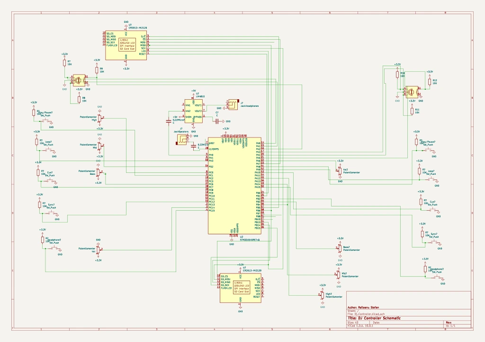
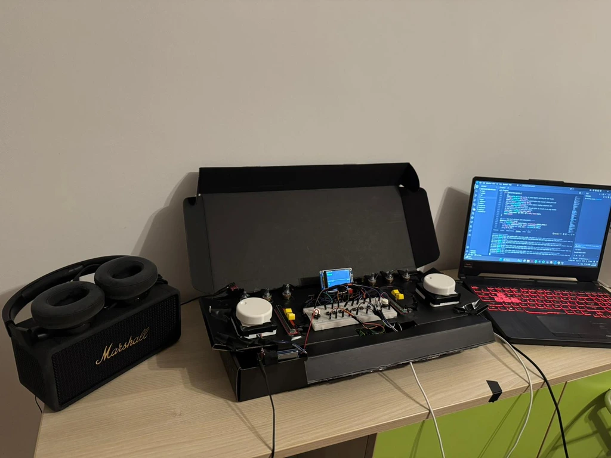
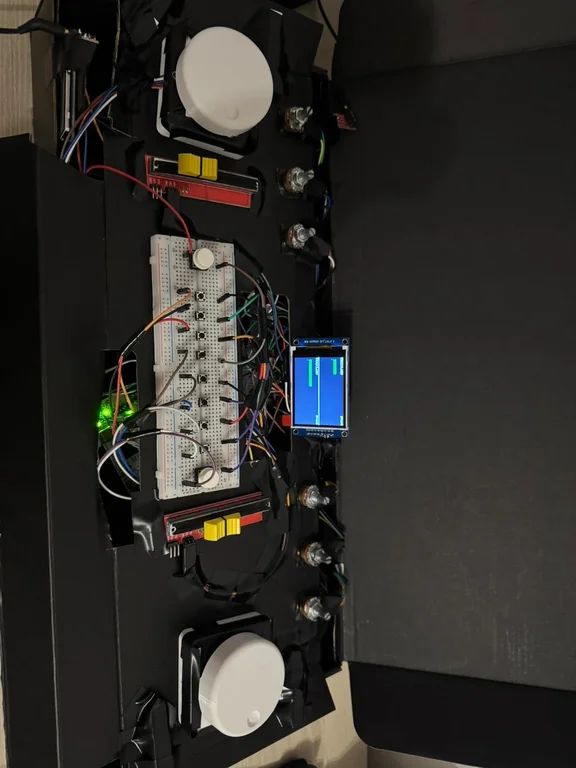

# DJ Controller

A standalone two-deck DJ controller running on the STM32U545RE, written in Rust.

:::info

**Author**: Stefan Răileanu \
**GitHub Project Link**: [link_to_github](https://github.com/UPB-PMRust-Students/acs-project-2026-raylaj23)

:::

## Description

A fully standalone two-deck DJ controller built on the STM32U545RE microcontroller, written in Rust using the Embassy framework. The board reads WAV audio files from an SD card and performs real-time mixing between two decks.

Each deck has its own jog wheel (a rotary encoder), three EQ knobs (bass, mid, high), a volume knob, and dedicated buttons for Play/Pause, Cue, Loop, Sync, and Headphone Cue Select. One shared TFT display shows track name, position, BPM, and loop state in play mode, or a scrollable file list in browse mode.

Audio leaves the STM32U545RE through its internal DAC: the main mix goes via a 3.5mm AUX jack into a Marshall Middleton speaker, and the cued deck is routed through a TPA headphone amplifier to the headphone output.

## Motivation

I'm a techno enthusiast and wanted a project that combines the technical skills I'm learning with a hobby I already love.

## Architecture

The system is organized around three main components: an **Input Handler**, an **Audio Engine**, and a **Display Driver**.

* **Input Handler** — reads rotary encoders (jog wheel seek and track browse), potentiometers (EQ bass/mid/high per deck, volume per deck), and buttons (Play/Pause, Cue, Loop, Sync, Headphone Cue).

* **Audio Engine** — streams two WAV files from SD card over SPI. Each deck runs an independent DSP chain (3-band biquad EQ: low-shelf bass at 200Hz, peaking mid at 1000Hz, high-shelf at 3000Hz), plus loop, cue, sync, and headphone cue routing logic. The internal DAC outputs the main mix on CH1 (Marshall) and the cued deck on CH2 (headphones).

* **Display Driver** — one ILI9341 2.4" TFT display shows per-deck state. In browse mode: scrollable WAV file list with highlighted selection. In play mode: track name, BPM, progress bar, cue point marker, loop region overlay, and status indicators (SYNC, HP, LOOP, PAUSED).

## Log

### Week 21 - 27 April
* Completed the documentation and ordered the hardware parts

### Week 28 April - 4 May
* Connected all the parts to STM32

### Week 5 - 11 May
* Got basic WAV playback working over SPI + DAC
* Added volumes per deck

### Week 12 - 18 May
* Implemented dual-deck streaming with ping-pong buffer architecture
* Added 3-band biquad EQ (bass/mid/high) per deck

### Week 19 - 25 May
* Implemented browse mode with rotary encoder track selection
* Added Play/Pause, Cue, Loop, Sync buttons
* Added headphone cue routing
* Added display with play mode and browse mode UI
* Finalized hardware connections (design)

## Hardware

The controller is built around the **STM32U545RE Nucleo board**. Two WAV streams are read from a microSD card over SPI. Audio is generated by the **STM32U545RE's internal DAC**. The main mix goes through a **3.5mm AUX jack** into a **Marshall Middleton** speaker. The cue channel goes through a **TPA headphone amplifier** to the headphones.

Each deck has a rotary encoder used as jog wheel (seek in track) and browse wheel (select track). Six potentiometers per deck: Bass EQ, Mid EQ, High EQ, and Volume. Five buttons per deck: Play/Pause, Cue, Loop, Sync, Headphone Cue Select. One shared **ILI9341 2.4" TFT display** (split into two halves, one per deck) connects over SPI1.

### Schematics

### Bill of Materials

| Device | Usage | Price |
|--------|--------|-------|
| STM32U545RE Nucleo Board | Main microcontroller | — |
| TPA Headphone Amplifier module | Headphone cue output | 24 RON |
| 3.5mm Stereo Audio Jack (female) ×2 | AUX output (Marshall) + headphone output | 4 RON |
| Marshall Middleton | Main speaker via built-in amplifier (AUX in) | — |
| Rotary Encoders ×2 | Jog wheel — seek in track, browse tracks | 10 RON |
| Potentiometers 10kΩ ×8 | EQ Bass/Mid/High ×6, Volume ×2 | 10.48 RON |
| Push Buttons ×10 | Play/Pause ×2, Cue ×2, Loop ×2, Sync ×2, HP Cue ×2 | 8.30 RON |
| ILI9341 2.4" TFT Display ×1 | Track info, BPM, position, browse file list | 34 RON |
| MicroSD card | Storing WAV audio files and BPM metadata | 40 RON |
| Wires, breadboard, capacitors | Wiring and decoupling | 50 RON |
| | | **Total: ~180 RON** |

## Software

| Library | Description | Usage |
|---------|-------------|-------|
| [embassy-rs](https://github.com/embassy-rs/embassy) | Async embedded framework for Rust | Main async runtime — drives SPI, DAC, ADC, DMA, GPIO EXTI concurrently |
| [embedded-sdmmc](https://github.com/rust-embedded-community/embedded-sdmmc-rs) | SD card FAT filesystem driver | Reads WAV files and companion BPM `.txt` files from SD card |
| [mipidsi](https://crates.io/crates/mipidsi) | Display driver (ILI9341/ST7789) | Drives the TFT display over SPI1 |
| [embedded-graphics](https://github.com/embedded-graphics/embedded-graphics) | 2D graphics library | Renders track name, BPM, progress bar, cue/loop markers, browse list |
| [libm](https://crates.io/crates/libm) | Math functions for no_std | Biquad EQ coefficient calculations (sin, cos, pow, sqrt) |

## Links

1. [STM32U545RE Reference Manual](https://www.st.com/resource/en/reference_manual/rm0456-stm32u5-series-armbased-32bit-mcus-stmicroelectronics.pdf)
2. [Embassy — Async Embedded Rust](https://embassy.dev/)
3. [WAV file format specification](http://soundfile.sapp.org/doc/WaveFormat/)