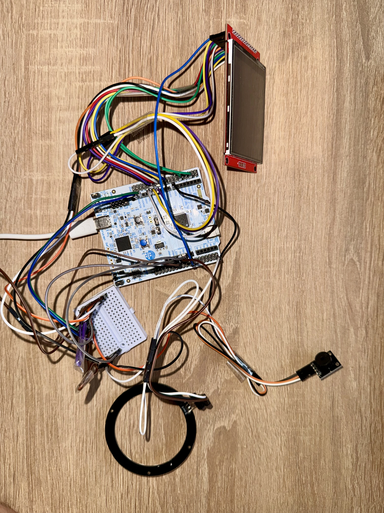
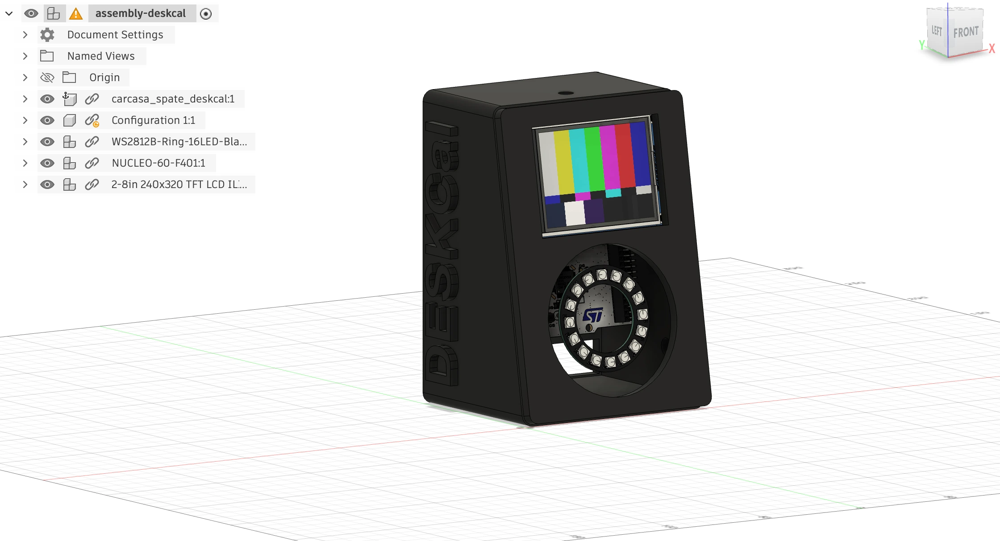
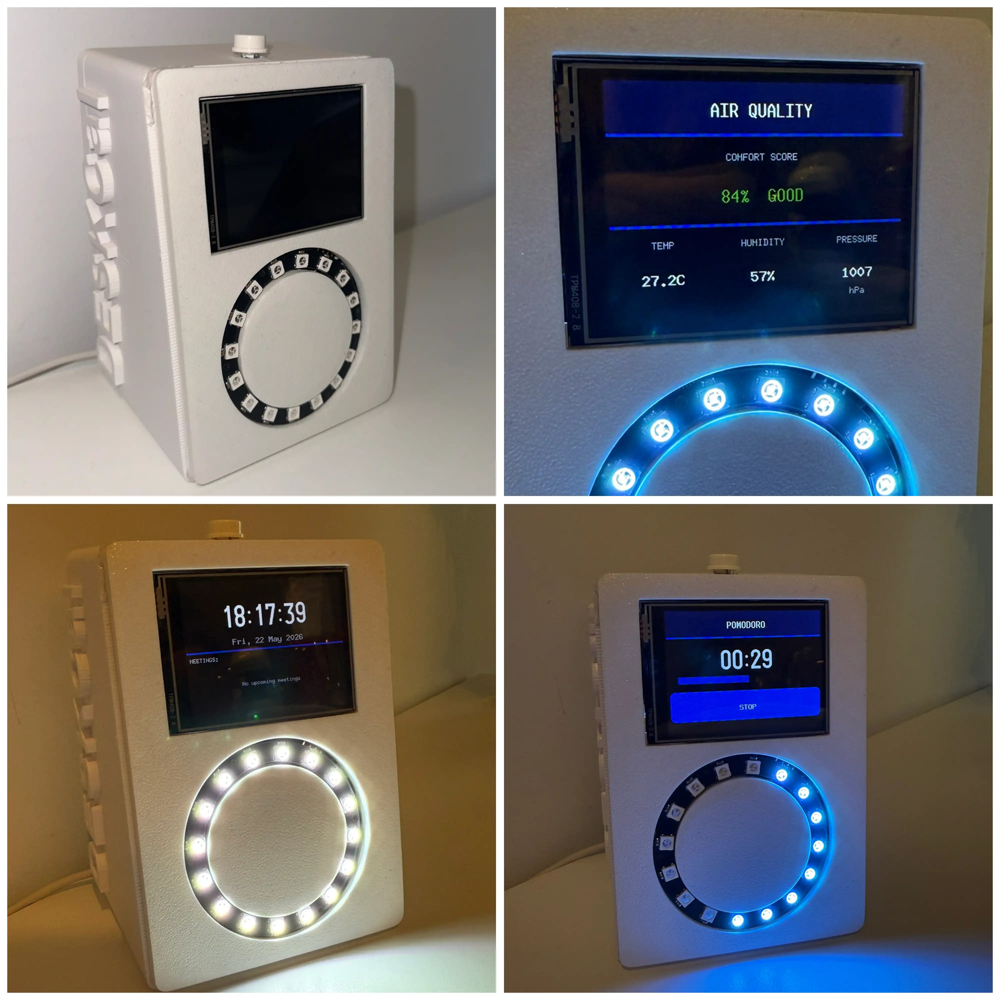
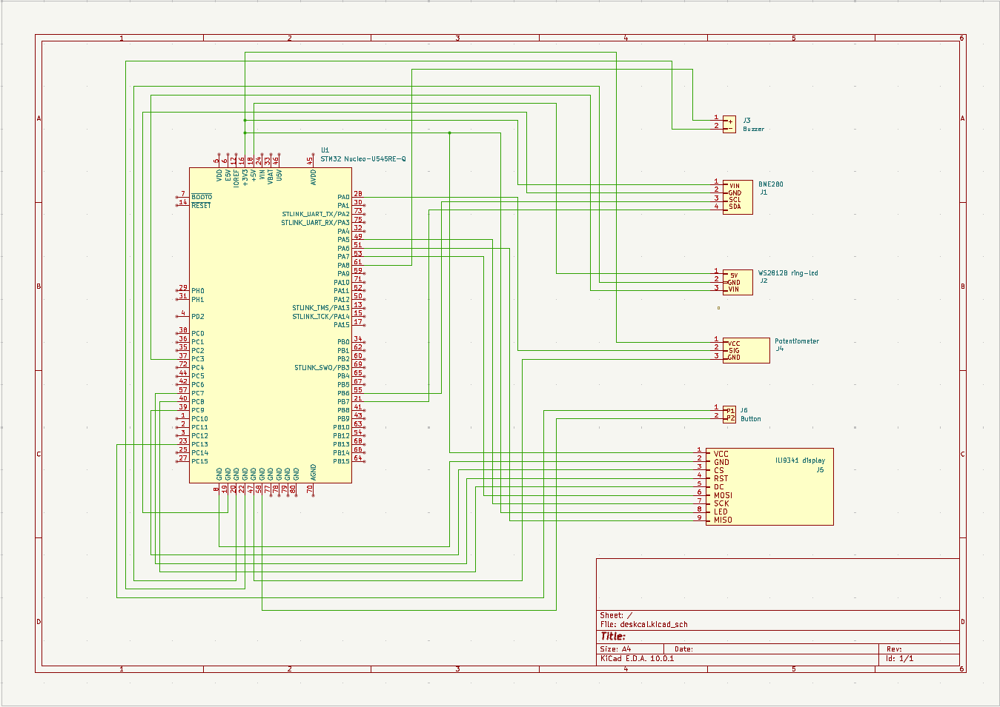

# DeskCal - Smart Desk Calendar
A smart desk calendar that displays weather, news, local sensor data, and 
calendar events from a dedicated web app on a TFT touch screen, with animated 
LED ring alerts for upcoming meetings.

:::info 

**Author**: BADEA Stefan-Vasile \
**GitHub Project Link**: [UPB-PMRust-Students/acs-project-2026-stefanbadea-sudo](https://github.com/UPB-PMRust-Students/acs-project-2026-stefanbadea-sudo)

:::

<!-- do not delete the \ after your name -->

## Description

DeskCal is a smart desk calendar running on an STM32 Nucleo-U545RE-Q
microcontroller. It receives real-time data from a laptop via USB-UART —
including current time, weather conditions, Calendar events, and live
news headlines — all serialized as JSON by a companion Python script.

A BME280 sensor measures local temperature, humidity, and atmospheric pressure.
A 2.8" ILI9341 TFT touchscreen display renders five navigable screens: a
summary overview, a full-screen clock with upcoming meetings, a local air
quality dashboard, an outdoor weather page, and a live news feed. Navigation
between screens is done via swipe gestures on the touchscreen.

A WS2812B RGB LED ring displays animated color patterns — configurable via a
companion web application — with a dedicated alert mode when a meeting is
approaching. A passive buzzer emits an audio alert before events start.

The system supports multiple visual themes, selectable in real time from the 
companion web app which communicates with the Python bridge over HTTP. The 
device is housed in a custom 3D-printed enclosure.

## Motivation

As a student with a busy schedule of classes, lab sessions, and project 
deadlines, I often find myself missing meetings or losing track of environmental 
conditions in my workspace. I wanted to build a device that consolidates all 
this information in one place on my desk, without requiring me to constantly 
check my phone or laptop. The project also gave me the opportunity to explore 
embedded Rust development with embassy-rs, work with multiple hardware 
peripherals simultaneously, and design a complete end-to-end system from 
hardware to software to physical enclosure.

## Architecture 

<!-- Add here the schematics with the architecture of your project. Make sure to 
include:
 - what are the main components (architecture components, not hardware 
 components)
 - how they connect with each other -->


**DeskCal Controller (Web App)** — a local web application running in the
browser that allows the user to select visual themes, configure LED ring
behavior, adjust brightness, and push quick meetings to the device. Communicates
with the Python bridge over HTTP at localhost:5000.

**Python Bridge Script** — runs on the laptop and acts as the central data
aggregator. Fetches weather data from OpenWeatherMap, events from
Calendar, and news headlines from an RSS feed using an open-source NewsAPI. 
Receives theme and configuration changes from the web app and forwards 
everything to the STM32 as JSON packets over USB-UART. Sends time 
synchronization packets every second and full data updates every 60 seconds.

**STM32 Nucleo-U545RE-Q** — main controller running embassy-rs. Contains a
dedicated async UART task that receives and parses incoming JSON packets and
dispatches them to the main loop via a channel.

**Display Subsystem** — ILI9341 2.8" TFT touchscreen over SPI renders five
screens: Summary (screen 0), Clock + Meetings (screen 1), Air Quality (screen
2), Weather (screen 3), News (screen 4), and a pomodoro timer (screen 5). 
Navigation between screens is performed via swipe gestures detected on the 
XPT2046 touchscreen controller. When a meeting is within 5 minutes, a 
full-screen alert overlay appears with a dismiss button on the touchscreen.

**Alert Subsystem** — WS2812B LED ring driven via one-wire protocol (using SPI
peripheral for timing) displays eight configurable animation modes:
Off, Dim, Solid, Breathe, Pulse, Fast, Strobe, and Chase. 

The ring switches to a dedicated alert animation mode when a meeting is 
approaching. A buzzer driven by PWM emits a tone. Both the normal ring 
color/animation and the alert color/animation are configurable in real time 
from the web app.

The system is organized around four main components:
 
**Host Python Script** — runs on the laptop, fetches weather from OpenWeatherMap 
and events from Google Calendar, serializes to JSON and sends over USB-UART 
every 60 seconds.
 
**STM32 Nucleo-U545RE-Q** — main controller running embassy-rs async tasks: 
UART reception, BME280 reading, display rendering, LED ring and buzzer control.
 
**Display Subsystem** — ILI9341 2.8" TFT over SPI renders four pages selected
via potentiometer (ADC).
 
**Alert Subsystem** — WS2812B LED ring (SPI) + passive buzzer (PWM) produce 
visual and audio alerts based on meeting proximity; tactile button handles 
snooze via GPIO interrupt.


## Log

<!-- write your progress here every week -->

### Week 5
Finalized project idea and had the theme approved by the lab coordinator.

### Week 7
Ordered all hardware components from Optimus Digital and eMAG. Started reading
embassy-rs documentation and experimenting with basic GPIO and UART on the
Nucleo board. Started enclosure design in Fusion 360.

### Week 8 & 9
Completed project documentation page. Set up embassy-rs project skeleton for
STM32U545. Verified all components arrived and functional.

### Week 11 - Hardware Milestone
Connected and tested all hardware components: ILI9341 display via SPI,
BME280 sensor via I2C, WS2812B LED ring via SPI, passive buzzer via PWM,
XPT2046 touchscreen, potentiometer via ADC. Designed and 3D printed enclosure.
Implemented basic firmware with display rendering, sensor reading, touch input,
buzzer alerts and LED ring animations.




### Week 12 - Software Milestone
Implemented UART communication with the Python bridge, JSON parsing, and
data handling. Developed the five main display pages with embedded-graphics.
Implemented swipe gesture detection for page navigation. Developed LED ring
animation modes and alert logic based on meeting proximity. Integrated buzzer
alerts. Tested the complete end-to-end system with the Python bridge sending
real-time data updates and theme changes from the web app. Enclosure design 
finalized and printed.



## Hardware

The project uses an STM32 Nucleo-U545RE-Q as the main microcontroller, running
at 160MHz via PLL configured in firmware.

A 2.8" ILI9341 TFT display with integrated XPT2046 touchscreen controller is
connected via SPI1 (PA5=SCK, PA7=MOSI, PA6=MISO). The display uses a dedicated
SPI chip select (PC9) and control pins for data/command (PC8) and reset (PC6).
The touchscreen controller shares the SPI bus with a separate chip select (PB4)
and an interrupt line (PC13) for touch detection.

A BME280 barometric sensor is connected via I2C1 (PB6=SCL, PB7=SDA) and
provides local temperature, humidity, and atmospheric pressure readings.

A WS2812B 16-LED RGB ring is driven via one-wire protocol using the SPI2
peripheral (PC3=MOSI, PB13=SCK) at 6.4MHz for precise signal timing. Each bit
is encoded as a single SPI byte (0xC0 for logical 0, 0xF8 for logical 1).

A passive buzzer is driven via PWM on TIM1 channel 1 (PA8), producing
configurable frequency tones for meeting alerts.

All components are interconnected via jumper wires on a mini breadboard and
housed in a custom 3D-printed PLA enclosure designed in Fusion 360.
Ordered all hardware components from Optimus Digital and eMAG. Started reading 
embassy-rs documentation and experimenting with basic GPIO and UART on the 
Nucleo board. Started enclosure design in Fusion 360.

### Schematics



### Bill of Materials

<!-- Fill out this table with all the hardware components that you might need.

The format is 
```
| [Device](link://to/device) | This is used ... | [price](link://to/store) |

```
-->


| Device | Usage | Price |
|--------|-------|-------|
| [STM32 Nucleo-U545RE-Q](https://www.st.com/en/evaluation-tools/nucleo-u545re-q.html) | Main microcontroller | Provided by faculty |
| [ILI9341 2.8" SPI TFT Display](https://www.optimusdigital.ro/en/lcds/3544-modul-lcd-spi-de-28-cu-touchscreen-controller-ili9341-i-xpt2046-240x320-px.html) | Displays clock, weather, sensor data and calendar pages | ~90 RON|
| [BME280 Barometric Sensor Module](https://www.optimusdigital.ro/en/pressure-sensors/1354-modul-senzor-barometric-de-presiune-bme280.html) | Measures local temperature, humidity and pressure | ~34 RON |
| [WS2812B RGB LED Ring (16 LEDs)](https://www.optimusdigital.ro/en/others/749-inel-de-led-uri-rgb-ws2812-cu-16-led-uri.html) | Visual meeting alerts with animated color patterns | ~20 RON|
| [Passive Buzzer 3.3V](https://www.optimusdigital.ro/ro/audio-buzzere/12247-buzzer-pasiv-de-33v-sau-3v.html) | Audio alerts before and during meetings | ~13 RON|
| [Tactile Button 6x6x6mm](https://www.optimusdigital.ro/ro/butoane-i-comutatoare/1119-buton-6x6x6.html) (x2) | Snooze reminder and UI interaction | ~3 RON|
| [Jumper Wires M-F 40p 20cm](https://www.optimusdigital.ro/ro/fire-fire-mufate/92-fire-colorate-mama-tata-40p.html) | Component interconnections | ~10 RON|
| [Jumper Wires F-F 10p 20cm](https://www.optimusdigital.ro/ro/fire-fire-mufate/91-fire-colorate-mama-mama-10p.html) (x2) | Component interconnections | ~10 RON|
| [Breadboard 170 points](https://www.optimusdigital.ro/ro/prototipare-breadboard-uri/246-mini-breadboard-colorat.html) | Prototyping connections | ~3 RON|
| 3D-printed PLA enclosure | Houses all components | provided by faculty |

## Software

| Library | Description | Usage |
| --- | --- | --- |
| [embassy-stm32](https://github.com/embassy-rs/embassy) | Async HAL for STM32 | Peripheral drivers: SPI1, SPI2, I2C1, USART1, GPIOs, and TIM1 PWM for the buzzer. |
| [embassy-executor](https://github.com/embassy-rs/embassy) | Async task executor | Running concurrent tasks (`#[embassy_executor::main]` and the asynchronous `uart_task`). |
| [embassy-sync](https://github.com/embassy-rs/embassy) | Sync primitives | `Channel` for inter-task packet communication and `Mutex` for safe SPI bus sharing. |
| [embassy-embedded-hal](https://github.com/embassy-rs/embassy) | Embedded HAL bridge | `SpiDevice` wrapper to share SPI1 between the ILI9341 display and the touch controller. |
| [embassy-time](https://github.com/embassy-rs/embassy) | Async time management | Global timers (`Timer::after_millis`) and `Delay` provider for display/sensor initialization. |
| [embedded-graphics](https://github.com/embedded-graphics/embedded-graphics) | 2D graphics library for embedded systems | Drawing primitives (rectangles, circles, boxes) and handling the `Rgb565` color palette. |
| [mipidsi](https://github.com/almindor/mipidsi) | MIPI Display Interface driver | Initializing and controlling the ILI9341 TFT display orientation and reset routines. |
| [display-interface-spi](https://www.google.com/search?q=https://github.com/rust-embedded/rust-spid%E9%81%8B%E8%BC%B8) | SPI display interface abstraction | Command/Data (DC) and SPI wrapper layer for the display driver. |
| [u8g2-fonts](https://www.google.com/search?q=https://github.com/oriansln/u8g2-fonts) | U8g2 font renderer for embedded-graphics | Rendering high-quality standalone text (e.g., the `logisoso38` font for the clock/Pomodoro digits). |
| [bme280](https://www.google.com/search?q=https://github.com/mcauser/rust-bme280) | BME280 sensor driver | Reading local temperature, humidity, and atmospheric pressure over I2C1. |
| [embedded-hal / embedded-io-async](https://github.com/rust-embedded/embedded-hal) | Hardware abstraction traits | Core traits used for hardware interoperability, specifically `SpiDevice` and asynchronous UART streams (`AsyncRead`). |
| [defmt](https://github.com/knurling-rs/defmt) | Ultra-efficient logging framework | Logging runtime debug information (`info!`) such as touchscreen coordinates and sensor data. |
| [defmt-rtt](https://github.com/knurling-rs/defmt) | Real-Time Transfer transport layer | Pushing `defmt` logs directly through the SWD debugger interface without using physical serial pins. |
| [panic-probe](https://github.com/knurling-rs/defmt) | Panic handler for microcontrollers | Catching runtime panics and safely streaming crash details over the debug probe. |

## Links
<!-- Add a few links that inspired you and that you think you will use for your project -->

1. [embassy-rs documentation](https://embassy.dev)
2. [ILI9341 datasheet](https://cdn-shop.adafruit.com/datasheets/ILI9341.pdf)
3. [WS2812B datasheet](https://cdn-shop.adafruit.com/datasheets/WS2812B.pdf)
4. [BME280 datasheet](https://www.bosch-sensortec.com/media/boschsensortec/downloads/datasheets/bst-bme280-ds002.pdf)
5. [News API documentation](https://newsapi.org/docs)
6. [OpenWeatherMap API](https://openweathermap.org/api)
7. [embedded-graphics examples](https://github.com/embedded-graphics/examples)
8. [KiCad EDA for schematics](https://www.kicad.org)
