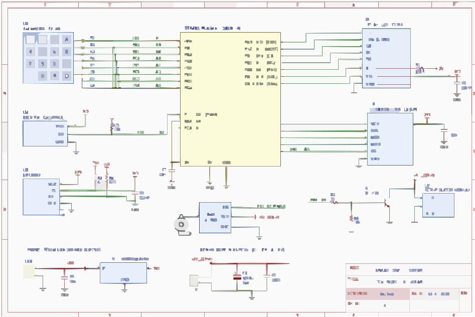

# Inteligent Vault
A smart safe box with PIN access, tamper detection, alarm, event logging and a local web admin interface.

:::info 

**Author**: Andrei Teodor-Mihai \
**GitHub Project Link**: [link_to_github](https://github.com/UPB-PMRust-Students/acs-project-2026-Teodor04)

:::

<!-- do not delete the \ after your name -->

## Description

Intelligent Vault is a smart electronic safe controlled by an STM32 Nucleo board. 
The safe can be unlocked using a PIN entered from a keypad. It controls a physical locking mechanism using a servo motor, detects unauthorized movement or forced opening attempts, triggers an alarm, and stores important events in a log.

The project also includes a USB connection to a PC/laptop. Through a local web interface, the user can monitor the safe status, view logs and configure some settings such as the PIN or tamper detection.


## Motivation

I chose this project because it combines several important embedded systems concepts: GPIO, PWM, SPI, I2C, serial communication, sensors, actuators and real-time event handling.

The project is also practical and easy to demonstrate. It has a visible physical result: the safe can lock/unlock, detect tampering and trigger an alarm. The web admin interface adds a connectivity component and makes the project more complex than a basic local-only embedded system.


## Architecture 

The system is split into the following main software components:

- Authentication Manager
  - Handles PIN input, checks if the PIN is correct and manages failed attempts.
  - After several wrong attempts, it activates a temporary lockout.

- Lock Controller
  - Controls the servo motor used for the physical locking mechanism.
  - Manages the LOCKED and UNLOCKED states.

- Tamper Detection
  - Reads data from the accelerometer/gyroscope.
  - Detects movement, shaking or forced opening.
  - Uses a reed switch or microswitch to detect if the door was opened while locked.

- Alarm Manager
  - Controls the buzzer and status LEDs.
  - Activates when tamper is detected or when too many wrong PIN attempts occur.

- Display/UI Manager
  - Shows the current state of the vault on the LCD display.
  - Displays messages such as LOCKED, ENTER PIN, UNLOCKED, ALARM and LOCKOUT.

- Event Logger
  - Stores important events such as BOOT, LOCKED, UNLOCKED, WRONG_PIN, TAMPER and ALARM.
  - Logs can be saved on a microSD card or sent to the PC through USB serial.

- Communication Manager
  - Sends status and events to a PC/laptop through USB serial.
  - Receives commands from the local web admin interface, such as LOCK, UNLOCK, SET_PIN or ARM_TAMPER.


## Log

<!-- write your progress here every week -->

### Week 5 - 11 May

Created the project idea and defined the main requirements.
Selected the STM32 Nucleo board as the main microcontroller platform.
Researched the required hardware components: servo motor, keypad, LCD, IMU sensor, reed switch, buzzer and microSD module.

### Week 12 - 18 May

Connected the keypad and tested PIN input.
Connected the servo motor and implemented basic LOCK/UNLOCK control.
Added the main vault state machine: BOOT, LOCKED, PIN_ENTRY, UNLOCKED, LOCKOUT and ALARM.
Added serial communication between the STM32 board and the PC server.
Displayed vault status and logs in the web admin interface.

### Week 19 - 25 May

Connected the IMU sensor and implemented basic motion/tamper detection.
Connected the reed switch for detecting forced door opening.
Added buzzer alarm and LED feedback.
Added event logging for wrong PIN attempts, unlock events and tamper events.
Tested the complete system and prepared the final demo.

## Hardware

The project uses an STM32 Nucleo-U545RE-Q development board as the main controller. The board controls the safe mechanism and communicates with several external modules.

The keypad is used for entering the PIN. The servo motor physically locks and unlocks the safe. The LCD display shows the current state of the system. The MPU6050 accelerometer/gyroscope detects movement or shaking, while a reed switch detects if the door is opened while the vault is locked. A buzzer is used for the alarm. A microSD module can be used for event logging.

The board is connected to a PC/laptop through USB serial. A local Python web server reads messages from the board and exposes a web admin interface.

### Schematics

The following schematic shows the main connections between the STM32 Nucleo board and the external modules used by the Intelligent Vault project.



### Bill of Materials

<!-- Fill out this table with all the hardware components that you might need.

The format is 
```
| [Device](link://to/device) | This is used ... | [price](link://to/store) |

```

-->

| Device                                                                                                                                              | Usage                                               | Price               |
| --------------------------------------------------------------------------------------------------------------------------------------------------- | --------------------------------------------------- | ------------------- |
| [STM32 Nucleo-U545RE-Q](https://www.st.com/en/evaluation-tools/nucleo-u545re-q.html)                                                                | Main microcontroller board, provided by the teacher | Provided by teacher |
| [MG90S Servo Motor](https://www.optimusdigital.ro/motoare-servomotoare/271-servomotor-mg90s.html)                                                   | Controls the physical lock mechanism                | 19.33 RON   |
| [Reed Switch Module](https://www.optimusdigital.ro/en/buttons-and-switches/12717-reed-switch-module.html)                                           | Detects if the safe door is opened/forced           | 5.99 RON  |
| [4x4 Matrix Keypad](https://www.optimusdigital.ro/senzori-senzori-de-atingere/2441-tastatura-matriceala-4x4-cu-butoane.html)                        | Used for PIN input                                  | 3.99 RON  |
| [1.8 inch SPI LCD ST7735](https://www.optimusdigital.ro/optoelectronice-lcd-uri/3554-modul-lcd-de-18-cu-spi-i-controller-st7735-128x160-px.html)    | Displays system state and messages                  | 29.99 RON   |
| [MPU6050 Accelerometer and Gyroscope](https://www.optimusdigital.ro/senzori-senzori-inertiali/96-modul-senzor-triaxial-mpu-6050.html)               | Detects movement, shaking and tamper attempts       | 15.49 RON   |
| [Active Buzzer Module](https://www.optimusdigital.ro/audio-buzzere/10-modul-cu-buzzer-activ.html)                                                   | Alarm output                                        | 2.99 RON  |
| [MicroSD Card Module](https://www.optimusdigital.ro/memorii/1516-modul-slot-card-microsd.html)                                                      | Stores event logs                                   | 4.39 RON   |
| [Female-Male Wires](https://www.optimusdigital.ro/en/wires-with-connectors/92-female-male-wire40p-20-cm.html)                                       | Used for connecting modules to the board            | 7.99 RON   |
| [Female-Female Wires](https://www.optimusdigital.ro/en/wires-with-connectors/90-20-cm-40p-female-female-wire.html)                                  | Used for connecting modules and headers             | 7.99 RON   |
| [Breadboard](https://www.optimusdigital.ro/prototipare-breadboard-uri/8-breadboard-830-points.html)                                                 | Used for prototyping connections                    | 10.99 RON   |
| [Breadboard Power Supply](https://www.optimusdigital.ro/electronica-de-putere-stabilizatoare-liniare/61-sursa-de-alimentare-pentru-breadboard.html) | Provides external 5V for the servo motor            | 4.69 RON   |
| [1000 uF Capacitor](https://www.optimusdigital.ro/ro/componente-electronice-condensatoare/7822-condensator-electrolitic-1000-uf-16-v.html)          | Stabilizes servo power supply                       | 0.59 RON   |


## Software

| Library                                                                           | Description                                                       | Usage                                                                      |
| --------------------------------------------------------------------------------- | ----------------------------------------------------------------- | -------------------------------------------------------------------------- |
| [embassy-stm32](https://github.com/embassy-rs/embassy)                            | Async embedded framework for STM32 microcontrollers               | Used for GPIO, timers, SPI, I2C, UART/USB and async tasks                  |
| [embedded-hal](https://github.com/rust-embedded/embedded-hal)                     | Common traits for embedded Rust drivers                           | Used as abstraction layer for peripherals and drivers                      |
| [embedded-graphics](https://github.com/embedded-graphics/embedded-graphics)       | 2D graphics library for embedded displays                         | Used for drawing text, status screens and UI elements on the LCD           |
| [mipidsi](https://github.com/almindor/mipidsi)                                    | Display driver for SPI TFT displays such as ST7735/ST7789/ILI9341 | Used for controlling the SPI LCD display                                   |
| [heapless](https://github.com/rust-embedded/heapless)                             | Fixed-capacity data structures without dynamic allocation         | Used for command buffers, logs and serial messages                         |
| [embedded-sdmmc-rs](https://github.com/rust-embedded-community/embedded-sdmmc-rs) | SD card and FAT filesystem library for embedded systems           | Used for writing event logs to the microSD card                            |
| [defmt](https://github.com/knurling-rs/defmt)                                     | Logging framework for embedded Rust                               | Used for debugging firmware during development                             |
| [panic-probe](https://github.com/knurling-rs/probe-run)                           | Panic handler for embedded debugging                              | Used for debugging panics through probe-run/defmt                          |
| [Flask](https://flask.palletsprojects.com/)                                       | Python web framework                                              | Used for the local web admin interface                                     |
| [PySerial](https://pyserial.readthedocs.io/)                                      | Python serial communication library                               | Used by the web server to communicate with the STM32 board over USB serial |


## Links

<!-- Add a few links that inspired you and that you think you will use for your project -->

1. [STM32](https://www.st.com/en/evaluation-tools/nucleo-u545re-q.html)
2. [Rust_Book](https://docs.rust-embedded.org/book/)
...
