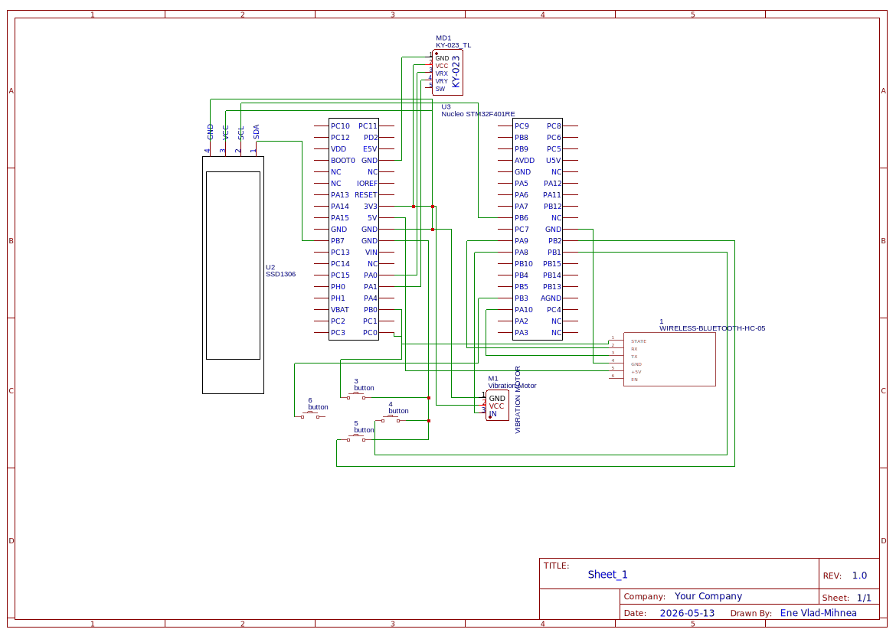

# Wireless Arcade Controller
A wireless arcade game controller built with Rust and Embassy on STM32 Nucleo-U545RE-Q.

:::info

**Author:** Ene Vlad-Mihnea
**GitHub Project Link:** [RustPad](https://github.com/UPB-PMRust-Students/acs-project-2026-enevlad)

:::

## Description

RustPad is a wireless game controller based on the STM32 Nucleo-U545RE-Q microcontroller,
programmed in Rust using the Embassy async framework. It features an analog joystick, four
digital action buttons, an SSD1306 OLED display showing Bluetooth connection status,
rumble feedback via a PWM vibration motor module, and wireless communication over Bluetooth
(HC-05). The controller is recognised by any game on Linux through a virtual gamepad created
with uinput, bridged by a companion Rust application running on the host PC.

## Motivation

My motivation for this project stems directly from my passion for gaming. Building a controller
from scratch in Rust provides hands-on experience with ADC sampling, GPIO interrupts,
UART-based wireless protocols, and async embedded programming — all within a single cohesive
project. Rust's ownership model makes it especially suitable for embedded development: memory
safety without a runtime and strong type guarantees that catch peripheral misconfigurations at
compile time.

## Architecture

The system is split into two main parts: **firmware** running on the Nucleo and a **bridge
application** running on the host PC.

**Input Layer** — The KY-023 analog joystick is sampled via ADC on PA0 and PA1. Four tactile
buttons are read via GPIO with internal pull-ups on PB0–PB3. Input state is collected every
20 ms in the main Embassy loop.

**Communication Layer** — The HC-05 Bluetooth module communicates with the MCU over USART1 at
115200 baud. Controller frames (`X:50 Y:-30 BTN:0101`) are sent to the host PC every 20 ms.
The HC-05 STATE pin on PC0 is used to detect Bluetooth connection status.

**Output Layer** — An SSD1306 OLED display shows connection status over I²C (updated only on
BT status change). A PWM vibration motor module on PA8 provides haptic feedback, triggered
either by button press or by a rumble command (`V`) received from the host.

**Host Bridge** — A Rust application on the PC connects to the HC-05 via Bluetooth RFCOMM,
parses controller frames and forwards them to a uinput virtual gamepad, making the controller
recognised by any Linux game.

## Log

### Week 5 - 11 May

Selected project components and ordered hardware. Set up the Rust/Embassy development
environment with the correct toolchain (1.90) and probe-rs for flashing. Tested basic
project compilation for the STM32 Nucleo-U545RE-Q target.

### Week 12 - 18 May

Tested all hardware components individually: analog joystick (ADC), tactile buttons (GPIO),
SSD1306 OLED display (I2C), HC-05 Bluetooth module (USART), and vibration motor (PWM).
All components confirmed working. Created EasyEDA schematic with all connections.

### Week 19 - 25 May

Integrated all components into the main controller firmware. Implemented Bluetooth communication
at 115200 baud (after AT command reconfiguration of HC-05). Developed the host bridge
application in Rust using bluer and evdev. Tested full controller functionality in SuperTuxKart
on Linux. Implemented haptic feedback via vibration motor triggered by button press.

## Hardware

The controller is built around the **STM32 Nucleo-U545RE-Q** (ARM Cortex-M33, 160 MHz). Input
comes from a **KY-023 analog joystick module** connected to two ADC channels (PA0, PA1) and
four **tactile push buttons** on GPIO pins PB0–PB3 with internal pull-ups. Wireless
communication is handled by an **HC-05 Bluetooth module** over USART1 (PA9/PA10) at 115200
baud. An **SSD1306 OLED 128×64** display is connected via I²C (PB6/PB7) and shows Bluetooth
connection status. A **PWM vibration motor module** (3–5V, integrated driver) on PA8 provides
haptic feedback.

## Schematics

## Bill of Materials

| Device | Usage | Price |
|--------|-------|-------|
| [STM32 Nucleo-U545RE-Q](https://www.st.com/en/evaluation-tools/nucleo-u545re-q.html) | Main microcontroller | ~60 RON |
| [KY-023 Analog Joystick](https://www.optimusdigital.ro) | Analog axis input (X/Y) | ~5 RON |
| [HC-05 Bluetooth Module](https://www.optimusdigital.ro) | Wireless UART communication | ~18 RON |
| [SSD1306 OLED 128×64 I²C](https://www.optimusdigital.ro) | BT status display | ~15 RON |
| [Tactile push buttons](https://www.optimusdigital.ro) × 4 | Action buttons | ~2 RON |
| [Modul motor vibratii PWM 3-5V](https://sigmanortec.ro/modul-motor-vibratii-dc-control-pwm-3-5v) | Rumble / haptic feedback | ~10 RON |
| Breadboard + wires | Wiring and assembly | ~10 RON |

## Software

### Firmware (STM32 Nucleo)

| Library | Description | Usage |
|---------|-------------|-------|
| [embassy-stm32](https://github.com/embassy-rs/embassy) | Async HAL for STM32 | ADC, GPIO, USART, I²C, PWM peripherals |
| [embassy-executor](https://github.com/embassy-rs/embassy) | Async task executor for embedded | Main async loop on the MCU |
| [embassy-time](https://github.com/embassy-rs/embassy) | Time abstractions for embedded | Timers and delays |
| [ssd1306](https://github.com/jamwaffles/ssd1306) | Display driver for SSD1306 OLED | Rendering BT status on the display |
| [embedded-graphics](https://github.com/embedded-graphics/embedded-graphics) | 2D graphics library | Drawing text to the OLED |
| [embedded-hal](https://github.com/rust-embedded/embedded-hal) | Hardware abstraction traits | PWM control for vibration motor |
| [defmt](https://github.com/knurling-rs/defmt) | Logging framework for embedded Rust | Debug output via probe-rs |
| [heapless](https://github.com/rust-embedded/heapless) | Static data structures | String formatting without heap |

### Host Bridge (Linux PC)

| Library | Description | Usage |
|---------|-------------|-------|
| [bluer](https://github.com/bluez/bluer) | Bluetooth library for Rust | RFCOMM connection to HC-05 |
| [evdev](https://github.com/emberian/evdev) | Linux input device library | Creating virtual gamepad via uinput |
| [tokio](https://tokio.rs) | Async runtime for Rust | Async Bluetooth I/O on the host |

## Links

1. [Embassy Framework](https://embassy.dev)
2. [STM32 Nucleo-U545RE-Q User Manual](https://www.st.com/resource/en/user_manual/um3062-stm32u3u5-nucleo64-boards-mb1841-stmicroelectronics.pdf)
3. [SSD1306 Datasheet](https://cdn-shop.adafruit.com/datasheets/SSD1306.pdf)
4. [HC-05 AT Commands Reference](https://www.instructables.com/AT-command-mode-of-HC-05-Bluetooth-module/)