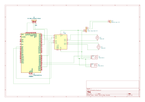

# Mini air defense system
A robotic pan-tilt turret capable of detecting targets and launching projectiles using a flywheel mechanism.

:::info 

**Author**: Condrea Vlad-Stefan \
**GitHub Project Link**: https://github.com/UPB-PMRust-Students/acs-project-2026-Ionidis

:::

## Description

A smart robotic turret made using a STM32 NUCLEO board that acts as the main controller. The system uses a pan-tilt mechanical bracket driven by two MG996R servo motors to aim. An HC-SR04 ultrasonic sensor is mounted on the moving arm to detect the distance to a target. Once the target is within range, the Nucleo board triggers the flywheel launcher, which consists of two high-speed DC motors with rubber wheels that shoot the projectile. 
The entire system is powered by a LiPo battery, using an LM2596 step-down module to safely provide 5V to the servos and sensor.
Added a joystick to the project so now I can manually control the turret and shoot the projectile by pressing the joystick button

## Motivation

I believe that it would be a fun and challenging experience. I find robotics fascinating, and this project perfectly combines mechanical assembly, sensor data acquisition, and motor control using Rust. It acts as a great introduction to tracking systems and automated defense mechanisms.

## Architecture 

The system starts with the HC-SR04 ultrasonic sensor, which constantly sends distance data to the STM32 Nucleo controller. 

The Nucleo board processes the sensor data to determine if a target is present. Based on the logic, it generates PWM signals sent directly to the two MG996R servo motors to adjust the Pan (horizontal) and Tilt (vertical) angles. When the target is locked, the Nucleo sends digital signals to a motor driver, which spins up the two DC motors of the flywheel launcher.

Power management is critical: a 7.4V LiPo battery supplies raw power to the motor driver for the DC motors. In parallel, the battery connects to an LM2596 Step-Down converter, which drops the voltage to a stable 5V to safely power the STM32 board, the HC-SR04 sensor, and the servo motors without frying them.

### Main Architectural Components

#### Target Detection System (Input Data)
* **Role:** Continuously monitors the environment to detect potential targets and measure their exact distance from the turret.
* **Components:** 1x HC-SR04 Ultrasonic Sensor mounted on the moving pan-tilt bracket.
* **Logic:** The STM32 board sends a microsecond trigger pulse to the sensor, which then emits a sound wave. The board measures the duration of the returning echo signal to calculate the distance in real-time, feeding this data to the radar sweep algorithm.

#### The Central Logic Controller (Processing)
* **Role:** Acts as the brain of the system, executing the core algorithms, managing real-time hardware interrupts, and computing ballistic alignment (e.g., Center of Mass calculations and trigonometric offset compensation).
* **Components:** STM32 Nucleo-U545RE-Q Development Board.
* **Logic:** Uses the `embassy` framework for asynchronous programming. It simultaneously handles spatial data acquisition, updates motor states, and coordinates the precise timing sequence for the firing mechanism without blocking the CPU.

#### Pan-Tilt Aiming System (Output)
* **Role:** Responsible for the physical orientation of the turret, allowing it to sweep, track, and lock onto targets across both horizontal (X) and vertical (Y) axes.
* **Components:** 2x MG996R High-Torque Servo Motors attached to a metal Pan-Tilt bracket.
* **Logic:** The microcontroller generates precise PWM (Pulse Width Modulation) signals. By altering the duty cycle, the board commands the servos to perform a radar-like scan, adjusting their angles to center perfectly on the detected object.

#### Flywheel Launcher System (Output)
* **Role:** Engages and accelerates the firing mechanism to launch the projectile at the locked target.
* **Components:** 1x L298N Motor Driver, 2x High-Speed DC Motors, and 2x Rubber Wheels.
* **Logic:** Upon confirming a target lock, the STM32 sends digital control signals to the IN pins of the L298N driver to set the rotation direction (wheels spinning inwards to grip and propel the foam dart). The L298N acts as a heavy-duty switch, delivering the high current required by the DC motors for the firing sequence.

#### Power Management Network
* **Role:** Distributes safe and stable operating voltages to all logic and mechanical components, preventing system resets under high mechanical loads.
* **Components:** 1x 7.4V LiPo Battery (Gens Ace 2S), 1x LM2596 Step-Down Module, and 1x LiPo Battery Tester/Buzzer.
* **Logic:** The power distribution is split into two branches. The raw 7.4V from the LiPo battery is routed directly to the L298N driver to provide maximum torque to the DC motors. In parallel, the LM2596 module steps down the 7.

## Schematics

## Log

### Week 20 - 26 April
Got approval and researched the components. 
Ordered all the components.

### Week 5 - 11 May
Assembled the mechanical pan-tilt bracket. Fixed alignment issues with the tilt servo and bearing. 
Attached the HC-SR04 sensor.
### Week 12 - 18 May
Managed to power up all components by soldering all the wires needed
to the step down module and the DC motors. The hardware is ready 
and can fully function.

### Week 19 - 25 May
Wrote the code that has 2 modes one for am auto mode which tries to detect an object as precise as possible and a manual mode where I have a joystick to guide the turret.
## Hardware

The project uses the Nucleo board as the brain. It receives echo pulses from the HC-SR04 sensor. After processing the distance, it sends PWM signals to the Pan and Tilt MG996R servos. It also controls a motor driver (L298N/L293D) to activate the dual DC motors for the launcher. The LM2596 acts as a power regulator.

### Schematics

### Bill of Materials

| Device | Usage | Price |
|--------|--------|-------|
| [STM32 Nucleo-U545RE-Q](https://www.st.com/) | Main Controller | Lab Provided |
| [Metal Pan-Tilt Bracket](https://sigmanortec.ro/montura-servomotor-suport-2-axe-pt-pentru-mg995-si-mg996r?SubmitCurrency=1&id_currency=2&gad_source=1&gad_campaignid=23069763085&gbraid=0AAAAAC3W72P0RBDTzsoYnW7xbtEHmLu-M&gclid=CjwKCAjwq6DQBhBVEiwA4ZD5XGo8ZEvrJrp7pxcddITfEeIV8q1r4CSNJAeO291vYGJuu1YSFt7F8BoCTZ8QAvD_BwE) | Mechanical structure for the arm | 20 RON |
| [2 x MG996R Servo Motor](https://sigmanortec.ro/servomotor-mg996r-360-grade-13kg) | Aiming (Pan and Tilt axis) | 60 RON | 
| [2 x DC Motor](https://sigmanortec.ro/Motor-DC-3-6V-p125923622) | Flywheel projectile launcher | 8 RON |
| [HC-SR04 Ultrasonic Sensor](https://www.emag.ro/senzor-de-distanta-cu-ultrasunete-elektroweb-hc-sr04-5v-dc-2-m-039/pd/DZYV7MYBM/?cmpid=146635&utm_source=google&utm_medium=cpc&utm_campaign=(RO:eMAG!)_3P_NO_SALES_%3e_Wearables_and_Gadgeturi&utm_content=82562655248&gad_source=1&gad_campaignid=2088939012&gbraid=0AAAAACvmxQgtjE8CIdP3iXDuTDxjEG6bT&gclid=CjwKCAjwq6DQBhBVEiwA4ZD5XIx8CzobJNMeapqsuDmqoS67Yd2IsWanyQbzr70As2FesWLuL1JPYxoCCJwQAvD_BwE) | Target detection and distance measuring | 14.5 RON |
| [LM2596 Step-Down Module](https://sigmanortec.ro/Modul-coborator-tensiune-adjustabil-LM2596-DC-DC-4-5-40V-3A-p134532509?SubmitCurrency=1&id_currency=2&gad_source=1&gad_campaignid=23069763085&gbraid=0AAAAAC3W72P0RBDTzsoYnW7xbtEHmLu-M&gclid=CjwKCAjwq6DQBhBVEiwA4ZD5XKNrrhmSm3R1GB8O9yIKvwqtWC4PvtEcek8ielgc6SKG15oek4I2pxoC-zsQAvD_BwE) | Voltage regulator (Drops LiPo 7.4V to 5V) | 7 RON |
| [L298N Motor Driver Module](https://www.optimusdigital.ro/) | Controls the DC motors for the launcher | 20 RON |
| [Baterie Gens Ace G-Tech](https://www.emag.ro/baterie-gens-ace-g-tech-soaring-1000mah-7-4v-30c-2s1p-xt60-kxg0060208/pd/D5RNQWMBM/?ref=history-shopping_486860698_3410_1) | Main power supply | 60 RON |
| [Rotite cauciuc](https://www.optimusdigital.ro/ro/mecanica-roti/347-roata-de-20-mm-cu-cauciuc-pentru-ax-de-2-mm.html) | Rotite care sa propulseze proiectilul din burete | 10 RON |
| [Fire dupont](https://www.emag.ro/set-10-fire-dupont-mama-tata-30cm-pentru-conexiuni-ai0305/pd/DRCXQ83BM/?ref=history-shopping_486860698_38837_2) | Fire pentru conecta componentele | 15 RON |
| [Tester acumulator](https://sigmanortec.ro/tester-acumulatori-1s-8s-afisaj-si-buzzer?SubmitCurrency=1&id_currency=2&gad_source=1&gad_campaignid=23069763085&gbraid=0AAAAAC3W72P0RBDTzsoYnW7xbtEHmLu-M&gclid=CjwKCAjwq6DQBhBVEiwA4ZD5XKXMtJKafM_lrj4lYL3c8VDChiT9p5kb4vToZBVscQi3ZkjAsjl4LRoCA4cQAvD_BwE) | Un buzzer care ma avertizeaza cand bateria este aproape sa se descarce | 10 RON |
| [Incarcator](https://www.emag.ro/incarcator-de-echilibru-pentru-baterii-de-litiu-2s-3s-7-4v-11-1v-b3-lipo-10w-incarcator-compact-b3ac-nafpro-b3-7-4-11-1v-nafpro/pd/DH6R603BM/) | Pentru reincarcarea bateriei | 75 RON |

## Software

| Library | Description | Usage |
|---------|-------------|-------|
| [embassy-stm32](https://github.com/embassy-rs/embassy) | Hardware Abstraction Layer | Handling GPIOs, EXTI (for sensor echo), and PWM peripherals (for servos) |    
| [embassy-executor](https://github.com/embassy-rs/embassy) | Async task executor | Managing concurrent tasks (sensor reading, aiming, shooting) |
| [embedded-hal](https://github.com/rust-embedded/embedded-hal) | Hardware abstraction traits | Standard interface for interacting with peripherals |
| [defmt](https://github.com/knurling-rs/defmt) | Logging framework | Used for debugging distance readings and states |

## Links

[How a Flywheel Blaster Works](https://www.youtube.com/watch?v=example1)
[STM32 Rust Embassy Tutorial](https://github.com/embassy-rs/embassy)