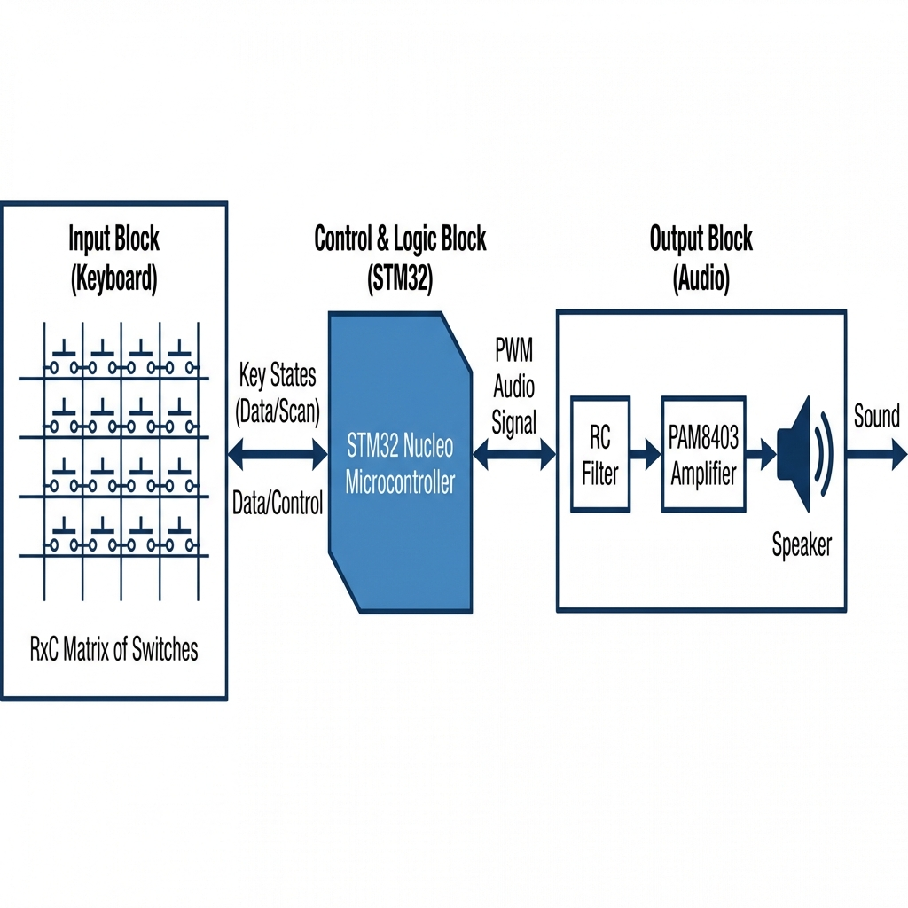
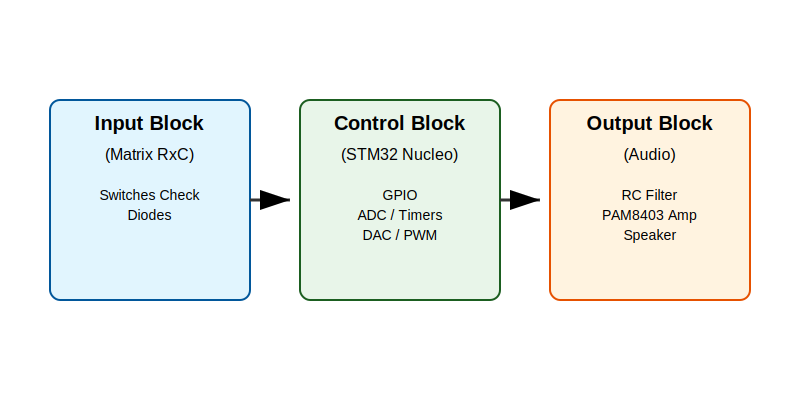
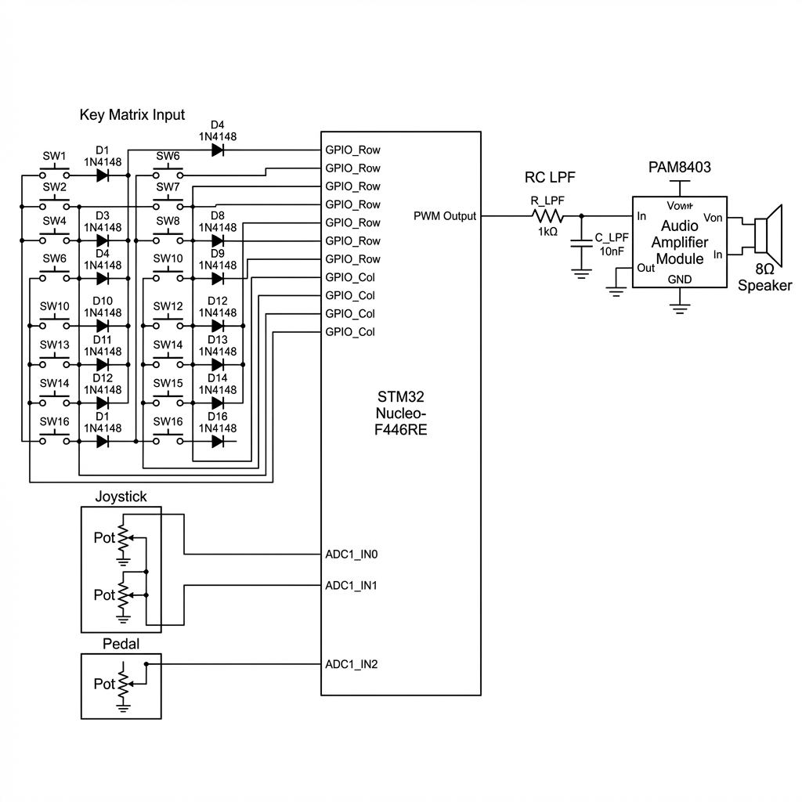

# Polyphonic Keyboard Synthesizer

### Embedded Rust on STM32

**Project Documentation & Implementation Plan**

:::info

**Author**: Delia Udrea \
**GitHub Project Link**: [https://github.com/UPB-PMRust-Students/project-dm-2025-DeliaUdrea](https://github.com/UPB-PMRust-Students/project-dm-2025-DeliaUdrea)

:::

## 1. General Description

This project aims to develop a fully functional digital musical instrument capable of rendering **polyphony** (chords) and responding in **real-time** to user interactions (keys, sustain pedal, pitch bend).

The core of the system is an **STM32 Nucleo** microcontroller, programmed in the **Rust** language (using a Real-Time framework) to guarantee minimal audio latency and high reliability.

### 1.1 Functionality

1.  **Polyphonic Input:** Reading approximately 61 keys (organized in an $R \times C$ matrix) with anti-ghosting protection (diode per switch).
2.  **Audio Synthesis:** Digital generation of sound waves (sine/square) on the microcontroller, utilizing the DAC or PWM peripheral.
3.  **Expressive Control:** Implementation of the *Sustain* function (pedal) and *Pitch Bend* control (joystick).
4.  **Audio Output:** Amplifying the weak digital signal from the MCU to drive an external speaker.

## 2. Motivation

### 2.1 Project Motivation
*   **Technical Challenge:** The project combines electronics (key matrix, audio filtering) with real-time programming, serving as an excellent demonstration of Rust capabilities in the `no_std` (embedded systems) environment.
*   **Experience Quality:** The choice of high-quality mechanical switches (Outemu Linear, 65g) over simple buttons offers a superior feel suitable for a musical instrument.
*   **Practical Application:** Creating a functional digital instrument capable of playing complete songs.

### 2.2 SWOT Analysis

| **Strengths** | **Weaknesses** |
| :--- | :--- |
| **High Performance:** Rust `no_std` ensures minimal latency for real-time audio. | **Complexity:** Manually wiring a 61-key matrix is labor-intensive and error-prone. |
| **Durability:** Mechanical switches provide a robust and long-lasting interface. | **Audio Quality:** PWM synthesis is simpler but lower fidelity than a dedicated DAC chip. |
| **Polyphony:** Capable of playing multiple notes simultaneously (chords). | |

| **Opportunities** | **Threats** |
| :--- | :--- |
| **Scalability:** The design can be expanded to include more effects (reverb, echo). | **Component Availability:** Specific switches or STM32 boards may be out of stock. |
| **Educational:** Deep dive into embedded systems, digital signal processing, and Rust. | **Timing constraints:** Real-time audio requires strict timing; missed deadlines cause glitches. |

---

## 3. System Architecture

### 2.1 Hardware Architecture

The system is divided into three main interconnected blocks:

1.  **Input Block (Keyboard):** The $R \times C$ matrix of switches and diodes.
2.  **Control and Logic Block (STM32):** Processing input and generating the digital audio signal.
3.  **Output Block (Audio):** Filtering, amplification, and playback of the sound via the speaker.

**Logical Interconnection Diagram:**

### 2.2 Software Architecture

The software is built using **Rust** and the **RTIC** (Real-Time Interrupt-driven Concurrency) framework to manage the strict timing requirements of audio synthesis. The architecture binds strictly to the hardware peripherals to ensure zero-latency performance.

#### Concurrency & Priority Model
*   **Audio Task (Priority 2 - Critical):** This is the "heartbeat" of the synthesizer. It is triggered by a hardware timer (e.g., TIM2) at exactly **44.1 kHz**. Its sole responsibility is to calculate the next sample value and write it to the DAC/PWM output. It *preempts* any lower priority tasks to ensure no audio glitches occur.
*   **Logic Task (Priority 1):** Triggered by software (Software Interrupt) whenever a key state changes. It handles the musical logic: converting key indices to MIDI notes, calculating frequencies using lookup tables (LUT), and processing Envelope (ADSR) states.
*   **I/O Task (Priority 0):** A periodic scheduled task (approx. every 5ms). It handles the physical interface (Matrix Scanning and ADC polling).

#### Hardware Binding
The software interacts directly with the STM32F4 peripherals via the `stm32f4xx-hal` crate:

1.  **GPIO (Key Matrix):** The Key Scan algorithm dynamically reconfigures GPIO pins. It drives one **Row pin High** (Logic 1) and reads the **Column pins**. If a Column reads High, the switch at that intersection is closed. It iterates through all rows rapidly to detect multiple key presses.
2.  **DAC / PWM (Audio Output):** The system uses a hardware Timer to enforce the sample rate.
    *   *PWM Mode:* The timer controls the duty cycle of a high-frequency square wave (e.g., >200 kHz) to approximate an analog voltage through the RC filter.
    *   *DAC Mode:* The calculated digital sample (12-bit) is written directly to the DAC Data Holding Register (DHR), which converts it to voltage.
3.  **ADC (Expressive Control):** The Joystick and Pedal are connected to Analog Inputs. The code triggers an ADC conversion sequence and reads the raw 12-bit values (0-4095) to calculate Pitch Bend modulation and Sustain status.

**Software Functional Diagram:**

---

## 4. Hardware Design (Circuit Design)

### 3.1 Critical Components

| Component | Specifications | Role in the Circuit |
| :--- | :--- | :--- |
| **Microcontroller** | STM32 Nucleo (e.g., F401RE) | Processing, Timers, ADC, DAC/PWM. |
| **Switches** | Outemu Linear (3-pin), 65g | Ensures quality tactile input. |
| **Polyphony Diode** | 1N4148 | Prevents "ghosting" in the $R \times C$ matrix. |
| **Amplifier** | PAM8403 Module ($2 \times 3$ W) | Audio amplification from 3.3V to speaker level. |
| **Matrix Wiring** | Set 5 Spools 24 AWG | Stable, soldered wiring for the ~70 internal connections. |

### 3.2 Logical Interconnection Diagram

The hardware blocks connect to the STM32 peripherals as follows:

*   **STM32 Box:** Handles GPIO, DAC/PWM, and ADC pins.
*   **Matrix:** $R$ rows connect to GPIO (Output) and $C$ columns connect to GPIO (Input with Pull-up).
*   **Audio:** Connection runs from the DAC/PWM pin, through the RC filter to the input of the PAM8403 module.

### 3.3 Detailed Electronic Schematic (KiCad)

*   **Key Matrix:** $R \times C$ connection with each diode (1N4148) correctly oriented on each switch.
*   **Audio Filter:** Resistor and capacitor (RC Low-Pass Filter) needed to smooth the PWM signal.

### 3.4 Prototyping and Wiring

*   **Matrix Construction:** Will be built by manually soldering the 24 AWG cable to the output pin of each switch.
*   **Termination:** The approx 20 wires from the matrix will be soldered onto the 20-pin IDC Connector.

---

## 5. Weekly Log (Project Status)

This log tracks the project's progress, from component acquisition to the implementation of key functionalities.

### Week 1: Planning and Hardware Acquisition
| Date | Status | Observations |
| :--- | :--- | :--- |
| **Day 1-2** | Finalized BOM | Final confirmation of components (Outemu, PAM8403, 1N4148). |
| **Day 3-5** | Workspace Setup | Installation of Rust toolchain (`cargo-embed`, `probe-rs`). |
| **Day 6-7** | Hardware Design | Creation of logic schematic and interconnection diagram. |
| **Status:** | **90% Complete** | **Component acquisition is the priority.** |

### Week 2: Basic Tests and Soldering
| Date | Status | Observations |
| :--- | :--- | :--- |
| **Day 8-10** | Matrix Soldering (Ph.1) | Soldering first 20 diodes. Wiring 4x4 test matrix. |
| **Day 11-12** | GPIO/Input Test | Rust code to scan 4x4 matrix and verify anti-ghosting. |
| **Day 13-14** | Audio Output Test | Generating fixed frequency tone using DAC/PWM. |
| **Status:** | **30% Complete** | **Confirmation of basic input/output functionality.** |

### Week 3: Real-Time Implementation and Polyphony
| Date | Status | Observations |
| :--- | :--- | :--- |
| **Day 15-17** | Audio Task | Implementing Audio Task at max priority (constant sample rate). |
| **Day 18-20** | Polyphonic Synthesis | Modifying Audio Task for simultaneous notes/chords. |
| **Day 21** | Final Assembly | Finalizing soldering of all ~61 keys. |
| **Status:** | **70% Complete** | **Basic piano functionality is finalized.** |

---

## 6. Software Design (Code Design)

### 5.1 Detailed Software Architecture

The system relies on a concurrent architecture, likely using **RTIC** or **Embassy** to ensure real-time responsiveness.

| Task | Function | Priority | Description |
| :--- | :--- | :--- | :--- |
| **Audio Gen** | Audio Output | **Max (Critical)** | Runs at ~44 kHz, feeding DAC/PWM. Must not be interrupted. |
| **Key Scan** | Matrix Input | **Medium** | Scans matrix (1-5 ms) to detect key presses. |
| **Control** | Musical Logic | **Medium** | Calculates Hz and Volume, manages Sustain/Pitch Bend. |
| **Idle** | Debugging | **Low** | Sends debugging messages to PC (RTT). |

### 5.2 Shared Data Structure (Safety in Rust)

To prevent *data races*, all data accessed by both the Audio Task and the I/O Task is protected.

*   **Active Notes:** A vector or array (e.g., `Vec<NoteData>`) storing currently active notes.
*   **Protection:** Protected by critical sections (RTIC) or channels (Embassy).

### 5.3 Functional Diagram (Data Flow)

1.  **Physical Input:** Switches, Joystick, Pedal.
2.  **Scan Task:** Matrix is scanned $\rightarrow$ ADC pin is read.
3.  **Key Event:** NoteOn / NoteOff sent to Musical Logic.
4.  **Control Logic:** Determines Freq/Amp, updates shared structure.
5.  **Audio Gen Task:** Reads shared structure, calculates wave value.
6.  **Output:** Digital signal $\rightarrow$ Filter $\rightarrow$ Amp $\rightarrow$ Speaker.

---

## 7. Bill of Materials (BOM)

Estimates based on average market rates (RON).

| No. | Component | Specifications | Qty | Unit (RON) | Total |
| :--- | :--- | :--- | :--- | :--- | :--- |
| **HARDWARE** | | | | | |
| 1. | Microcontroller | [STM32 Nucleo (F401RE)](https://www.st.com) | 1 | 80.00 | 80.00 |
| 2. | Key Switches | [Outemu Linear, 65g](https://example.com) | 70 | 1.80 | 126.00 |
| 3. | Diode Kit | 1N4148 (20 pcs/kit) | 4 | 12.00 | 48.00 |
| 4. | Audio Amplifier | PAM8403 (2 x 3W) | 1 | 25.00 | 25.00 |
| 5. | Speaker | 4 inch, 8 Ohm | 1 | 40.00 | 40.00 |
| 6. | Sustain Button | Momentary Pushbutton | 1 | 10.00 | 10.00 |
| **PROTOTYPING** | | | | | |
| 7. | Protoboard | Breadboard MB102 | 1 | 20.00 | 20.00 |
| 8. | Jumper Wires | Male-Male | 1 set | 15.00 | 15.00 |
| 9. | Matrix Wire | 24 AWG Cable | 1 set | 30.00 | 30.00 |
| 10. | Matrix Conn. | IDC 20 pin | 1 | 10.00 | 10.00 |
| 11. | Speaker Cable | 2 x 0.75 mm^2 | 1 m | 5.00 | 5.00 |
| **TOOLS** | | | | | |
| 12. | Soldering Kit | 60W Iron + Stand | 1 set | 125.00 | 125.00 |
| 13. | Resistor Kit | 600 pcs | 1 set | 45.00 | 45.00 |
| 14. | Capacitor Kit | 500 pcs | 1 set | 50.00 | 50.00 |
| | | **TOTAL ESTIMATED** | | | **~ 619** |

---

## Links

1.  [Embedded-Graphics Documentation](https://github.com/embedded-graphics/embedded-graphics)
2.  [STM32 Nucleo Datasheet](https://www.st.com/en/evaluation-tools/stm32-nucleo-boards.html)
3.  [Rust Embedded Book](https://docs.rust-embedded.org/book/)
4.  [RTIC Documentation](https://rtic.rs/)
