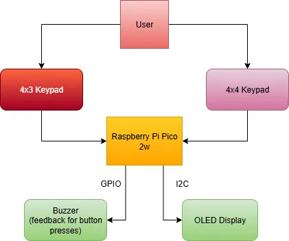
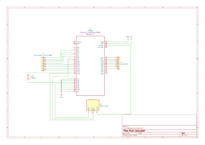

# Rust Calculator
A calculator that take numbers and opperations as inputs and outputs results to a i2c screen

:::info 

**Author**: Scrob Sebastian-Mina \
**GitHub Project Link**: https://github.com/UPB-PMRust-Students/project-Seby-S/tree/main

:::

## Description

This project implements a calculator using a Raspberry Pi Pico 2w microcontroller running rust code.
It supports:

- **Basic arithmetic**: addition, subtraction, multiplication, division  
- **More advanced functions**: exponentiation, square roots, and trigonometric operations  
- **Graphical interface**: an OLED display that shows your input and results
- **Audible feedback**: buzzer beeps confirm key presses

Input comes from 2 seperate keypads:

-a 4x3 matrix keypad used to enter numbers(0-9 keys), a '=' button and a button that retanins the previously calculated answer for ease of us;

-a 4x4 matrix keypad used to enter the signs and operations possible. The keys are for: +,-,*,/,^,radical,sin,cos,tan,cotan,log(base10),!. There is also a backspace button that if held pressed for 1 second it clears the screen, parentheses buttons and a button for decimal points(.);

Output is displayed via the I2C Oled sceen.


## Motivation

I wanted to make something practical for my project and I use calculators all the time in my life. Since I have a calculator it is easy to test and compare how my project should behave. I also like simple user input/output devices.

## Architecture 



### Components

- **Raspberry Pi Pico 2w**: connected to everything and runs code
- **Keypad(4x4)**: connect with 8 GPIO pins
- **Keypad(4x3)**: also connect with 7 GPIO pins
- **OLED display**: connect with GPIO pins and uses I2C (4 pins)
- **Buzzer**: connect with GPIO pins (2 pins)


## Log

<!-- write every week your progress here -->

### Week 5 - 11 May
Parts have arived and got the bords to work.

### Week 12 - 18 May
Schematics and wiring done. Now coding for the dispaly and keypad is in progress.

### Week 19 - 25 May
Finishing the coding part.

## Hardware
- Raspberry Pi Pico 2W (RP2350): Main microcontroller handling system logic and display 
- OLED Display 0.96'' I2C: display for UI and results  
- Keypad(4x3): user input for numbers,clear key and '=' key;  
- Keypad(4x4): user input for operations,backspace,decimal poin, and paranthesis  
- 3V active buzzers: audio feedback for key presses  
- Breadboard & wires for prototyping


### Schematics



### Bill of Materials

<!-- Fill out this table with all the hardware components that you might need.

The format is 
```
| [Device](link://to/device) | This is used ... | [price](link://to/store) |

```

-->

| Device | Usage | Price |
|--------|--------|-------|
| [Raspberry Pi Pico 2W](https://www.raspberrypi.com/documentation/microcontrollers/raspberry-pi-pico.html)  | The microcontroller | [39 RON](https://www.optimusdigital.ro/en/raspberry-pi-boards/13327-raspberry-pi-pico-2-w.html)  |
| [Raspberry Pi Pico 2W](https://www.raspberrypi.com/documentation/microcontrollers/raspberry-pi-pico.html)  | The debug probe | [39 RON](https://www.optimusdigital.ro/en/raspberry-pi-boards/13327-raspberry-pi-pico-2-w.html)  |
| Display OLED 0.96'' I2C alb | output | [16 RON](https://sigmanortec.ro/display-oled-096-i2c-iic-alb) |
| Tastatura matriceala 4x4 | input | [7 RON](https://www.optimusdigital.ro/ro/senzori-senzori-de-atingere/470-tastatura-matriceala-4x4-cu-conector-pin-de-tip-mama.html) |
| Tastatura numerica 4x3 | input | [18 RON](https://sigmanortec.ro/tastatura-numerica-4x3-12-butoane) |
| 2x Buzzer Activ de 3 V | audio feedback | [2 RON](https://www.optimusdigital.ro/ro/audio-buzzere/635-buzzer-activ-de-3-v.html) |
| Breadboard HQ (830) | platform | [10 RON](https://www.optimusdigital.ro/en/breadboards/8-breadboard-hq-830-points.html) |
| Set Fire Tata-Tata | wires | [8 RON](https://www.optimusdigital.ro/ro/fire-fire-mufate/12-set-de-cabluri-pentru-breadboard.html) |
| Fire Colorate Mamă-Tată | wires | [10 RON](https://www.optimusdigital.ro/ro/fire-fire-mufate/878-set-fire-mama-tata-40p-30-cm.html?search_query=fire&results=415) |
|||Total: 149 RON |

## Software

| Library | Description | Usage |
|---------|-------------|-------|
| [embassy-rp](https://docs.embassy.dev/embassy-rp/git/rp2040/index.html) | Peripheral access & async drivers for the RP2040 | Used for GPIO, I2C, timers, and initializing peripherals |
| [embedded-graphics](https://docs.rs/embedded-graphics/latest/embedded_graphics/) | 2D graphics primitives | Used for text and symbols for the OLED screen |
| [embassy-executor](https://docs.embassy.dev/embassy-executor/git/main/index.html) | Async task executor for Embassy | Runs the async tasks |
| [ssd1306](https://docs.rs/ssd1306/latest/ssd1306/) | OLED display driver crate | Provides I2C interface for the OLED display |
| [libm](https://docs.rs/libm/latest/libm/) | Math library for no-std environments | Provides math functions (sin, cos, tan, log, ^, etc.) |
| [heapless](https://docs.rs/heapless/latest/heapless/) | Fixed-capacity, no-std collections | Used for storing the input expression string without heap allocation |
| [defmt](https://defmt.ferrous-systems.com/) | Lightweight logging framework for embedded | Debug/info/error logging |
| [panic-probe](https://docs.rs/panic-probe/latest/panic_probe/) | Panic handler with defmt integration | Reports panic messages |

## Links

<!-- Add a few links that inspired you and that you think you will use for your project -->

1. [Embedded-Graphics Documentation](https://github.com/embedded-graphics/embedded-graphics)  
2. [RP2040 Datasheet](https://datasheets.raspberrypi.com/rp2040/rp2040-datasheet.pdf)  
3. [Rust Embedded Book](https://docs.rust-embedded.org/book/)
4. [Keypad Matrix Tutorial (Theory + Wiring)](https://lastminuteengineers.com/arduino-keypad-tutorial/)
5. [SSD1306 OLED Datasheet](https://cdn-shop.adafruit.com/datasheets/SSD1306.pdf)
6. [libm Crate Documentation](https://docs.rs/libm/latest/libm/)

