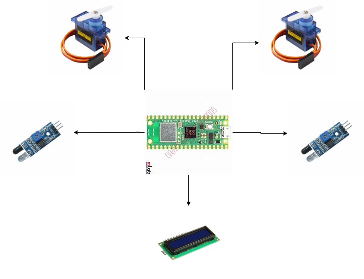
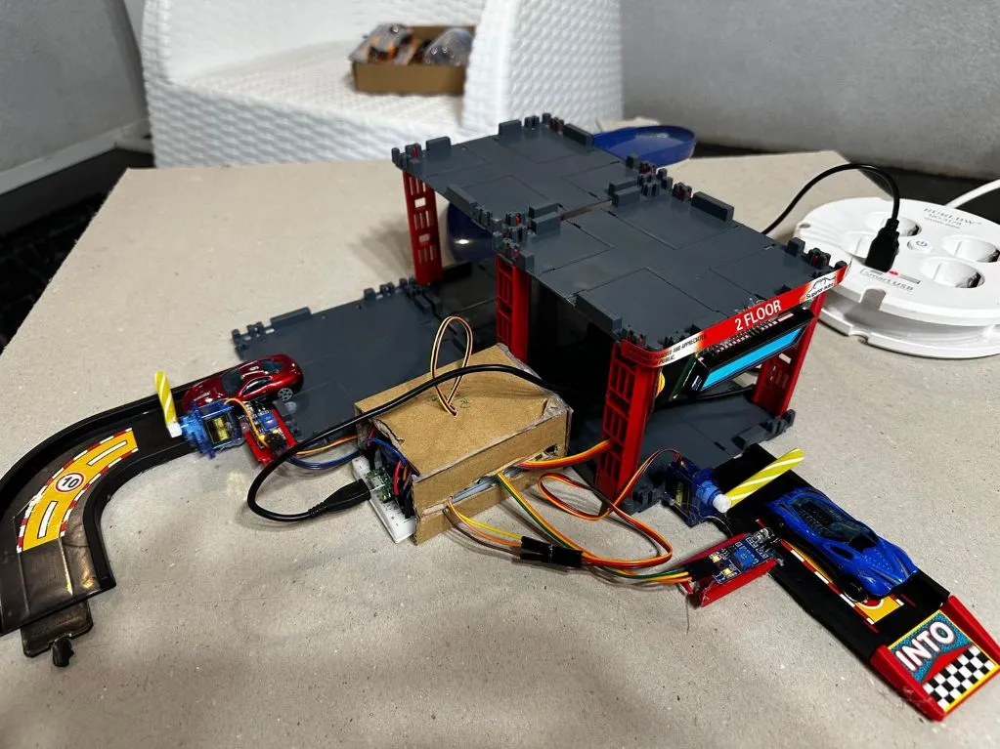
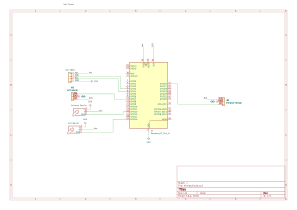

# RustPark
A simple automated parking system that opens gates and tracks spots using sensors and a display.

:::info

**Author**: Alsalman Ahmad Ayman\
**GitHub Project Link**: https://github.com/UPB-PMRust-Students/project-Ahmad-9612

::::

## Description
Rust Park is a small-scale smart parking system built using a Raspberry Pi Pico microcontroller. It uses infrared sensors to detect vehicles at the entrance and exit, automatically controlling two servo motors that raise and lower barrier gates. An OLED screen at the entrance displays the number of available parking spots in real time. The project is powered by Rust and the Embassy async framework, allowing all components to work together efficiently and respond quickly to car movements. It simulates how modern automated parking systems work, but with minimal hardware and code complexity.
## Motivation
I've always had a strong interest in vehicles, especially trucks, and that passion inspired me to create a project related to transportation and logistics. I wanted to design something that reflects a real-world problem in a simplified, functional way. Smart parking systems are a growing part of modern infrastructure, and building one from scratch allowed me to combine my personal interest in vehicles with my curiosity about embedded systems and automation. Rust Park became the perfect opportunity to bring both together into a hands-on, practical solution.
## Architecture
### Schematic Diagram

**Raspberry Pi Pico 2W**
- **Role**: The main controller that runs the logic, handles inputs from sensors, controls outputs like the screen and servo motors, and manages system state.

- **Connections**:
    - I²C: Connected to the LED display (SCL, SDA)
    - GPIOs: Connected to IR sensors (digital input)
    - PWM: Connected to servo motors (output)

**Infrared (IR) Obstacle Sensors (×2)**
- **Role**: Detect vehicles entering or exiting the parking area.

- **Interface**: Digital GPIO

- **Connections**:
    - One sensor is placed at the entry, the other at the exit.
    - Each is connected to a separate GPIO pin configured as input on the Raspberry Pi Pico.
    - The detection signal is used to trigger gate movement and update parking space count.

**Servo Motors (×2 - SG90)**
- **Role**: Act as entry and exit gates by physically lifting or lowering a barrier when a car is detected.

- **Interface**: PWM (Pulse Width Modulation)

- **Connections**:
    - Each motor is connected to a PWM-capable GPIO pin on the Pico.
    - They receive control signals to rotate based on sensor input.
    - One motor handles the entry gate, the other the exit gate.

**LCD 1602 Display**
- **Role**: Displays the number of available parking spots in real time (e.g., “3/4 spots available”), positioned at the entrance for drivers to see.

- **Interface**: I²C (with I²C backpack module attached)

- **Connections**:
    - SCL (Clock) and SDA (Data) pins are connected to the I²C interface of the Raspberry Pi Pico.
    - Updates are triggered by logic changes based on IR sensor input (car entering or exiting).
    - The display communicates over a shared I²C bus and can be addressed by its I²C address.

## Log
### Week 5 - 11 May
- Finalized the wiring and organized the components inside the smart parking structure.

- Completed testing for sensors, servos, and the LCD to ensure they all work together correctly.

- Uploaded and tested the control code on the microcontroller (e.g., entry/exit logic, gate movement).

- Integrated the system with the physical model and performed full functionality tests
### Week 12 - 18 May
- Built the physical structure of the smart parking system.

- Installed and fixed the motors, sensors, and display onto the model.

- Secured all components in their final positions to prepare for wiring and system integration.

- Ensured that the design allows easy access for future wiring and testing.

### Week 19 - 25 May

## Hardware
The hardware setup consists of a Raspberry Pi Pico microcontroller as the central unit, coordinating the system’s logic and peripherals. Two infrared sensors are used to detect vehicles at the entry and exit points, each connected to digital GPIO pins. These sensors trigger servo motors, which physically control the gate barriers and are driven using PWM signals. A 1602 LCD display, connected via the I²C interface, shows the number of available parking spots in real time. All components are mounted on a cardboard structure simulating a miniature parking lot, providing both functional and visual representation of a real-world automated parking system.

### Schematics

### Bill of Materials

| Device | Usage | Price |
|--------|-------|-------|
| [Raspberry Pi Pico 2W](https://www.raspberrypi.com/documentation/microcontrollers/pico-series.html) | The microcontroller | [1 x 39.66 RON](https://www.optimusdigital.ro/en/raspberry-pi-boards/13327-raspberry-pi-pico-2-w.html?srsltid=AfmBOoo5CQdoi14-RbmA_YJJrNUG1hPBzlSKgPdCOYv9U2PgJdK3bPwM) |
| [1602 LCD with I2C Adaptor](https://www.vishay.com/docs/37484/lcd016n002bcfhet.pdf) | Physical User Interface | [1 x 16.34 RON](https://www.optimusdigital.ro/ro/optoelectronice-lcd-uri/2894-lcd-cu-interfata-i2c-si-backlight-albastru.html?search_query=LCD&results=210)  |
|[Micro Servomotor SG90 180°](http://www.ee.ic.ac.uk/pcheung/teaching/DE1_EE/stores/sg90_datasheet.pdf)| The micro servomotor used for the barrier | [2 x 11,99 RON](https://www.optimusdigital.ro/ro/motoare-servomotoare/2261-micro-servo-motor-sg90-180.html?search_query=sg90&results=11)|
| [Infrared Sensor ](https://arduinogetstarted.com/tutorials/arduino-infrared-obstacle-avoidance-sensor) | infrared sensor for vehicle sensing| [2 x 3,49 RON](https://www.optimusdigital.ro/ro/senzori-senzori-optici/4514-senzor-infrarosu-de-obstacole.html?search_query=infrarosu&results=131) |
| 830 Points Breadboard | Connectivity | [1 x 13.99 RON](https://www.bitmi.ro/breadboard-830-puncte-mb-102-10500.html?gad_source=1) |

## Software
                                        
| Library | Description | Usage |
|--------|-------|-------|
| [lcd1602-driver](https://github.com/eZioPan/lcd1602-driver)                              | Driver for LCD1602 display via I²C                     | Used to display the number of available parking spots |
| [embassy-time](https://docs.embassy.dev/embassy-time/git/default/index.html)            | Time management utilities (timers, delays, intervals)  | Used for delays, gate timings, and debouncing         |
| [embassy-rp](https://docs.embassy.dev/embassy-rp/git/rp2040/index.html)                 | HAL for Raspberry Pi Pico                              | Accessing GPIOs, PWM, and I²C interfaces              |
| [embassy-executor](https://docs.embassy.dev/embassy-executor/git/std/index.html)        | Async runtime for embedded systems                     | Running concurrent tasks (sensors, gates, display)    |
| [embassy-sync](https://github.com/embassy-rs/embassy/tree/main/embassy-sync)            | Async-safe synchronization primitives                  | Used for signaling between tasks using `Signal`       |
| [heapless](https://github.com/rust-embedded/heapless)                                    | Data structures without heap allocation                | Used for formatting numbers for LCD display           |

## Links
1. [Car Parking System](https://www.youtube.com/watch?v=8XOsXdNOa4g&ab_channel=svsembedded)