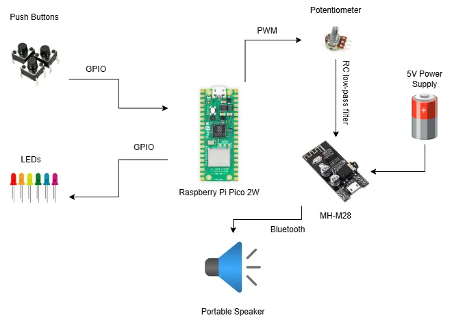
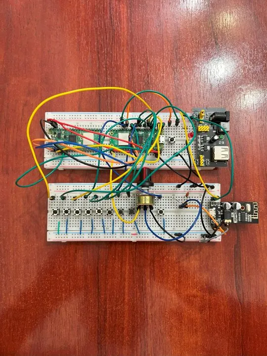
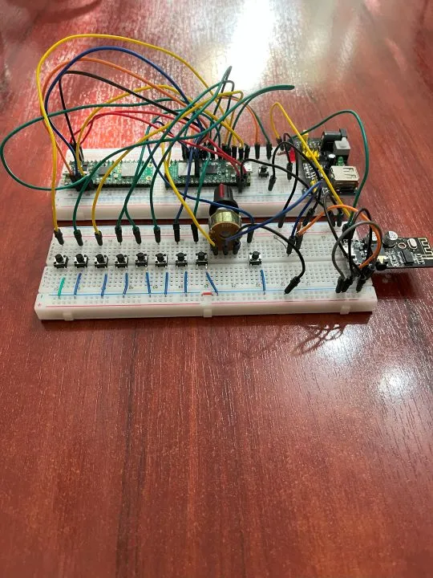
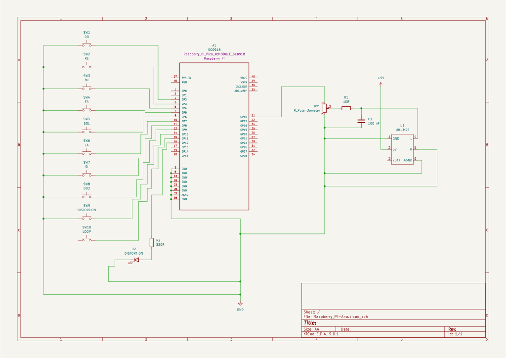

# Raspberry PI-ANO
A compact digital piano with physical keys, wireless audio output via Bluetooth, and interactive sound modes, built on a Raspberry Pi Pico 2W.

:::info 

**Author**: Dragomir Alexandru \
**GitHub Project Link**: https://github.com/UPB-PMRust-Students/project-Alexdr04

:::

## Description

This project is built using a Raspberry Pi Pico 2W, seven push buttons for musical notes, a potentiometer for volume control, and a Bluetooth audio module for wireless sound output. It features a loop mode for recording and repeating note sequences, a distortion toggle for creative audio effects, and status LEDs to indicate the current mode.

## Motivation

I’ve always enjoyed music and wanted to combine that interest with what I’ve learned about embedded systems. This project gives me a fun, hands-on way to explore PWM audio, GPIO input, and Bluetooth output while building something creative and interactive.

## Architecture 



**Controller**:  
  Raspberry Pi Pico 2W — handles all logic, reads button inputs, and generates audio output via PWM.

**Input System**:  
  A set of 7 push buttons for the musical notes and 2 buttons for toggling loop and distortion modes. Connected to the Pico via GPIO.

**Audio Processing Unit**:  
  PWM signal from the Pico is passed through a potentiometer for volume control before reaching the Bluetooth module.

**Output System**:  
  MH-M28 Bluetooth audio module receives the analog signal and transmits it wirelessly to a portable speaker.

**Visual Feedback**:  
  3 LEDs indicate the current playback mode (normal, loop, or distortion). Controlled via GPIO.

**Power Supply**:  
  A 5V external power source powers the MH-M28 module separately from the Pico, ensuring stable Bluetooth audio output.

## Log

<!-- write your progress here every week -->

### Week 5 - 11 May

After my project was approved, I finalized the component list, ordered everything, and began assembling the hardware. I tested the debugger connection with the Raspberry Pi Pico 2W to ensure proper flashing and communication. I also experimented with basic GPIO inputs and outputs to validate button and LED functionality. Additionally, I started drafting the system schematic in KiCad and planned out the initial wiring layout on the breadboard.

### Week 12 - 18 May

This week, I finalized the hardware setup on the breadboard, successfully connecting all components including the buttons, potentiometer, filter, and MH-M28 Bluetooth module. I also began writing the software for handling input, audio output, and mode toggling, and made solid progress toward implementing the core functionality. However, I ran into an issue with the Bluetooth module — it doesn't seem to pair with my portable speaker. I am not entirely sure yet whether the problem is with the module, the speaker, or the way I am using it, but I will investigate further and try different approaches to get it working. If necessary, I will explore replacing the module with one better suited for Bluetooth audio transmission.

### Week 19 - 25 May

## Hardware

The hardware setup centers around a Raspberry Pi Pico 2W, which serves as the main controller. It is connected to eight push buttons used to trigger musical notes and two additional buttons — one to activate a loop mode that records and replays note sequences, and another to toggle a distortion effect. A single LED provides visual feedback indicating whether the system is currently in distortion mode.

To control output volume, a potentiometer is wired between the PWM output and the signal line, which is passed through a low-pass filter to convert it into an analog audio signal. The audio signal from the Pico is smoothed using a passive RC low-pass filter, composed of a 1 kΩ resistor and a 100 nF ceramic capacitor, which attenuates high-frequency components and converts the PWM signal into a usable analog waveform.

This filtered audio signal is then sent into the MH-M28 Bluetooth module via its L channel input. The MH-M28 transmits audio wirelessly to a paired Bluetooth speaker. It is powered by an external 5V source, while the Raspberry Pi Pico and the rest of the components are powered via USB. A common ground line is shared across all parts of the system to maintain electrical reference integrity.

The full circuit is prototyped on a breadboard, allowing for flexible testing and easy hardware iteration during development.





### Schematics



### Bill of Materials

<!-- Fill out this table with all the hardware components that you might need.

The format is 
```
| [Device](link://to/device) | This is used ... | [price](link://to/store) |

```

-->

| Device | Usage | Price |
|--------|--------|-------|
| [Raspberry Pi Pico 2W ×2](https://www.raspberrypi.com/documentation/microcontrollers/raspberry-pi-pico.html) | Microcontroller | [39,66 RON ×2](https://www.optimusdigital.ro/ro/placi-raspberry-pi/13327-raspberry-pi-pico-2-w.html?search_query=raspberry+pi+pico+2w&results=26) |
| [Breadboard 830 points ×2](https://learn.sparkfun.com/tutorials/how-to-use-a-breadboard/all) | Prototyping | [9,98 RON ×2](https://www.optimusdigital.ro/ro/prototipare-breadboard-uri/8-breadboard-830-points.html) |
| [MH-M28 Bluetooth Module](https://sigmanortec.ro/en/bluetooth-42-ble-audio-module-stereo-mh-m28) | Audio output | [13,29 RON](https://www.optimusdigital.ro/ro/wireless-bluetooth/8124-modul-pentru-transmisie-audio-fara-fir-ble-stereo-mh-m28.html?search_query=mh-m28&results=14) |
| [Rotary Potentiometer 10kΩ](https://docs.sunfounder.com/projects/kepler-kit/en/latest/component/component_potentiometer.html#potentiometer) | Volume control | [1,99 RON](https://www.optimusdigital.ro/ro/componente-electronice-potentiometre/1886-potentiometru-stereo-10k.html?search_query=potentiometru&results=172) |
| [Tactile Button 6x6x6 ×9](https://docs.sunfounder.com/projects/kepler-kit/en/latest/component/component_button.html#button) | User input | [0,36 RON ×9](https://www.optimusdigital.ro/ro/butoane-i-comutatoare/1119-buton-6x6x6.html?search_query=butoane+6x6x6&results=1) |
| [Red LED 5mm](https://www.electronics-tutorials.ws/diode/diode_8.html) | Mode indicator | [0,39 RON](https://www.optimusdigital.ro/ro/optoelectronice-led-uri/29-led-set-3-culori-x-10-pcs-fiecare.html?search_query=led+rosu&results=166) |
| [Resistor 220Ω ×3](https://docs.sunfounder.com/projects/kepler-kit/en/latest/component/component_resistor.html) | LED limiter | [0,10 RON ×3](https://www.optimusdigital.ro/ro/componente-electronice-rezistoare/1097-rezistor-025w-220.html?search_query=rezistor+220&results=22) |
| [Male-to-Male Jumper Wires](https://www.circuitbasics.com/how-to-use-breadboard-jumper-wires/) | Connections | [7,98 RON](https://www.optimusdigital.ro/ro/fire-fire-mufate/890-set-fire-tata-tata-40p-30-cm.html?search_query=tata+tata&results=693) |
| [Male-to-Female Jumper Wires](https://www.circuitbasics.com/how-to-use-breadboard-jumper-wires/) | Connections | [3,99 RON](https://www.optimusdigital.ro/ro/toate-produsele/876-set-fire-mama-tata-10p-15-cm.html?search_query=jumper&results=70) |
| [5V Breadboard Power Supply Module](https://howtomechatronics.com/tutorials/electronics/breadboard-power-supply-module/) | Power supply | [4,69 RON](https://www.optimusdigital.ro/ro/electronica-de-putere-stabilizatoare-liniare/61-sursa-de-alimentare-pentru-breadboard.html) |
| [Ceramic Capacitor 100nF](https://www.circuitbasics.com/what-is-a-capacitor/) | Low-pass filter | [0,69 RON](https://www.optimusdigital.ro/ro/componente-electronice-condensatoare/3927-condensator-100-nf50v.html?search_query=condensator+100nF&results=7) |


## Software

| Library | Description | Usage |
|---------|-------------|-------|
| [embassy](https://github.com/embassy-rs/embassy) | Asynchronous framework for embedded development in Rust | Used to handle GPIO events and multitasking |
| [rp2040-hal](https://github.com/rp-rs/rp-hal) | Hardware Abstraction Layer for Raspberry Pi RP2040 microcontrollers | Provides access to GPIO, ADC, PWM, and other peripherals |
| [embedded-hal](https://github.com/rust-embedded/embedded-hal) | Generic traits for embedded hardware abstraction | Interfaces with drivers like LEDs and buttons |
| [defmt](https://github.com/knurling-rs/defmt) | Lightweight logging crate for embedded systems | Debugging and formatted logging |
| [probe-rs](https://github.com/probe-rs/probe-rs) | Debug probe support for Rust-embedded development | Used to flash firmware and debug via the second Pico |
| [heapless](https://github.com/japaric/heapless) | Data structures without dynamic memory allocation | Used for storing note sequences in loop mode |


## Links

<!-- Add a few links that inspired you and that you think you will use for your project -->

1. [inspiration](https://gurgleapps.com/learn/projects/diy-raspberrypi-pico-piano-project)


