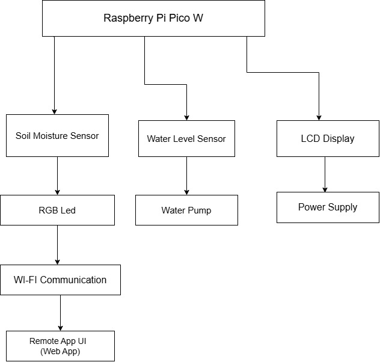
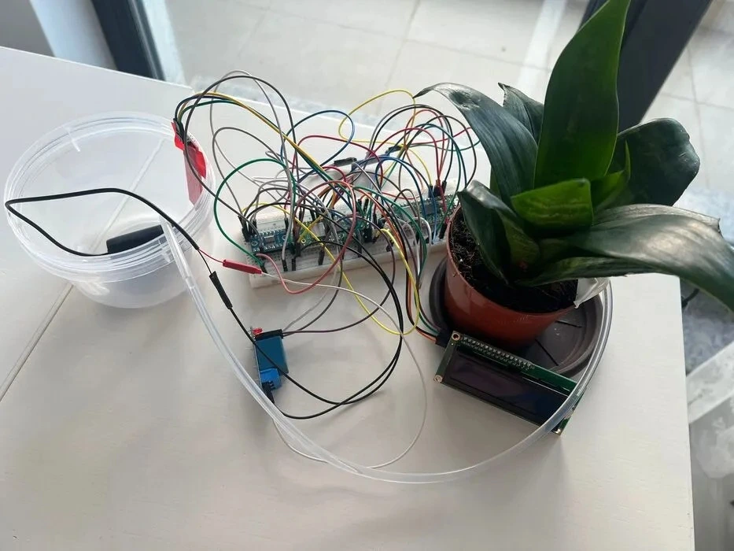
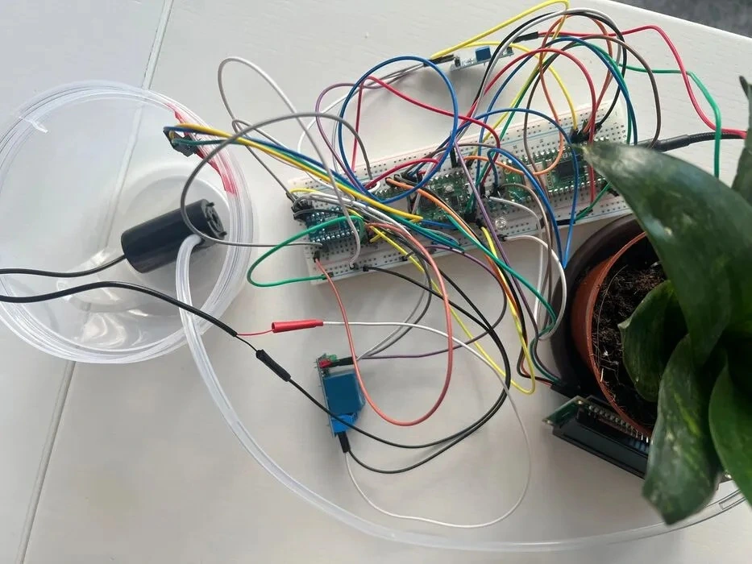
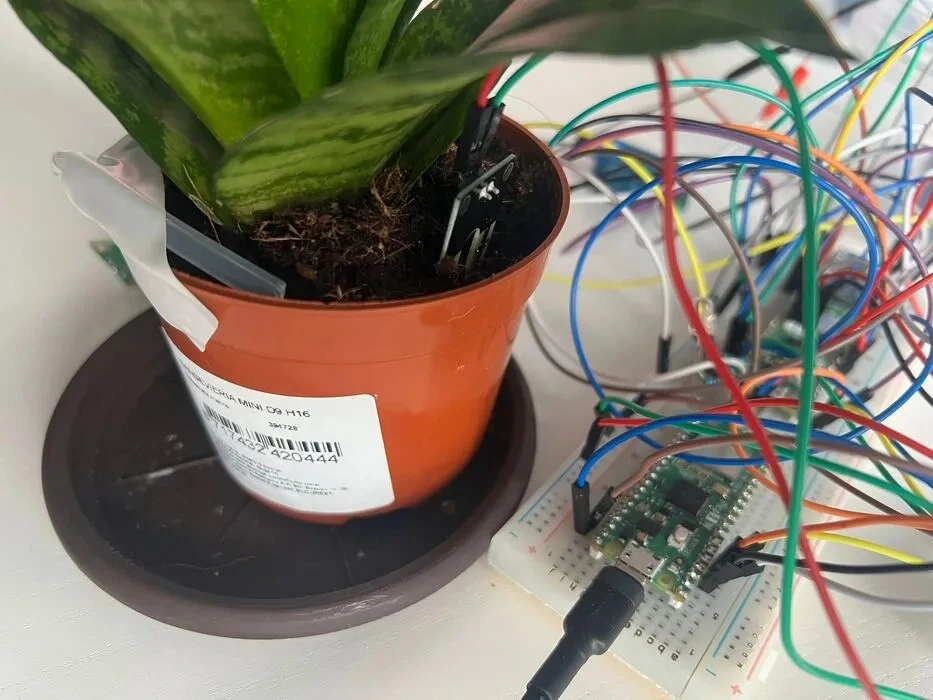

# CactusCare
Smart Cactus Monitoring & Watering System

:::info 

**Author**: Vladuta Aida \
**GitHub Project Link**: https://github.com/UPB-PMRust-Students/project-xwidaa

:::

## Description

CactusCare is a smart monitoring and watering system designed specifically for cactus plants. It uses a soil humidity sensor to detect moisture levels and decides when watering is needed. If the soil remains too dry for a set period, a small water pump activates to deliver just enough water, preventing overwatering. A water level sensor checks if the reservoir is empty, and an LCD display notifies the user only when a refill is needed. An RGB LED indicates the soil's wet or dry status. Additionally, the system connects to a remote mobile or web app over Wi-Fi, allowing users to monitor sensor readings and manually control watering from anywhere.

## Motivation

CactusCare was designed to make cactus care easier and smarter. It monitors soil moisture and waters the plant only when needed, preventing overwatering or neglect. With a water level sensor and simple LCD alerts, users are notified only when the reservoir is empty. This helps save water, keeps the cactus healthy, and reduces the need for constant attention.

## Architecture 

The CactusCare system is designed to automate the monitoring and watering of cactus plants. It utilizes various sensors and actuators connected to a Raspberry Pi Pico W microcontroller and includes Wi-Fi capability to allow remote monitoring and control through an app.



1. **Microcontroller:** Raspberry Pi Pico W
Function: Acts as the central processing unit, reading sensor data and controlling actuators.

    **Connections:**

    **Soil Moisture Sensor:** Reads analog voltage corresponding to soil moisture levels.

    **Water Level Sensor:** Monitors the water reservoir level.

    **RGB LED:** Indicates soil moisture status (e.g., green for moist, red for dry).

    **LCD Display:** Displays messages, such as low water alerts.

    **Water Pump:** Activated when soil is dry and water is available.

    **Wi-Fi Module (built-in):** Connects to a remote app for monitoring and control.

2. **Soil Moisture Sensor**
    **Function:** Measures the moisture content of the soil.

    **Connection:** Analog output connected to an ADC pin on the Pico W.

3. **Water Level Sensor**
    **Function:** Detects the water level in the reservoir to prevent dry pumping.

    **Connection:** Digital or analog output connected to the Pico W.

4. **RGB LED**
    **Function:** Provides a visual indication of soil moisture status.

    **Connection:** Three GPIO pins control the red, green, and blue channels.

5. **LCD Display**
    **Function:** Displays system messages, such as "Water Reservoir Empty."

    **Connection:** Typically connected via I²C interface to the Pico W.
Raspberry Pi Forums

6. **Water Pump**
    **Function:** Irrigates the plant when soil moisture is low.

    **Connection:** Controlled via a relay module connected to a GPIO pin.
element14 Community

7. **Remote App (Web/Mobile)**
    **Function:** Allows users to remotely check soil moisture and water level status, and optionally trigger watering.
    **Connection:** Communicates with the Raspberry Pi Pico W over Wi-Fi (e.g., via HTTP or MQTT).

8. **Power Supply**
    **Function:** Provides necessary voltage and current to the system.

    **Components:** Battery pack or USB power source.

    

## Log

<!-- write your progress here every week -->

### Week 5 - 11 May


I managed to get my hand on all of the necessary components that i have to use for my project.I also soldered my components so that I can use them in my project. I connected my Raspberry Pi Pico 2W and the debugger and tested them using a simple code.

### Week 12 - 18 May


This week, I successfully connected and integrated all the main components of my project. I wired the LCD display, RGB LED, soil moisture sensor, water level sensor, Raspberry Pi Pico 2W. After assembling the full setup, I tested it with a real plant and used an actual water container for the irrigation system. 

### Week 19 - 25 May

## Hardware

This project uses a Raspberry Pi Pico W as the main controller to automate plant watering. A soil humidity sensor monitors the moisture level in the soil, while a water level sensor checks if there is enough water in the reservoir. An RGB LED visually indicates the soil's condition—dry or wet—and an LCD module displays a warning when the reservoir is empty. When the soil is dry and water is available, a small water pump motor is activated to water the plant through connected tubing. All components are connected using a breadboard, jumper wires, and appropriate resistors, and the system is powered by a battery for portability.







### Schematics


### Bill of Materials

<!-- Fill out this table with all the hardware components that you might need.

The format is 
```
| [Device](link://to/device) | This is used ... | [price](link://to/store) |

```

-->

| [Device](link://to/device) | Usage | [Price](link://to/store) |
|-----------------------------|-------|-------------------------|
| [Raspberry Pi Pico W](https://www.optimusdigital.ro/en/raspberry-pi-boards/12394-raspberry-pi-pico-w.html) | The microcontroller | [35 RON](https://www.optimusdigital.ro/en/raspberry-pi-boards/12394-raspberry-pi-pico-w.html) |
| [Soil Moisture Sensor](https://www.robofun.ro/senzori/modul-senzor-umiditate-pentru-arduino-uno-r3.html) | Detects soil moisture levels | [5 RON](https://www.robofun.ro/senzori/modul-senzor-umiditate-pentru-arduino-uno-r3.html) |
| [Water Level Sensor](https://www.robofun.ro/senzori/rain-water-level-detection-sensor-module.html) | Detects water level in the reservoir | [1.5 RON](https://www.robofun.ro/senzori/rain-water-level-detection-sensor-module.html) |
| [RGB LED 5mm](https://www.robofun.ro/componente/led-rgb.html) | Shows dry/wet status with colors | [11 RON](https://www.robofun.ro/componente/led-rgb.html) |
| [LCD Module 16x2 Blue Backlight](https://www.robofun.ro/module/modul-afisaj-led-negru-galben.html) | Displays reservoir empty status | [35 RON](https://www.robofun.ro/module/modul-afisaj-led-negru-galben.html) |
| [Mini Submersible Water Pump](https://sigmanortec.ro/Pompa-apa-submersibila-3-6VDC-verticala-p172447502?SubmitCurrency=1&id_currency=2&gad_source=1&gad_campaignid=22174019478&gbraid=0AAAAAC3W72PlTkN1EMBw47dmMmOIsklJO&gclid=Cj0KCQjwoNzABhDbARIsALfY8VPQJgsP5wRyXyjoVF8LhSOLjNcPm5Z3VBNcR0cp0nAFcrESJ-D-Q00aAvO0EALw_wcB) | Pumps water to the plant | [10 RON](https://sigmanortec.ro/Pompa-apa-submersibila-3-6VDC-verticala-p172447502?SubmitCurrency=1&id_currency=2&gad_source=1&gad_campaignid=22174019478&gbraid=0AAAAAC3W72PlTkN1EMBw47dmMmOIsklJO&gclid=Cj0KCQjwoNzABhDbARIsALfY8VPQJgsP5wRyXyjoVF8LhSOLjNcPm5Z3VBNcR0cp0nAFcrESJ-D-Q00aAvO0EALw_wcB) |
| [Water Tank and Tube Kit](https://www.robofun.ro/mecanice/tub-silicon-pentru-pompa-peristaltica-1-metru.html) | Stores and channels water | [27 RON](https://www.robofun.ro/mecanice/tub-silicon-pentru-pompa-peristaltica-1-metru.html) |
| [Mini Breadboard 400 Holes](https://www.emag.ro/breadboard-placa-test-400-puncte-oky0005/pd/DSBXR1MBM/?gQT=1) | For prototyping and connections | [7 RON](https://www.emag.ro/breadboard-placa-test-400-puncte-oky0005/pd/DSBXR1MBM/?gQT=1) |
| [Jumper Wires M-M 20cm ](https://www.robofun.ro/fire-conexiune-tata-tata-10-bucati-20cm.html?gad_source=1&gad_campaignid=20726321991&gbraid=0AAAAApSyPJXztoCXcRSbOFuSlj9i7Iql4&gclid=Cj0KCQjwoNzABhDbARIsALfY8VNT0OiqJawl2mxPwXJzD0xEF789u0CQtLksJjfnQ4TtoYzTh0tP1SoaAvhPEALw_wcB) | For connecting components | [5 RON](https://www.robofun.ro/fire-conexiune-tata-tata-10-bucati-20cm.html?gad_source=1&gad_campaignid=20726321991&gbraid=0AAAAApSyPJXztoCXcRSbOFuSlj9i7Iql4&gclid=Cj0KCQjwoNzABhDbARIsALfY8VNT0OiqJawl2mxPwXJzD0xEF789u0CQtLksJjfnQ4TtoYzTh0tP1SoaAvhPEALw_wcB) |
| [Resistors](https://www.robofun.ro/componente/rezistor-220k-0-25w-set-10-bucati.html) | Used with sensors and LEDs | [3 RON](https://www.robofun.ro/componente/rezistor-220k-0-25w-set-10-bucati.html) |


## Software

| Library | Description | Usage |
|---------|-------------|-------|
| [st7789](https://github.com/almindor/st7789) | Display driver for ST7789 | Used for the display for the Pico Explorer Base |
| [embedded-graphics](https://github.com/embedded-graphics/embedded-graphics) | 2D graphics library | Used for drawing to the display |
| [embedded-hal](https://github.com/rust-embedded/embedded-hal) | Hardware Abstraction Layer for embedded systems | For interfacing with hardware components like sensors and actuators |
| [embassy-rp](https://github.com/embassy-rs/embassy) | Async framework for RP2040-based microcontrollers | Manages async tasks on the Raspberry Pi Pico W |
| [cortex-m-rt](https://github.com/rust-embedded/cortex-m-rt) | Rust runtime for ARM Cortex-M microcontrollers | Provides startup/runtime support for low-level embedded code |
| [lcd](https://crates.io/crates/lcd) | Library for controlling LCD displays | Used to control the 16x2 LCD module |
| [dc-motor](https://crates.io/crates/dc-motor) or [relay-control](https://crates.io/crates/relay-control) | Control DC motors or relays | Used for driving the water pump motor |
| [esp-wifi](https://github.com/embassy-rs/embassy/tree/main/embassy-net) | Wi-Fi stack for RP2040 and ESP chips | Connects Raspberry Pi Pico W to Wi-Fi network |
| [minimq](https://github.com/quartiq/minimq) | MQTT client library for embedded Rust | Publishes sensor data and subscribes to commands over MQTT |
| [serde_json](https://crates.io/crates/serde_json) | JSON serialization/deserialization | Formats sensor readings into JSON for MQTT messages |

## Links

<!-- Add a few links that inspired you and that you think you will use for your project -->

1. [link](https://www.raspberrypi.com/news/pico-plant-waterer/)
2. [link](https://www.pcbway.com/project/shareproject/Automatic_Plant_Watering_System_using_Raspberry_Pi_Pico.html)

