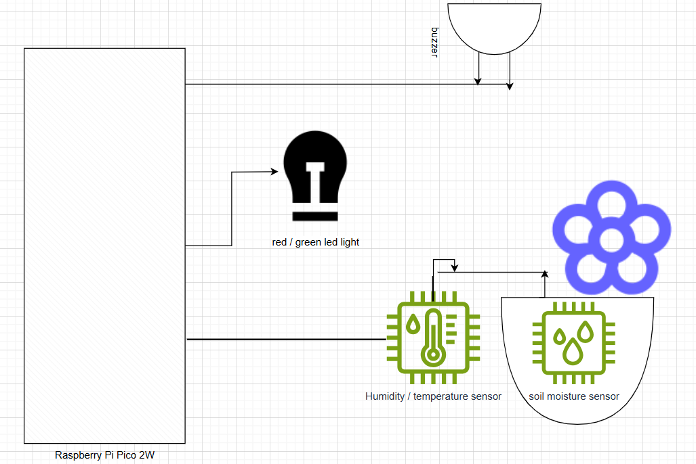
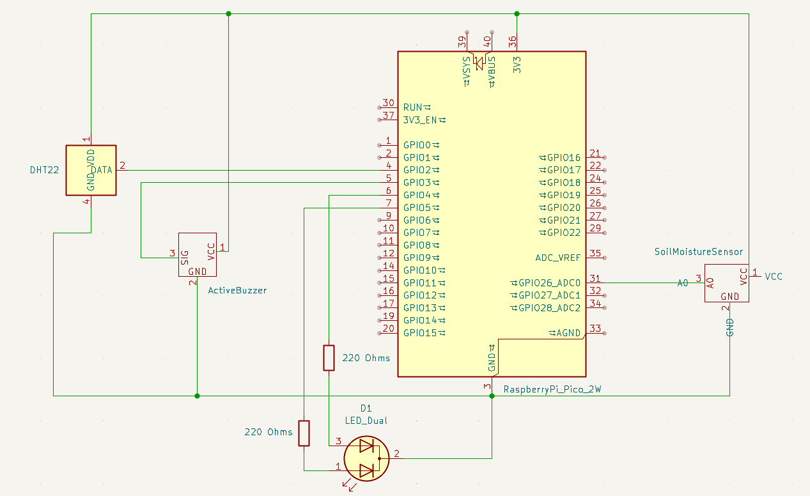

# Home Florist Monitoring System

Plant soil moisture and surrounding's humidity and temperature monitoring system with buzzer alert and bicolor LED display.

---

## Info

**Author:** Aleksandar Petreski    
**Group:** Erasmus    
**GitHub Project Link:** [GitHub Repository](https://github.com/aleksandarce/website/tree/aleksandarce-patch-1/website/versioned_docs/version-fils_en/project/2025/aleksandar.petreski)

---

## Description

This project is a smart plant monitor that continuously reads humidity and temperature data using a DHT22 and soil moisture data using a FC-28 sensor. It displays the status on a bicolor LED, turning red when the sensor readings fall below a set threshold and green otherwise. Additionally, the system activates a buzzer alert.

---

## Motivation

I chose this project to apply embedded Rust programming to a real-world, practical use case. It demonstrates the use of multiple hardware peripherals and introduces IoT-friendly monitoring for plant care, which is a relatable and valuable scenario.

---

## Architecture

The architecture consists of the following main components:
* **Soil Moisture Sensor Module (FC-28):** Measures the soil moisture level using analog output.
* **Air Sensor Module (DHT22):** Measures ambient temperature and humidity.
* **Display Module:** Manages output to the bicolor LED screen (red / green).
* **Alert Module:** Triggers a buzzer when humidity drops below the threshold.
* **Controller Module:** Central logic running on the Raspberry Pi Pico W to coordinate tasks.

### Diagram

---

## Log

**Week 28  April - 4 May:** Defined the project scope and wrote the initial documentation.   
**Week 12 - 18 May:** Ordered the components.   
**Week 19 - 25 May:** Put everything together and started building the software; completed the code and ran system tests.   

---

## Hardware

* Raspberry Pi Pico 2W microcontroller
* FC-28 Soil Moisture Sensor (analog output)  
* DHT22 sensor for humidity and temperature
* Bicolor LED (red/green)
* Active buzzer
* Breadboard and male-to-male jumper wires

---

## Schematics

---

## Bill of Materials

| Device                     | Usage                  | Price    |
| ---------------------------| ---------------------- | -------- |
| [Raspberry Pi Pico 2W](https://www.optimusdigital.ro/en/raspberry-pi-boards/13327-raspberry-pi-pico-2-w.html?search_query=raspberry+pi+pico+2w&results=36)       | The microcontroller    | 40 RON   |
| [FC-28 Soil Moisture Sensor](https://www.optimusdigital.ro/ro/senzori-senzori-de-umiditate/8243-senzor-de-umiditate-a-solului.html?search_query=senzor+umiditate+solului&results=6)  | Soil moisture sensor   | 35 RON   |
| [DHT22 Sensor](https://www.optimusdigital.ro/ro/senzori-senzori-de-temperatura/1449-modul-senzor-de-temperatura-i-umiditate-dht22.html?search_query=dht22&results=6)               | Temp & humidity sensor | 23 RON   |
| [Bicolor LED (3mm, common cathode)](https://www.optimusdigital.ro/ro/optoelectronice-led-uri/704-led-bicolor-de-3-mm-rosu-si-verde-cu-catod-comun.html?search_query=led&results=778)        | Status indicator (red / green)       | 1 RON   |
| [Active Buzzer](https://www.optimusdigital.ro/ro/audio-buzzere/635-buzzer-activ-de-3-v.html?search_query=buzzer&results=62)              | Sound alert            | 1 RON    |
| [Breadboard](https://www.optimusdigital.ro/ro/prototipare-breadboard-uri/13249-breadboard-300-puncte.html?search_query=breadboard&results=126)         | Prototyping            | 3.5 RON   |
| [220Ω Resistors (x2)](https://www.optimusdigital.ro/ro/componente-electronice-rezistoare/10958-rezistor-05w-220.html?search_query=rezistor&results=110)         | Current limiting for LED           | .2 RON   |
| [Male-to-male wires](https://www.optimusdigital.ro/ro/fire-fire-mufate/12-set-de-cabluri-pentru-breadboard.html?search_query=jumper+wire&results=13) | Prototyping | 8 RON |

---

## Software

| Library           | Description            | Usage                        |
| ----------------- | ---------------------- | ---------------------------- |
| embassy-rp        | Pico 2W HAL            | Control GPIO, I2C            |
| dht-sensor        | DHT22 driver           | Read humidity & temperature  |
| embedded-graphics | 2D graphics library    | Render text and graphics     |
| embassy-time      | Async timing functions | Manage delays and scheduling |

---

## Links

* [Embassy Framework](https://embassy.dev)
* [DHT Sensor Rust Crate](https://crates.io/crates/dht-sensor)
