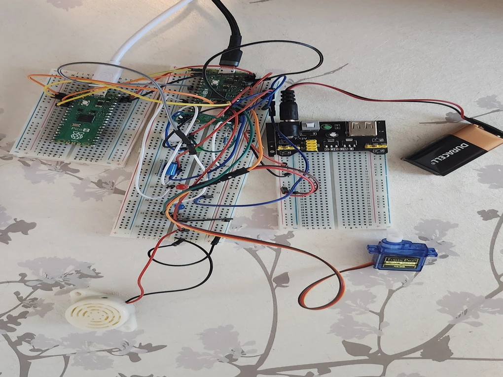

# Real-Time Intrusion detection with Access Management
A compact, offline smart entry system built with Rust for secure, real-time home access control.

:::info 

**Author**: Gugulea Maria-Alexandra \
**GitHub Project Link**: https://github.com/UPB-PMRust-Students/project-alexandra-gugulea

:::

## Description

This project implements a real-time embedded access control system using the Raspberry Pi Pico and the Rust-based embassy asynchronous framework. It integrates motion and vibration sensors, a push-button interface, and a servo motor to detect presence, manage visitor access, and respond to potential intrusions. The firmware runs in a no_std environment and uses cooperative multitasking, interrupt-driven USB communication, and precise timing control to ensure responsive and deterministic behavior.

Complementing the embedded system is a custom-built web interface that allows remote interaction via serial commands. Users can unlock the door, deny access, or trigger an emergency alert directly from the browser. The interface also maintains a timestamped log of all events and actions, providing real-time visibility into system activity. This project demonstrates key microprocessor architecture concepts, including GPIO control, task scheduling, and peripheral abstraction, all while combining embedded hardware with modern web-based control.

## Motivation

Living alone for the first time since starting university made me think differently about home security. I wanted something simple, reliable, and fully under my control, without relying on cloud services or expensive commercial systems. Building this project was my way of creating a solution I could trust, one that responds to real-world events and lets me make decisions remotely through a web interface I designed myself.

It gave me a sense of ownership over my space and helped me feel safer day to day. More than just a technical challenge, it became a personal project rooted in independence, curiosity, and the need to make my environment smarter and more secure on my own terms.

## Architecture 

To bring this system to life, I combined a set of affordable and widely available hardware components, each chosen for its simplicity, reliability, and compatibility with microcontroller-based development. The setup includes two Raspberry Pi Pico boards (one for running the firmware and one for debugging) alongside sensors, actuators, and basic input/output devices. Together, these parts form a responsive and secure access control system that reacts to real-world events and allows remote interaction through a custom web interface. Below is a breakdown of each component and its role in the project: 

### 1. Raspberry Pi Pico 2W (Main Controller)

Dual-core ARM Cortex-M0+ microcontroller with onboard Wi-Fi
Executes the core firmware written in Rust using the embassy async framework
Manages sensor input, servo control, LED/buzzer signaling, and serial communication
Handles task scheduling, event detection, and decision logic in a no_std environment

### 2. Raspberry Pi Pico 2 (Debugger Interface)

Identical MCU without Wi-Fi, used for development and debugging
Provides USB serial access for monitoring system logs and sending commands
Acts as a stable interface for testing and real-time interaction during deployment

### 3. HC-SR505 PIR Motion Sensor

Compact passive infrared sensor with digital output
Detects movement within a short range (~3 meters)
Triggers visitor detection logic and initiates notification routines when motion is sensed

### 4. SW-420 Vibration Sensor Module

Mechanical vibration switch with digital output
Detects physical disturbances such as knocks, impacts, or forced entry attempts
Used to escalate alerts and activate buzzer/LED signaling for intruder detection

### 5. SG90 Servo Motor

180° micro servo with PWM control
Mechanically actuates the locking mechanism by rotating to predefined angles
Controlled via software PWM pulses generated by the firmware for precise positioning 

### 6. Active Buzzer

Sound-emitting device that produces a continuous tone when powered
Used to audibly signal alerts, such as denied access or emergency escalation
Activated during intrusion events or manual override commands

### 7. LED Indicators (Red, Green, Blue)

Visual feedback components connected to GPIO outputs
Green LED: indicates access granted or successful unlock
Red LED: signals alerts, denied access, or intrusion detection
Blue LED: shows system status (armed/disarmed) in real time

### 8. Push Button (Visitor Request Input)

Tactile switch connected to a GPIO input with pull-up configuration
Allows visitors to manually request access, triggering a decision prompt
Debounced and monitored asynchronously to avoid false triggers

### 9. Resistors

Passive components used to limit current and protect GPIO lines
Ensure safe operation of LEDs, sensors, and button inputs
Prevent voltage spikes and reduce power draw across compone

## Log

### Week 1

I  began by exploring the best approach to debugging the project, comparing the Raspberry Pi debugger with using a second Pico board. This week was mostly about planning: defining what I wanted the system to do, how I envisioned it working, and outlining the steps I’d need to take to get there.

### Week 2

I started integrating the hardware components, beginning with the motion sensor. I tested each sensor individually with simple Rust code to confirm functionality before layering them together. As I added more components(vibration sensor, push button, LEDs, buzzer, and servo) the codebase grew more complex, evolving into a responsive system.

### Week 3

This week was focused entirely on the web interface. I explored different communication options: Wi-Fi, Bluetooth, or offline USB, and ultimately chose an offline setup to ensure the system remains secure and functional even without internet access. I then began integrating the interface logic into the Rust firmware.

### Week 4

I continued developing the web interface, working on both the frontend and backend. I also focused on bridging the gap between the website and the embedded system, figuring out how to send commands and receive feedback through serial communication. 

### Week 5

I shifted gears toward documentation and presentation. I wrote detailed explanations of the system, created wiring diagrams, and refined the overall structure of the project to make it clear, accessible, and ready to share.

## Hardware

The hardware design centers around a modular, event-driven architecture that combines sensing, actuation, and user interaction. The system is built to detect motion and vibration, respond to visitor input, and control a locking mechanism, all while providing real-time feedback through LEDs, sound, and a custom web interface. Two microcontrollers are used to separate core logic from debugging, improving reliability and development flexibility. 

### Core Components

Raspberry Pi Pico 2W (Main Controller) Runs the Rust firmware and handles all real-time tasks including sensor polling, servo control, and USB communication. Its dual-core processor and Wi-Fi capability make it ideal for embedded applications, though Wi-Fi is disabled in this project for offline security.

Raspberry Pi Pico 2 (Debugger) Used exclusively for development and debugging. It provides a stable USB serial interface for monitoring logs, sending commands, and testing firmware behavior during runtime.

### Sensors & Inputs

HC-SR505 PIR Motion Sensor Detects infrared radiation from moving objects. Positioned near the entryway to trigger visitor detection logic when someone approaches.

SW-420 Vibration Sensor Detects physical disturbances such as knocks or forced entry. Triggers intruder alerts and activates the buzzer and red LED.

Push Button Allows visitors to manually request access. When pressed, it initiates a decision prompt via the web interface.

### Actuators & Feedback  
SG-90 Servo Motor: Controls the physical locking mechanism. Rotates between locked and unlocked positions based on visitor decisions or serial commands.

Active Buzzer: Emits sound alerts during denied access or intrusion events. Used to draw attention and signal urgency.

LEDs (Red, Green, Blue) Provide visual feedback as follows: Green- Access granted, Red: Alert or denied access, Blue: System armed/disarmed status

### Supporting Components
Resistors: Used to limit current and protect GPIO pins. Essential for safe operation of LEDs, sensors, and the push button.  

### Schematics

### Bill of Materials

| Device | Usage | Price |
|--------|--------|-------|
| [Raspberry Pi Pico 2W](https://www.raspberrypi.com/documentation/microcontrollers/raspberry-pi-pico.html) | The microcontroller that acts central controller for the smart lock system. It receives input from sensors (motion, vibration), processes logic, and controls actuators like the servo and buzzer. | [47 RON](https://ardushop.ro/ro/raspberry-pi/2453-raspberry-pi-pico-2-5056561803951.html?gad_source=1&gad_campaignid=22058879462&gclid=EAIaIQobChMIzOvO_M2qjQMVWgcGAB17YBkyEAQYASABEgKKw_D_BwE) |
| [Raspberry Pi Pico 2]( https://www.raspberrypi.com/documentation/microcontrollers/raspberry-pi-pico.html)| The debugger interface | [45 RON](https://ardushop.ro/ro/raspberry-pi/2453-raspberry-pi-pico-2-5056561803951.html?gad_source=1&gad_campaignid=22058879462&gclid=EAIaIQobChMIzOvO_M2qjQMVWgcGAB17YBkyEAQYASABEgKKw_D_BwE) |
| [HC-SR505 PIR Motion Sensor](https://static.rapidonline.com/pdf/78-4110_v1.pdf) | Detects motion near the door. When someone approaches, it triggers the Pico to prepare for possible unlock logic. | [10 RON](https://ardushop.ro/ro/module/508-modul-mini-senzor-pir-hc-sr505-6427854005922.html?gad_source=1&gad_campaignid=22058879462&gclid=EAIaIQobChMIo7rDwNCqjQMV7QYGAB3XIi1fEAQYBCABEgIyafD_BwE) |
| [SW-420 Vibration Sensor](https://media.digikey.com/pdf/Data%20Sheets/Seeed%20Technology/Grove_Vibration_Sensor_SW-420_Web.pdf) | Detects strong vibrations or knocks on the door | [6 RON](https://www.bitmi.ro/senzor-vibratie-sw-420-11516.html?gad_source=1&gad_campaignid=22005142538&gclid=EAIaIQobChMI4Ie_4uuqjQMVgz4GAB3aFg6TEAQYASABEgKrUPD_BwE) |
| [SG90](http://www.ee.ic.ac.uk/pcheung/teaching/DE1_EE/stores/sg90_datasheet.pdf) | Physically locks or unlocks a latch or bolt by rotating to a defined angle. | [10 RON](https://www.bitmi.ro/servomotor-sg90-180-grade-9g-10496.html?gad_source=1&gad_campaignid=22005721655&gclid=EAIaIQobChMIqISq6eyqjQMVvzsGAB1aXgsNEAQYASABEgIpwPD_BwE) | 
| [LED Indicators](https://cdn.robotshop.com/media/b/blu/rb-blu-131/pdf/subsea-led-indicator-red-datasheet.pdf) | Used to provide visual feedback. | [18 RON/box](https://www.emag.ro/kit-200-buc-led-3mm-5mm-de-diferite-culori-ai707/pd/D4DJYTMBM/?ref=graph_profiled_similar_fallback_1_2&provider=rec&recid=rec_49_c3cf01a5f6d67f883d5335d536a19e5ac00d688d8498e9bc137fdb4a25e0e10f_1757069964&scenario_ID=49)
|

## Software

| Library | Description | Usage |
|---------|-------------|-------|
| [embassy-executor](https://github.com/embassy-rs/embassy) | Async/await task executor for embedded systems. | Enables the #[embassy_executor::main] macro to define the asynchronous main() function and handle concurrency. |
| [embassy-rp](https://docs.embassy.dev/embassy-rp/git/rp2040/index.html) | HAL (Hardware Abstraction Layer) for Raspberry Pi Pico (RP2040) based on Embassy. | gpio: For reading inputs (PIR sensor, vibration sensor, mode button) and controlling outputs (buzzer).pwm: For controlling the servo motor that locks/unlocks the door. i2c: For communicating with the fingerprint sensor via I2C. |
| [embassy-time](https://docs.rs/embassy-time/latest/embassy_time/) | Time management for embedded async applications. | Used for delays and timeouts (Timer::after(...)) to pace logic, like waiting for button holds or simulating sensor communication. |
|[embassy_usb](https://docs.embassy.dev/embassy-usb/git/default/index.html) | USB stack for embedded Rust applications. | Enables CDC-ACM serial communication between the Pico and the web interface. |
| [defmt](https://github.com/knurling-rs/defmt) | Efficient logging framework for embedded Rust. | Used to log debug messages (info!) that help trace events like mode switching, sensor triggers, and fingerprint status |
| [defmt-rtt](https://crates.io/crates/defmt-rtt) | Sends defmt logs over RTT (Real-Time Transfer). | Allows debug logs to be viewed via RTT during development. |
| [panic-probe](https://crates.io/crates/panic-probe) | Panic handler that outputs messages using defmt and terminates cleanly. | Provides helpful panic messages during development in case something crashes. |
| [embedded-hal](https://github.com/rust-embedded/embedded-hal) | Defines common embedded hardware traits like I2C, PWM, etc. | Used as a trait bound in authenticate_fingerprint and enroll_fingerprint to work with I2C generically. |
|[static-cell](https://docs.rs/static_cell/latest/static_cell/) | Static memory allocation for embedded Rust. | Used to initialize USB descriptors and shared state without dynamic allocation. |

## Links

1. [GitHub Repo for Embassy](https://github.com/embassy-rs/embassy)
2. [Crate Registry for Rust](https://crates.io/)
...
