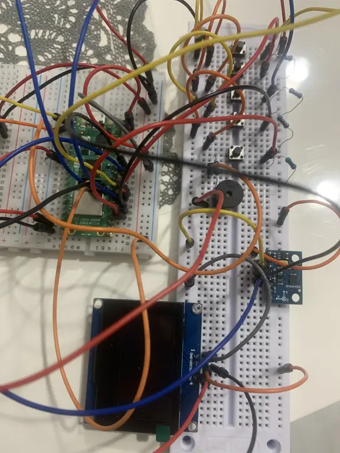
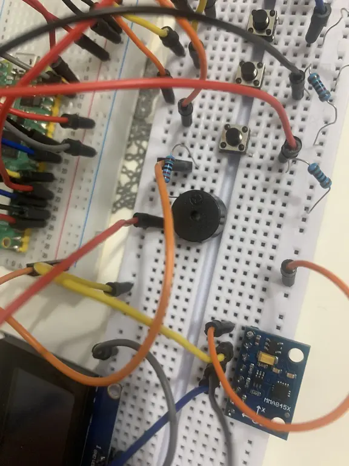
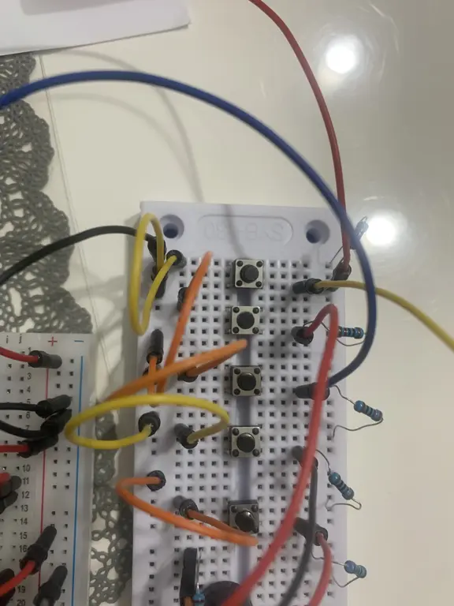
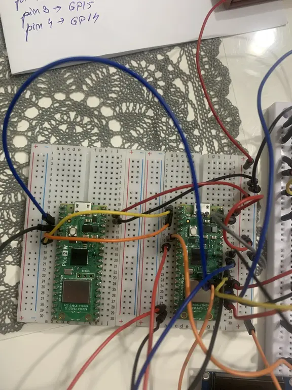
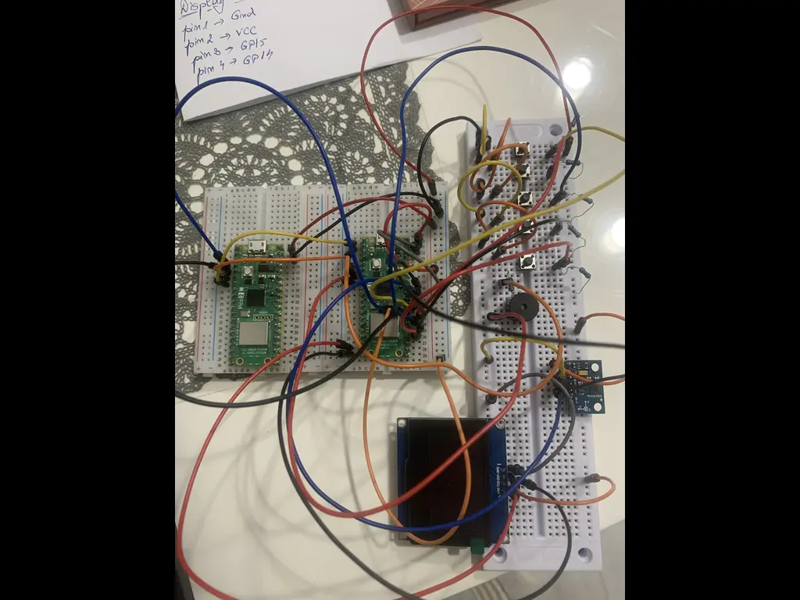
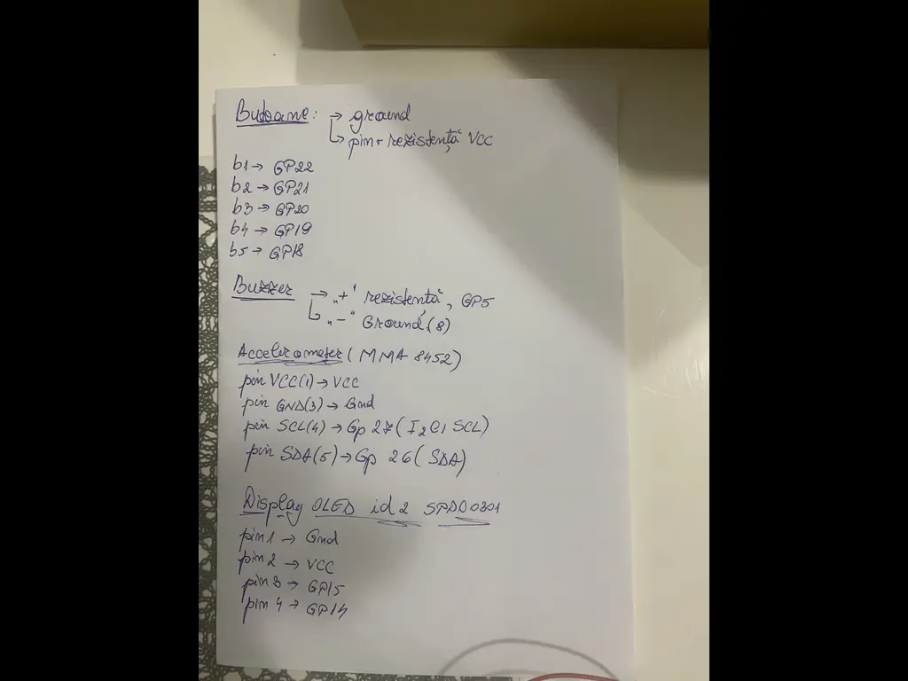

# Labyrinth Game
A Rust-powered maze game on Raspberry Pi Pico W, controlled via buttons, joystick, or tilt sensor.

:::info 

**Author**: Piciu-Dinita Diana-Alexandra \
**GitHub Project Link**: [Link to GitHub](https://github.com/UPB-PMRust-Students/project-alexandrapiciu)

:::

## Description

This project implements an interactive maze game that users can play using physical inputs: buttons, joystick, and an accelerometer. It runs on the Raspberry Pi Pico W and can display the game on an OLED or through a wireless connection on a PC via a web interface. The game involves navigating from a starting point to an endpoint on a grid-based maze, through levels of increasing difficulty.

## Motivation

I wanted to build a project that combines embedded programming, game design and user interaction with physical hardware. This game challenges the player’s spatial navigation and also challenges me to integrate different input methods (buttons, joystick, tilt) and display technologies (OLED and web UI). It’s an interesting and educational way to explore embedded systems with Rust while practicing full-stack thinking.

## Architecture 
Main Components:  
- **Raspberry Pi Pico W**: The microcontroller that reads input, handles game logic, and serves the game display via Wi-Fi.  
- **Input System**: Consists of push buttons (for directional movement) and a tilt sensor such as an accelerometer (for motion-based control).  
- **Game Engine**: A Rust-based module that handles maze logic, player movement, collision detection, level progression, and game state updates.  
- **Level Storage**: Multiple levels stored as 2D matrices directly in code, representing start points, walls, goals, and empty tiles.  
- **Web Display Interface**: A web page hosted by the Pico W using `embassy-net`, displaying a radar-style or grid-based view of the maze game in real-time.  
- **Sound System**: A buzzer connected to a GPIO pin outputs a tone when the player completes a level succesfully.  


Connections:  
- **Buttons** are wired to GPIOs with 10KΩ pull-down resistors.  
- **Accelerometer** connects via I2C 
- **Buzzer** is connected to a PWM-capable GPIO 
- **Wi-Fi communication** is handled entirely by the Pico W and allows a laptop to connect and view the game through a browser

System Workflow:  
1. **Input Capture**: The player moves using buttons or by tilting the board.  
2. **Input Handling**: The system reads these inputs, removes small signal errors, and turns them into movement commands.  
3. **Game Engine Logic**: The game checks if the move is allowed, updates the player’s position, and sees if the goal was reached. It also decides when to change to the next level.  
4. **WebSocket/HTTP Update**: The Pico W sends the new game state over Wi-Fi to the web page.  
5. **Display Rendering**: The web page shows the updated position of the player and other game information.  
6. **Sound Trigger**: When the player reaches the end of the level, the buzzer makes a sound and the next level starts.  

This system is easy to expand, well organized, and fun to use. It uses modern embedded software methods, works over Wi-Fi in real time, and lets the player control the game in different ways.


## Log

<!-- write your progress here every week -->

### Week 5 - 11 May
I connected all the components and made the electronic circuit and tested it. 

### Week 12 - 18 May
I created the KiCad scheme and uploaded the hardware parts.
### Week 19 - 25 May

## Hardware

## Hardware

The project uses the following hardware components:

- **Raspberry Pi Pico W**: Acts as the central microcontroller and provides Wi-Fi for web display. The other one is used for debugging.
- **Breadboard**: Used to build and test the prototype without soldering
- **Tactile Push Buttons (×4)**: Used for controlling player movement in the game
- **Accelerometer (Tilt Sensor)**: Allows the player to control movement by tilting the board
- **Passive Buzzer**: Provides sound feedback when the level is completed
- **Resistors (10kΩ)**: Used with buttons to ensure safe and correct operation
- **Dupont Wires (Male-Male, Female-Female, Female-Male)**: For making all necessary connections between components
- **Micro USB Cable**: Powers the Raspberry Pi Pico W and allows programming
- **Laptop**: Displays the game through a web interface hosted by the Pico W

### Schematics










### Bill of Materials

<!-- Fill out this table with all the hardware components that you might need.

The format is 
```
| [Device](link://to/device) | This is used ... | [price](link://to/store) |

```

-->

## Bill of Materials

| Device | Usage | Price |
|--------|-------|-------|
| [MMA8452 Digital Accelerometer Module](https://www.optimusdigital.ro/en/inertial-sensors/748-modul-accelerometru-digital-mma8452.html) | For measuring tilt and movement | 14,99 lei |
| [3 V or 3.3V Passive Buzzer](https://www.optimusdigital.ro/en/buzzers/12247-3-v-or-33v-passive-buzzer.html) | For sound feedback | 0,99 lei |
| 2x [Raspberry Pi Pico 2W](https://www.optimusdigital.ro/ro/placi-raspberry-pi/13327-raspberry-pi-pico-2-w.html) | The microcontroller for the system | 39,66 lei |
| [400p HQ Breadboard](https://www.optimusdigital.ro/en/breadboards/44-400p-hq-breadboard.html) | For assembling the prototype | 4,56 lei |
| [Afisaj OLED 128x64px 1.54” Albastru](https://www.emag.ro/afisaj-oled-128x64px-1-54-inch-albastru-oled-154-blue/pd/DWKNW6MBM/) | OLED display for showing game graphics and data in higher visibility | [46,46 Lei](https://www.emag.ro/afisaj-oled-128x64px-1-54-inch-albastru-oled-154-blue/pd/DWKNW6MBM/) |


I already had an arduino kit with cables, buttons and resistors.
## Software

| Library | Description | Usage |
|---------|-------------|-------|
| [embassy](https://docs.rs/embassy/latest/embassy/) | Async runtime for embedded systems | Manages tasks and system operations |
| [embassy-hal](https://docs.rs/embassy-hal/latest/embassy_hal/) | Hardware Abstraction Layer | Interfaces with Raspberry Pi Pico W hardware |
| [embassy-executor](https://docs.rs/embassy-executor/latest/embassy_executor/) | Task executor | Handles asynchronous tasks and data processing |
| [embassy-time](https://docs.rs/embassy-time/latest/embassy_time/) | Timing module | Provides timing functions for operations |
| [embassy-net](https://docs.rs/embassy-net/latest/embassy_net/) | Networking library | Manages Wi-Fi communications |
| [embassy-gpio](https://docs.rs/embassy-gpio/latest/embassy_gpio/) | GPIO management | Controls GPIO pins for devices and inputs |
| [embassy-sync](https://docs.rs/embassy-sync/latest/embassy_sync/) | Synchronization primitives | Provides channels, mutexes, and other synchronization tools for concurrent tasks |
| [embassy-usb](https://docs.rs/embassy-usb/latest/embassy_usb/) | USB device management | Manages USB connections and operations |
| [embassy-pwm](https://docs.rs/embassy-pwm/latest/embassy_pwm/) | Pulse Width Modulation (PWM) control | Controls PWM outputs for motor control and LEDs |
| [embassy-pio](https://docs.rs/embassy-pio/latest/embassy_pio/) | Programmable I/O management | Facilitates complex I/O operations programmatically |

## Links

