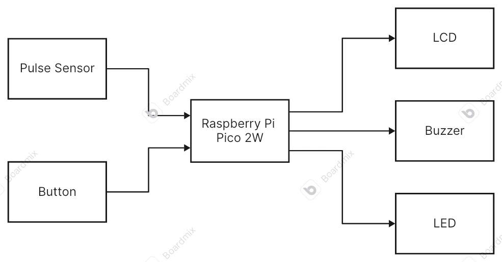
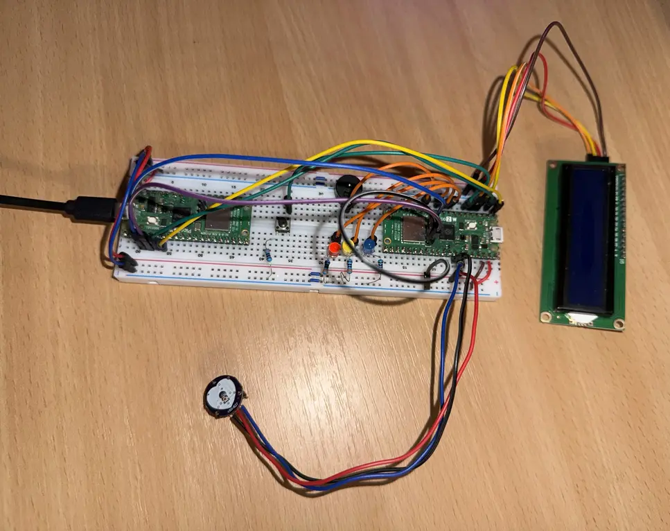

# Breathing Exercises Companion
A device that measures the heart rate and helps you lower it.

:::info 

**Author**: Ivan Alexandru-Vlad \
**GitHub Project Link**: https://github.com/UPB-PMRust-Students/project-Alexandru-Vlad13

:::

## Description

My device is supposed to monitor the heart rate of the user and display it on an LCD screen 
while simultaneously outputting the heartbeats through a buzzer. By pressing a button, the user 
can switch from ‘”monitoring” mode to “breathing exercises” mode. In this mode instructions 
for breathing used to lower the heartbeat will be displayed on the screen while also being 
accompanied by specific pitches from the buzzer. By pressing the button once again the user can end 
the session and put the device on stand-by.

## Motivation

For me personally this device would be a great gadget to have for everyday use. Nowadays a lot of people deal with a lot of stress and don't really have a lot of ways to deal with it. While meditation might not be the right fit for everyone, my device offers a straight-forward approach to dealing with stress. By simply pressing a finger on the sensor you can see your heart rate displayed in real time and with visual and auditory guidance you can perform simple breathing exercises to lower your hear beats. The main feature of this device is that you can see your heart rate decrease in real time and in doing so you can become more aware of your own well-being. 

## Architecture 

The Raspberry Pi Pico 2W is at the core of the device and it manages the input from and button and sensor and gives output to the LCD display, the buzzer and the LED.

The XD-58C Pulse Sensor monitors the heart beats and sends an analog signal. to the Pico.

The push button allows the user to change the modes of functioning of the device.

The LCD Screen is responsible for displaying the information gathered by the sensor and then offering helpful instructions to the user.

The passive buzzer outputs the heartbeats in real time as they are detected.

The LED accompanies the buzzer in lighting up with each heartbeat.
 
 

## Log

### Week 5 - 11 May

I wired the main pico to the one that serves as a debugger. I flashed the debug probe firmware on one of the picos.

### Week 12 - 18 May

I finished putting together all the harware components. I started downloading the necessary crates for the LCD.

### Week 19 - 25 May

## Hardware

A Raspberry Pi Pico 2W that acts as the central control unit; it processes the analog input from the pulse sensor and then performs logic processes and sends the output to the LCD, buzzer and LED.

An XD-58C Pulse Sensor that measures the changes in light absorption and reflection onto the user's fingertip in order to measure blood flow.

A push button- the Pico is waiting for the button to be pressed down in order to switch between modes of functioning.

An I2C LCD that displays the number of heartbeats per minute and instructions for the user.

A passive buzzer that will generate a variety of different pitches of sound.

An LED that will light up with every heartbeat.

A generic electronics kit that contains a breadboard, jumper wires, resistors, capacitors.

### Schematics

### Bill of Materials

| Device | Usage | Price |
|--------|--------|-------|
| [Raspberry Pi Pico 2W](https://www.raspberrypi.com/documentation/microcontrollers/raspberry-pi-pico.html) | The microcontroller | [39.66 RON](https://www.optimusdigital.ro/ro/placi-raspberry-pi/13327-raspberry-pi-pico-2-w.html?gad_source=1&gclid=Cj0KCQjw_dbABhC5ARIsAAh2Z-QlzokQcX6UhFQKItBEDdApxMGKedUtmfErGM3cVL3fFfLKt3wzf9QaAn8uEALw_wcB) |
| [XD-58C Pulse Sensor](https://cdn-shop.adafruit.com/product-files/1093/Pulse+Sensor+Data+Sheet-2018.pdf) | The Sensor | [15.71 RON](https://www.robofun.ro/senzor-puls-si-ritm-cardiac.html?gad_source=1&gbraid=0AAAAApSyPJXNf2Z7R1SlKtsqr0sgSWMRR&gclid=Cj0KCQjw_dbABhC5ARIsAAh2Z-T7DLf15QLhYCjnJrQLtCd5nPkkig8itMaCA7j7dIGIyYryCD1ortwaAtpuEALw_wcB) |
| [I2C LCD](https://www.handsontec.com/dataspecs/module/I2C_1602_LCD.pdf) | The Display | [16.34 RON](https://www.optimusdigital.ro/en/lcds/2894-1602-lcd-with-i2c-interface-and-blue-backlight.html?gad_source=1&gbraid=0AAAAADv-p3DST91rElLA-XfsBRapIVDc8&gclid=Cj0KCQjw_dbABhC5ARIsAAh2Z-QY-g1aLKqwpD5IaWKVncrzNfsgiK_NrWYv9GSs5IdDYBs_gM_zJZ0aAlQhEALw_wcB) |
| [Passive Buzzer](https://components101.com/misc/buzzer-pinout-working-datasheet) | The Buzzer | [0.99 RON](https://www.optimusdigital.ro/en/buzzers/12247-3-v-or-33v-passive-buzzer.html?gad_source=1&gbraid=0AAAAADv-p3DST91rElLA-XfsBRapIVDc8&gclid=Cj0KCQjw_dbABhC5ARIsAAh2Z-Q7eu3c6X7m6BFGhxgkyWS5XuwzUq4zbFTkJLN3f2lT3t0ZoGeE8WcaAgbLEALw_wcB) |
| General Electronics Kit | Breadboard, wires, buttons, LEDs, resistors, etc. | [60.38 RON](https://www.emag.ro/set-componente-electronice-breadboard-830-puncte-led-uri-compatibil-arduino-si-raspberry-pi-zz00044/pd/DRXG4XYBM/?utm_medium=ios&utm_source=mobile%20app&utm_campaign=share%20product) |

## Software

| Library | Description | Usage |
|---------|-------------|-------|
| [rp2350-hal](https://docs.rs/rp235x-hal/latest/rp235x_hal/) | Hardware abstraction layer crate | Used to facilitate embedded development on the RP2350 microcontroller |
| [embedded-hal](https://crates.io/crates/embedded-hal) | Embedded hardware abstraction layer crate | Used for building an ecosystem of platform-agnostic drivers |
| [defmt](https://docs.rs/defmt/latest/defmt/) | Efficient logging framework for microcontrollers | Used for debugging embedded firmware on microcontrollers with limited resources |
| [cortex_m](https://docs.rs/cortex-m/latest/cortex_m/) | Low level access to Cortex-M processors | Used for access to core peripherals like NVIC, SCB and SysTick |

## Links

1. [Connecting pulse sensor to Raspberry Pi ](https://github.com/WorldFamousElectronics/Raspberry_Pi/blob/master/PulseSensor_Processing_Pi/PulseSensor_Processing_Pi.md)
2. [Connecting I2C LCD to the Raspberry Pi Pico](https://www.tomshardware.com/how-to/lcd-display-raspberry-pi-pico)

