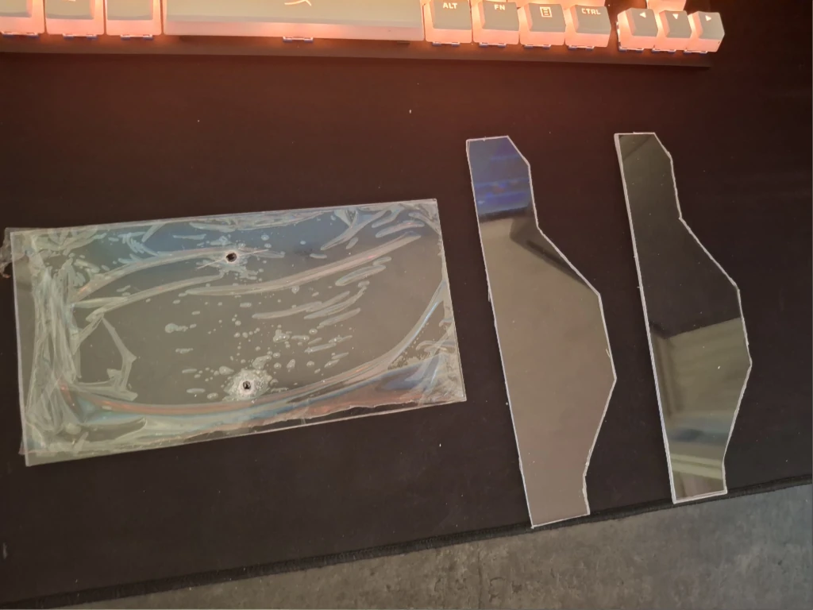
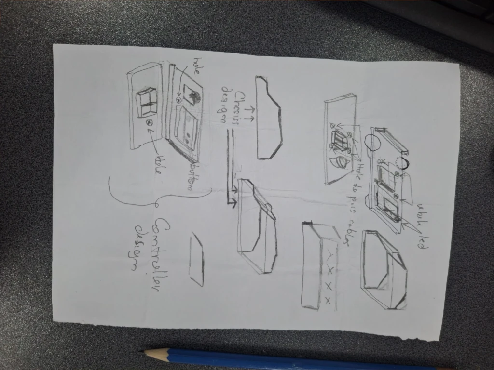
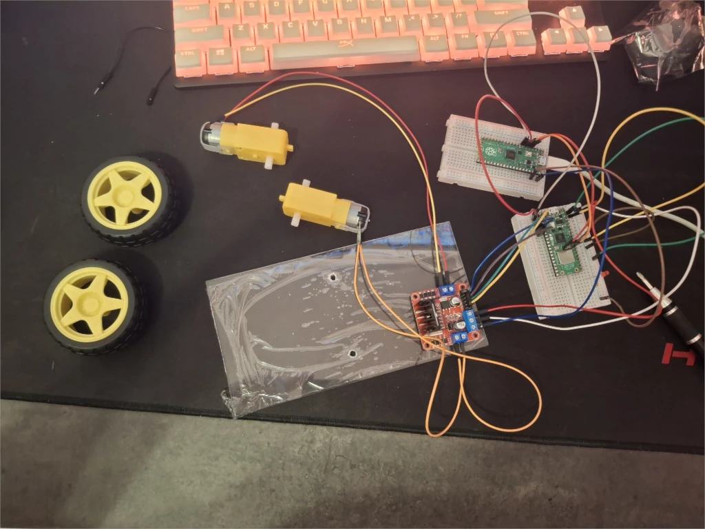
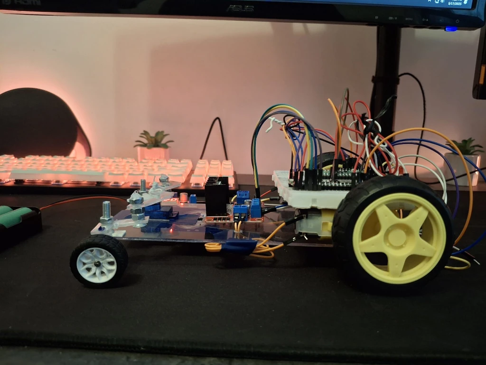
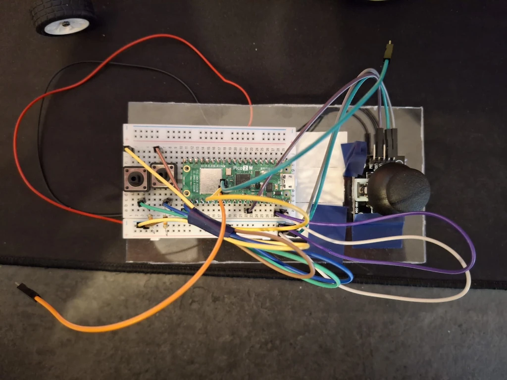
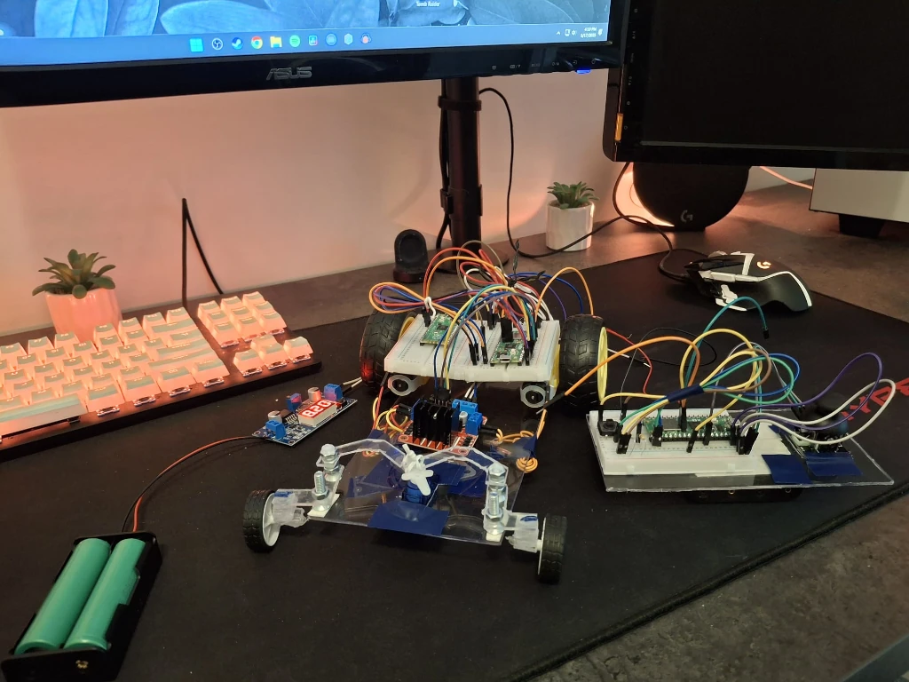
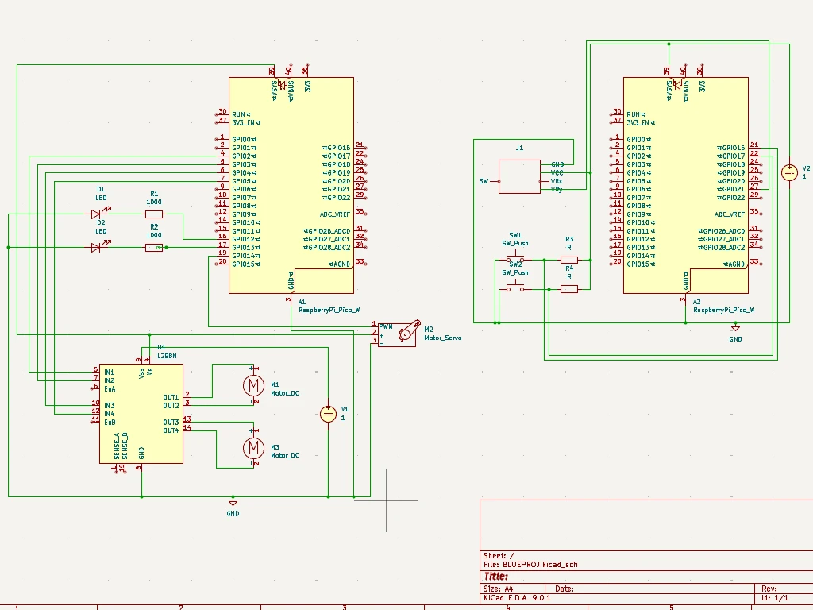

# RC Car with physical controller
A remote controlled car designed to drive around for entertainment using a physical controller.

:::info 

**Author**: Gheorghe Alin-Ioan

**GitHub Project Link**: https://github.com/UPB-PMRust-Students/project-blue-v27

:::

## Description

This car is build using a Raspberry Pi Pico 2W, 2 motors with wheels, a L298N module, and two LEDs. The controller is build using a Raspberry Pi Pico 2W, a joystick and two buttons. The controller sends the input to the car via WIFI, thus dictating the movement of the car.

## Motivation

Growing up I've never had a remote controlled car and so I chose to build one for myself. I aim to make it the car in such a way that it is fun to drive around.

## Architecture 

### Schematic Diagram

The diagram of the project:

**Raspberry Pi Pico 2W**
- **Role**: Controls every component. In the case of the car it controls the motors and the LEDs. In the case of the controller it reads the input from the buttons and the joystick.
- **Connections**: GPIO for LEDs, motors, buttons and ADC joystick.
**DC motors**
- **Interface**: GPIO
- **Role**:  Allow the car to go forward and backwards
- **Connections**: conected to the L298N Module, left Motor: + -> out1, - -> out2; right Motor: + -> out3, - -> out4
**L298N**
- **Interface**: GPIO
- **Role**:  controls the motors
- **Connections**: Vcc -> powerSource, Gnd -> Gnd, 5V -> Vsys, in1 -> GP2, in2 -> GP3, in3 -> GP4, in4 -> GP5,
**Servo motor**
- **Interface**: GPIO
- **Role**:  controls the steering of the car
- **Connections**: Gnd -> Gnd, 5V -> powerSource, Pwm - GP14
**LEDs**
- **Interface**: GPIO
- **Role**: Indicate when the car is breaking.
- **Connections**: GP12 and GP13, each having a 470Ohm resistor connected in series. 
**Joystick**
- **Interface**: ADC
- **Role**:  Controlls the steering of the car
- **Connections**: yAxis -> GP27, VCC -> powerSource, GND -> Gnd.
**Buttons**
- **Interface**: GPIO
- **Role**:  Controlls the acceleration and breaking of the car
- **Connections**: GP16 AND GP17, each having a 10kOhm resistor in series
  
## Log

### Week 5 - 11 May

I started cutting the Acrylic plates and assembling the hardware part of the project.

### Week 12 - 18 May

Completed the hardware of the project making all connections and the cable management. I have also added a ballcaster underneath the plate to support some of the weight pressing onto the small front wheels. For the controller I simply connected everything onto a custom made acrylic frame. I have also designed and cut a custom steering setup for the car.

### Week 19 - 25 May

Completed the code for the car wich gets inputs, and acts acordingly, from the controller via UDP acces point.

## Hardware

I've used two Raspberry Pi Pico 2 W's, a L298N module connected to 2 Dc motors with wheels, 2 LEDs to indicate when you are breaking, a servo motor for steering, a joystick for controlling the steering and 2 buttons for going forward and backwards. The frames for both the car and the controlel, as well as the steering setup, are made out of acrylic.

### Schematics

### Bill of Materials

| Device                                                  | Usage                        | Price                           |
|---------------------------------------------------------|------------------------------|---------------------------------|
| [2x Raspberry Pi Pico 2W](https://www.raspberrypi.com/documentation/microcontrollers/pico-series.html) | The microcontroller | [39.66 RON](https://www.optimusdigital.ro/ro/placi-raspberry-pi/13327-raspberry-pi-pico-2-w.html?search_query=%09Raspberry+Pi+Pico+2W&results=26) |
[L298N driver module](https://components101.com/modules/l293n-motor-driver-module) | Driver module  | [10.99 RON](https://www.optimusdigital.ro/ro/drivere-de-motoare-cu-perii/145-driver-de-motoare-dual-l298n.html?search_query=Modul+cu+Driver+de+Motoare+Dual+L298N+Rosu&results=1) |
[2x Dc Motor](https://www.optimusdigital.ro/ro/motoare-altele/139-motor-cu-reductor-si-roata.html?search_query=Motor+cu+reductor+si+roata&results=18f) | Wheels | [2x 14.99 RON](https://www.optimusdigital.ro/ro/motoare-altele/139-motor-cu-reductor-si-roata.html?search_query=Motor+cu+reductor+si+roata&results=18f) |
[2x Wheels](https://www.optimusdigital.ro/ro/mecanica-roti/347-roata-de-20-mm-cu-cauciuc-pentru-ax-de-2-mm.html?search_query=Roata+de+30+mm+cu+Cauciuc+pentru+Ax+de+2+mm&results=16) | Steering Wheels | [2 x 4.99 RON](https://www.optimusdigital.ro/ro/mecanica-roti/347-roata-de-20-mm-cu-cauciuc-pentru-ax-de-2-mm.html?search_query=Roata+de+30+mm+cu+Cauciuc+pentru+Ax+de+2+mm&results=16) |
[Servo Motor](https://www.optimusdigital.ro/ro/motoare-servomotoare/26-micro-servomotor-sg90.html?search_query=Micro+Servomotor+SG90+90%C2%B0&results=9) | Servo Motor | [13.99 RON](https://www.optimusdigital.ro/ro/motoare-servomotoare/26-micro-servomotor-sg90.html?search_query=Micro+Servomotor+SG90+90%C2%B0&results=9) |
[Joystick](https://www.emag.ro/modul-joystick-robofun-ps2-00002455/pd/DTCSFYYBM/) | Joystick | [6.92 RON](https://www.emag.ro/modul-joystick-robofun-ps2-00002455/pd/DTCSFYYBM/) |
[2x LEDs](https://www.optimusdigital.ro/ro/optoelectronice-led-uri/696-led-rou-de-3-mm-cu-lentile-difuze.html?search_query=LED+Ro%C8%99u+de+3+mm+cu+Lentile+Difuze&results=2) | Break lights | [2x 0.39 RON](https://www.optimusdigital.ro/ro/optoelectronice-led-uri/696-led-rou-de-3-mm-cu-lentile-difuze.html?search_query=LED+Ro%C8%99u+de+3+mm+cu+Lentile+Difuze&results=2) |
[2x 1k Rezistor](https://www.optimusdigital.ro/ro/componente-electronice-rezistoare/859-rezistor-025w-1k.html?search_query=Rezistor+0.25W+1K%CE%A9&results=4) | Series Resistance for the break lights | [2x 0.10 RON](https://www.optimusdigital.ro/ro/componente-electronice-rezistoare/859-rezistor-025w-1k.html?search_query=Rezistor+0.25W+1K%CE%A9&results=4) |
[2 Round Cap Buttons ](https://www.optimusdigital.ro/ro/butoane-i-comutatoare/1114-buton-cu-capac-rotund-rou.html?search_query=%09Buton+cu+Capac+Rotund+Ro%C8%99u&results=1) | Acceleration and breaking buttons | [2x 1.99 RON](https://www.optimusdigital.ro/ro/butoane-i-comutatoare/1114-buton-cu-capac-rotund-rou.html?search_query=%09Buton+cu+Capac+Rotund+Ro%C8%99u&results=1) |
[40 15cm Male-Female wires](https://www.optimusdigital.ro/ro/toate-produsele/877-set-fire-mama-tata-40p-15-cm.html?search_query=Fire+Colorate+Mama-Tata+%2840p%2C+15+cm%29&results=5) | Male-Female Wires | [7.99 RON](https://www.optimusdigital.ro/ro/toate-produsele/877-set-fire-mama-tata-40p-15-cm.html?search_query=Fire+Colorate+Mama-Tata+%2840p%2C+15+cm%29&results=5)
[40 15cm Male-Female Wires](https://www.optimusdigital.ro/ro/fire-fire-mufate/881-set-fire-mama-mama-40p-15-cm.html?search_query=Fire+Colorate+Mama-Mama+%2840p%2C+15+cm%29&results=10) | Male-Male Wires | [6.99 RON](https://www.optimusdigital.ro/ro/fire-fire-mufate/881-set-fire-mama-mama-40p-15-cm.html?search_query=Fire+Colorate+Mama-Mama+%2840p%2C+15+cm%29&results=10)
[40 30cm Male-Male Wires](https://www.optimusdigital.ro/ro/fire-fire-mufate/890-set-fire-tata-tata-40p-30-cm.html?search_query=Fire+Colorate+Tata-Tata+%2840p%2C+30+cm%29&results=10)| Male-Male Wires | [7.98 RON](https://www.optimusdigital.ro/ro/fire-fire-mufate/890-set-fire-tata-tata-40p-30-cm.html?search_query=Fire+Colorate+Tata-Tata+%2840p%2C+30+cm%29&results=10)

## Software

| Library | Description | Usage |
|---------|-------------|-------|
| [embassy-rp](https://github.com/embassy-rs/embassy) | RP2040 peripheral access | Initializes and interacts with Pico W hardware peripherals |
| [embassy-executor](https://github.com/embassy-rs/embassy) | Async runtime | Runs asynchronous tasks like motor control and input reading |
| [embassy-time](https://github.com/embassy-rs/embassy) | Time utilities | Used for delays, scheduling, and task coordination |
| [embassy-net](https://github.com/embassy-rs/embassy) | Networking stack | Manages TCP/IP over Wi-Fi; used for remote control |
| [embassy-lab-utils](https://github.com/embassy-rs/embassy-lab) | Pico W Wi-Fi helpers | Simplifies Wi-Fi and network stack setup |
| [gpio](https://docs.rs/embassy-rp/latest/embassy_rp/gpio/) | GPIO module | Controls motor direction pins (L298N IN1–IN4) |
| [adc](https://docs.rs/embassy-rp/latest/embassy_rp/adc/) | ADC module | Reads analog joystick values for direction/speed input |
| [defmt](https://github.com/knurling-rs/defmt) | Logging framework | For debug messages via RTT/serial |
| [panic-probe](https://docs.rs/panic-probe) | Panic handler | Handles panics with minimal overhead |
| [static_cell](https://docs.rs/static_cell) | Static memory allocation | Safely manages statically allocated Embassy resources |
| [cyw43](https://docs.rs/cyw43/latest/cyw43) | WIFI | Handles the wifi chip on the board |

## Links

1. [Arduino Line Follower](https://www.youtube.com/watch?v=5jh-5HGvC-I&t=181s)
2. [Steering Inspiration](https://www.youtube.com/shorts/jCH9cWKqCqs)
