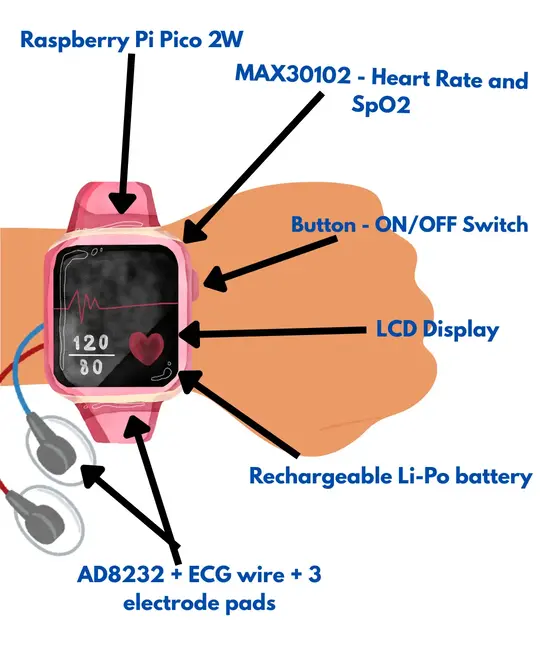

# Wearable Health-Monitoring System
A watch-like device that tracks a person's health.

:::info 

**Author**: Danaila Andreea-Valentina \
**GitHub Project Link**: https://github.com/UPB-PMRust-Students/project-andreeadanaila20

:::

## Description

The project consists on a watch-like device that can be put on a person's wrist that measures and displays key biometric data in real time. Built around a Raspberry Pi Pico 2W board, the system integrates two sensors: MAX30102 for the heart rate and SpO2, and the AD8232 for a basic monitoring of ECG levels. The display presents the measurements directly on the wearable device, eliminating thus the need for an external app. The project is powered by a rechargeable Li-Po battery, and a button is used to turn the system on or off.

## Motivation

My motivation for choosing this project was to create a simple health monitoring system that anyone can use, regardless of their medical expertise. Continuous health tracking is becoming more and more vital for the early detection of issues, while also promoting personal wellness. Today however, most devices that can be bought are either too expensive or rely on external apps. This project aims to create a low-cost and easy to use alternative, thus the use of a button for ON/OFF. 

## Architecture 

### Components 
The architecture is designed of a few layers. Firstly, we have the processing layer, which consists of the Raspberry Pi Pico 2W board. Then, we have the input layer which connects to the two sensors, MAX30102 and AD8232. The output layer connects to the LCD display. The control layer is the button for turning the system on and off. Lastly, the power management layer, which consists of the Li-Po Battery.

### Connections
The heart rate and SpO2 sensor (MAX30102) and the ECG sensor (AD8232) collect the health data and send it to the Pico over I2C.
The Pico takes the data and sends it to the display to show the vitals using I2C.
The button is pressed and the Pico turns the system on or off.

## Log

### Week 8 - 14 April
I researched the suitable components for my device and ordered them. I researched the best way to make the project wearable, looking into PCBs as an option. In the same week, I soldered the pins on my two sensors and on the Raspberry Board.

### Week 9 - 24 April
I made the initial connection between all the components - Raspberry board, MAX30102, AD8232, and the display, on a breadboard. 

### Week 12 - 15 May
I finalised the connections on the breadboard, as well as the box that surrounds the components.

## Hardware

-Raspberry Pi Pico 2W (RP2350): The microcontroller used for handlind system logic, display, and functionality
-LCD ST7735: Display used to show the pulse, SpO2 levels and ECK.
-MAX30102: Sensor for pulse and SpO2 levels
-AD8232 + ECK Wire + 3 electrodes: Sensor used for ECK
-Simple button: ON/OFF 
-LIPO rechargeable battery
-Breadboard and jumper wires

For the project enclosure, I recycled a cupboard box that I painted red.
[!Hardware Picture](hardware.webp)
[!Connections Picture](connections.webp)

### Schematics

[!KICAD Picture](kicad.webp)

### Bill of Materials

<!-- Fill out this table with all the hardware components that you might need.

The format is 
```
| [Device](link://to/device) | This is used ... | [price](link://to/store) |

```

-->

| Device | Usage | Price |
|--------|--------|-------|
| [Raspberry Pi Pico W](https://www.raspberrypi.com/documentation/microcontrollers/raspberry-pi-pico.html) | The microcontroller | [42 RON](https://www.optimusdigital.ro/en/raspberry-pi-boards/12394-raspberry-pi-pico-w.html) |
| [MAX30102](https://www.analog.com/media/en/technical-documentation/data-sheets/max30102.pdf) | Pulse and SpO2 Sensor | [13.99 RON](https://www.bitmi.ro/electronica/modul-senzor-pulsoximetru-max30102-10803.html?2pau=c18a6784a&2ptt=quicklink&2ptu=989f060e9&2pdlst=CjwKCAjw56DBBhAkEiwAaFsG-gOslTXvwF3MwF92Usl5F51eJF0b4_U_0tFbXzkZTmy6vWktrx3rGBoCny4QAvD_BwE&gad_source=1&gad_campaignid=20272504713&gclid=CjwKCAjw56DBBhAkEiwAaFsG-gOslTXvwF3MwF92Usl5F51eJF0b4_U_0tFbXzkZTmy6vWktrx3rGBoCny4QAvD_BwE)|
| [AD8232, ECK cable and electrodes](https://www.analog.com/media/en/technical-documentation/data-sheets/ad8232.pdf) | ECK Sensor | [34.99 RON](https://www.optimusdigital.ro/ro/senzori-altele/1347-modul-senzor-ecg-ad8232.html) |
| [LCD](https://www.displayfuture.com/Display/datasheet/controller/ST7735.pdf) | Display | [35 RON](https://emag.ro/display-tft-lcd-1-8-inch-128x160-spi-st7735s-arduino-emg204/pd) |
| [LiPO battery 3.7V 250mAh](https://en.wikipedia.org/wiki/Lithium_polymer_battery) |Rechargeable battery | [27.90 RON](https://emag.ro/acumulator-li-polymer-250mah-3-7v-502030-237/pd)
| [Breadboards, jumpers, button] | Wiring | Already owned them |

## Software

| Library | Description | Usage |
|---------|-------------|-------|
| embassy-rp | RP2040 peripherals | Used to access GPIO, I2C, SPI, etc. |
| embassy-time | Time library | Used for delays, timeouts, etc. |
| heapless | String & Buffer management | Used for wiring strings to display without dynamic alloc |
| st7735-lcd | Driver for ST7735 SPI display | Used for rendering on the SPI LCD |
| max3010x | MAX30102 sensor driver | Used to read heart rate, SpO2 data |
| embedded-graphics | Drawing text/shapes on display | Paired with st7735-lcd for graphics/text display |

## Links

<!-- Add a few links that inspired you and that you think you will use for your project -->

1. [MAX30102 with arduino](https://www.instructables.com/Guide-to-Using-MAX30102-Heart-Rate-and-Oxygen-Sens/)
2. [AD8232 with arduino](https://how2electronics.com/ecg-monitoring-with-ad8232-ecg-sensor-arduino/)
...
