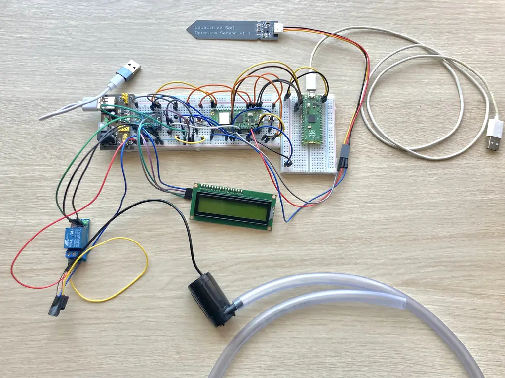
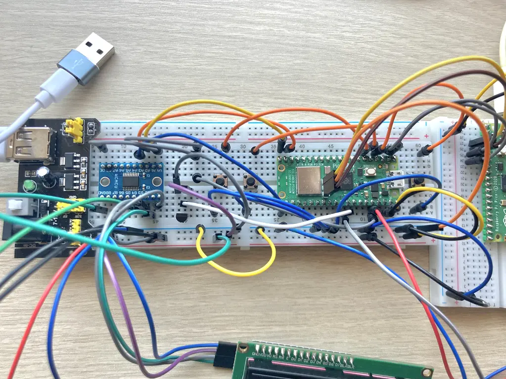
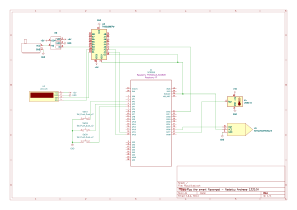

# Ripy the smart flowerpot
a self-watering plant pot with configurable parameters

:::info 

**Author**: Nedelcu Andreea \
**GitHub Project Link**: https://github.com/UPB-PMRust-Students/project-andreea-35

:::

## Description

Ripy is a plant pot add-on that waters your plant regularly! You set a desired humidity level and it adds water accordingly so as to maintain it. The display is where you can view your plant's conditions (current humidity / temperature) or set parameters (desired humidity level / number of times to water the plant per day).

## Motivation

Sometimes you have households where family members are away more often than they are at home. Even those who do spend a lot of time inside might go on vacation or have to be out of town for a couple of days, maybe a week - and not even the least demanding of plants can go unwatered that long! Ripy makes sure any green friend, fussy or not, is maintained happy and hydrated! \
My family has a bunch of plants around the house but some aren't exactly thriving due to us getting busy and forgetting to water them or leaving them unwatered while we're away on vacation. That's what inspired me to take on this project!

## Architecture 

## Log

<!-- write your progress here every week -->

### Week 5 - 11 May
Having had all components arrive and soldered the previous week, it was time to put it all together. To plan everything out more exactly, I started with the KiCAD schematic. Not all of the components had symbols in the base library, so some I got off of Github and others I drew myself. With everything decided, connecting everything went quite smoothly. The relay module did confuse me a bit, but feedback from this week's lab and reading up on it answered all of my questions (seeing the module schematic especially helped). I also set-up the debugger pico within this timeframe and wrote code to test out the capacitive soil moisture sensor and buttons, which worked! I moved onto testing the LCD screen, and while it did light up, I couldn't manage to display anything on it. I'm planning on trying a different driver/library.

### Week 12 - 18 May
Unfortunately, this week hasn't seen as much progress as the previous when it comes to the project itself. I did the move from Gitlab to Github for the documentation, set up my local source code repository and pushed my first code. I had the water pump cables extended with some jumper wires at the lab and insulated them with tape at home. Spent Saturday morning updating the log with everything for the hardware milestone. Sunday I worked on the LCD again and while I did solve one big issue (not finding the correct I2C device address) I still couldn't get it to display anything.

### Week 19 - 25 May
This one was a rollercoaster of emotions. Started off on a high - successfully tested the water pump (I was a bit nervous since it used the relay and lengthened wires) and I finally got the LCD to work! Though only for one line at first. Saturday however, disaster struck - my relay was no longer working. And there was a fishy smell coming from my project. I soon realised when I had changed the relay wires to some longer ones a few days ago I had accidentally swapped IN and VCC. The relay still lit up.. so the culprit was my level shifter. My suspicions were confirmed at EG306: it was busted. But with the professor's advice I adapted the project to make do without it. Crisis averted! Got my LCD to display on both lines, too! The issue was not with the library but with the wiring and the way I was powering it. With all hardware challenges overcome, I could (at last) fully dedicate my time to writing the software. Things went pretty smoothly from there!

## Hardware

The main challenge regarding hardware was having components that operate on 5V, incompatible with the pico's 3.3V output.

**Raspberry Pi Pico W**	- the brains: reads sensor data, controls the relay module (which switches the pump) and updates the LCD;

**Capacitive Soil Moisture Sensor**	- measures the soil’s moisture level through analog output. The Pico reads this to determine if watering is needed;
- **Connections**:
    - **VCC**
    - **GND**
    - **OUT** (Output)

**LM35D Analog Temperature Sensor** - measures ambient temperature through analog output; Values are displayed on the LCD;
- **Connections**:
    - **VCC**
    - **GND**
    - **OUT** (Output)

**5V Relay Module**- acts as a switch for the water pump. Triggered by a GPIO pin from the Pico;
- **Connections**:
    - **VCC**
    - **GND**
    - **IN** (Input / Control Pin) - *used to control the output of the relay*
    - **COM** (Common) - *the common connection for both NO and NC*
    - **NO** (Normally Open) - *the load connection when the relay is ON*
    - **NC** (Normally Closed) - *connects to the COM terminal by default, or when the relay is OFF*

**Water Pump**	- turns on when the relay is triggered to water the plant;

**1602 LCD Display with I2C Adapter** -	shows current humidity, temperature, and user-set parameters. Connects to the Pico via I2C;
- **Interface**: I2C
- **Connections**:
    - **VCC**
    - **GND**
    - **SDA** (Serial Data Line)
    - **SCL** (Serial Clock Line)

**3 × Push Buttons** - provide input for adjusting settings like desired humidity and number of waterings per day. Each button connects to a GPIO pin.

### Pictures

^ *Breadboard wirings post level shifter incident*

### Schematics

*(updated schematic)*

### Bill of Materials

| Device | Usage | Price |
|--------|--------|-------|
| [Raspberry Pi Pico 2W](https://www.raspberrypi.com/documentation/microcontrollers/raspberry-pi-pico.html) | The microcontroller | [39.66 RON](https://www.optimusdigital.ro/en/raspberry-pi-boards/12394-raspberry-pi-pico-w.html) |
| [Breadboard power supply](https://www.handsontec.com/dataspecs/mb102-ps.pdf) | The voltage source | [4.69 RON](https://www.optimusdigital.ro/en/linear-regulators/61-breadboard-source-power.html) |
| [Capacitive Soil Moisture Sensor](https://www.datocms-assets.com/28969/1662716326-hw-101-hw-moisture-sensor-v1-0.pdf) | The soil moisture sensor | [4.77 RON](https://ardushop.ro/ro/senzori/267-senzor-higrometru-capacitiv-6427854002815.html) |
| [LM35D Analog Temperature Sensor (TO-92)](https://www.ti.com/lit/ds/symlink/lm35.pdf) | The temperature sensor | [4.99 RON](https://www.optimusdigital.ro/ro/senzori/1469-senzor-de-temperatura-analogic-lm35d-to-92.html?search_query=0104210000013399&results=1) |
| Water Pump | The water dispenser | [13.49 RON](https://www.emag.ro/pompa-centrifugala-submersibila-mini-pentru-fantani-acvarii-80l-h-5v-6w-negru-e420/pd/DMMKP3YBM/?X-Search-Id=6e9e26f9ed9fbf6f9d84&X-Product-Id=154502367&X-Search-Page=1&X-Search-Position=0&X-Section=search&X-MB=0&X-Search-Action=view) |
| ø 8mm 1m Transparent Tube | Water transportation from the pump to the pot | [2.92 RON](https://www.emag.ro/furtun-bipy-ker-apa-8-mm-1-m-vt8/pd/DN5CQCYBM/?utm_source=cns_confirmation&utm_medium=email&utm_campaign=cns_confirmation_order&utm_content=cns_product_image&ref_id=1785626640) |
| [1 Channel 5V Relay Module](https://handsontec.com/dataspecs/relay/1Ch-relay.pdf)| Water pump activation | [4.99 RON](https://www.optimusdigital.ro/ro/electronica-de-putere-module-cu-releu/13084-modul-releu-cu-un-canal-comandat-cu-5-v.html) |
| [1602 Green LCD Display with I2C adapter](https://www.handsontec.com/dataspecs/module/I2C_1602_LCD.pdf) | Display for our parameters | [26.83 RON](https://ardushop.ro/ro/senzori/267-senzor-higrometru-capacitiv-6427854002815.html) |
| 3x 6 x 6 x 6 Push Buttons | Interaction with the display | [1.08 RON](https://www.optimusdigital.ro/ro/butoane-i-comutatoare/1119-buton-6x6x6.html?search_query=buton&results=213) |
| ~~[TXS0108E 8 Bit Bidirectional Logic Level Converter](https://www.ti.com/lit/ds/symlink/txs0108e.pdf)~~ | Voltage converter to use 5V components with the PICO | [6.49 RON](https://www.optimusdigital.ro/ro/interfata-convertoare-de-niveluri/1380-convertor-de-niveluri-logice-bidirecional-pe-8-bii-txs0108e.html?search_query=0104110000012852&results=1) |

## Software

| Library | Description | Usage |
|---------|-------------|-------|
| [embedded_hal](https://github.com/embassy-rs/embassy) | Hardware abstraction layer for embedded systems | Used for abstracting hardware interactions |
|[gpio](https://docs.embassy.dev/embassy-stm32/git/stm32c011d6/gpio/index.html)|GPIO manipulation |Used for interacting with GPIO pins |
| [defmt](https://github.com/knurling-rs/defmt) | Efficient logging for embedded systems | Enables detailed logging for system diagnostics and debugging during development |
|[embassy-rp](https://docs.embassy.dev/embassy-rp/git/rp2040/index.html)| Peripheral access library |Used for initializing and interacting with peripherals 
|[embassy-time](https://embassy.dev/book/dev/time_keeping.html)| Time management library |Used for time-based operations such as delays |
| [port_expander](https://docs.rs/port-expander/latest/port_expander/) | Abstraction for I2C port-expander | Used for I2C LCD Display |
| [ag-lcd](https://github.com/mjhouse/ag-lcd) | Display Library | Used for I2C LCD Display |
| [heapless](https://docs.rs/heapless/0.8.0/heapless/) | Data structure library | Used for Strings to display on LCD |
| [num_traits](https://docs.rs/num-traits/latest/num_traits/) | Numeric traits for generic mathematics | Used for float values |

## Links

1. [Build A Plant Watering System 🌱🤖 | With a Pi Pico by VEEB Projects](https://www.youtube.com/watch?v=WVijoh-hqkw&list=TLPQMDQwNTIwMjU_mDmZqmpG4g)
2. [DIY Raspberry Pi Arduino Plant Watering System by Caroline Dunn](https://youtu.be/DOaDnYj3vfI?si=0LPCuMySoOpkZZ3T)
3. [How to create IOT Plant Watering System Using Raspberry Pi Pico W](https://kitflix.com/how-to-create-iot-plant-watering-system-using-raspberry-pi-pico-w/)
4. [Pico Pico - Embedded Programming with Rust](https://pico.implrust.com/index.html)
5. [Connect I2C 1602 LCD to Raspberry Pico](https://javed0863.medium.com/connect-i2c-1602-lcd-to-raspberry-pi-pico-rp2040-d52bc96d551f)
6. [Breadboard Power Supply module - How to use it?](https://www.youtube.com/watch?v=u_cJCtaEmyA&t=87s)
7. [Sunfounder: 5V Relay module](https://docs.sunfounder.com/projects/ultimate-sensor-kit/en/latest/components_basic/25-component_relay.html)
8. [Circuit digest:  Understanding How a Single Channel Relay Module Works](https://circuitdigest.com/microcontroller-projects/interface-single-channel-relay-module-with-arduino)
9. [Last Minute Engineers: Interface One Channel Relay Module with Arduino](https://lastminuteengineers.com/one-channel-relay-module-arduino-tutorial/)