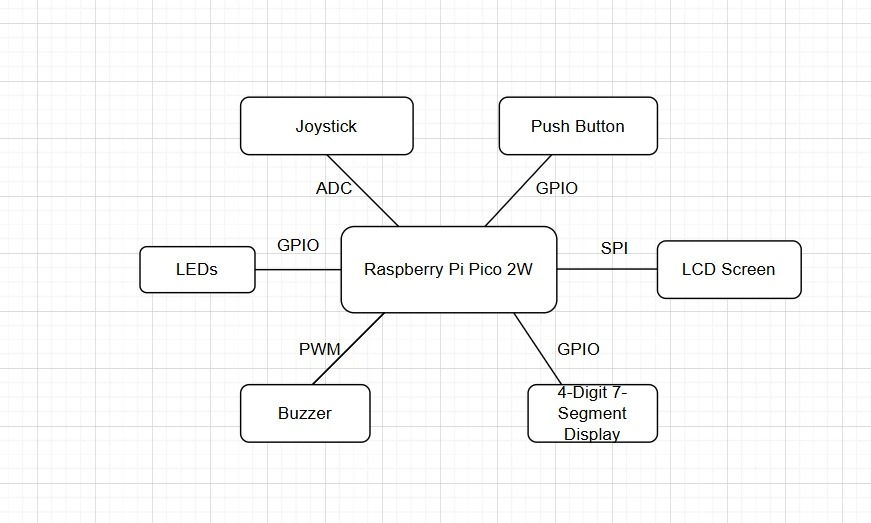
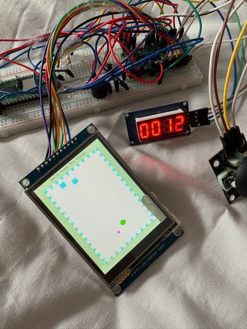
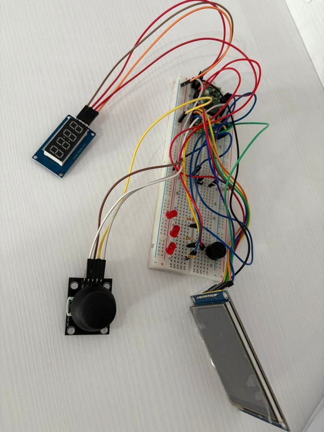

# Don't Touch The Spikes

Don't Touch The Spikes game based on a raspberry pi pico 2W

:::info 

**Author**: Andreea Simion \
**GitHub Project Link**: https://github.com/UPB-PMRust-Students/project-elizasimion-2004

:::

## Description

In this project, I want to recreate the game Don’t touch the spikes on a Raspberry Pi, using an LCD display which will work using Embedded-graphics. The player controls a bird using a joystick, while a separate button is used to restart the game after it ends. The bird moves within four walls with spikes and must collect randomly appearing food to increase the score, which is shown on a 4-digit 7-segment display. As the player progresses, the difficulty increases: at a score of 5, an enemy character appears that the bird must avoid; at 10 points, a second enemy is introduced; and at 15 points, three LEDs light up. Buzzers are used to provide sound effects when the player scores or loses. The game ends when the bird touches a spike or an enemy character.

## Motivation

When I was a child, Don’t touch the spikes was one of my favorite games. I remember spending hours playing it with my cousin, always competing to beat each other's high scores. I was fascinated by how such a simple game could be so fun and addictive, and I wondered how it was made. Now, as a university student, I’m excited to finally have the opportunity to learn the skills needed. This project allows me to apply the technical skills I’ve gained while also reconnecting with a childhood memory.

## Architecture

•  Raspberry Pi Pico 2W

Acts as the main microcontroller that runs the game logic, handles input from components, drives the display, and controls game events like scoring and game over.

•  LCD Screen 

– SPI -  Raspberry Pi Pico 2W

Displays the game's graphics using the Embedded-graphics library.

•  Joystick 

– ADC - Raspberry Pi Pico 2W

Serves as the player's input device to control the movement of the bird within the game area.

•  4-Digit 7-Segment Display

– GPIO - Raspberry Pi Pico 2W

Shows the player's current score in real-time as they collect food during the game.

•  Buzzer

– PWM - Raspberry Pi Pico 2W 

Provides sound effects for scoring or losing

•  Breadboard

Used to connect all the electronic components

•  Push Button

 – GPIO - Raspberry Pi Pico 2W
 
reset button 

•  Wires

Used to connect all components to the Raspberry Pi Pico

•  LEDs

– GPIO - Raspberry Pi Pico 2W

Light up when the player reaches certain scores

## Log

- *Week 5 - 11 May*: Planned the architecture of the project, bought all the required components and created the documentation of the project.
- *Week 12 - 18 May*: This week, I received all the hardware components, created the KiCad schematic, and started wiring the components on the breadboard.
- *Week 19 - 25 May*: During this week I focused on writing the software part and finished the project. 

## Hardware

The Raspberry Pi Pico 2W serves as the main microcontroller, running the game logic, handling input from various components, driving the display, and controlling game events such as scoring and game over. The game’s graphics are displayed on an ILI9341 LCD screen connected via SPI, utilizing the Embedded-graphics library. Player input is managed through a joystick connected via the ADC, allowing control of the bird's movement within the game area. A 4-digit 7-segment display connected through GPIO shows the player’s current score in real-time as they collect food. Sound effects for scoring or losing are produced by a buzzer controlled via PWM. All electronic components are connected using a breadboard and wires. Additionally, a push button connected through GPIO functions as a reset button, while LEDs, also connected via GPIO, light up when the player reaches certain scores.

## Schematics

KiCAD schematics

## Bill of Materials

| Device              | Usage                      | Price   |
|---------------------|-----------------------------|---------|
| [Raspberry Pi Pico 2W](https://www.optimusdigital.ro/ro/placi-raspberry-pi/13327-raspberry-pi-pico-2-w.html?search_query=raspberry+pi+pico+2w&results=26)| the microcontroller         | 40 RON  |
|[LCD screen](https://www.optimusdigital.ro/ro/optoelectronice-lcd-uri/3550-modul-lcd-de-28-cu-spi-i-controller-ili9341-240x320-px.html?search_query=LCD+ili&results=93) | displays the game |70 RON|
|[Joystick](https://ardushop.ro/ro/electronica/1627-modul-joystick-6427854024459.html)|player's input device | 5.41 RON|
|[4-Digit 7-Segment Display](https://ardushop.ro/ro/electronica/308-display-led-4x7-segmente-6427854003300.html) | current score in real-time | 6.10 RON |
| [Buzzer](https://www.optimusdigital.ro/ro/audio-buzzere/634-buzzer-pasiv-de-5-v.html?search_query=buzzer&results=63) | sound effects | 1.4 RON |
|[Breadboard](https://www.optimusdigital.ro/ro/prototipare-breadboard-uri/13244-breadboard-175-x-67-x-9-mm.html?search_query=breadboard&results=127)| connect all the electronic components | 10 RON |
|[Push Button](https://ardushop.ro/ro/butoane--switch-uri/713-buton-mic-push-button-trough-hole-6427854009050.html) | restart the game | 1.02 RON |
| [Wires](https://www.optimusdigital.ro/ro/fire-fire-mufate/92-fire-colorate-mama-tata-40p.html?search_query=breadboard&results=127) | connect the components | 10 RON |
| [LEDs](https://www.optimusdigital.ro/ro/optoelectronice-led-uri/696-led-rou-de-3-mm-cu-lentile-difuze.html?search_query=led&results=779) | light up after a certain score | 0.3 RON |

## Software

| Library            | Description                  | Usage                             |
|--------------------|-------------------------------|-----------------------------------|
| [embedded-graphics](https://crates.io/crates/embedded-graphics)  | 2D graphics library           | Used for drawing to the display  |
|[embassy-embedded-hal](https://crates.io/crates/embassy-embedded-hal) |SPI and I2C library | Used for actually configuring the SPI lcd |
|[embassy-rp](https://crates.io/crates/embassy-rp) | Closest to a default library | Used for SPI, GPIO pins and peripherals |
|[embassy-executor](https://crates.io/crates/embassy-executor) |An async/await executor | Handle multiple operations simultaneously |
|[rand](https://crates.io/crates/rand) |Rust crate for random number generating | Used for creating a random position for the "food" |
|[display_interface_spi](https://crates.io/crates/display-interface-spi)| Bridges the gap between SPI communication protocol and display drivers| Translates high-level display commands into proper SPI transactions|
|[heapless](https://github.com/rust-embedded/heapless) | Enables the use of fixed-size data structures that do not require heap memory |Managing strings and vectors that have a fixed capacity |
|[embassy-time](https://github.com/embassy-rs/embassy/tree/main/embassy-time) |Provides time-related utilities |Managing delays and scheduling tasks |
| [ili9341](https://docs.rs/ili9341/0.6.0/ili9341/) | Driver for TFT LCDs using the ILI9341 controller | Render 2D game graphics |
|[driver-3461bs-rs](https://crates.io/crates/driver-3461bs-rs) | Supports functions for controlling the screen's pixels, colors, and other display settings | Render text, graphics, or animations on the screen |
|[defmt](https://crates.io/crates/defmt)| Efficient logging | Moves the expensive string formatting operations from the microcontroller to the development computer, allowing detailed debugging information |

## Links
https://t1willi.itch.io/dont-touch-the-spikes
